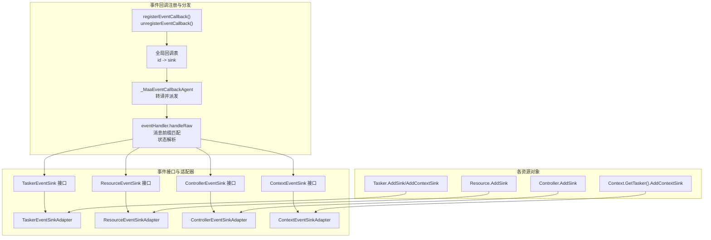
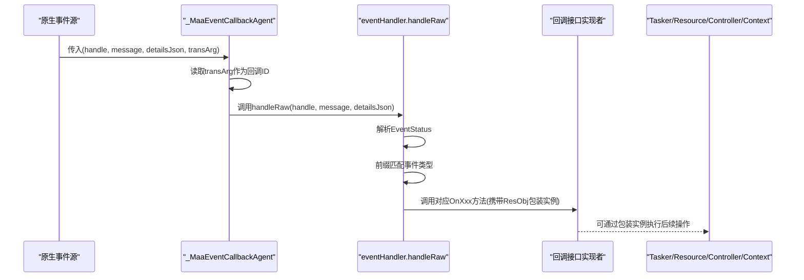
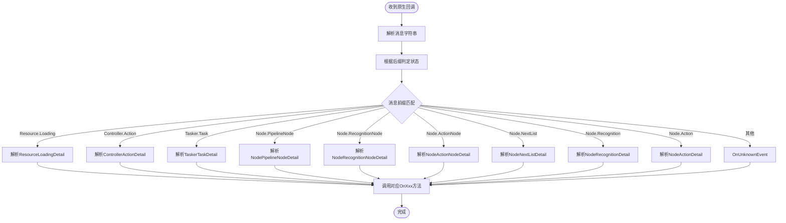
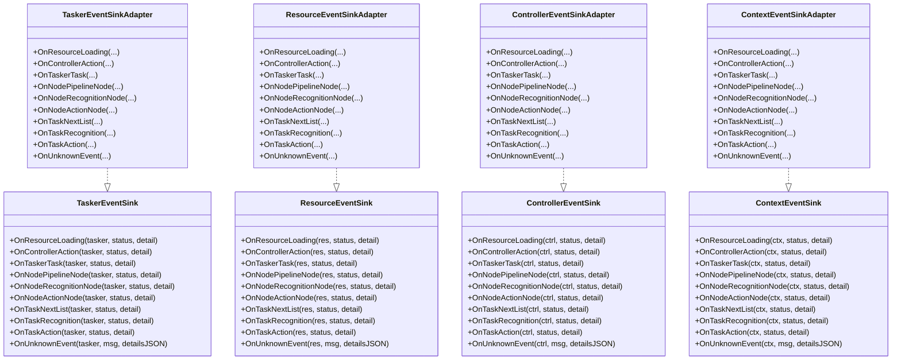
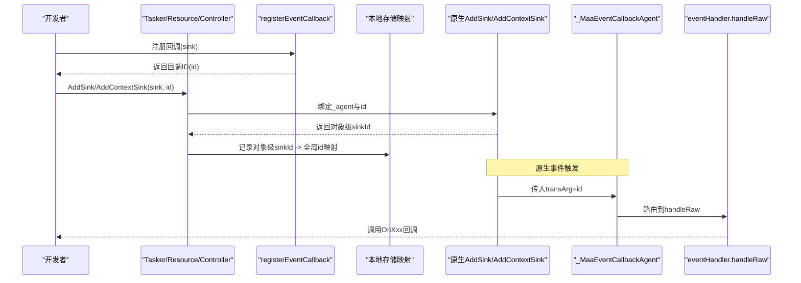
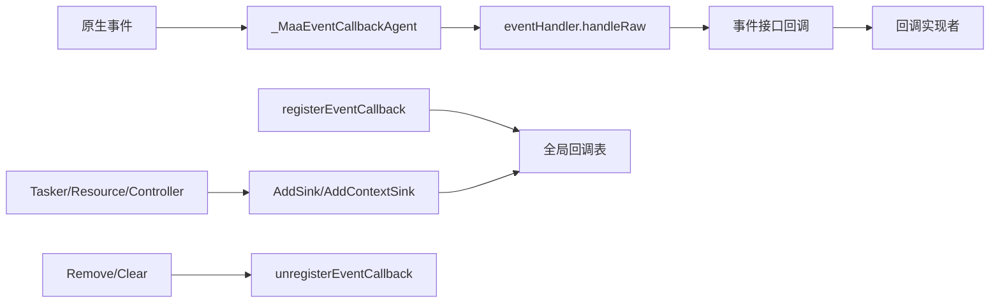

# 事件系统

<cite>
**本文引用的文件**
- [event.go](file://event.go)
- [event_sinks_gen.go](file://event_sinks_gen.go)
- [tasker.go](file://tasker.go)
- [resource.go](file://resource.go)
- [controller.go](file://controller.go)
- [context.go](file://context.go)
- [agent_server.go](file://agent_server.go)
- [examples/quick-start/main.go](file://examples/quick-start/main.go)
- [examples/custom-action/main.go](file://examples/custom-action/main.go)
- [examples/custom-recognition/main.go](file://examples/custom-recognition/main.go)
- [examples/agent-client/main.go](file://examples/agent-client/main.go)
- [examples/agent-server/main.go](file://examples/agent-server/main.go)
</cite>

## 目录
1. [简介](#简介)
2. [项目结构](#项目结构)
3. [核心组件](#核心组件)
4. [架构总览](#架构总览)
5. [详细组件分析](#详细组件分析)
6. [依赖关系分析](#依赖关系分析)
7. [性能考量](#性能考量)
8. [故障排查指南](#故障排查指南)
9. [结论](#结论)
10. [附录：完整使用示例与最佳实践](#附录完整使用示例与最佳实践)

## 简介
本文件为事件系统的API参考文档，聚焦于事件回调接口与事件详情结构体，涵盖以下接口：
- TaskerEventSink
- ResourceEventSink
- ControllerEventSink
- ContextEventSink

以及对应的回调方法：
- OnResourceLoading()
- OnControllerAction()
- OnTaskerTask()
- OnNodePipelineNode()
- OnNodeRecognitionNode()
- OnNodeActionNode()
- OnTaskNextList()
- OnTaskRecognition()
- OnTaskAction()
- OnUnknownEvent()

同时文档化事件状态枚举 EventStatus 的取值与语义，并解释事件回调的注册与管理机制，包括 registerEventCallback() 与 unregisterEventCallback() 的内部工作原理。最后提供完整的使用示例路径，帮助开发者快速实现事件监听器并处理各类事件。

## 项目结构
事件系统由“事件回调注册/分发”和“事件接口适配器”两部分组成：
- 事件回调注册与分发：在 event.go 中定义了全局回调表、回调ID生成、消息路由与状态解析。
- 事件接口与适配器：在 event_sinks_gen.go 中通过模板生成 Tasker/Resource/Controller/Context 四类事件接口及 Adapter，提供按事件粒度注册的便捷方法。
- 各资源对象的事件注册入口：在 tasker.go、resource.go、controller.go 中分别提供 AddSink/RemoveSink/ClearSinks 等方法；Context 通过 Tasker 的 AddContextSink 提供上下文事件回调。
- Agent Server 的事件注册：在 agent_server.go 中提供 AgentServerAdd*Sink 方法，便于服务端侧统一接入事件回调。

图表来源
- [event.go](file://event.go#L21-L333)
- [event_sinks_gen.go](file://event_sinks_gen.go#L1-L676)
- [tasker.go](file://tasker.go#L358-L432)
- [resource.go](file://resource.go#L346-L382)
- [controller.go](file://controller.go#L279-L300)
- [context.go](file://context.go#L197-L209)

章节来源
- [event.go](file://event.go#L1-L334)
- [event_sinks_gen.go](file://event_sinks_gen.go#L1-L676)
- [tasker.go](file://tasker.go#L358-L432)
- [resource.go](file://resource.go#L346-L382)
- [controller.go](file://controller.go#L279-L300)
- [context.go](file://context.go#L197-L209)

## 核心组件
- 事件状态枚举 EventStatus
  - EventStatusUnknown：未知状态（当消息后缀不匹配 Starting/Succeeded/Failed）
  - EventStatusStarting：事件开始
  - EventStatusSucceeded：事件成功
  - EventStatusFailed：事件失败

- 事件详情结构体（字段含义）
  - ResourceLoadingDetail
    - res_id：资源加载任务ID
    - hash：资源哈希
    - path：资源路径
  - ControllerActionDetail
    - ctrl_id：控制器实例ID
    - uuid：控制器唯一标识
    - action：动作名称
    - param：动作参数（map[string]any）
  - TaskerTaskDetail
    - task_id：任务ID
    - entry：任务入口名
    - uuid：任务唯一标识
    - hash：任务哈希
  - NodePipelineNodeDetail
    - task_id：任务ID
    - node_id：节点ID
    - name：节点名
    - focus：焦点信息（任意类型）
  - NodeRecognitionNodeDetail
    - task_id：任务ID
    - node_id：识别节点ID
    - name：节点名
    - focus：焦点信息（任意类型）
  - NodeActionNodeDetail
    - task_id：任务ID
    - node_id：动作节点ID
    - name：节点名
    - focus：焦点信息（任意类型）
  - NodeNextListDetail
    - task_id：任务ID
    - name：任务名
    - next_list：下一跳列表项集合
    - focus：焦点信息（任意类型）
  - NodeRecognitionDetail
    - task_id：任务ID
    - reco_id：识别ID
    - name：识别名
    - focus：焦点信息（任意类型）
  - NodeActionDetail
    - task_id：任务ID
    - action_id：动作ID
    - name：动作名
    - focus：焦点信息（任意类型）

- 事件回调接口
  - TaskerEventSink：包含上述所有回调方法，接收 Tasker 实例指针
  - ResourceEventSink：包含上述所有回调方法，接收 Resource 实例指针
  - ControllerEventSink：包含上述所有回调方法，接收 Controller 实例指针
  - ContextEventSink：包含上述所有回调方法，接收 Context 实例指针（且支持在 Tasker 上以 AddContextSink 注册）

- 事件回调注册与管理
  - registerEventCallback(sink any) uint64：为回调分配全局唯一ID并登记到全局表
  - unregisterEventCallback(id uint64)：从全局表移除指定ID
  - 各资源对象的 AddSink/RemoveSink/ClearSinks：将回调注册到对应原生对象，并维护映射关系
  - Context 事件通过 Tasker 的 AddContextSink 注册，回调时会携带 Context 实例

章节来源
- [event.go](file://event.go#L41-L121)
- [event_sinks_gen.go](file://event_sinks_gen.go#L1-L676)
- [tasker.go](file://tasker.go#L358-L432)
- [resource.go](file://resource.go#L346-L382)
- [controller.go](file://controller.go#L279-L300)
- [context.go](file://context.go#L197-L209)

## 架构总览
事件回调从底层原生模块产生，经由 _MaaEventCallbackAgent 转换为 Go 层回调，再由 eventHandler.handleRaw 按消息前缀匹配具体事件类型，解析 EventStatus 并调用相应接口方法。回调参数中包含对应资源对象的句柄包装实例（Tasker/Resource/Controller/Context），以便在回调中进行后续操作。

图表来源
- [event.go](file://event.go#L296-L333)
- [event_sinks_gen.go](file://event_sinks_gen.go#L1-L676)

## 详细组件分析

### 事件状态与消息路由
- 状态解析规则
  - 以“.Starting”结尾：EventStatusStarting
  - 以“.Succeeded”结尾：EventStatusSucceeded
  - 以“.Failed”结尾：EventStatusFailed
  - 其他：EventStatusUnknown
- 消息前缀匹配
  - Resource.Loading → ResourceLoadingDetail
  - Controller.Action → ControllerActionDetail
  - Tasker.Task → TaskerTaskDetail
  - Node.PipelineNode → NodePipelineNodeDetail
  - Node.RecognitionNode → NodeRecognitionNodeDetail
  - Node.ActionNode → NodeActionNodeDetail
  - Node.NextList → NodeNextListDetail
  - Node.Recognition → NodeRecognitionDetail
  - Node.Action → NodeActionDetail
  - 其他 → OnUnknownEvent

图表来源
- [event.go](file://event.go#L127-L281)
- [event.go](file://event.go#L283-L294)

章节来源
- [event.go](file://event.go#L127-L294)

### 事件详情结构体字段说明
- ResourceLoadingDetail
  - res_id：资源加载任务ID
  - hash：资源哈希
  - path：资源路径
- ControllerActionDetail
  - ctrl_id：控制器实例ID
  - uuid：控制器唯一标识
  - action：动作名称
  - param：动作参数（map[string]any）
- TaskerTaskDetail
  - task_id：任务ID
  - entry：任务入口名
  - uuid：任务唯一标识
  - hash：任务哈希
- NodePipelineNodeDetail
  - task_id：任务ID
  - node_id：节点ID
  - name：节点名
  - focus：焦点信息（任意类型）
- NodeRecognitionNodeDetail
  - task_id：任务ID
  - node_id：识别节点ID
  - name：节点名
  - focus：焦点信息（任意类型）
- NodeActionNodeDetail
  - task_id：任务ID
  - node_id：动作节点ID
  - name：节点名
  - focus：焦点信息（任意类型）
- NodeNextListDetail
  - task_id：任务ID
  - name：任务名
  - next_list：下一跳列表项集合
  - focus：焦点信息（任意类型）
- NodeRecognitionDetail
  - task_id：任务ID
  - reco_id：识别ID
  - name：识别名
  - focus：焦点信息（任意类型）
- NodeActionDetail
  - task_id：任务ID
  - action_id：动作ID
  - name：动作名
  - focus：焦点信息（任意类型）

章节来源
- [event.go](file://event.go#L52-L121)

### 事件接口与适配器
- TaskerEventSink/ResourceEventSink/ControllerEventSink/ContextEventSink
  - 每个接口均包含 OnResourceLoading、OnControllerAction、OnTaskerTask、OnNodePipelineNode、OnNodeRecognitionNode、OnNodeActionNode、OnTaskNextList、OnTaskRecognition、OnTaskAction、OnUnknownEvent 十个回调方法
  - 对应 Adapter 提供单事件回调的轻量封装，便于直接注册某个事件的处理函数
- 各资源对象的便捷注册方法
  - Tasker：OnResourceLoading(fn)/OnControllerAction(fn)/.../OnUnknownEvent(fn)，返回 sinkId，可用于 RemoveSink
  - Resource：OnResourceLoading(fn)/OnControllerAction(fn)/.../OnUnknownEvent(fn)，返回 sinkId，可用于 RemoveSink
  - Controller：OnResourceLoading(fn)/OnControllerAction(fn)/.../OnUnknownEvent(fn)，返回 sinkId，可用于 RemoveSink
  - Context：通过 Tasker 的 OnResourceLoadingInContext(fn)/OnControllerActionInContext(fn)/.../OnUnknownEventInContext(fn) 注册，回调时携带 Context 实例

图表来源
- [event_sinks_gen.go](file://event_sinks_gen.go#L1-L676)

章节来源
- [event_sinks_gen.go](file://event_sinks_gen.go#L1-L676)

### 事件回调注册与管理机制
- 注册流程
  - 调用 registerEventCallback(sink) 分配全局唯一ID并登记到全局表
  - 将 _MaaEventCallbackAgent 与该ID作为 transArg 传递给原生层 AddSink/AddContextSink
  - 原生层回调时，_MaaEventCallbackAgent 读取 transArg 作为ID，查表获取 sink 并交由 eventHandler.handleRaw 处理
- 管理流程
  - RemoveSink/RemoveContextSink：先从存储映射中取出真实回调ID并调用 unregisterEventCallback，再通知原生层移除
  - ClearSinks/ClearContextSinks：遍历映射，逐个注销并清空映射
  - Destroy：在各资源对象销毁时，清理其持有的所有回调ID

图表来源
- [event.go](file://event.go#L21-L40)
- [tasker.go](file://tasker.go#L358-L432)
- [resource.go](file://resource.go#L346-L382)
- [controller.go](file://controller.go#L279-L300)

章节来源
- [event.go](file://event.go#L21-L40)
- [tasker.go](file://tasker.go#L358-L432)
- [resource.go](file://resource.go#L346-L382)
- [controller.go](file://controller.go#L279-L300)

### 事件回调方法与参数说明
- OnResourceLoading(tasker/res/ctrl/ctx, status, detail)
  - 用途：资源加载事件
  - 参数：status 为 EventStatus，detail 为 ResourceLoadingDetail
- OnControllerAction(tasker/res/ctrl/ctx, status, detail)
  - 用途：控制器动作事件
  - 参数：status 为 EventStatus，detail 为 ControllerActionDetail
- OnTaskerTask(tasker/res/ctrl/ctx, status, detail)
  - 用途：任务启动事件
  - 参数：status 为 EventStatus，detail 为 TaskerTaskDetail
- OnNodePipelineNode(tasker/res/ctrl/ctx, status, detail)
  - 用途：流水线节点事件
  - 参数：status 为 EventStatus，detail 为 NodePipelineNodeDetail
- OnNodeRecognitionNode(tasker/res/ctrl/ctx, status, detail)
  - 用途：识别节点事件
  - 参数：status 为 EventStatus，detail 为 NodeRecognitionNodeDetail
- OnNodeActionNode(tasker/res/ctrl/ctx, status, detail)
  - 用途：动作节点事件
  - 参数：status 为 EventStatus，detail 为 NodeActionNodeDetail
- OnTaskNextList(tasker/res/ctrl/ctx, status, detail)
  - 用途：任务下一跳列表事件
  - 参数：status 为 EventStatus，detail 为 NodeNextListDetail
- OnTaskRecognition(tasker/res/ctrl/ctx, status, detail)
  - 用途：任务识别事件
  - 参数：status 为 EventStatus，detail 为 NodeRecognitionDetail
- OnTaskAction(tasker/res/ctrl/ctx, status, detail)
  - 用途：任务动作事件
  - 参数：status 为 EventStatus，detail 为 NodeActionDetail
- OnUnknownEvent(tasker/res/ctrl/ctx, msg, detailsJSON)
  - 用途：未识别事件
  - 参数：msg 为原始消息字符串，detailsJSON 为原始详情JSON字符串

章节来源
- [event_sinks_gen.go](file://event_sinks_gen.go#L1-L676)
- [event.go](file://event.go#L127-L281)

## 依赖关系分析
- 低耦合高内聚
  - 事件接口与适配器独立于资源对象，仅通过句柄包装实例交互
  - 注册/注销逻辑集中在 event.go 与各资源对象的 AddSink/RemoveSink/ClearSinks
- 关键依赖链
  - 原生回调 → _MaaEventCallbackAgent → eventHandler.handleRaw → 事件接口回调
  - 注册 → registerEventCallback → 原生 AddSink/AddContextSink → 存储映射
  - 注销 → 从映射取回真实ID → unregisterEventCallback → 原生 Remove/Clear

图表来源
- [event.go](file://event.go#L21-L40)
- [event.go](file://event.go#L296-L333)
- [tasker.go](file://tasker.go#L358-L432)
- [resource.go](file://resource.go#L346-L382)
- [controller.go](file://controller.go#L279-L300)

章节来源
- [event.go](file://event.go#L21-L40)
- [tasker.go](file://tasker.go#L358-L432)
- [resource.go](file://resource.go#L346-L382)
- [controller.go](file://controller.go#L279-L300)

## 性能考量
- 回调ID生成采用原子自增，避免锁竞争
- 全局回调表使用读写锁保护，读多写少场景下可提升并发性能
- 事件路由基于字符串前缀匹配，开销极低
- Adapter 仅做轻量转发，避免额外拷贝
- 建议在回调中尽量减少阻塞操作，必要时异步处理或复用 goroutine

## 故障排查指南
- 回调未触发
  - 检查是否正确调用 AddSink/AddContextSink 并保存返回的 sinkId
  - 确认原生层已绑定对应资源（Tasker.BindResource/BindController）
- 回调被提前移除
  - 使用 RemoveSink/RemoveContextSink 时需确保对象生命周期
  - 在 Destroy 前调用 ClearSinks/ClearContextSinks 清理
- 事件状态异常
  - 确认消息后缀是否符合 .Starting/.Succeeded/.Failed
  - 若为未知事件，检查 OnUnknownEvent 是否有处理逻辑
- Agent Server 场景
  - 使用 AgentServerAdd*Sink 注册服务端事件回调

章节来源
- [tasker.go](file://tasker.go#L358-L432)
- [resource.go](file://resource.go#L346-L382)
- [controller.go](file://controller.go#L279-L300)
- [agent_server.go](file://agent_server.go#L38-L76)

## 结论
事件系统通过统一的回调注册与分发机制，为 Tasker、Resource、Controller、Context 提供一致的事件感知能力。借助 Adapter，开发者可以按事件粒度快速注册处理函数；通过 AddSink/RemoveSink/ClearSinks，能够灵活地管理回调生命周期。结合 EventStatus 与详细的事件详情结构体，开发者可以精确地捕获并响应系统运行过程中的关键事件。

## 附录：完整使用示例与最佳实践
- 快速开始示例（含事件回调注册思路）
  - 示例路径：[examples/quick-start/main.go](file://examples/quick-start/main.go#L1-L41)
  - 说明：初始化框架、创建 Tasker/Resource/Controller 并绑定，随后可在此基础上添加事件回调
- 自定义动作示例（事件回调与上下文联动）
  - 示例路径：[examples/custom-action/main.go](file://examples/custom-action/main.go#L1-L49)
  - 说明：注册自定义动作并在回调中处理相关事件
- 自定义识别示例（事件回调与上下文操作）
  - 示例路径：[examples/custom-recognition/main.go](file://examples/custom-recognition/main.go#L1-L77)
  - 说明：在识别回调中使用 Context 执行任务、覆盖管道、克隆上下文等
- Agent 客户端/服务端示例（事件回调在服务端接入）
  - 示例路径：[examples/agent-client/main.go](file://examples/agent-client/main.go#L1-L56)
  - 示例路径：[examples/agent-server/main.go](file://examples/agent-server/main.go#L1-L37)
  - 说明：服务端通过 AgentServerAdd*Sink 注册事件回调，客户端触发任务后服务端接收事件

最佳实践建议
- 优先使用便捷注册方法（Tasker.OnXxx/Resource.OnXxx/Controller.OnXxx/Context.OnXxxInContext）一次性注册所需事件
- 在回调中避免长时间阻塞，必要时异步处理
- 明确事件状态语义，针对 Starting/Succeeded/Failed 做差异化处理
- 在对象销毁前调用 ClearSinks/ClearContextSinks，防止悬挂回调

章节来源
- [examples/quick-start/main.go](file://examples/quick-start/main.go#L1-L41)
- [examples/custom-action/main.go](file://examples/custom-action/main.go#L1-L49)
- [examples/custom-recognition/main.go](file://examples/custom-recognition/main.go#L1-L77)
- [examples/agent-client/main.go](file://examples/agent-client/main.go#L1-L56)
- [examples/agent-server/main.go](file://examples/agent-server/main.go#L1-L37)