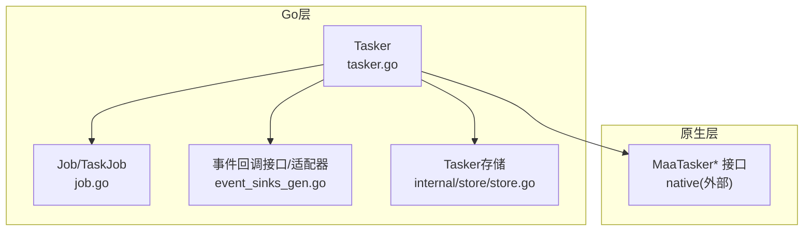
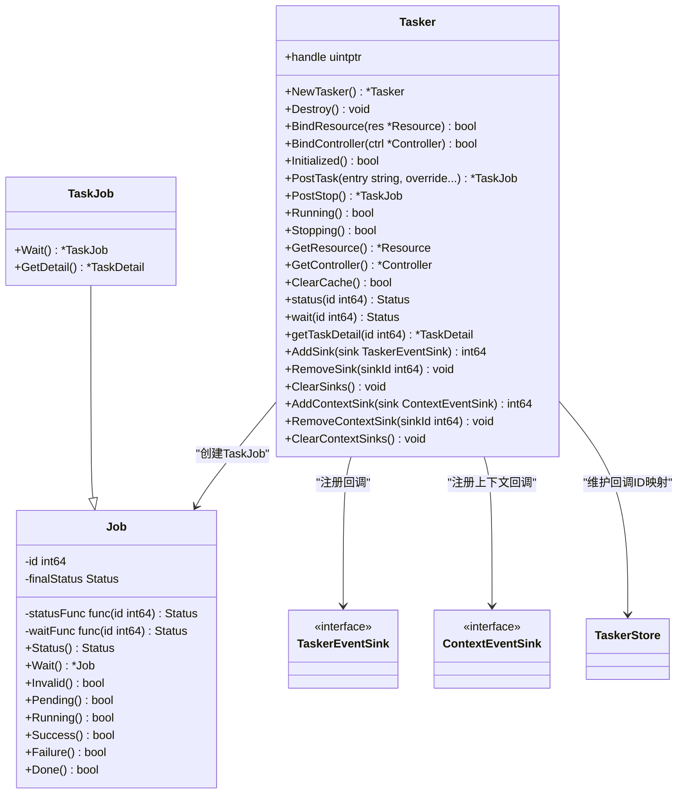
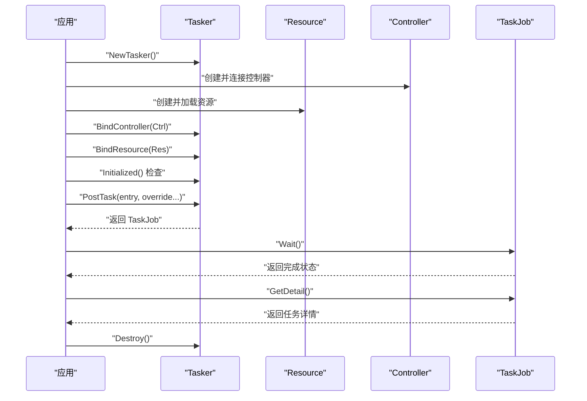
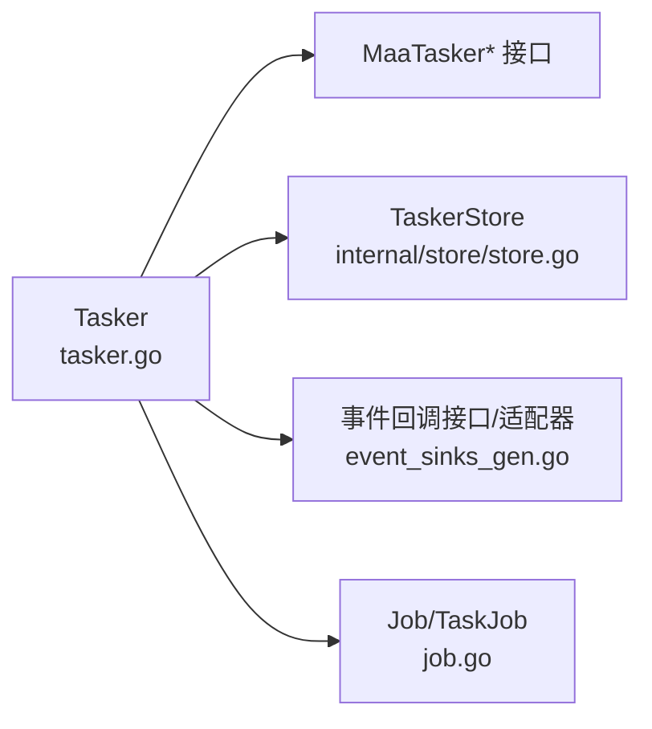

# 任务管理器

<cite>
**本文引用的文件列表**
- [tasker.go](file://tasker.go)
- [job.go](file://job.go)
- [event_sinks_gen.go](file://event_sinks_gen.go)
- [internal/store/store.go](file://internal/store/store.go)
- [examples/quick-start/main.go](file://examples/quick-start/main.go)
- [examples/custom-action/main.go](file://examples/custom-action/main.go)
- [examples/custom-recognition/main.go](file://examples/custom-recognition/main.go)
- [tasker_test.go](file://tasker_test.go)
</cite>

## 目录
1. [简介](#简介)
2. [项目结构](#项目结构)
3. [核心组件](#核心组件)
4. [架构总览](#架构总览)
5. [详细组件分析](#详细组件分析)
6. [依赖关系分析](#依赖关系分析)
7. [性能与并发特性](#性能与并发特性)
8. [故障排查指南](#故障排查指南)
9. [结论](#结论)
10. [附录：完整使用示例路径](#附录完整使用示例路径)

## 简介
本文件为任务管理器（Tasker）组件的详尽API参考文档。内容涵盖：
- NewTasker() 的创建与返回值
- Tasker 结构体的方法族：资源/控制器绑定、初始化状态检查、任务提交与停止、运行状态检查、资源/控制器获取、运行时缓存清理
- 任务状态查询与等待：status()、wait()
- 任务详情获取：getTaskDetail()
- 事件回调：AddSink()/RemoveSink()/ClearSinks() 与 AddContextSink()/RemoveContextSink()/ClearContextSinks()
- 完整生命周期与使用模式的示例路径

## 项目结构
围绕任务管理器的关键文件与职责如下：
- tasker.go：定义 Tasker 结构体及所有公开方法，封装底层原生接口调用，并提供任务详情查询与事件回调注册能力
- job.go：定义 Job/TaskJob 抽象，统一异步任务的状态查询与等待行为，并扩展任务详情获取
- event_sinks_gen.go：生成事件回调接口与适配器，提供 AddSink/AddContextSink 等便捷方法
- internal/store/store.go：维护 Tasker 实例与其事件回调映射的全局存储，确保回调在销毁时正确注销
- examples/*：提供从快速开始到自定义动作/识别的完整使用示例
- tasker_test.go：验证 Tasker 的基本行为与典型流程

图表来源
- [tasker.go](file://tasker.go#L12-L432)
- [job.go](file://job.go#L1-L96)
- [event_sinks_gen.go](file://event_sinks_gen.go#L1-L171)
- [internal/store/store.go](file://internal/store/store.go#L1-L64)

章节来源
- [tasker.go](file://tasker.go#L12-L432)
- [job.go](file://job.go#L1-L96)
- [event_sinks_gen.go](file://event_sinks_gen.go#L1-L171)
- [internal/store/store.go](file://internal/store/store.go#L1-L64)

## 核心组件
- Tasker：任务管理器对象，持有底层句柄，负责任务提交、状态查询、详情获取、资源/控制器绑定与事件回调注册等
- Job/TaskJob：抽象异步任务，提供状态查询与等待，TaskJob 还可获取任务详情
- 事件回调接口与适配器：TaskerEventSink/ContextEventSink 及其 Adapter，用于注册回调并接收事件通知

章节来源
- [tasker.go](file://tasker.go#L12-L432)
- [job.go](file://job.go#L1-L96)
- [event_sinks_gen.go](file://event_sinks_gen.go#L1-L171)

## 架构总览
下图展示了 Tasker 与 Job、事件回调、存储之间的交互关系。

图表来源
- [tasker.go](file://tasker.go#L12-L432)
- [job.go](file://job.go#L1-L96)
- [event_sinks_gen.go](file://event_sinks_gen.go#L1-L171)
- [internal/store/store.go](file://internal/store/store.go#L1-L64)

## 详细组件分析

### NewTasker() 创建与返回值
- 功能：创建一个新的任务管理器实例
- 返回值：
  - 成功：返回指向 Tasker 的指针
  - 失败：返回空指针（底层创建失败）
- 行为要点：
  - 内部会将该实例的句柄与两个回调ID映射表写入全局存储，以便后续销毁时正确注销回调
- 使用建议：
  - 调用后应始终在合适时机调用 Destroy() 释放资源

章节来源
- [tasker.go](file://tasker.go#L17-L31)
- [internal/store/store.go](file://internal/store/store.go#L44-L64)

### 资源与控制器绑定、初始化状态检查
- BindResource(res)：将已初始化的资源绑定到任务管理器
- BindController(ctrl)：将已初始化的控制器绑定到任务管理器
- Initialized()：检查任务管理器是否已初始化（需先绑定资源与控制器）

章节来源
- [tasker.go](file://tasker.go#L50-L63)

### 任务提交与停止
- PostTask(entry, override...)：
  - 提交一个任务，entry 为任务入口名
  - override 为可选参数，支持字符串或可 JSON 序列化的任意类型；仅取第一个参数
  - 返回 TaskJob，可用于查询状态与等待完成
- PostStop()：向任务管理器发送停止信号，返回 TaskJob

章节来源
- [tasker.go](file://tasker.go#L90-L122)
- [job.go](file://job.go#L66-L96)

### 运行状态与停止状态检查
- Running()：检查实例是否处于运行中
- Stopping()：检查实例是否处于停止中

章节来源
- [tasker.go](file://tasker.go#L98-L101)
- [tasker.go](file://tasker.go#L113-L116)

### 资源与控制器获取
- GetResource()：返回当前绑定的资源对象
- GetController()：返回当前绑定的控制器对象

章节来源
- [tasker.go](file://tasker.go#L124-L134)

### 运行时缓存清理
- ClearCache()：清理运行时缓存，返回清理结果

章节来源
- [tasker.go](file://tasker.go#L136-L139)

### 任务状态查询与等待
- status(id)：查询指定任务ID的状态
- wait(id)：阻塞直到任务完成并返回最终状态

章节来源
- [tasker.go](file://tasker.go#L103-L111)
- [job.go](file://job.go#L1-L65)

### 任务详情获取
- getTaskDetail(id)：查询任务详情，包含入口名、节点详情与状态
- 内部还提供：
  - getNodeDetail(id)：查询节点详情（名称、识别/动作详情、是否已完成）
  - getRecognitionDetail(id)：查询识别详情（名称、算法、命中框、原始图像、绘制图像等）
  - getActionDetail(id)：查询动作详情（名称、动作、目标框、是否成功等）

章节来源
- [tasker.go](file://tasker.go#L240-L344)

### 事件回调相关方法
- AddSink(sink)：注册普通事件回调，返回 sinkId
- RemoveSink(sinkId)：按 sinkId 移除回调
- ClearSinks()：移除并注销全部普通事件回调
- AddContextSink(sink)：注册带上下文的事件回调，返回 sinkId
- RemoveContextSink(sinkId)：按 sinkId 移除上下文回调
- ClearContextSinks()：移除并注销全部上下文事件回调
- 生成的便捷方法（通过适配器）：
  - OnResourceLoading(fn)、OnControllerAction(fn)、OnTaskerTask(fn)、OnNodePipelineNode(fn)、OnNodeRecognitionNode(fn)、OnNodeActionNode(fn)、OnTaskNextList(fn)、OnTaskRecognition(fn)、OnTaskAction(fn)、OnUnknownEvent(fn)
  - OnResourceLoadingInContext(fn)、OnControllerActionInContext(fn)、OnTaskerTaskInContext(fn)、OnNodePipelineNodeInContext(fn)、OnNodeRecognitionNodeInContext(fn)、OnNodeActionNodeInContext(fn)、OnTaskNextListInContext(fn)、OnTaskRecognitionInContext(fn)、OnTaskActionInContext(fn)、OnUnknownEventInContext(fn)

章节来源
- [tasker.go](file://tasker.go#L357-L432)
- [event_sinks_gen.go](file://event_sinks_gen.go#L1-L171)

### 生命周期与使用模式（序列图）
以下序列图展示了典型的任务生命周期：创建 -> 绑定资源/控制器 -> 初始化检查 -> 提交任务 -> 等待完成 -> 获取详情 -> 销毁

图表来源
- [tasker.go](file://tasker.go#L17-L31)
- [tasker.go](file://tasker.go#L50-L63)
- [tasker.go](file://tasker.go#L90-L122)
- [job.go](file://job.go#L66-L96)

## 依赖关系分析
- Tasker 对外依赖：
  - 原生接口：通过底层 native 包调用 MaaTasker* 系列函数
  - 存储：使用 internal/store/store.go 中的 TaskerStore 维护回调ID映射
  - 事件系统：通过 event_sinks_gen.go 生成的接口与适配器实现回调注册
  - 任务抽象：依赖 job.go 中的 Job/TaskJob 提供状态与等待能力

图表来源
- [tasker.go](file://tasker.go#L12-L432)
- [internal/store/store.go](file://internal/store/store.go#L1-L64)
- [event_sinks_gen.go](file://event_sinks_gen.go#L1-L171)
- [job.go](file://job.go#L1-L96)

章节来源
- [tasker.go](file://tasker.go#L12-L432)
- [internal/store/store.go](file://internal/store/store.go#L1-L64)
- [event_sinks_gen.go](file://event_sinks_gen.go#L1-L171)
- [job.go](file://job.go#L1-L96)

## 性能与并发特性
- 回调注销：Destroy() 会遍历并注销所有已注册的普通与上下文回调，避免悬挂回调导致的内存泄漏
- 并发安全：TaskerStore 使用读写锁保护，回调ID映射的更新是线程安全的
- 任务等待：wait() 会阻塞当前协程直至任务完成，适合同步等待场景；也可结合 Wait() 在异步场景中轮询状态
- 缓存清理：ClearCache() 可用于释放运行时占用的资源，降低内存压力

章节来源
- [tasker.go](file://tasker.go#L34-L48)
- [internal/store/store.go](file://internal/store/store.go#L1-L43)
- [job.go](file://job.go#L58-L65)

## 故障排查指南
- NewTasker() 返回空指针
  - 可能原因：底层创建失败
  - 建议：检查初始化选项与环境配置
- Initialized() 返回 false
  - 可能原因：未绑定资源或控制器，或绑定后未完成初始化
  - 建议：确认 BindResource/BindController 已成功，且资源/控制器已准备就绪
- PostTask() 无响应
  - 可能原因：未绑定控制器或资源，或任务入口不存在
  - 建议：先绑定资源/控制器，再提交任务；核对入口名
- 事件回调未触发
  - 可能原因：未注册回调或回调被提前移除
  - 建议：确认 AddSink/AddContextSink 返回的 sinkId 正确，避免重复 ClearSinks
- 任务完成后无法获取详情
  - 可能原因：底层查询失败或节点详情缺失
  - 建议：检查 getTaskDetail/getNodeDetail 的返回值，必要时重试或查看日志

章节来源
- [tasker.go](file://tasker.go#L17-L31)
- [tasker.go](file://tasker.go#L50-L63)
- [tasker.go](file://tasker.go#L90-L122)
- [tasker.go](file://tasker.go#L357-L432)
- [tasker_test.go](file://tasker_test.go#L1-L195)

## 结论
Tasker 提供了完整的任务生命周期管理能力，包括任务提交、状态查询、等待完成、详情获取与事件回调注册。通过资源/控制器绑定与初始化检查，确保任务在正确的上下文中执行。配合 Job/TaskJob 的状态与等待机制，开发者可以灵活地构建同步或异步的任务流程。同时，完善的回调注销与存储管理保证了资源的安全回收。

## 附录：完整使用示例路径
以下示例展示了从创建到销毁的完整生命周期与常见使用模式：

- 快速开始
  - 示例路径：[examples/quick-start/main.go](file://examples/quick-start/main.go#L1-L41)
  - 关键步骤：初始化 -> 创建 Tasker -> 连接控制器 -> 绑定资源 -> 初始化检查 -> 提交任务 -> 等待完成 -> 获取详情 -> 销毁

- 自定义动作
  - 示例路径：[examples/custom-action/main.go](file://examples/custom-action/main.go#L1-L49)
  - 关键步骤：初始化 -> 创建 Tasker -> 连接控制器 -> 绑定资源 -> 注册自定义动作 -> 提交任务 -> 等待完成 -> 获取详情 -> 销毁

- 自定义识别
  - 示例路径：[examples/custom-recognition/main.go](file://examples/custom-recognition/main.go#L1-L77)
  - 关键步骤：初始化 -> 创建 Tasker -> 连接控制器 -> 绑定资源 -> 注册自定义识别 -> 提交任务 -> 等待完成 -> 获取详情 -> 销毁

章节来源
- [examples/quick-start/main.go](file://examples/quick-start/main.go#L1-L41)
- [examples/custom-action/main.go](file://examples/custom-action/main.go#L1-L49)
- [examples/custom-recognition/main.go](file://examples/custom-recognition/main.go#L1-L77)