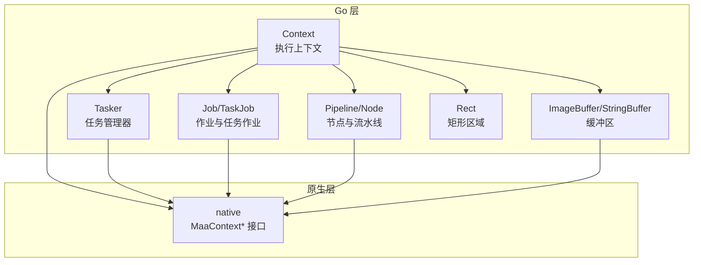
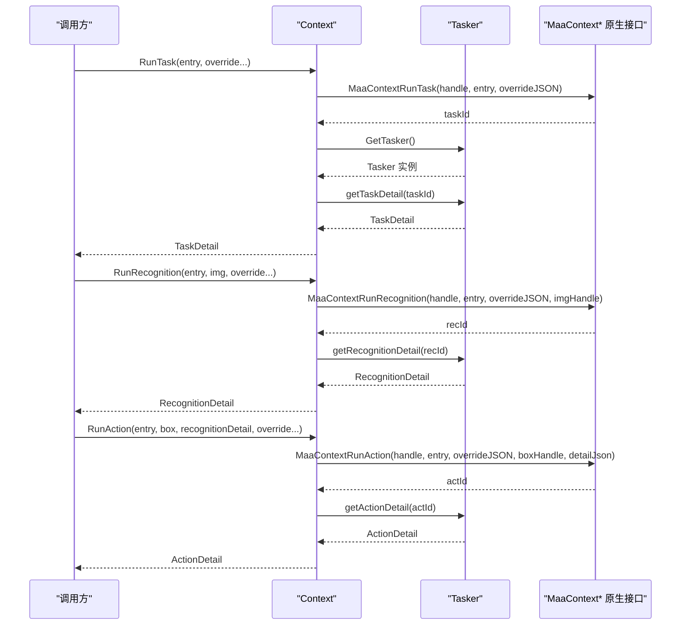
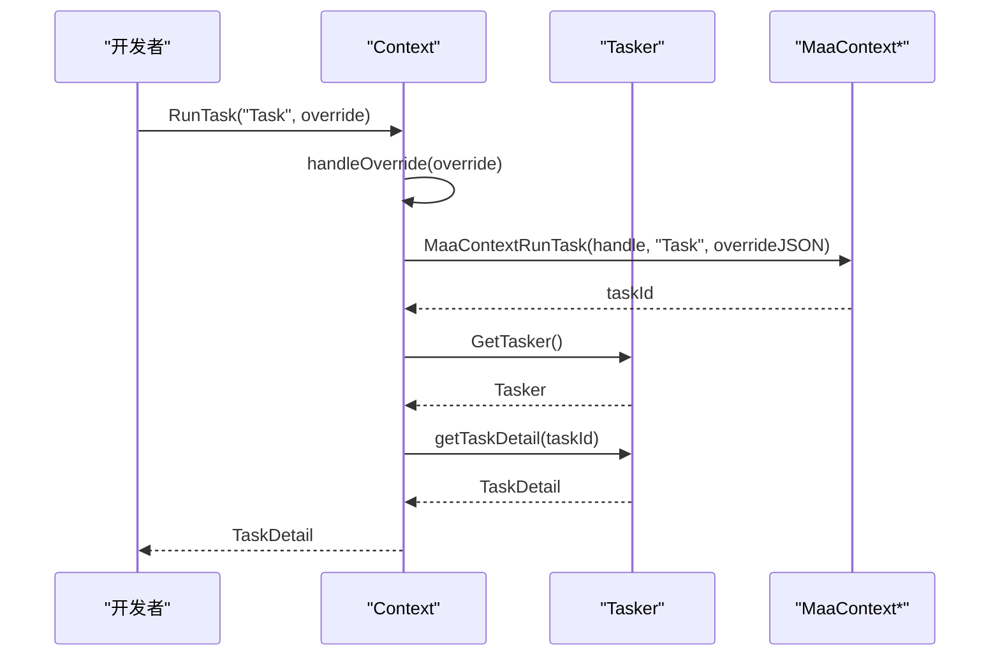
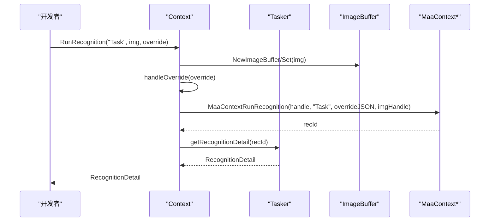
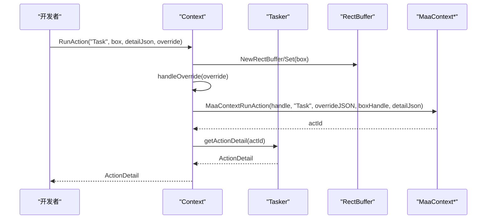
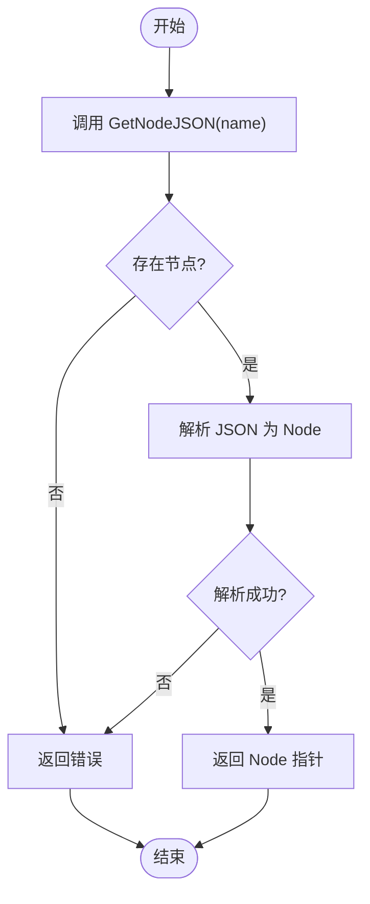
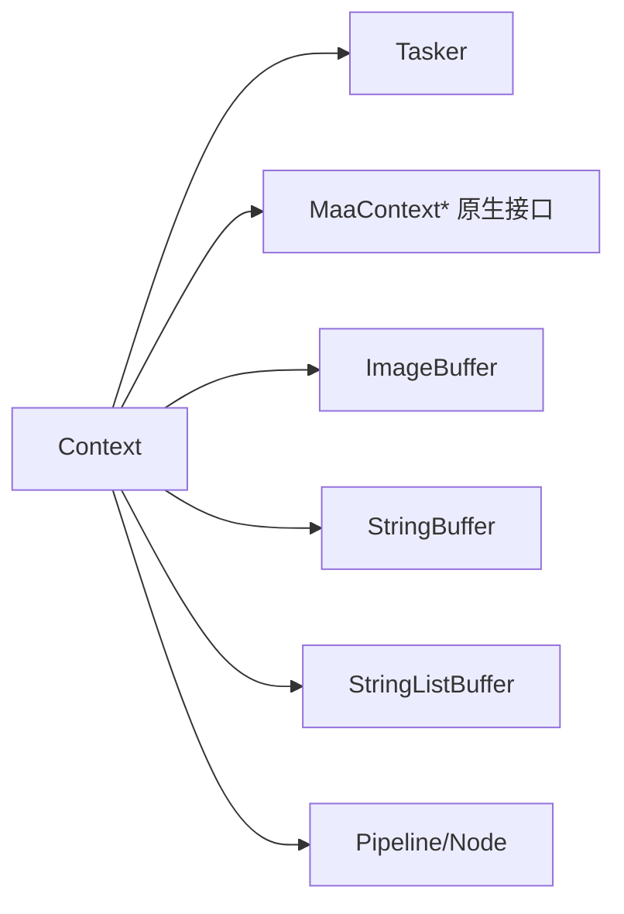

# 执行上下文

<cite>
**本文引用的文件**
- [context.go](file://context.go)
- [context_test.go](file://context_test.go)
- [tasker.go](file://tasker.go)
- [job.go](file://job.go)
- [pipeline.go](file://pipeline.go)
- [rect.go](file://rect.go)
- [internal/buffer/image_buffer.go](file://internal/buffer/image_buffer.go)
- [internal/buffer/string_buffer.go](file://internal/buffer/string_buffer.go)
- [internal/native/framework.go](file://internal/native/framework.go)
- [examples/custom-recognition/main.go](file://examples/custom-recognition/main.go)
</cite>

## 目录
1. [简介](#简介)
2. [项目结构](#项目结构)
3. [核心组件](#核心组件)
4. [架构总览](#架构总览)
5. [详细组件分析](#详细组件分析)
6. [依赖关系分析](#依赖关系分析)
7. [性能考量](#性能考量)
8. [故障排查指南](#故障排查指南)
9. [结论](#结论)
10. [附录](#附录)

## 简介
本文件为 Context 组件的详尽 API 参考文档，面向希望在任务执行过程中灵活控制识别、动作与流水线行为的开发者。Context 提供了以下关键能力：
- 执行任务并返回详细信息
- 执行图像识别并返回识别详情
- 执行动作并返回动作详情
- 覆盖流水线配置（支持 JSON 字符串或可序列化对象）
- 覆盖下一个节点列表
- 覆盖图像资源
- 获取节点 JSON 与解析后的节点数据
- 获取当前任务作业与关联的任务管理器
- 克隆上下文
- 设置/获取锚点
- 获取/清空命中计数

上述所有方法均支持 override 参数以 JSON 字符串或可序列化对象的形式传入，便于在运行时动态调整节点行为。

## 项目结构
Context 的实现位于顶层模块中，并通过内部缓冲区与原生绑定进行交互。其主要依赖包括：
- 任务管理器 Tasker：用于查询任务详情、状态与作业
- 作业 Job/TaskJob：封装异步任务的状态查询与等待
- 管道定义 Pipeline/Node：描述节点属性与行为
- 原生接口 native：桥接 Go 与底层框架
- 缓冲区 buffer：图像与字符串等跨语言传递的中间层

图表来源
- [context.go](file://context.go#L1-L240)
- [tasker.go](file://tasker.go#L1-L120)
- [job.go](file://job.go#L1-L96)
- [pipeline.go](file://pipeline.go#L1-L120)
- [internal/buffer/image_buffer.go](file://internal/buffer/image_buffer.go#L1-L130)
- [internal/buffer/string_buffer.go](file://internal/buffer/string_buffer.go#L1-L58)
- [internal/native/framework.go](file://internal/native/framework.go#L194-L206)

章节来源
- [context.go](file://context.go#L1-L240)
- [tasker.go](file://tasker.go#L1-L120)
- [job.go](file://job.go#L1-L96)
- [pipeline.go](file://pipeline.go#L1-L120)
- [internal/buffer/image_buffer.go](file://internal/buffer/image_buffer.go#L1-L130)
- [internal/buffer/string_buffer.go](file://internal/buffer/string_buffer.go#L1-L58)
- [internal/native/framework.go](file://internal/native/framework.go#L194-L206)

## 核心组件
- Context：执行上下文，封装与底层框架交互的入口，提供任务、识别、动作、流水线覆盖、节点数据查询、锚点与命中计数等能力。
- Tasker：任务管理器，负责提交任务、查询状态、获取任务详情与作业。
- Job/TaskJob：作业抽象，提供状态查询与等待完成的能力。
- Pipeline/Node：流水线与节点模型，描述识别、动作、下一跳、超时、重试等属性。
- Rect：矩形区域类型，用于动作目标与识别 ROI。
- 缓冲区 buffer：图像与字符串缓冲，用于跨语言传递原始数据。

章节来源
- [context.go](file://context.go#L1-L240)
- [tasker.go](file://tasker.go#L1-L120)
- [job.go](file://job.go#L1-L96)
- [pipeline.go](file://pipeline.go#L1-L120)
- [rect.go](file://rect.go#L1-L6)

## 架构总览
Context 在执行任务、识别与动作时，会将 Go 层的数据转换为底层框架可接受的句柄或 JSON 字符串，并通过原生接口调用底层能力。同时，Context 通过 Tasker 获取任务详情与作业，从而实现对任务生命周期的掌控。

图表来源
- [context.go](file://context.go#L30-L126)
- [tasker.go](file://tasker.go#L141-L238)
- [internal/native/framework.go](file://internal/native/framework.go#L194-L206)

## 详细组件分析

### Context 结构体与方法总览
- 结构体字段
  - handle：底层上下文句柄，用于与原生接口交互
- 方法族
  - 任务执行：RunTask(entry, override...) -> *TaskDetail
  - 图像识别：RunRecognition(entry, img, override...) -> *RecognitionDetail
  - 动作执行：RunAction(entry, box, recognitionDetail, override...) -> *ActionDetail
  - 流水线覆盖：OverridePipeline(override any) -> bool
  - 下一跳覆盖：OverrideNext(name string, nextList []string) -> bool
  - 图像覆盖：OverrideImage(imageName string, image image.Image) -> bool
  - 节点数据：GetNodeJSON(name string) -> (string, bool)，GetNodeData(name string) -> (*Node, error)
  - 当前任务：GetTaskJob() -> *TaskJob，GetTasker() -> *Tasker
  - 上下文克隆：Clone() -> *Context
  - 锚点：SetAnchor(anchorName, nodeName string) -> bool，GetAnchor(anchorName string) -> (string, bool)
  - 命中计数：GetHitCount(nodeName string) -> (uint64, bool)，ClearHitCount(nodeName string) -> bool

章节来源
- [context.go](file://context.go#L12-L239)

### RunTask：执行任务并返回详细信息
- 参数
  - entry：任务入口节点名称
  - override...：可选参数，支持 JSON 字符串或任意可序列化对象；仅使用第一个参数
- 返回值
  - *TaskDetail：任务详情；失败时返回 nil
- 使用场景
  - 在自定义动作中临时覆盖流水线后执行任务
  - 与 Tasker.PostTask 配合，统一管理任务生命周期
- 处理流程
  - 将 override 转换为 JSON 字符串
  - 调用原生接口执行任务并获取 taskId
  - 通过 Tasker 查询任务详情
- 示例路径
  - [context_test.go](file://context_test.go#L1-L52)
  - [examples/custom-recognition/main.go](file://examples/custom-recognition/main.go#L44-L77)

章节来源
- [context.go](file://context.go#L30-L58)
- [tasker.go](file://tasker.go#L285-L344)
- [context_test.go](file://context_test.go#L1-L52)
- [examples/custom-recognition/main.go](file://examples/custom-recognition/main.go#L44-L77)

### RunRecognition：执行图像识别并返回识别详情
- 参数
  - entry：识别节点名称
  - img：输入图像
  - override...：可选参数，支持 JSON 字符串或任意可序列化对象；仅使用第一个参数
- 返回值
  - *RecognitionDetail：识别详情；失败时返回 nil
- 使用场景
  - 在自定义识别中临时覆盖识别参数（如 ROI）后执行识别
  - 与自定义识别配合，动态调整识别范围或算法参数
- 处理流程
  - 将 override 转换为 JSON 字符串
  - 将 image.Image 包装为图像缓冲并传入原生接口
  - 通过 Tasker 查询识别详情
- 示例路径
  - [context_test.go](file://context_test.go#L54-L103)
  - [examples/custom-recognition/main.go](file://examples/custom-recognition/main.go#L44-L77)

章节来源
- [context.go](file://context.go#L60-L92)
- [tasker.go](file://tasker.go#L141-L195)
- [internal/buffer/image_buffer.go](file://internal/buffer/image_buffer.go#L1-L130)
- [context_test.go](file://context_test.go#L54-L103)
- [examples/custom-recognition/main.go](file://examples/custom-recognition/main.go#L44-L77)

### RunAction：执行动作并返回动作详情
- 参数
  - entry：动作节点名称
  - box：动作目标矩形区域
  - recognitionDetail：识别结果的 DetailJson
  - override...：可选参数，支持 JSON 字符串或任意可序列化对象；仅使用第一个参数
- 返回值
  - *ActionDetail：动作详情；失败时返回 nil
- 使用场景
  - 在自定义动作中根据识别结果决定点击坐标或滑动参数
  - 与自定义动作配合，动态调整动作参数
- 处理流程
  - 将 override 转换为 JSON 字符串
  - 将 Rect 包装为矩形缓冲并传入原生接口
  - 通过 Tasker 查询动作详情
- 示例路径
  - [context_test.go](file://context_test.go#L105-L148)
  - [examples/custom-recognition/main.go](file://examples/custom-recognition/main.go#L44-L77)

章节来源
- [context.go](file://context.go#L94-L126)
- [tasker.go](file://tasker.go#L197-L238)
- [rect.go](file://rect.go#L1-L6)
- [context_test.go](file://context_test.go#L105-L148)
- [examples/custom-recognition/main.go](file://examples/custom-recognition/main.go#L44-L77)

### OverridePipeline：覆盖流水线配置
- 参数
  - override：支持 JSON 字符串、字节切片或任意可序列化对象
- 返回值
  - bool：是否成功覆盖
- 使用场景
  - 在自定义动作/识别中临时修改节点参数（如 ROI、阈值、模板等）
  - 与 RunTask/RunRecognition/RunAction 搭配，按需覆盖
- 处理流程
  - 将 override 转换为 JSON 字符串
  - 调用原生接口覆盖流水线
- 示例路径
  - [context_test.go](file://context_test.go#L150-L207)
  - [examples/custom-recognition/main.go](file://examples/custom-recognition/main.go#L44-L77)

章节来源
- [context.go](file://context.go#L128-L147)
- [context_test.go](file://context_test.go#L150-L207)
- [examples/custom-recognition/main.go](file://examples/custom-recognition/main.go#L44-L77)

### OverrideNext：覆盖下一个节点列表
- 参数
  - name：节点名称
  - nextList：下一跳节点名称列表
- 返回值
  - bool：是否成功覆盖
- 使用场景
  - 在自定义动作中动态改变下一跳顺序或目标
- 处理流程
  - 将字符串列表包装为字符串列表缓冲并传入原生接口
- 示例路径
  - [context_test.go](file://context_test.go#L209-L262)

章节来源
- [context.go](file://context.go#L149-L166)
- [context_test.go](file://context_test.go#L209-L262)

### OverrideImage：覆盖图像资源
- 参数
  - imageName：图像资源名
  - image：输入图像
- 返回值
  - bool：是否成功覆盖
- 使用场景
  - 在自定义识别中临时替换模板图或检测图
- 处理流程
  - 将 image.Image 包装为图像缓冲并传入原生接口
- 示例路径
  - [context.go](file://context.go#L168-L173)

章节来源
- [context.go](file://context.go#L168-L173)

### GetNodeJSON / GetNodeData：获取节点数据
- GetNodeJSON(name)
  - 返回：(string, bool)；字符串为节点 JSON，bool 表示是否存在
- GetNodeData(name)
  - 返回：(*Node, error)；解析失败时返回错误
- 使用场景
  - 在自定义识别/动作中读取节点参数（如 ROI、阈值、模板等）
- 处理流程
  - 通过原生接口获取节点 JSON
  - 将 JSON 解析为 Node 结构体
- 示例路径
  - [context_test.go](file://context_test.go#L264-L420)
  - [context_test.go](file://context_test.go#L420-L800)

章节来源
- [context.go](file://context.go#L175-L195)
- [pipeline.go](file://pipeline.go#L1-L120)
- [context_test.go](file://context_test.go#L264-L800)

### GetTaskJob / GetTasker：获取当前任务作业与任务管理器
- GetTaskJob()
  - 返回：*TaskJob；基于当前上下文的任务 ID 与 Tasker 的状态/等待函数构造
- GetTasker()
  - 返回：*Tasker；从上下文句柄获取 Tasker 实例
- 使用场景
  - 在自定义动作中查询任务状态、等待任务完成或获取任务详情
- 示例路径
  - [context.go](file://context.go#L197-L208)
  - [tasker.go](file://tasker.go#L1-L120)

章节来源
- [context.go](file://context.go#L197-L208)
- [tasker.go](file://tasker.go#L1-L120)

### Clone：克隆上下文
- 参数：无
- 返回：*Context；克隆后的上下文拥有独立句柄
- 使用场景
  - 在自定义识别/动作中创建独立上下文，避免相互影响
- 示例路径
  - [examples/custom-recognition/main.go](file://examples/custom-recognition/main.go#L44-L77)

章节来源
- [context.go](file://context.go#L210-L214)
- [examples/custom-recognition/main.go](file://examples/custom-recognition/main.go#L44-L77)

### SetAnchor / GetAnchor：设置/获取锚点
- SetAnchor(anchorName, nodeName)
  - 返回：bool；是否成功设置
- GetAnchor(anchorName)
  - 返回：(string, bool)；锚点指向的节点名与是否存在标志
- 使用场景
  - 在自定义识别/动作中记录运行时锚点，后续节点可通过锚点引用
- 示例路径
  - [context.go](file://context.go#L216-L227)

章节来源
- [context.go](file://context.go#L216-L227)

### GetHitCount / ClearHitCount：获取/清空命中计数
- GetHitCount(nodeName)
  - 返回：(uint64, bool)；命中次数与是否存在标志
- ClearHitCount(nodeName)
  - 返回：bool；是否成功清空
- 使用场景
  - 在自定义识别/动作中统计节点命中次数或重置计数
- 示例路径
  - [context.go](file://context.go#L229-L239)

章节来源
- [context.go](file://context.go#L229-L239)

### override 参数支持 JSON 字符串或可序列化对象的处理逻辑
- Context 内部提供 handleOverride 与 OverridePipeline 的通用处理逻辑，支持：
  - string：直接使用
  - []byte：转换为 string 后使用
  - 其他类型：尝试 JSON 序列化，失败则回退为空 JSON
- 这种设计使得在运行时可以灵活地以结构化数据覆盖节点参数，提升可维护性与可读性。

章节来源
- [context.go](file://context.go#L16-L28)
- [context.go](file://context.go#L128-L147)

### 任务执行流程（RunTask）时序图

图表来源
- [context.go](file://context.go#L30-L58)
- [tasker.go](file://tasker.go#L285-L344)
- [internal/native/framework.go](file://internal/native/framework.go#L194-L206)

### 识别流程（RunRecognition）时序图

图表来源
- [context.go](file://context.go#L60-L92)
- [tasker.go](file://tasker.go#L141-L195)
- [internal/buffer/image_buffer.go](file://internal/buffer/image_buffer.go#L1-L130)
- [internal/native/framework.go](file://internal/native/framework.go#L194-L206)

### 动作流程（RunAction）时序图

图表来源
- [context.go](file://context.go#L94-L126)
- [tasker.go](file://tasker.go#L197-L238)
- [rect.go](file://rect.go#L1-L6)
- [internal/native/framework.go](file://internal/native/framework.go#L194-L206)

### 节点数据解析流程（GetNodeData）流程图

图表来源
- [context.go](file://context.go#L175-L195)
- [pipeline.go](file://pipeline.go#L1-L120)

## 依赖关系分析
- Context 与 Tasker 的耦合
  - Context 通过 GetTasker() 获取 Tasker 实例，用于查询任务详情与作业
  - Context 通过 GetTaskJob() 基于当前上下文的任务 ID 与 Tasker 的状态/等待函数构造 TaskJob
- Context 与原生接口的耦合
  - 所有执行类方法最终调用 MaaContext* 原生接口
  - 数据传递通过缓冲区（图像、字符串、字符串列表）完成
- Context 与 Pipeline/Node 的关系
  - GetNodeJSON/GetNodeData 用于读取节点配置，结合 OverridePipeline/OverrideNext/OverrideImage 实现动态覆盖
- 缓冲区的作用
  - ImageBuffer：将 image.Image 转换为底层可识别的原始数据
  - StringBuffer：用于字符串的跨语言传递与读取
  - StringListBuffer：用于字符串列表的传递（如 OverrideNext）

图表来源
- [context.go](file://context.go#L1-L240)
- [tasker.go](file://tasker.go#L1-L120)
- [internal/buffer/image_buffer.go](file://internal/buffer/image_buffer.go#L1-L130)
- [internal/buffer/string_buffer.go](file://internal/buffer/string_buffer.go#L1-L58)
- [internal/native/framework.go](file://internal/native/framework.go#L194-L206)

章节来源
- [context.go](file://context.go#L1-L240)
- [tasker.go](file://tasker.go#L1-L120)
- [internal/buffer/image_buffer.go](file://internal/buffer/image_buffer.go#L1-L130)
- [internal/buffer/string_buffer.go](file://internal/buffer/string_buffer.go#L1-L58)
- [internal/native/framework.go](file://internal/native/framework.go#L194-L206)

## 性能考量
- 缓冲区生命周期
  - 图像与字符串缓冲在使用后应销毁，避免内存泄漏
  - 在识别/动作执行中，图像缓冲应在 defer 中销毁
- JSON 序列化开销
  - override 参数若为复杂对象，序列化会产生额外开销；建议仅传递必要字段
- 作业等待策略
  - 使用 TaskJob.Wait() 阻塞等待任务完成，避免频繁轮询状态
- 命中计数与节点属性
  - 合理使用 MaxHit、PreDelay、PostDelay 等属性，减少无效识别与动作

[本节为通用指导，不直接分析具体文件]

## 故障排查指南
- RunTask/RunRecognition/RunAction 返回 nil
  - 检查 override 是否正确序列化为 JSON
  - 检查图像/矩形缓冲是否正确设置与销毁
  - 检查 Tasker 是否已绑定资源与控制器
- GetNodeData 返回错误
  - 确认节点名称是否存在
  - 确认 JSON 解析是否符合 Node 结构
- OverrideNext 不生效
  - 确认节点名称与下一跳列表正确
  - 确认在 RunTask 之前调用
- OverrideImage 不生效
  - 确认图像资源名与实际资源一致
  - 确认图像格式与尺寸满足底层要求
- 锚点与命中计数
  - SetAnchor/GetAnchor 成功与否取决于底层是否支持
  - GetHitCount/ClearHitCount 返回值需检查节点名是否正确

章节来源
- [context.go](file://context.go#L1-L240)
- [tasker.go](file://tasker.go#L1-L120)
- [context_test.go](file://context_test.go#L1-L262)

## 结论
Context 为任务执行提供了强大的运行时控制能力，通过 override 参数的灵活支持与丰富的上下文操作（流水线覆盖、节点数据读取、锚点与命中计数），开发者可以在自定义识别与动作中实现高度动态的行为。配合 Tasker 的作业管理与原生接口的高效调用，Context 能够满足复杂自动化场景的需求。

[本节为总结，不直接分析具体文件]

## 附录
- 常见使用模式
  - 自定义识别中临时覆盖识别参数并执行识别
  - 自定义动作中根据识别结果动态调整动作参数
  - 在同一上下文中克隆出独立上下文，分别执行不同配置的任务
  - 使用 OverrideNext 动态切换下一跳节点顺序
  - 使用 OverrideImage 替换模板图或检测图
- 示例参考
  - [examples/custom-recognition/main.go](file://examples/custom-recognition/main.go#L44-L77)

[本节为补充说明，不直接分析具体文件]