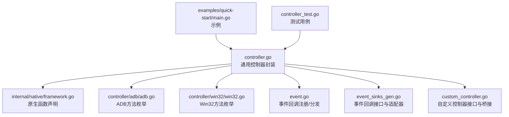
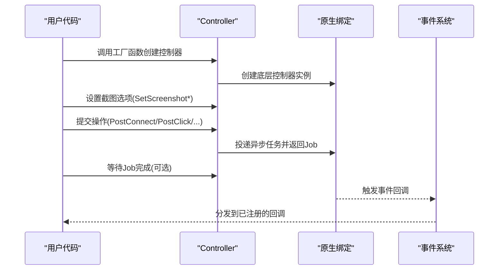
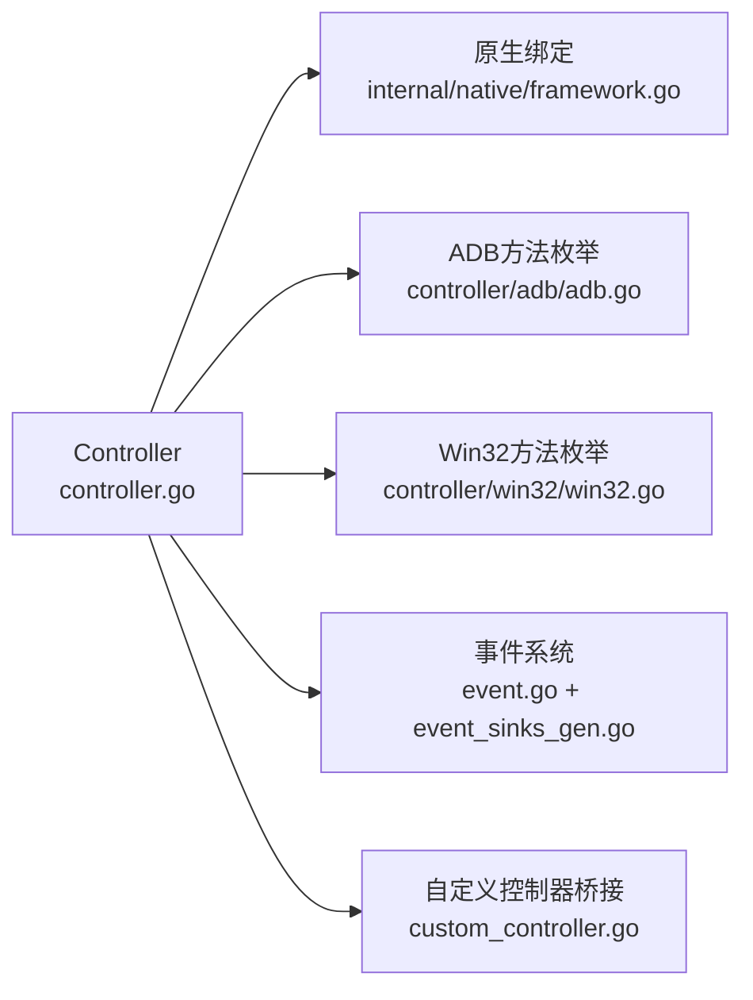

# 控制器

<cite>
**本文引用的文件**
- [controller.go](file://controller.go)
- [custom_controller.go](file://custom_controller.go)
- [controller/adb/adb.go](file://controller/adb/adb.go)
- [controller/win32/win32.go](file://controller/win32/win32.go)
- [event.go](file://event.go)
- [event_sinks_gen.go](file://event_sinks_gen.go)
- [internal/native/framework.go](file://internal/native/framework.go)
- [controller_test.go](file://controller_test.go)
- [examples/quick-start/main.go](file://examples/quick-start/main.go)
</cite>

## 目录
1. [简介](#简介)
2. [项目结构](#项目结构)
3. [核心组件](#核心组件)
4. [架构总览](#架构总览)
5. [详细组件分析](#详细组件分析)
6. [依赖关系分析](#依赖关系分析)
7. [性能考量](#性能考量)
8. [故障排查指南](#故障排查指南)
9. [结论](#结论)
10. [附录](#附录)

## 简介
本文件为控制器（Controller）组件的详尽API参考文档，覆盖以下内容：
- 工厂函数：NewAdbController()、NewWin32Controller()、NewCustomController() 的用法与参数说明
- Controller 结构体的方法：Destroy()、SetScreenshotTargetLongSide()、SetScreenshotTargetShortSide()、SetScreenshotUseRawSize()、PostConnect()、PostClick()、PostSwipe()、PostClickKey()、PostInputText()、PostStartApp()、PostStopApp()、PostTouchDown()、PostTouchMove()、PostTouchUp()、PostKeyDown()、PostKeyUp()、PostScreencap()、PostScroll()、Connected()、CacheImage()、GetUUID()
- 事件回调：AddSink()、RemoveSink()、ClearSinks() 及其便捷注册方法 OnResourceLoading()、OnControllerAction() 等
- 完整使用示例路径，展示不同控制器的创建与使用流程

## 项目结构
控制器模块位于顶层目录，包含通用控制器封装与平台特定实现：
- 通用控制器封装与工厂函数：controller.go
- 自定义控制器接口与回调桥接：custom_controller.go
- ADB 控制器方法枚举与解析：controller/adb/adb.go
- Win32 控制器方法枚举与解析：controller/win32/win32.go
- 事件系统与回调适配器：event.go、event_sinks_gen.go
- 原生绑定声明：internal/native/framework.go
- 使用示例与测试：examples/quick-start/main.go、controller_test.go

图表来源
- [controller.go](file://controller.go#L1-L120)
- [internal/native/framework.go](file://internal/native/framework.go#L157-L174)
- [controller/adb/adb.go](file://controller/adb/adb.go#L1-L60)
- [controller/win32/win32.go](file://controller/win32/win32.go#L1-L60)
- [event.go](file://event.go#L1-L60)
- [event_sinks_gen.go](file://event_sinks_gen.go#L500-L520)
- [custom_controller.go](file://custom_controller.go#L1-L60)
- [examples/quick-start/main.go](file://examples/quick-start/main.go#L1-L41)
- [controller_test.go](file://controller_test.go#L1-L40)

章节来源
- [controller.go](file://controller.go#L1-L120)
- [internal/native/framework.go](file://internal/native/framework.go#L157-L174)

## 核心组件
- Controller：通用控制器封装，负责创建与管理底层控制器实例，并提供统一的操作接口与事件回调机制
- CustomController：自定义控制器接口，允许用户通过 Go 实现设备控制逻辑
- ADB/Win32 方法枚举：分别定义了屏幕截图与输入方法的可选集合及解析工具
- 事件系统：支持注册回调以监听资源加载、控制器动作、任务执行、节点识别/动作等事件

章节来源
- [controller.go](file://controller.go#L24-L120)
- [custom_controller.go](file://custom_controller.go#L42-L102)
- [controller/adb/adb.go](file://controller/adb/adb.go#L9-L65)
- [controller/win32/win32.go](file://controller/win32/win32.go#L9-L60)
- [event.go](file://event.go#L1-L60)
- [event_sinks_gen.go](file://event_sinks_gen.go#L508-L520)

## 架构总览
控制器的调用链路如下：
- 工厂函数创建底层控制器实例（原生层），并初始化控制器存储
- 通过 PostXxx 方法提交异步任务，返回 Job 并可等待结果
- 通过 SetXxx 方法设置截图目标尺寸或原始尺寸策略
- 通过 AddSink/RemoveSink/ClearSinks 管理事件回调
- 事件回调由原生层触发，经回调适配器分发到用户实现

图表来源
- [controller.go](file://controller.go#L28-L120)
- [internal/native/framework.go](file://internal/native/framework.go#L157-L174)
- [event.go](file://event.go#L127-L170)
- [event_sinks_gen.go](file://event_sinks_gen.go#L607-L676)

## 详细组件分析

### 工厂函数
- NewAdbController(adbPath, address, screencapMethod, inputMethod, config, agentPath)：创建 ADB 控制器
  - 参数说明
    - adbPath：adb 可执行文件路径
    - address：设备地址（如 127.0.0.1:5555）
    - screencapMethod：屏幕截图方法（位或组合）
    - inputMethod：输入方法（位或组合）
    - config：配置字符串
    - agentPath：MaaAgent 二进制路径
  - 返回值：成功返回 *Controller，失败返回 nil
  - 失败原因：底层创建失败或句柄为 0
  - 初始化：创建后会初始化控制器存储，以便后续事件回调与自定义控制器回调管理
  - 示例路径：[examples/quick-start/main.go](file://examples/quick-start/main.go#L16-L26)

- NewWin32Controller(hWnd, screencapMethod, mouseMethod, keyboardMethod)：创建 Win32 控制器
  - 参数说明
    - hWnd：窗口句柄（unsafe.Pointer）
    - screencapMethod：屏幕截图方法（单选）
    - mouseMethod：鼠标输入方法（单选）
    - keyboardMethod：键盘输入方法（单选）
  - 返回值：成功返回 *Controller，失败返回 nil
  - 初始化：同上
  - 示例路径：[examples/quick-start/main.go](file://examples/quick-start/main.go#L16-L26)

- NewCustomController(ctrl)：创建自定义控制器
  - 参数说明
    - ctrl：实现 CustomController 接口的对象
  - 返回值：成功返回 *Controller，失败返回 nil
  - 初始化：注册自定义回调并记录回调ID，便于销毁时清理
  - 示例路径：[controller_test.go](file://controller_test.go#L10-L15)

章节来源
- [controller.go](file://controller.go#L28-L120)
- [examples/quick-start/main.go](file://examples/quick-start/main.go#L16-L26)
- [controller_test.go](file://controller_test.go#L10-L15)

### Controller 方法总览
- Destroy()：释放控制器实例
  - 行为：解锁控制器存储，注销自定义控制器回调与所有事件回调，删除存储项，再调用原生销毁
  - 注意：调用后该控制器不可再使用

- 截图尺寸与原始尺寸
  - SetScreenshotTargetLongSide(targetLongSide int32) bool：设置长边目标尺寸（另一侧按比例缩放）
  - SetScreenshotTargetShortSide(targetShortSide int32) bool：设置短边目标尺寸（另一侧按比例缩放）
  - SetScreenshotUseRawSize(enabled bool) bool：启用/禁用使用原始尺寸（不缩放）

- 连接与状态
  - PostConnect() *Job：建立连接，返回 Job，可 Wait() 获取结果
  - Connected() bool：检查当前连接状态

- 设备操作（均返回 Job，可 Wait() 获取结果）
  - PostClick(x, y int32) *Job
  - PostSwipe(x1, y1, x2, y2 int32, duration time.Duration) *Job
  - PostClickKey(keycode int32) *Job
  - PostInputText(text string) *Job
  - PostStartApp(intent string) *Job
  - PostStopApp(intent string) *Job
  - PostTouchDown(contact, x, y, pressure int32) *Job
  - PostTouchMove(contact, x, y, pressure int32) *Job
  - PostTouchUp(contact int32) *Job
  - PostKeyDown(keycode int32) *Job
  - PostKeyUp(keycode int32) *Job
  - PostScreencap() *Job
  - PostScroll(dx, dy int32) *Job

- 缓存与元信息
  - CacheImage() image.Image：获取上次截图请求的图像缓存
  - GetUUID() (string, bool)：获取设备 UUID，失败返回空串与 false

- 事件回调
  - AddSink(sink ControllerEventSink) int64：添加事件回调，返回 sink ID
  - RemoveSink(sinkId int64)：移除指定 sink ID
  - ClearSinks()：清空所有事件回调
  - 便捷注册方法（返回 sink ID）
    - OnResourceLoading(fn)
    - OnControllerAction(fn)
    - OnTaskerTask(fn)
    - OnNodePipelineNode(fn)
    - OnNodeRecognitionNode(fn)
    - OnNodeActionNode(fn)
    - OnTaskNextList(fn)
    - OnTaskRecognition(fn)
    - OnTaskAction(fn)
    - OnUnknownEvent(fn)

章节来源
- [controller.go](file://controller.go#L105-L300)
- [event.go](file://event.go#L1-L60)
- [event_sinks_gen.go](file://event_sinks_gen.go#L607-L676)

### ADB 方法枚举与解析
- ScreencapMethod/InputMethod：位掩码组合，支持多方法并行选择
- 常量与默认值：包含多种方法常量与默认集合
- 字符串表示与解析：提供 String() 与 ParseXxx()，便于从配置字符串转换为枚举值
- 使用建议：根据设备能力与网络环境选择合适方法组合

章节来源
- [controller/adb/adb.go](file://controller/adb/adb.go#L9-L170)

### Win32 方法枚举与解析
- ScreencapMethod/InputMethod：单选枚举，非位或组合
- 常量与默认值：包含多种方法常量
- 字符串表示与解析：提供 String() 与 ParseXxx()

章节来源
- [controller/win32/win32.go](file://controller/win32/win32.go#L9-L164)

### 自定义控制器接口与桥接
- CustomController 接口：定义 Connect、RequestUUID、GetFeature、StartApp、StopApp、Screencap、Click、Swipe、TouchDown、TouchMove、TouchUp、ClickKey、InputText、KeyDown、KeyUp 等方法
- MaaCustomControllerCallbacks：原生回调指针表，通过 purego.NewCallback 将 Go 函数桥接到原生层
- 回调代理：_ConnectAgent、_RequestUUIDAgent、_GetFeatureAgent、_StartAppAgent、_StopAppAgent、_ScreencapAgent、_ClickAgent、_SwipeAgent、_TouchDownAgent、_TouchMoveAgent、_TouchUpAgent、_ClickKey、_InputText、_KeyDown、_KeyUp
- 注册/注销：通过 registerCustomControllerCallbacks/unregisterCustomControllerCallbacks 维护回调映射

章节来源
- [custom_controller.go](file://custom_controller.go#L42-L102)
- [custom_controller.go](file://custom_controller.go#L104-L392)

### 事件回调系统
- 回调注册：registerEventCallback 返回唯一回调ID，保存在全局映射中
- 回调分发：_MaaEventCallbackAgent 根据 transArg 查找回调，构造 eventHandler 并按消息前缀分派到对应 OnXxx 方法
- 事件类型：资源加载、控制器动作、任务执行、节点识别/动作、未知事件等
- 适配器：ControllerEventSinkAdapter 提供便捷的函数式回调包装

章节来源
- [event.go](file://event.go#L1-L60)
- [event.go](file://event.go#L127-L170)
- [event_sinks_gen.go](file://event_sinks_gen.go#L508-L520)

## 依赖关系分析
- 控制器封装依赖原生绑定（创建、销毁、选项设置、任务投递、事件回调）
- ADB/Win32 方法枚举用于工厂函数参数，决定底层行为
- 事件系统通过回调适配器解耦上层业务与原生事件分发
- 自定义控制器通过回调桥接与原生层交互

图表来源
- [controller.go](file://controller.go#L1-L120)
- [internal/native/framework.go](file://internal/native/framework.go#L157-L174)
- [controller/adb/adb.go](file://controller/adb/adb.go#L1-L60)
- [controller/win32/win32.go](file://controller/win32/win32.go#L1-L60)
- [event.go](file://event.go#L1-L60)
- [event_sinks_gen.go](file://event_sinks_gen.go#L508-L520)
- [custom_controller.go](file://custom_controller.go#L1-L60)

## 性能考量
- 异步任务：所有操作均返回 Job 并可 Wait()，避免阻塞主线程
- 截图尺寸：合理设置长/短边目标尺寸可减少数据传输与处理开销
- 原生层优化：ADB/Win32 方法枚举允许框架自动选择最快/可用方法，降低延迟
- 事件回调：仅注册必要回调，避免过多 JSON 解析与对象分配

## 故障排查指南
- 控制器创建失败
  - 检查 adbPath/address 或 hWnd 是否有效
  - 检查 screencapMethod/inputMethod 是否符合设备能力
  - 参考：[controller.go](file://controller.go#L28-L120)
- 连接失败
  - 使用 PostConnect().Wait() 检查结果
  - 使用 Connected() 确认连接状态
  - 参考：[controller_test.go](file://controller_test.go#L68-L82)
- 截图异常
  - 切换 screencapMethod 或关闭 SetScreenshotUseRawSize
  - 使用 CacheImage() 验证缓存图像是否存在
  - 参考：[controller_test.go](file://controller_test.go#L191-L210)
- 输入无效
  - 确认坐标与按键码正确
  - 对于触摸序列，确保 TouchDown/Move/Up 成对出现
  - 参考：[controller_test.go](file://controller_test.go#L84-L118)
- 事件回调未触发
  - 确认已 AddSink 并保持 sink 生命周期
  - 使用 OnXxx 便捷方法简化注册
  - 参考：[event.go](file://event.go#L127-L170)，[event_sinks_gen.go](file://event_sinks_gen.go#L607-L676)

章节来源
- [controller.go](file://controller.go#L105-L300)
- [controller_test.go](file://controller_test.go#L68-L210)
- [event.go](file://event.go#L127-L170)
- [event_sinks_gen.go](file://event_sinks_gen.go#L607-L676)

## 结论
Controller 组件提供了统一、跨平台的设备控制抽象，结合异步任务与事件回调机制，能够高效地完成自动化操作与状态监控。通过工厂函数与方法枚举，用户可以灵活选择 ADB/Win32 或自定义控制器，并在需要时扩展事件处理能力。

## 附录

### API 一览与使用要点
- 工厂函数
  - NewAdbController：适用于 Android 设备，需提供 adb 路径、设备地址、方法枚举与 agent 路径
  - NewWin32Controller：适用于 Windows 桌面应用，需提供窗口句柄与方法枚举
  - NewCustomController：适用于自定义设备控制，需实现 CustomController 接口
  - 示例：[examples/quick-start/main.go](file://examples/quick-start/main.go#L16-L26)

- 截图与尺寸
  - SetScreenshotTargetLongSide/SetScreenshotTargetShortSide：设置目标尺寸（另一侧按比例缩放）
  - SetScreenshotUseRawSize：启用原始尺寸（不缩放）
  - 示例：[controller_test.go](file://controller_test.go#L28-L66)

- 连接与状态
  - PostConnect：建立连接
  - Connected：检查连接状态
  - 示例：[controller_test.go](file://controller_test.go#L68-L82)

- 设备操作
  - PostClick/PostSwipe/PostClickKey/PostInputText/PostStartApp/PostStopApp/PostTouchDown/PostTouchMove/PostTouchUp/PostKeyDown/PostKeyUp/PostScreencap/PostScroll
  - 示例：[controller_test.go](file://controller_test.go#L84-L198)

- 缓存与元信息
  - CacheImage：获取上次截图缓存
  - GetUUID：获取设备 UUID
  - 示例：[controller_test.go](file://controller_test.go#L191-L219)

- 事件回调
  - AddSink/RemoveSink/ClearSinks
  - OnResourceLoading/OnControllerAction/OnTaskerTask/OnNodePipelineNode/OnNodeRecognitionNode/OnNodeActionNode/OnTaskNextList/OnTaskRecognition/OnTaskAction/OnUnknownEvent
  - 示例：[event_sinks_gen.go](file://event_sinks_gen.go#L607-L676)