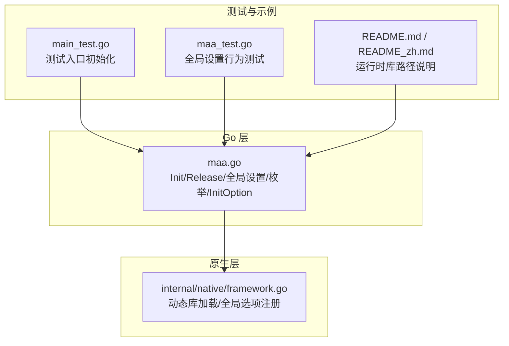
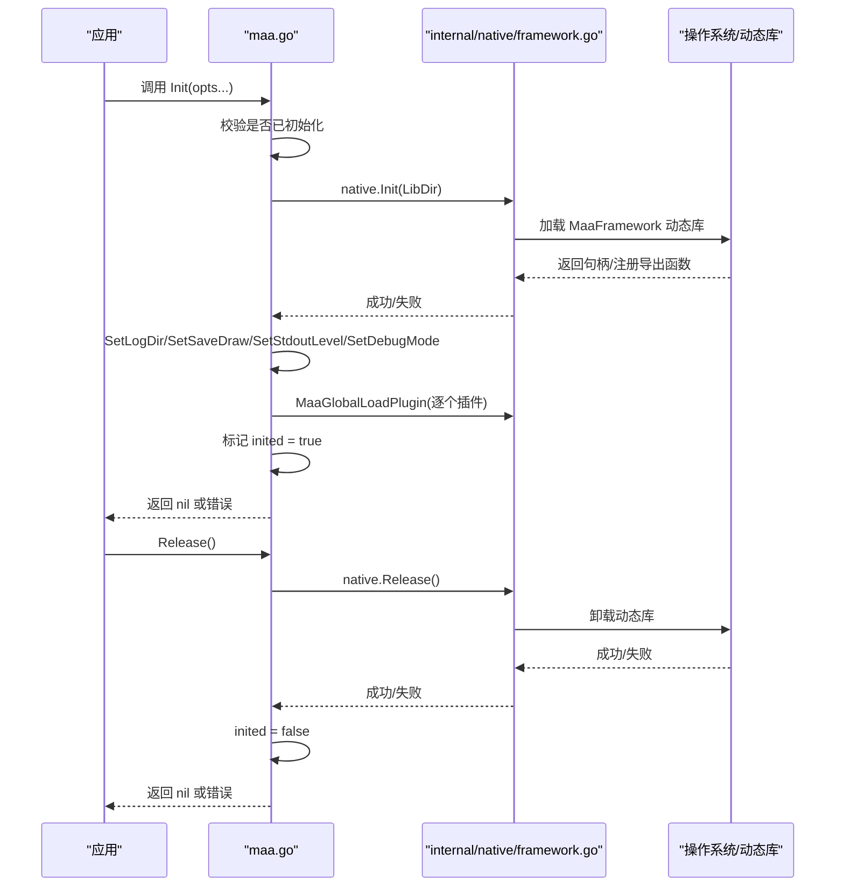
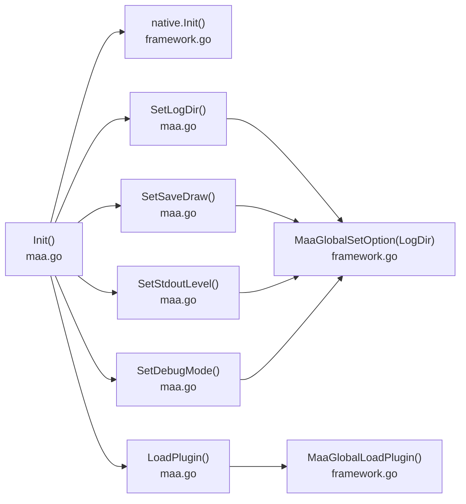

# 框架初始化

<cite>
**本文引用的文件**
- [maa.go](file://maa.go)
- [framework.go](file://internal/native/framework.go)
- [main_test.go](file://main_test.go)
- [maa_test.go](file://maa_test.go)
- [README.md](file://README.md)
- [README_zh.md](file://README_zh.md)
</cite>

## 目录
1. [简介](#简介)
2. [项目结构](#项目结构)
3. [核心组件](#核心组件)
4. [架构总览](#架构总览)
5. [详细组件分析](#详细组件分析)
6. [依赖关系分析](#依赖关系分析)
7. [性能考量](#性能考量)
8. [故障排查指南](#故障排查指南)
9. [结论](#结论)

## 简介
本章节面向希望在 Go 中正确初始化与释放 MaaFramework 的开发者，系统性地文档化框架初始化 API，重点覆盖：
- Init() 函数与 InitOption 配置项（WithLibDir、WithLogDir、WithSaveDraw、WithStdoutLevel、WithDebugMode、WithPluginPaths）
- 全局设置函数（SetLogDir、SetSaveDraw、SetStdoutLevel、SetDebugMode、LoadPlugin）
- 查询与释放接口（IsInited()、Release()）
- 错误处理（ErrAlreadyInitialized、ErrNotInitialized）
- 日志级别 LoggingLevel 的语义与适用场景

## 项目结构
围绕初始化 API 的关键文件与职责如下：
- maa.go：对外暴露 Init、IsInited、Release、Set* 系列全局设置函数、LoggingLevel 枚举及 InitOption 配置项
- internal/native/framework.go：封装底层动态库加载与全局选项设置（MaaGlobalSetOption、MaaGlobalLoadPlugin 等）
- main_test.go、maa_test.go：演示与验证初始化与全局设置的行为
- README.md、README_zh.md：提供初始化与运行时库路径的说明

图表来源
- [maa.go](file://maa.go#L1-L211)
- [framework.go](file://internal/native/framework.go#L256-L460)
- [main_test.go](file://main_test.go#L1-L16)
- [maa_test.go](file://maa_test.go#L1-L141)
- [README.md](file://README.md#L62-L77)
- [README_zh.md](file://README_zh.md#L62-L77)

章节来源
- [maa.go](file://maa.go#L1-L211)
- [framework.go](file://internal/native/framework.go#L256-L460)
- [main_test.go](file://main_test.go#L1-L16)
- [maa_test.go](file://maa_test.go#L1-L141)
- [README.md](file://README.md#L62-L77)
- [README_zh.md](file://README_zh.md#L62-L77)

## 核心组件
- InitConfig：初始化配置对象，包含 LibDir、LogDir、SaveDraw、StdoutLevel、DebugMode、PluginPaths 等字段
- InitOption：函数式选项类型，用于构建 InitConfig
- Init()：完成动态库加载、全局设置与插件加载，并标记已初始化
- IsInited()：查询是否已初始化
- Release()：释放动态库资源并重置初始化状态
- SetLogDir/SetSaveDraw/SetStdoutLevel/SetDebugMode：设置全局日志相关选项
- LoadPlugin：加载插件
- LoggingLevel：日志级别枚举

章节来源
- [maa.go](file://maa.go#L17-L106)
- [maa.go](file://maa.go#L108-L210)
- [framework.go](file://internal/native/framework.go#L256-L286)

## 架构总览
初始化流程由 Go 层 Init() 调用原生层动态库加载函数，随后应用全局设置与插件加载，最终标记初始化完成；释放流程则反向执行。

图表来源
- [maa.go](file://maa.go#L108-L161)
- [framework.go](file://internal/native/framework.go#L288-L302)
- [framework.go](file://internal/native/framework.go#L458-L460)

## 详细组件分析

### Init() 与 InitOption 配置项
- InitConfig 字段
  - LibDir：动态库所在目录；为空时按默认策略定位
  - LogDir：日志输出目录，默认 "./debug"
  - SaveDraw：是否保存识别绘制结果至 LogDir/vision，便于调试
  - StdoutLevel：控制标准输出日志级别
  - DebugMode：是否启用综合调试模式
  - PluginPaths：要加载的插件路径列表
- InitOption
  - WithLibDir：设置 LibDir
  - WithLogDir：设置 LogDir
  - WithSaveDraw：设置 SaveDraw
  - WithStdoutLevel：设置 StdoutLevel
  - WithDebugMode：设置 DebugMode
  - WithPluginPaths：设置 PluginPaths（可变参数）
- 默认值
  - LibDir 空字符串
  - LogDir "./debug"
  - SaveDraw false
  - StdoutLevel LoggingLevelInfo
  - DebugMode false
  - PluginPaths 空切片
- Init() 行为要点
  - 若已初始化则返回 ErrAlreadyInitialized
  - 合并默认配置与传入选项
  - 调用原生 Init 加载动态库
  - 应用全局设置（日志目录、保存绘制、标准输出级别、调试模式）
  - 依次加载插件
  - 设置 inited 标志为 true
- 错误处理
  - ErrAlreadyInitialized：重复初始化
  - 其他错误来自原生层加载失败或设置失败

章节来源
- [maa.go](file://maa.go#L17-L106)
- [maa.go](file://maa.go#L108-L161)

### 全局设置函数
- SetLogDir(path string) bool
  - 作用：设置日志根目录
  - 约束：空路径返回 false
- SetSaveDraw(enabled bool) bool
  - 作用：控制是否保存识别绘制结果
- SetStdoutLevel(level LoggingLevel) bool
  - 作用：设置标准输出日志级别
- SetDebugMode(enabled bool) bool
  - 作用：启用/禁用调试模式
- LoadPlugin(path string) bool
  - 作用：加载插件（支持全路径或名称，目录递归搜索）

章节来源
- [maa.go](file://maa.go#L167-L210)
- [framework.go](file://internal/native/framework.go#L256-L286)

### 查询与释放
- IsInited() bool
  - 作用：查询框架是否已初始化
- Release() error
  - 作用：释放动态库资源并重置初始化状态
  - 若未初始化则返回 ErrNotInitialized
  - 成功后将 inited 置为 false

章节来源
- [maa.go](file://maa.go#L141-L161)

### LoggingLevel 枚举与应用场景
- 枚举值（按严重程度升序）
  - Off：关闭日志输出
  - Fatal：致命错误
  - Error：一般错误
  - Warn：警告
  - Info：信息性日志（默认）
  - Debug：调试信息
  - Trace：最详细追踪
  - All：输出全部级别
- 使用建议
  - 开发/调试：Info 或 Debug
  - 生产问题排查：Trace
  - 仅关注异常：Error/Warn/Fatal
  - 最小化输出：Off 或 Fatal

章节来源
- [maa.go](file://maa.go#L180-L203)

### 错误类型
- ErrAlreadyInitialized：重复调用 Init()
- ErrNotInitialized：在未初始化状态下调用 Release()

章节来源
- [maa.go](file://maa.go#L10-L16)

## 依赖关系分析
- Init() 依赖原生层动态库加载与全局选项设置
- Set* 系列函数通过原生层 MaaGlobalSetOption 应用配置
- LoadPlugin 通过原生层 MaaGlobalLoadPlugin 注册插件

图表来源
- [maa.go](file://maa.go#L108-L210)
- [framework.go](file://internal/native/framework.go#L256-L286)
- [framework.go](file://internal/native/framework.go#L458-L460)

章节来源
- [maa.go](file://maa.go#L108-L210)
- [framework.go](file://internal/native/framework.go#L256-L286)
- [framework.go](file://internal/native/framework.go#L458-L460)

## 性能考量
- 动态库加载成本：Init() 会加载 MaaFramework 动态库并注册大量导出函数，建议在应用启动阶段尽早调用一次
- 插件加载：LoadPlugin() 可能引入额外开销，建议仅加载必要插件
- 日志级别：过高的日志级别（如 Trace）会产生大量 IO，生产环境建议适度降低
- 保存绘制：SaveDraw 打开会写入磁盘，对 IO 有一定压力，仅在调试时开启

## 故障排查指南
- 重复初始化
  - 现象：Init() 返回 ErrAlreadyInitialized
  - 处理：确保只调用一次 Init()，并在应用生命周期内复用
- 未初始化即释放
  - 现象：Release() 返回 ErrNotInitialized
  - 处理：先调用 Init()，再调用 Release()
- 动态库加载失败
  - 现象：Init() 返回底层错误
  - 排查：确认 LibDir 正确、库文件存在且与平台匹配；参考 README 的运行时库路径说明
- 日志目录无效
  - 现象：SetLogDir 返回 false
  - 处理：传入非空有效路径
- 插件加载失败
  - 现象：LoadPlugin 返回 false
  - 排查：确认插件路径正确，或使用插件名让系统在默认目录搜索

章节来源
- [maa.go](file://maa.go#L10-L16)
- [maa.go](file://maa.go#L108-L161)
- [README.md](file://README.md#L62-L77)
- [README_zh.md](file://README_zh.md#L62-L77)

## 结论
- 正确初始化：优先使用 Init(WithLibDir(...), WithLogDir(...), WithSaveDraw(...), WithStdoutLevel(...), WithDebugMode(...), WithPluginPaths(...))，并在应用启动阶段一次性完成
- 合理设置：根据场景选择合适的日志级别与调试模式，避免不必要的 IO 与性能损耗
- 稳健释放：确保在退出前调用 Release()，以释放底层资源
- 错误处理：对 ErrAlreadyInitialized 与 ErrNotInitialized 进行显式处理，避免隐式崩溃