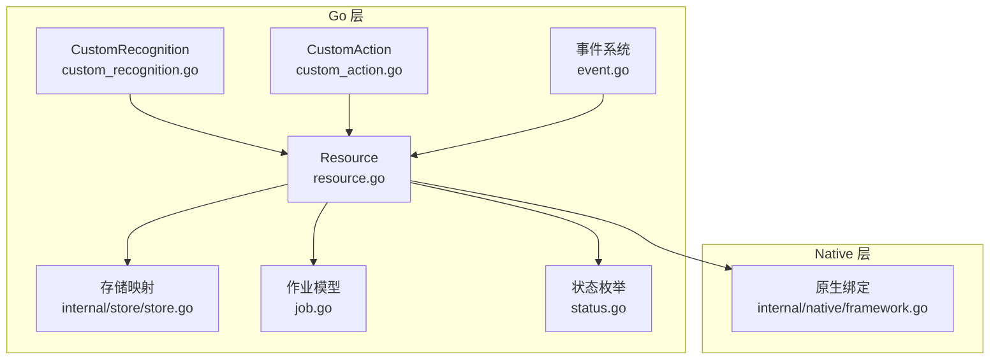
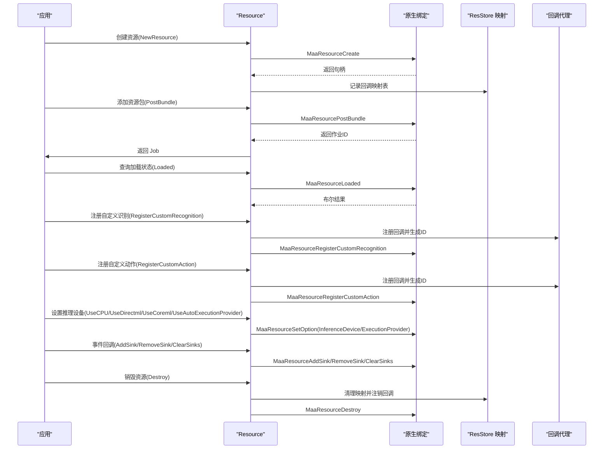
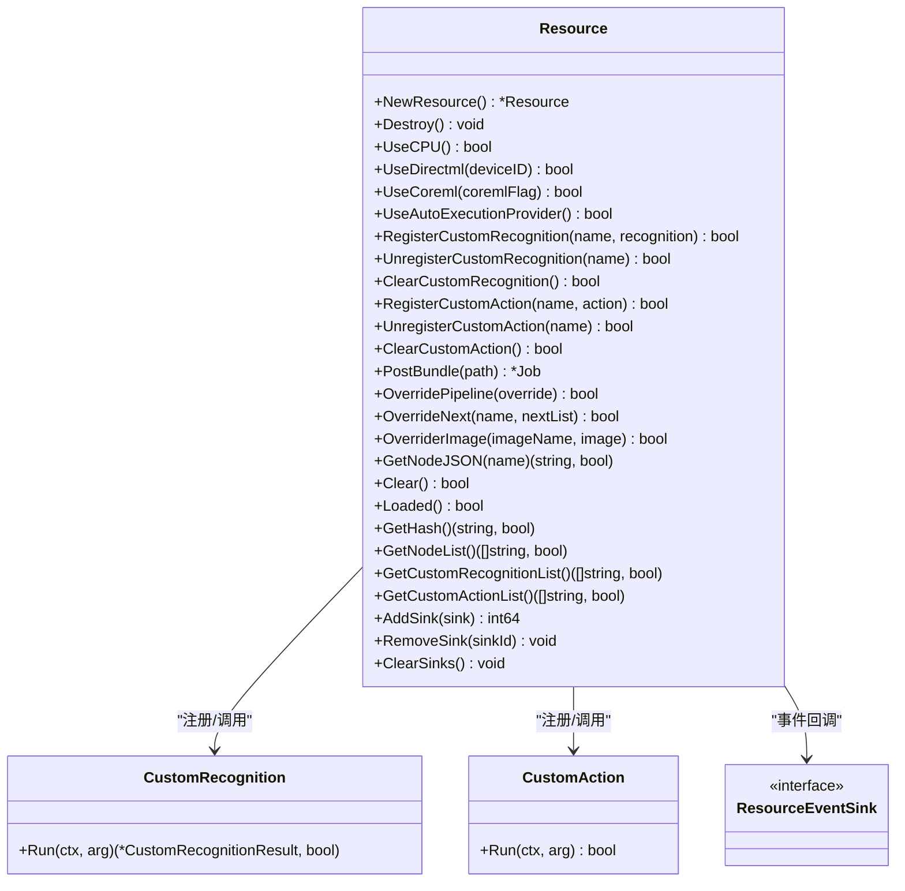
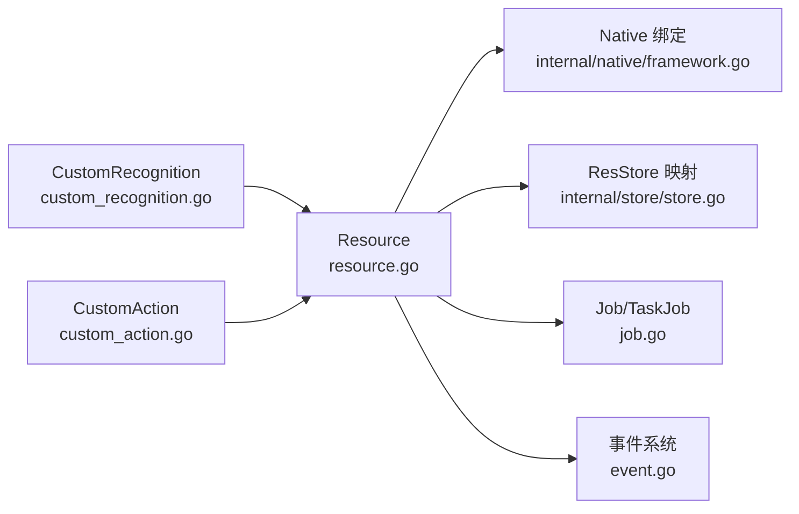

# 资源管理器

<cite>
**本文引用的文件**
- [resource.go](file://resource.go)
- [custom_recognition.go](file://custom_recognition.go)
- [custom_action.go](file://custom_action.go)
- [event.go](file://event.go)
- [internal/store/store.go](file://internal/store/store.go)
- [internal/native/framework.go](file://internal/native/framework.go)
- [job.go](file://job.go)
- [status.go](file://status.go)
- [examples/custom-action/main.go](file://examples/custom-action/main.go)
- [examples/custom-recognition/main.go](file://examples/custom-recognition/main.go)
- [examples/quick-start/main.go](file://examples/quick-start/main.go)
- [resource_test.go](file://resource_test.go)
</cite>

## 目录
1. [简介](#简介)
2. [项目结构](#项目结构)
3. [核心组件](#核心组件)
4. [架构总览](#架构总览)
5. [详细组件分析](#详细组件分析)
6. [依赖关系分析](#依赖关系分析)
7. [性能考量](#性能考量)
8. [故障排查指南](#故障排查指南)
9. [结论](#结论)
10. [附录](#附录)

## 简介
本文件为 Resource 组件的详尽 API 参考与使用指南，涵盖：
- NewResource() 的创建与返回值
- Resource 结构体所有方法的用途与行为
- 自定义识别与动作的注册/注销/清空
- 推理设备选择（CPU/DirectML/CoreML/Auto）
- 资源包路径添加、流水线覆盖、任务下一跳覆盖、图像覆盖
- 节点 JSON 获取、资源加载状态、资源哈希、各类列表查询
- 事件回调的添加、移除、清空
- 完整的资源管理器使用流程示例

## 项目结构
Resource 组件位于顶层模块中，通过内部 native 层绑定底层框架能力，并借助 internal/store 进行回调与句柄映射管理。

图表来源
- [resource.go](file://resource.go#L1-L383)
- [custom_recognition.go](file://custom_recognition.go#L1-L103)
- [custom_action.go](file://custom_action.go#L1-L92)
- [event.go](file://event.go#L1-L334)
- [internal/store/store.go](file://internal/store/store.go#L1-L65)
- [internal/native/framework.go](file://internal/native/framework.go#L117-L369)
- [job.go](file://job.go#L1-L96)
- [status.go](file://status.go#L1-L61)

章节来源
- [resource.go](file://resource.go#L1-L383)
- [internal/native/framework.go](file://internal/native/framework.go#L117-L369)

## 核心组件
- Resource：资源管理器主体，封装资源生命周期与能力调用
- CustomRecognition/CustomAction：自定义识别与动作接口
- 事件系统：ResourceEventSink 回调机制
- 存储映射：ResStoreValue 保存回调 ID 映射
- 作业模型：Job/TaskJob 提供异步状态查询与等待

章节来源
- [resource.go](file://resource.go#L1-L383)
- [custom_recognition.go](file://custom_recognition.go#L1-L103)
- [custom_action.go](file://custom_action.go#L1-L92)
- [event.go](file://event.go#L1-L334)
- [internal/store/store.go](file://internal/store/store.go#L1-L65)
- [job.go](file://job.go#L1-L96)
- [status.go](file://status.go#L1-L61)

## 架构总览
Resource 通过 native 层暴露的方法实现对底层资源的控制，内部使用 store 将 Go 层回调 ID 与原生句柄进行映射，确保资源销毁时能正确清理回调。

图表来源
- [resource.go](file://resource.go#L1-L383)
- [internal/native/framework.go](file://internal/native/framework.go#L117-L369)
- [internal/store/store.go](file://internal/store/store.go#L1-L65)
- [event.go](file://event.go#L1-L334)

## 详细组件分析

### NewResource() 与 Destroy()
- NewResource()：创建一个新的资源对象，返回指向 Resource 的指针；若底层创建失败则返回空指针。创建成功后会初始化资源级回调映射表。
- Destroy()：销毁资源前会遍历并注销所有已注册的事件回调、自定义识别回调、自定义动作回调，随后调用底层销毁接口释放资源。

章节来源
- [resource.go](file://resource.go#L17-L54)
- [internal/store/store.go](file://internal/store/store.go#L54-L65)

### 推理设备设置
- UseCPU()：设置执行提供者为 CPU，设备为自动。
- UseDirectml(deviceID)：设置执行提供者为 DirectML，可指定设备 ID。
- UseCoreml(coremlFlag)：设置执行提供者为 CoreML，可传入标志或设备 ID。
- UseAutoExecutionProvider()：设置执行提供者为 Auto，设备为自动。

这些方法通过统一的 setOption 接口设置推理设备与执行提供者。

章节来源
- [resource.go](file://resource.go#L65-L112)

### 自定义识别
- RegisterCustomRecognition(name, recognition)：将自定义识别注册到资源，返回布尔值表示是否成功。内部会注册 Go 层回调并记录映射，再调用底层注册接口。
- UnregisterCustomRecognition(name)：从资源注销指定名称的自定义识别，先在映射中查找并注销对应回调，再调用底层注销接口。
- ClearCustomRecognition()：清空资源上所有自定义识别，逐个注销并重置映射。

章节来源
- [resource.go](file://resource.go#L114-L161)
- [custom_recognition.go](file://custom_recognition.go#L1-L103)
- [internal/store/store.go](file://internal/store/store.go#L54-L65)

### 自定义动作
- RegisterCustomAction(name, action)：将自定义动作注册到资源，返回布尔值表示是否成功。内部注册 Go 层回调并记录映射，再调用底层注册接口。
- UnregisterCustomAction(name)：从资源注销指定名称的自定义动作，先在映射中查找并注销对应回调，再调用底层注销接口。
- ClearCustomAction()：清空资源上所有自定义动作，逐个注销并重置映射。

章节来源
- [resource.go](file://resource.go#L163-L210)
- [custom_action.go](file://custom_action.go#L1-L92)
- [internal/store/store.go](file://internal/store/store.go#L54-L65)

### 资源包与加载
- PostBundle(path)：向资源添加一个资源包路径，返回 Job 对象，可通过 Wait() 等待加载完成。
- Clear()：清空资源加载路径。
- Loaded()：检查资源是否已加载完成。
- GetHash()：获取资源哈希字符串与是否成功标志。

章节来源
- [resource.go](file://resource.go#L212-L303)
- [job.go](file://job.go#L1-L96)
- [status.go](file://status.go#L1-L61)

### 流水线与任务控制
- OverridePipeline(override)：覆盖流水线配置，支持字符串或可序列化为 JSON 的任意类型。内部会尝试 JSON 序列化，失败则返回 false。
- OverrideNext(name, nextList)：覆盖某个任务节点的“下一跳”列表，内部构造字符串列表缓冲区并调用底层接口。
- OverriderImage(imageName, image)：覆盖资源中的某张图片，内部构造图像缓冲区并调用底层接口。
- GetNodeJSON(name)：按节点名获取节点 JSON 数据，返回字符串与布尔标志。

章节来源
- [resource.go](file://resource.go#L219-L264)

### 列表查询
- GetNodeList()：获取资源中的节点列表，返回字符串数组与布尔标志。
- GetCustomRecognitionList()：获取自定义识别列表，返回字符串数组与布尔标志。
- GetCustomActionList()：获取自定义动作列表，返回字符串数组与布尔标志。

章节来源
- [resource.go](file://resource.go#L305-L343)

### 事件回调
- AddSink(sink)：添加资源事件回调，返回 sink ID；内部注册 Go 层回调并建立映射，再调用底层添加接口。
- RemoveSink(sinkId)：根据 sink ID 移除事件回调，先注销 Go 层回调，再调用底层移除接口。
- ClearSinks()：清空所有事件回调，逐个注销并重置映射。

事件回调代理会根据消息前缀分发到不同事件类型（如 Resource.Loading、Controller.Action、Tasker.Task 等），并在末尾调用对应的 ResourceEventSink 方法。

章节来源
- [resource.go](file://resource.go#L345-L383)
- [event.go](file://event.go#L1-L334)
- [internal/store/store.go](file://internal/store/store.go#L54-L65)

### 类图：Resource 与相关接口

图表来源
- [resource.go](file://resource.go#L1-L383)
- [custom_recognition.go](file://custom_recognition.go#L1-L103)
- [custom_action.go](file://custom_action.go#L1-L92)
- [event.go](file://event.go#L1-L334)

## 依赖关系分析
- Resource 依赖 native 层提供的资源操作函数（创建/销毁/设置选项/注册/注销等）。
- Resource 使用 internal/store 中的 ResStoreValue 保存三类映射：
  - SinkIDToEventCallbackID：资源事件 sink ID 到 Go 回调 ID
  - CustomRecognizersCallbackID：自定义识别名称到 Go 回调 ID
  - CustomActionsCallbackID：自定义动作名称到 Go 回调 ID
- 事件回调代理与自定义识别/动作回调代理分别维护各自的全局映射，Resource 在销毁时负责清理这些映射。

图表来源
- [resource.go](file://resource.go#L1-L383)
- [internal/native/framework.go](file://internal/native/framework.go#L117-L369)
- [internal/store/store.go](file://internal/store/store.go#L1-L65)
- [job.go](file://job.go#L1-L96)
- [event.go](file://event.go#L1-L334)

章节来源
- [resource.go](file://resource.go#L1-L383)
- [internal/native/framework.go](file://internal/native/framework.go#L117-L369)
- [internal/store/store.go](file://internal/store/store.go#L1-L65)

## 性能考量
- 异步加载：PostBundle 返回 Job，建议使用 Wait() 等待完成后再进行后续操作，避免阻塞主线程。
- 批量操作：在大量注册自定义识别/动作时，注意及时清理不再使用的项，避免内存与回调累积。
- 设备选择：UseAutoExecutionProvider() 可自动选择最优执行提供者，但具体性能取决于运行环境；GPU 加速通常优于 CPU，但需考虑显存占用与驱动稳定性。
- 图像覆盖：OverriderImage 会构造图像缓冲区，频繁覆盖可能带来额外内存开销，建议按需使用。

[本节为通用指导，不直接分析具体文件]

## 故障排查指南
- NewResource() 返回空指针：底层创建失败，检查初始化参数与环境依赖。
- 注册/注销失败：确认名称唯一且未被其他实例占用；检查底层返回值与映射是否正确更新。
- 事件回调未触发：确认 AddSink 成功并返回有效 sink ID；检查消息前缀与事件类型匹配。
- OverridePipeline 失败：检查传入数据是否可序列化为合法 JSON。
- Loaded() 恒为 false：确认 PostBundle 已 Wait 成功且资源路径正确。
- 销毁后仍出现回调异常：确认 Destroy() 已清理映射并注销回调。

章节来源
- [resource.go](file://resource.go#L17-L54)
- [resource_test.go](file://resource_test.go#L1-L298)
- [event.go](file://event.go#L1-L334)

## 结论
Resource 组件提供了资源生命周期管理、设备选择、自定义识别/动作注册、资源包加载、流水线与任务控制、事件回调以及多种查询能力。通过与 native 层的紧密协作与内部映射表的维护，实现了稳定可靠的资源管理体验。建议在实际使用中遵循异步加载、按需注册/注销、合理选择推理设备的原则，以获得最佳性能与稳定性。

[本节为总结性内容，不直接分析具体文件]

## 附录

### API 参考摘要
- NewResource()：创建资源，返回 *Resource 或空指针
- Destroy()：释放资源并清理回调映射
- UseCPU()/UseDirectml()/UseCoreml()/UseAutoExecutionProvider()：设置推理设备与执行提供者
- RegisterCustomRecognition()/UnregisterCustomRecognition()/ClearCustomRecognition()：自定义识别注册/注销/清空
- RegisterCustomAction()/UnregisterCustomAction()/ClearCustomAction()：自定义动作注册/注销/清空
- PostBundle(path)：添加资源包路径，返回 Job
- OverridePipeline(override)：覆盖流水线配置
- OverrideNext(name, nextList)：覆盖任务下一跳列表
- OverriderImage(imageName, image)：覆盖资源图片
- GetNodeJSON(name)：获取节点 JSON
- Clear()：清空资源加载路径
- Loaded()：检查资源是否加载完成
- GetHash()：获取资源哈希
- GetNodeList()/GetCustomRecognitionList()/GetCustomActionList()：获取各类列表
- AddSink(sink)/RemoveSink(sinkId)/ClearSinks()：事件回调管理

章节来源
- [resource.go](file://resource.go#L1-L383)

### 使用流程示例（步骤化）
- 初始化与绑定
  - 创建资源：NewResource()
  - 添加资源包：PostBundle(路径).Wait()
  - 绑定控制器与任务器（示例见 quick-start）
- 自定义识别/动作
  - 注册自定义识别：RegisterCustomRecognition("名称", 实现)
  - 注册自定义动作：RegisterCustomAction("名称", 实现)
- 配置与运行
  - 设置推理设备：UseCPU()/UseDirectml()/UseCoreml()/UseAutoExecutionProvider()
  - 覆盖流水线：OverridePipeline(配置)
  - 覆盖下一跳：OverrideNext("节点名", []string{"任务A","任务B"})
  - 覆盖图片：OverriderImage("图片名", 图像)
- 查询与监控
  - 查询节点 JSON：GetNodeJSON("节点名")
  - 查询列表：GetNodeList()/GetCustomRecognitionList()/GetCustomActionList()
  - 查询哈希：GetHash()
  - 检查加载状态：Loaded()
- 事件回调
  - 添加回调：AddSink(sink)，记录返回的 sink ID
  - 移除回调：RemoveSink(sinkId)
  - 清空回调：ClearSinks()
- 清理
  - 注销自定义识别/动作：Unregister/ Clear
  - 销毁资源：Destroy()

章节来源
- [examples/quick-start/main.go](file://examples/quick-start/main.go#L1-L41)
- [examples/custom-action/main.go](file://examples/custom-action/main.go#L1-L49)
- [examples/custom-recognition/main.go](file://examples/custom-recognition/main.go#L1-L77)
- [resource.go](file://resource.go#L1-L383)

### 代码片段路径（示例）
- 快速开始示例：[examples/quick-start/main.go](file://examples/quick-start/main.go#L1-L41)
- 自定义动作示例：[examples/custom-action/main.go](file://examples/custom-action/main.go#L1-L49)
- 自定义识别示例：[examples/custom-recognition/main.go](file://examples/custom-recognition/main.go#L1-L77)
- 资源测试用例（含注册/注销/清空/加载/哈希/列表等）：[resource_test.go](file://resource_test.go#L1-L298)