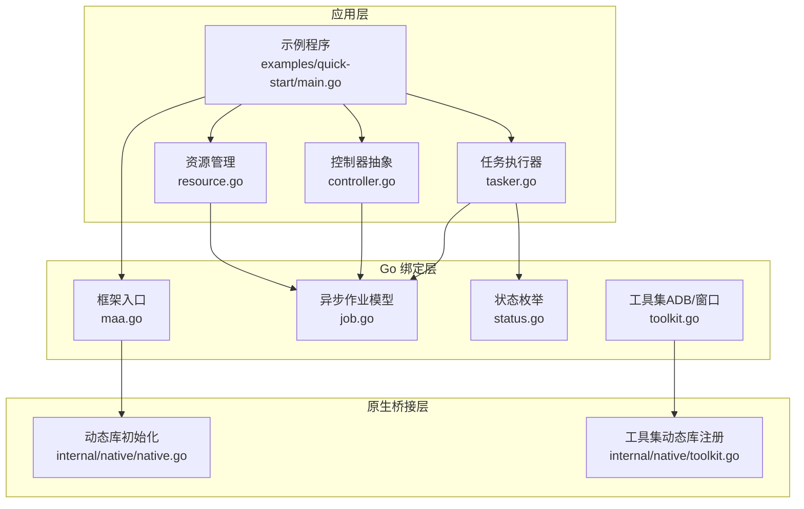
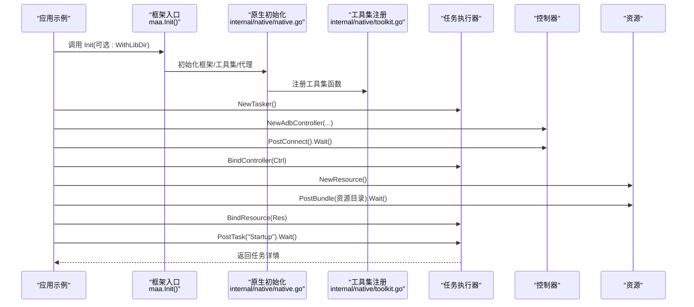
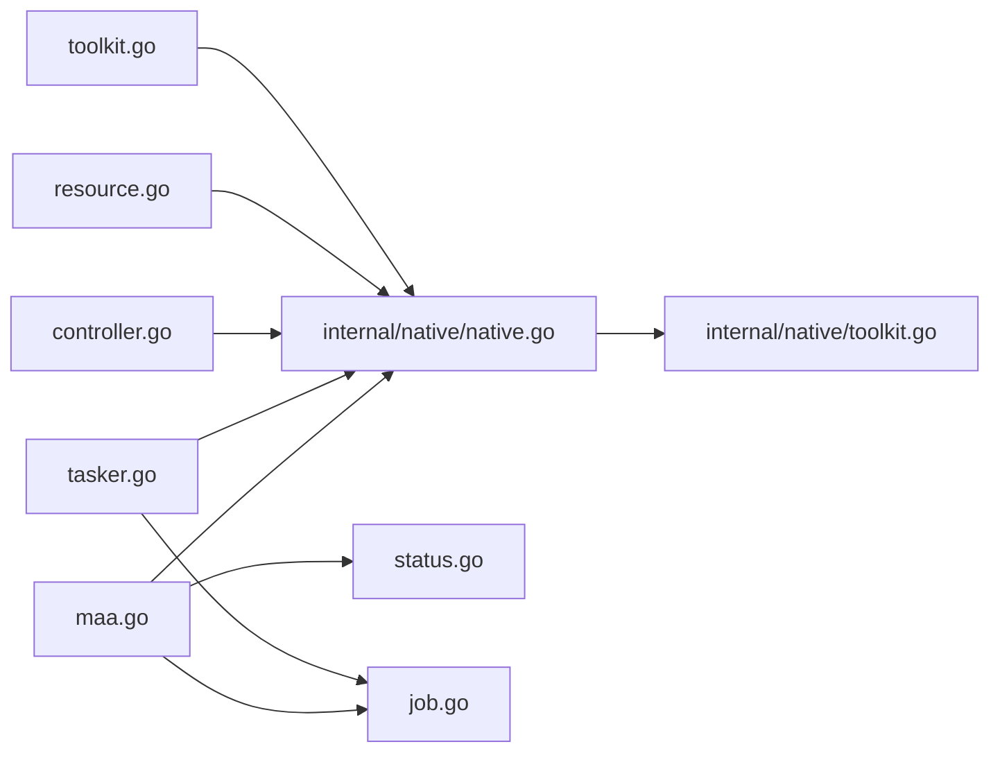
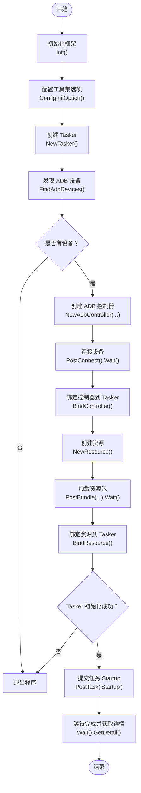

# 快速开始

<cite>
**本文引用的文件列表**
- [README.md](file://README.md)
- [go.mod](file://go.mod)
- [maa.go](file://maa.go)
- [tasker.go](file://tasker.go)
- [controller.go](file://controller.go)
- [resource.go](file://resource.go)
- [job.go](file://job.go)
- [status.go](file://status.go)
- [toolkit.go](file://toolkit.go)
- [internal/native/native.go](file://internal/native/native.go)
- [internal/native/toolkit.go](file://internal/native/toolkit.go)
- [examples/quick-start/main.go](file://examples/quick-start/main.go)
- [examples/quick-start/resource/pipeline/pipeline.json](file://examples/quick-start/resource/pipeline/pipeline.json)
</cite>

## 目录
1. [简介](#简介)
2. [项目结构](#项目结构)
3. [核心组件](#核心组件)
4. [架构总览](#架构总览)
5. [详细组件解析](#详细组件解析)
6. [依赖关系分析](#依赖关系分析)
7. [性能与最佳实践](#性能与最佳实践)
8. [故障排查指南](#故障排查指南)
9. [结论](#结论)
10. [附录：完整可运行示例说明](#附录完整可运行示例说明)

## 简介
本指南面向首次接触 maa-framework-go 的开发者，目标是帮助你在最短时间内完成环境搭建、动态库配置，并运行一个完整的“快速开始”示例。你将学会：
- 使用 go get 安装 Go 包
- 下载并配置 MaaFramework 动态库（Init 选项、工作目录、环境变量、系统库路径）
- 基于 examples/quick-start/main.go 的完整流程讲解：初始化、创建 Tasker、发现并连接 ADB 设备、创建并绑定 Resource 和 Controller、加载资源包、提交并执行任务
- 常见问题与解决方案（如设备未找到、库文件加载失败）

## 项目结构
仓库采用模块化设计，核心 Go 绑定位于根目录，内部通过 internal/native 调用纯 Go 的 purego 动态库加载机制；examples 提供示例工程；controller 提供控制器抽象（ADB/Win32）；tasker、resource 等为业务核心对象。

图表来源
- [examples/quick-start/main.go](file://examples/quick-start/main.go#L1-L41)
- [maa.go](file://maa.go#L1-L211)
- [tasker.go](file://tasker.go#L1-L433)
- [controller.go](file://controller.go#L1-L300)
- [resource.go](file://resource.go#L1-L383)
- [job.go](file://job.go#L1-L96)
- [status.go](file://status.go#L1-L61)
- [toolkit.go](file://toolkit.go#L1-L79)
- [internal/native/native.go](file://internal/native/native.go#L1-L41)
- [internal/native/toolkit.go](file://internal/native/toolkit.go#L35-L91)

章节来源
- [README.md](file://README.md#L41-L134)
- [go.mod](file://go.mod#L1-L15)

## 核心组件
- 框架入口与初始化
  - 初始化函数负责加载 MaaFramework 动态库、设置全局选项（日志、调试、插件），并标记已初始化状态。
  - 支持通过 InitOption 指定库目录、日志目录、保存绘图、输出级别、调试模式、插件路径等。
- 任务执行器 Tasker
  - 创建、销毁、绑定资源与控制器、检查初始化状态、提交任务、等待完成、查询任务详情。
- 控制器 Controller
  - ADB/Win32/自定义控制器封装，提供连接、点击、滑动、输入、截图、按键等操作，支持事件回调。
- 资源 Resource
  - 资源加载、自定义识别/动作注册、管道覆盖、图像覆盖、节点查询、事件回调。
- 异步作业 Job/TaskJob
  - 封装异步请求的状态查询与等待，TaskJob 还能获取任务详情。
- 工具集 Toolkit
  - ADB 设备发现、桌面窗口发现、配置初始化选项等。

章节来源
- [maa.go](file://maa.go#L1-L211)
- [tasker.go](file://tasker.go#L1-L433)
- [controller.go](file://controller.go#L1-L300)
- [resource.go](file://resource.go#L1-L383)
- [job.go](file://job.go#L1-L96)
- [status.go](file://status.go#L1-L61)
- [toolkit.go](file://toolkit.go#L1-L79)

## 架构总览
下图展示从应用到原生库的调用链路，以及初始化顺序与职责划分。

图表来源
- [examples/quick-start/main.go](file://examples/quick-start/main.go#L1-L41)
- [maa.go](file://maa.go#L108-L139)
- [internal/native/native.go](file://internal/native/native.go#L5-L23)
- [internal/native/toolkit.go](file://internal/native/toolkit.go#L42-L91)
- [tasker.go](file://tasker.go#L1-L120)
- [controller.go](file://controller.go#L24-L76)
- [resource.go](file://resource.go#L1-L80)

## 详细组件解析

### 初始化与动态库配置
- 安装 Go 包
  - 使用 go get 安装模块，版本为 v3。
- 配置动态库
  - 可通过 Init 的 WithLibDir 显式指定 MaaFramework 动态库所在目录
  - 或将库文件放置在程序工作目录
  - 或添加到 PATH（Windows）或 LD_LIBRARY_PATH（Linux/macOS）
  - 或安装到系统库路径
- 初始化流程
  - Init 会按顺序初始化框架、工具集、代理服务，并设置日志、调试、插件等全局选项
  - 若重复初始化会返回错误

章节来源
- [README.md](file://README.md#L41-L134)
- [maa.go](file://maa.go#L108-L139)
- [internal/native/native.go](file://internal/native/native.go#L5-L23)

### 任务执行器 Tasker
- 生命周期
  - NewTasker 创建句柄并登记事件回调映射
  - Destroy 时注销所有事件回调并释放句柄
- 绑定
  - BindResource/BindController 将资源与控制器绑定至 Tasker
- 执行
  - PostTask 提交任务，支持传入覆盖参数（字符串或可 JSON 序列化的对象）
  - Wait 等待完成，GetDetail 获取任务详情
- 查询
  - Initialized 检查初始化状态
  - Running/Stopping 状态查询
  - ClearCache 清理运行时缓存

章节来源
- [tasker.go](file://tasker.go#L1-L120)
- [tasker.go](file://tasker.go#L120-L220)
- [tasker.go](file://tasker.go#L220-L344)

### 控制器 Controller（ADB）
- 创建
  - NewAdbController 接收 ADB 路径、设备地址、截图/输入方法、配置、Agent 二进制路径等参数
- 连接与交互
  - PostConnect 发起连接并等待成功
  - 提供点击、滑动、输入文本、按键、启动/停止应用、触摸、滚动、截图等操作
- 属性
  - Connected 检查连接状态
  - CacheImage 获取最近一次截图缓存
  - AddSink/RemoveSink/ClearSinks 管理事件回调

章节来源
- [controller.go](file://controller.go#L24-L76)
- [controller.go](file://controller.go#L157-L238)
- [controller.go](file://controller.go#L248-L278)

### 资源 Resource
- 加载
  - NewResource 创建资源句柄
  - PostBundle 添加资源目录并等待加载完成
  - Loaded 检查是否已加载
- 自定义扩展
  - RegisterCustomRecognition/RegisterCustomAction 注册自定义识别/动作
  - OverridePipeline/OverrideNext/Image 覆盖能力
- 查询
  - GetNodeList/GetHash/GetNodeJSON 等辅助接口
  - AddSink/RemoveSink/ClearSinks 管理事件回调

章节来源
- [resource.go](file://resource.go#L1-L80)
- [resource.go](file://resource.go#L212-L238)
- [resource.go](file://resource.go#L345-L383)

### 异步作业 Job/TaskJob
- Job
  - Status/Pending/Running/Success/Failure/Done 状态判断
  - Wait 阻塞直到完成，记录最终状态
- TaskJob
  - 在 Job 基础上增加 GetDetail 获取任务详情

章节来源
- [job.go](file://job.go#L1-L96)
- [status.go](file://status.go#L1-L61)

### 工具集 Toolkit（ADB 设备发现）
- FindAdbDevices
  - 返回设备列表，包含 ADB 路径、地址、截图/输入方法、配置等信息
- ConfigInitOption
  - 初始化用户路径与默认配置 JSON

章节来源
- [toolkit.go](file://toolkit.go#L1-L79)
- [internal/native/toolkit.go](file://internal/native/toolkit.go#L42-L91)

## 依赖关系分析
- 外部依赖
  - purego：用于纯 Go 动态库加载与函数注册
  - testify：测试断言（示例与测试中使用）
- 内部依赖
  - internal/native：统一管理动态库初始化与函数注册
  - internal/buffer：缓冲区封装，用于跨边界传递字符串、图像、矩形等
  - internal/store：存储 Tasker/Controller/Resource 的回调映射与生命周期管理

图表来源
- [maa.go](file://maa.go#L1-L211)
- [tasker.go](file://tasker.go#L1-L120)
- [controller.go](file://controller.go#L1-L120)
- [resource.go](file://resource.go#L1-L120)
- [toolkit.go](file://toolkit.go#L1-L79)
- [internal/native/native.go](file://internal/native/native.go#L1-L41)
- [internal/native/toolkit.go](file://internal/native/toolkit.go#L35-L91)

章节来源
- [go.mod](file://go.mod#L1-L15)

## 性能与最佳实践
- 动态库加载
  - 尽量使用 Init 的 WithLibDir 指定库目录，避免系统搜索路径开销
  - 合理设置日志级别与 SaveDraw，避免过多磁盘 IO
- 任务与控制器
  - 使用 PostTask 的覆盖参数进行轻量级配置变更，减少资源重载
  - 对频繁操作（如截图）尽量复用缓存结果
- 资源管理
  - 在退出前显式 Destroy 所有对象，避免资源泄漏
  - 使用 ClearSinks/RemoveSink 清理不再需要的回调

[本节为通用建议，不直接分析具体文件]

## 故障排查指南
- 设备未找到
  - 现象：FindAdbDevices 返回空列表
  - 排查：确认 ADB 已安装并加入 PATH；设备已开启开发者选项与 USB 调试；驱动正常；必要时指定 ADB 路径
  - 参考：工具集初始化与设备发现逻辑
- 库文件加载失败
  - 现象：Init 抛出错误或后续调用触发空指针
  - 排查：确认平台与架构匹配（amd64/arm64）；库文件完整且可读；通过 Init 的 WithLibDir 指定正确目录；或放置于工作目录；或设置环境变量；或安装到系统库路径
- 连接失败
  - 现象：PostConnect.Wait() 失败
  - 排查：检查设备地址、截图/输入方法组合是否可用；尝试不同 Screencap/Input 方法；确认设备在线
- 初始化失败
  - 现象：Tasker 初始化失败或返回空详情
  - 排查：确认 Init 已调用且成功；资源已加载完成；Tasker 已绑定资源与控制器

章节来源
- [toolkit.go](file://toolkit.go#L32-L66)
- [maa.go](file://maa.go#L108-L139)
- [controller.go](file://controller.go#L157-L170)
- [tasker.go](file://tasker.go#L60-L64)

## 结论
通过本指南，你已经了解了如何安装 Go 包、配置 MaaFramework 动态库，并基于示例程序完成从初始化到任务执行的全流程。建议在实际项目中结合自身需求选择合适的动态库配置方式，并遵循资源生命周期管理的最佳实践，以获得稳定高效的自动化体验。

[本节为总结性内容，不直接分析具体文件]

## 附录：完整可运行示例说明
以下逐行解析 examples/quick-start/main.go 的执行流程与每一步的作用，帮助你理解从零到一的完整过程。

- 第 1 行：导入标准库与 maa-framework-go/v3
- 第 11 行：初始化框架（可选：通过 InitOption 指定库目录）
- 第 12 行：配置工具集初始化选项（用户路径与默认配置）
- 第 13-14 行：创建 Tasker 并在退出时销毁
- 第 16 行：发现 ADB 设备，取第一个设备作为示例
- 第 17-24 行：创建 ADB 控制器，传入 ADB 路径、设备地址、截图/输入方法、配置、Agent 二进制路径
- 第 25-26 行：发起连接并等待成功
- 第 27 行：将控制器绑定到 Tasker
- 第 29-32 行：创建资源并加载本地资源目录，等待加载完成
- 第 33-36 行：检查 Tasker 是否初始化成功，否则退出
- 第 38 行：提交名为 “Startup” 的任务并等待完成
- 第 39 行：打印任务详情

图表来源
- [examples/quick-start/main.go](file://examples/quick-start/main.go#L1-L41)
- [tasker.go](file://tasker.go#L1-L120)
- [controller.go](file://controller.go#L24-L76)
- [resource.go](file://resource.go#L212-L238)
- [toolkit.go](file://toolkit.go#L32-L66)

章节来源
- [examples/quick-start/main.go](file://examples/quick-start/main.go#L1-L41)
- [examples/quick-start/resource/pipeline/pipeline.json](file://examples/quick-start/resource/pipeline/pipeline.json#L1-L5)