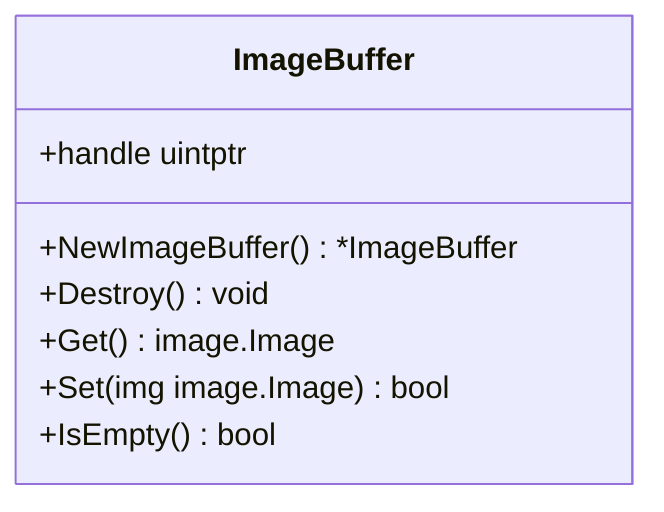
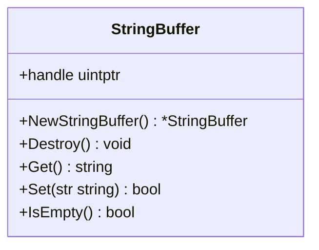
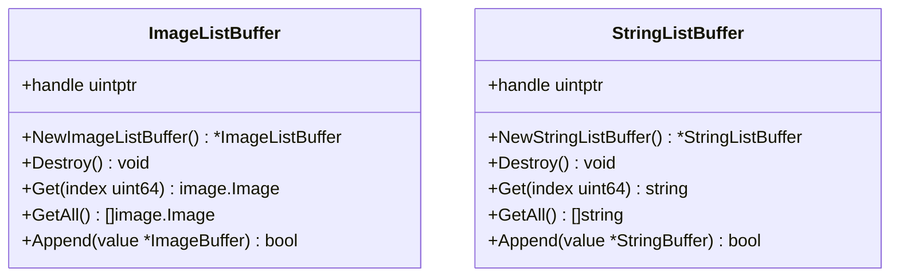
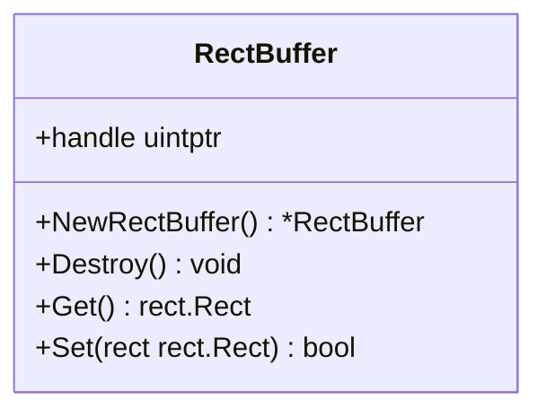
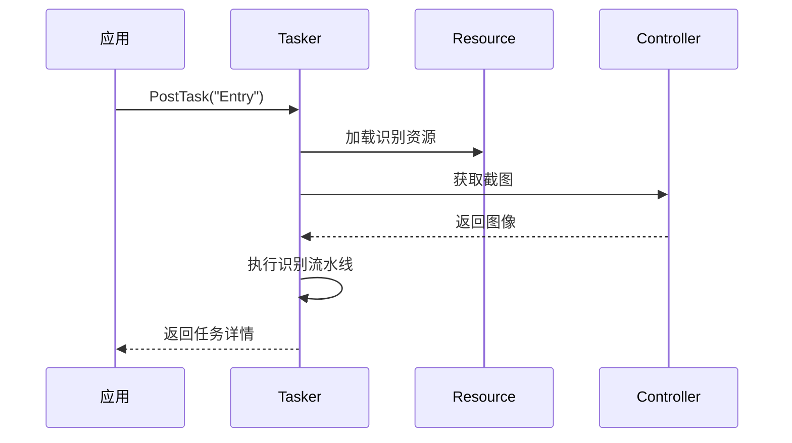

# 性能优化

<cite>
**本文档中引用的文件**  
- [image_buffer.go](file://internal/buffer/image_buffer.go)
- [string_buffer.go](file://internal/buffer/string_buffer.go)
- [image_list_buffer.go](file://internal/buffer/image_list_buffer.go)
- [string_list_buffer.go](file://internal/buffer/string_list_buffer.go)
- [rect_buffer.go](file://internal/buffer/rect_buffer.go)
- [store.go](file://internal/store/store.go)
- [tasker.go](file://tasker.go)
- [resource.go](file://resource.go)
- [context.go](file://context.go)
- [controller.go](file://controller.go)
- [job.go](file://job.go)
</cite>

## 目录
1. [引言](#引言)
2. [缓冲区机制与内存管理](#缓冲区机制与内存管理)
3. [资源管理最佳实践](#资源管理最佳实践)
4. [任务调度优化](#任务调度优化)
5. [图像识别性能调优](#图像识别性能调优)
6. [内部性能考量](#内部性能考量)
7. [开发者可操作建议](#开发者可操作建议)
8. [结论](#结论)

## 引言

maa-framework-go 是一个用于自动化操作的高性能框架，广泛应用于游戏自动化、UI 测试等场景。随着应用复杂度的提升，性能优化成为确保系统高效运行的关键因素。本文档旨在为开发者提供全面的性能优化指导，涵盖内存管理、资源调度、任务执行效率以及图像识别等多个方面。

通过深入分析框架内部的缓冲区机制（如 `image_buffer`、`string_buffer` 等），我们将揭示其如何减少垃圾回收（GC）压力并提升内存使用效率。同时，文档将探讨资源预加载、缓存策略、任务并发控制等最佳实践，并结合 `internal/store` 和 `buffer` 包的实现原理，帮助开发者理解框架在性能设计上的考量。

本指南不仅适用于希望提升现有应用性能的开发者，也适合希望深入理解框架底层机制的技术人员。通过遵循本文档中的建议，开发者可以显著提高 maa-framework-go 应用的响应速度和稳定性。

## 缓冲区机制与内存管理

maa-framework-go 通过精心设计的缓冲区机制来优化内存使用，减少频繁的内存分配与释放，从而降低 GC 压力。这些缓冲区封装了底层 C/C++ 的内存管理逻辑，通过 Go 的 `unsafe.Pointer` 和 `uintptr` 实现高效的数据传递。

### 图像缓冲区（ImageBuffer）

`ImageBuffer` 结构体用于管理图像数据的生命周期。它通过 `native.MaaImageBufferCreate()` 创建一个指向原生内存的句柄，并在 `Destroy()` 方法中调用 `native.MaaImageBufferDestroy()` 释放资源。这种设计避免了 Go 堆上大块图像数据的频繁分配，减少了 GC 扫描的压力。

当调用 `Get()` 方法获取 `image.Image` 时，框架会从原生内存中读取原始字节数据，并转换为 Go 的 `*image.NRGBA` 类型。此过程涉及一次内存拷贝，但通过复用 `ImageBuffer` 实例，可以避免重复创建和销毁图像对象。



**图示来源**
- [image_buffer.go](file://internal/buffer/image_buffer.go#L12-L130)

### 字符串缓冲区（StringBuffer）

`StringBuffer` 用于高效管理字符串数据。与 `ImageBuffer` 类似，它通过句柄管理原生内存中的字符串。`Get()` 方法返回 Go 字符串，而 `Set()` 方法将 Go 字符串写入原生内存。由于字符串在自动化流程中常用于节点名称、识别结果等，使用缓冲区可避免大量短生命周期字符串的创建。



**图示来源**
- [string_buffer.go](file://internal/buffer/string_buffer.go#L7-L58)

### 列表缓冲区（ImageListBuffer & StringListBuffer）

框架提供了 `ImageListBuffer` 和 `StringListBuffer` 来管理图像和字符串的集合。这些结构体允许批量操作，减少单个元素操作的开销。例如，`ImageListBuffer.GetAll()` 会一次性返回所有图像的切片，而内部通过 `ImageBuffer.Get()` 逐个转换。



**图示来源**
- [image_list_buffer.go](file://internal/buffer/image_list_buffer.go#L9-L74)
- [string_list_buffer.go](file://internal/buffer/string_list_buffer.go#L7-L69)

### 矩形缓冲区（RectBuffer）

`RectBuffer` 用于管理矩形区域数据（如识别框、点击区域）。它通过 `Set()` 和 `Get()` 方法在 Go 的 `Rect` 类型与原生内存之间转换，避免了频繁的结构体拷贝。



**图示来源**
- [rect_buffer.go](file://internal/buffer/rect_buffer.go#L8-L59)

**本节来源**
- [image_buffer.go](file://internal/buffer/image_buffer.go#L12-L130)
- [string_buffer.go](file://internal/buffer/string_buffer.go#L7-L58)
- [image_list_buffer.go](file://internal/buffer/image_list_buffer.go#L9-L74)
- [string_list_buffer.go](file://internal/buffer/string_list_buffer.go#L7-L69)
- [rect_buffer.go](file://internal/buffer/rect_buffer.go#L8-L59)

## 资源管理最佳实践

有效的资源管理是提升 maa-framework-go 应用性能的关键。框架通过 `Resource` 结构体统一管理识别资源、自定义动作和推理模型配置。

### 资源预加载

建议在应用启动时一次性加载所有资源包，而不是在运行时动态加载。使用 `PostBundle()` 方法异步加载资源，并通过 `Wait()` 阻塞直到加载完成。这可以避免在关键执行路径上出现延迟。

```go
res := maa.NewResource()
defer res.Destroy()
job := res.PostBundle("./resource")
job.Wait() // 确保资源加载完成
```

### 缓存策略

框架内部会缓存已加载的资源数据。开发者应避免重复调用 `PostBundle()` 加载相同路径的资源。若需更新资源，应先调用 `Clear()` 清除旧资源，再加载新资源。

### 推理设备配置

通过 `UseCPU()`、`UseDirectml()` 等方法显式设置推理设备，可避免框架自动探测带来的性能开销。对于支持 GPU 的环境，优先使用 DirectML 或 CoreML 以加速图像识别。

```go
res.UseDirectml(maa.InferenceDevice0)
```

### 自定义识别与动作注册

注册自定义识别器和动作应在资源初始化阶段完成。重复注册同一名称的识别器会导致旧实例被替换，可能引发资源泄漏。建议在初始化时集中注册所有自定义组件。

```go
res.RegisterCustomRecognition("MyRec", &MyRec{})
res.RegisterCustomAction("MyAct", &MyAct{})
```

**本节来源**
- [resource.go](file://resource.go#L13-L383)
- [examples/quick-start/main.go](file://examples/quick-start/main.go#L1-L41)
- [examples/custom-action/main.go](file://examples/custom-action/main.go#L1-L49)
- [examples/custom-recognition/main.go](file://examples/custom-recognition/main.go#L1-L77)

## 任务调度优化

合理的任务调度策略能够显著提升自动化流程的执行效率。

### 任务并发控制

`Tasker` 支持并发执行多个任务。但过度并发可能导致系统资源争用。建议根据目标设备性能合理设置并发数。可通过 `PostTask()` 提交多个任务，并使用 `Wait()` 控制执行顺序。

```go
job1 := tasker.PostTask("Task1")
job2 := tasker.PostTask("Task2")
job1.Wait() // 等待任务1完成
job2.Wait() // 等待任务2完成
```

### 任务间隔设置

避免在循环中频繁提交任务。应在任务之间添加适当的延迟，以减少 CPU 占用和系统负载。使用 `time.Sleep()` 控制任务间隔。

### 任务取消与清理

使用 `PostStop()` 可以优雅地停止正在运行的任务。在应用退出前，应调用 `ClearCache()` 清理运行时缓存，释放内存。

```go
tasker.PostStop().Wait()
tasker.ClearCache()
```

### 事件回调管理

通过 `AddSink()` 注册事件回调时，应在不再需要时调用 `RemoveSink()` 或 `ClearSinks()`，防止内存泄漏。



**图示来源**
- [tasker.go](file://tasker.go#L13-L433)
- [controller.go](file://controller.go#L24-L300)

**本节来源**
- [tasker.go](file://tasker.go#L13-L433)
- [job.go](file://job.go#L1-L96)
- [controller.go](file://controller.go#L24-L300)

## 图像识别性能调优

图像识别是自动化流程中的性能瓶颈之一。优化识别性能需要在精度与速度之间找到平衡。

### 模板匹配优化

模板匹配的性能受搜索区域大小和图像分辨率影响。建议：
- 使用 `roi` 参数限定识别区域，避免全屏搜索
- 通过 `SetScreenshotTargetLongSide()` 降低截图分辨率
- 避免使用过大的模板图像

### OCR 使用场景优化

OCR 识别较慢，应谨慎使用：
- 仅在必要时启用 OCR，优先使用模板匹配
- 缩小 OCR 识别区域
- 预处理图像（如二值化）以提高识别速度

### 自定义识别器优化

在自定义识别器中，避免在 `Run()` 方法中创建大量临时对象。可复用 `Context` 实例进行嵌套识别。

```go
func (r *MyRec) Run(ctx *maa.Context, arg *maa.CustomRecognitionArg) (*maa.CustomRecognitionResult, bool) {
    // 复用 ctx 进行子任务识别
    result := ctx.RunRecognition("SubTask", arg.Img)
    // ...
}
```

**本节来源**
- [context.go](file://context.go#L12-L240)
- [examples/custom-recognition/main.go](file://examples/custom-recognition/main.go#L1-L77)

## 内部性能考量

框架在设计上充分考虑了性能因素，主要体现在 `internal/store` 和缓冲区管理两个方面。

### Store 机制

`internal/store/store.go` 中的 `Store[T]` 泛型结构体用于管理各种句柄到值的映射。它使用 `sync.RWMutex` 实现线程安全的读写操作，避免了竞态条件。

`TaskerStore`、`CtrlStore`、`ResStore` 三个全局变量分别管理任务、控制器和资源的状态。通过 `Update()` 方法在锁保护下修改值，确保数据一致性。

```go
var (
    TaskerStore = New[TaskerStoreValue]()
    CtrlStore   = New[CtrlStoreValue]()
    ResStore    = New[ResStoreValue]()
)
```

这种集中式存储减少了重复查找的开销，提高了访问效率。

```mermaid
classDiagram
class Store[T] {
+data map[uintptr]T
+mu sync.RWMutex
+Set(handle uintptr, value T)
+Get(handle uintptr) T
+Del(handle uintptr)
+Update(handle uintptr, fn func(*T))
}
class TaskerStoreValue {
+SinkIDToEventCallbackID map[int64]uint64
+ContextSinkIDToEventCallbackID map[int64]uint64
}
class CtrlStoreValue {
+SinkIDToEventCallbackID map[int64]uint64
+CustomControllerCallbacksID uint64
}
class ResStoreValue {
+SinkIDToEventCallbackID map[int64]uint64
+CustomRecognizersCallbackID map[string]uint64
+CustomActionsCallbackID map[string]uint64
}
Store[T] --> TaskerStoreValue
Store[T] --> CtrlStoreValue
Store[T] --> ResStoreValue
```

**图示来源**
- [store.go](file://internal/store/store.go#L5-L65)

### 缓冲区复用模式

框架在内部大量使用缓冲区复用。例如，在 `getRecognitionDetail()` 方法中，临时创建多个缓冲区用于获取识别详情，使用 `defer` 确保及时销毁。

```go
func (t *Tasker) getRecognitionDetail(recId int64) *RecognitionDetail {
    name := buffer.NewStringBuffer()
    defer name.Destroy()
    raw := buffer.NewImageBuffer()
    defer raw.Destroy()
    // ...
}
```

这种模式避免了将大对象逃逸到堆上，减少了 GC 压力。

**本节来源**
- [store.go](file://internal/store/store.go#L5-L65)
- [tasker.go](file://tasker.go#L141-L195)
- [context.go](file://context.go#L60-L71)

## 开发者可操作建议

基于上述分析，以下是开发者可立即实施的性能优化建议：

### 复用对象

- 复用 `Tasker`、`Resource`、`Controller` 实例，避免频繁创建和销毁
- 在自定义识别器中复用 `Context` 实例进行嵌套操作

### 减少不必要的截图

- 合理设置 `PostScreencap()` 的调用频率
- 使用 `CacheImage()` 复用最近的截图，避免重复截取

### 优化流水线逻辑

- 简化识别流水线，移除不必要的节点
- 使用 `OverridePipeline()` 动态调整识别逻辑，避免加载完整资源

### 内存管理

- 及时调用 `Destroy()` 释放资源
- 避免在循环中创建大量临时缓冲区

### 并发控制

- 根据设备性能合理设置任务并发数
- 使用 `Job.Wait()` 控制任务执行顺序，避免资源争用

### 配置优化

- 显式设置推理设备（CPU/GPU）
- 调整截图分辨率以平衡识别精度与速度

**本节来源**
- [tasker.go](file://tasker.go#L13-L433)
- [resource.go](file://resource.go#L13-L383)
- [controller.go](file://controller.go#L24-L300)
- [context.go](file://context.go#L12-L240)

## 结论

maa-framework-go 通过精心设计的缓冲区机制、资源管理和任务调度系统，为高性能自动化应用提供了坚实基础。开发者通过理解框架内部的性能考量，可以有效优化应用的内存使用和执行效率。

关键优化策略包括：合理使用缓冲区减少 GC 压力、预加载资源并配置合适的推理设备、控制任务并发与间隔、优化图像识别逻辑。同时，遵循对象复用、及时释放资源、减少不必要的截图等最佳实践，能够显著提升应用性能。

未来，建议持续关注框架的性能监控与调优工具，结合实际应用场景进行针对性优化，以实现最佳的自动化执行效果。