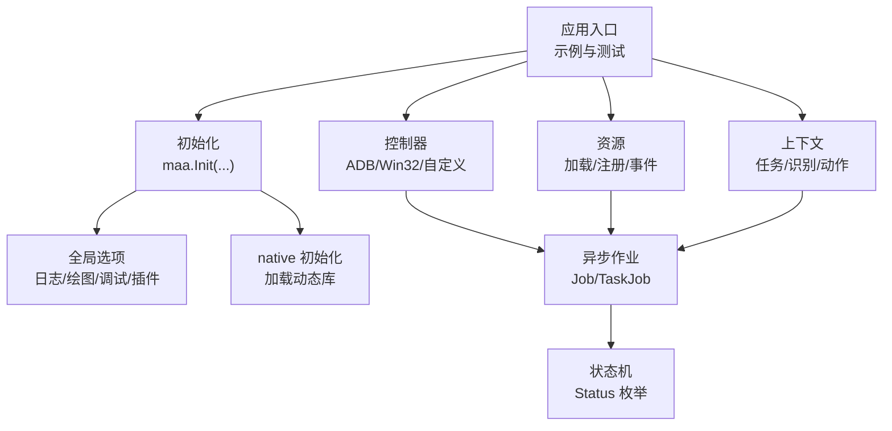
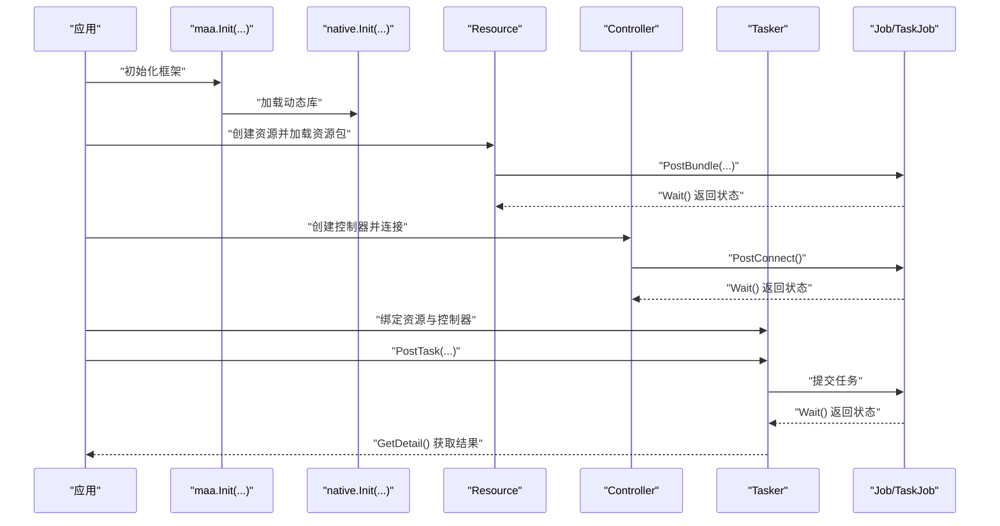
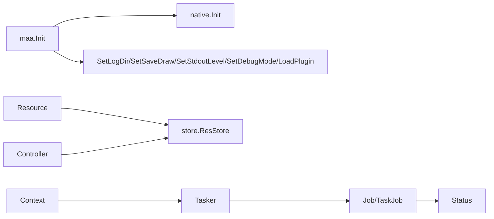

# 故障排除

<cite>
**本文引用的文件列表**
- [README.md](file://README.md)
- [maa.go](file://maa.go)
- [context.go](file://context.go)
- [resource.go](file://resource.go)
- [controller.go](file://controller.go)
- [job.go](file://job.go)
- [status.go](file://status.go)
- [internal/native/native.go](file://internal/native/native.go)
- [internal/store/store.go](file://internal/store/store.go)
- [test/main_test.go](file://test/main_test.go)
- [test/run_without_file_test.go](file://test/run_without_file_test.go)
- [test/pipleline_smoking_test.go](file://test/pipleline_smoking_test.go)
- [examples/quick-start/main.go](file://examples/quick-start/main.go)
- [examples/custom-action/main.go](file://examples/custom-action/main.go)
</cite>

## 目录
1. [简介](#简介)
2. [项目结构](#项目结构)
3. [核心组件](#核心组件)
4. [架构总览](#架构总览)
5. [详细组件分析与排错要点](#详细组件分析与排错要点)
6. [依赖关系分析](#依赖关系分析)
7. [性能考虑与瓶颈识别](#性能考虑与瓶颈识别)
8. [调试技巧与日志分析](#调试技巧与日志分析)
9. [常见问题与解决方案](#常见问题与解决方案)
10. [结论](#结论)

## 简介
本指南面向使用 maa-framework-go 的开发者，聚焦于在实际工程中可能遇到的初始化失败、设备连接超时、资源加载错误、任务执行失败等问题，提供系统化的诊断思路、可操作的修复步骤以及基于仓库内测试与示例的复现实操建议。同时给出日志启用与解读方法、性能瓶颈识别与监控手段，帮助快速定位并解决问题。

## 项目结构
- 初始化与全局配置：通过初始化函数设置库路径、日志目录、保存绘图、控制台日志级别、调试模式、插件加载等。
- 控制器层：支持 ADB 控制器、Win32 控制器与自定义控制器；提供连接、输入、截图、滚动等异步作业。
- 资源层：资源对象负责加载资源包、注册自定义识别/动作、事件回调、节点数据查询等。
- 上下文层：封装任务、识别、动作的运行与覆盖能力，支持锚点、命中计数等辅助调试。
- 异步作业与状态：统一的 Job/TaskJob 抽象，配合 Status 枚举判断完成态与成功/失败。
- 内部桥接：native 层负责动态库加载与释放，store 层维护句柄级回调与注册表。

图表来源
- [maa.go](file://maa.go#L108-L161)
- [internal/native/native.go](file://internal/native/native.go#L5-L23)
- [controller.go](file://controller.go#L158-L231)
- [resource.go](file://resource.go#L212-L238)
- [context.go](file://context.go#L30-L126)
- [job.go](file://job.go#L1-L64)
- [status.go](file://status.go#L1-L61)

章节来源
- [README.md](file://README.md#L62-L105)
- [maa.go](file://maa.go#L108-L161)
- [internal/native/native.go](file://internal/native/native.go#L5-L23)

## 核心组件
- 初始化与全局选项
  - 初始化必须在使用其他 API 前调用；可配置库目录、日志目录、是否保存绘图、标准输出日志级别、调试模式、插件路径。
  - 若未初始化或重复初始化会返回特定错误。
- 控制器
  - 支持 ADB/Win32/自定义控制器；提供连接、点击、滑动、按键、输入文本、启动/停止应用、触摸、滚动、截图等异步作业。
  - 连接状态可通过 Connected 检查；缓存最近一次截图图像。
- 资源
  - 负责加载资源包、注册自定义识别/动作、事件回调、节点数据查询、自定义推理设备选择等。
  - 提供 PostBundle、OverridePipeline、OverrideNext、OverrideImage、GetNodeJSON、Loaded、GetHash、GetNodeList 等能力。
- 上下文
  - 封装 RunTask、RunRecognition、RunAction 的运行与覆盖；支持锚点、命中计数、克隆、获取当前任务作业等。
- 异步作业与状态
  - Job/TaskJob 统一管理异步请求的状态轮询与等待；Status 提供 invalid/pending/running/success/failure 的枚举与判定方法。

章节来源
- [maa.go](file://maa.go#L108-L211)
- [controller.go](file://controller.go#L158-L300)
- [resource.go](file://resource.go#L1-L383)
- [context.go](file://context.go#L1-L240)
- [job.go](file://job.go#L1-L96)
- [status.go](file://status.go#L1-L61)

## 架构总览
下面的序列图展示了从初始化到任务执行的关键流程，包括资源加载、控制器绑定、任务提交与等待、状态判断与结果获取。

图表来源
- [maa.go](file://maa.go#L108-L161)
- [internal/native/native.go](file://internal/native/native.go#L5-L23)
- [resource.go](file://resource.go#L212-L238)
- [controller.go](file://controller.go#L158-L175)
- [job.go](file://job.go#L1-L64)

## 详细组件分析与排错要点

### 初始化与全局选项
- 典型问题
  - 未调用初始化即使用其他 API 导致空指针或行为异常。
  - 重复初始化导致“已初始化”错误。
  - 动态库路径缺失导致初始化失败。
- 排错要点
  - 确认初始化顺序：先 Init，再 ConfigInitOption，再创建 Tasker/Resource/Controller。
  - 使用 WithLibDir 明确指定 MaaFramework 动态库所在目录，或放置于工作目录、PATH/LD_LIBRARY_PATH，或安装到系统库路径。
  - 启用日志目录与保存绘图，便于后续定位视觉相关问题。
- 参考实现
  - 初始化函数、错误常量、全局选项设置、插件加载。

章节来源
- [maa.go](file://maa.go#L108-L211)
- [README.md](file://README.md#L62-L105)

### 控制器（ADB/Win32/自定义）
- 典型问题
  - 设备连接超时或失败：端口、ADB 路径、输入/截图方法配置不当。
  - 连接后无法截图或图像为空：截图目标尺寸/缩放策略不匹配。
  - 输入/点击无效：坐标系、输入方法、权限不足。
- 排错要点
  - 使用 PostConnect().Wait() 并检查状态；若失败，逐步降低截图目标长边/短边或关闭缩放，尝试不同截图/输入方法。
  - 使用 CacheImage() 检查最近截图是否可用；若为空，确认截图方法与设备兼容性。
  - 对 Win32 控制器，确保窗口句柄有效且具备前台权限。
- 参考实现
  - 连接、输入、截图、滚动、按键、触摸等作业；状态查询与连接状态检查。

章节来源
- [controller.go](file://controller.go#L158-L300)

### 资源（资源包加载与自定义识别/动作）
- 典型问题
  - 资源加载失败：路径不存在、权限不足、资源包格式错误。
  - 自定义识别/动作未生效：注册名冲突、回调未正确注册/注销。
  - 事件回调泄漏：未及时清理 Sink。
- 排错要点
  - 使用 PostBundle(...).Wait() 并检查状态；确认资源目录包含正确的节点与资源文件。
  - 注册自定义识别/动作后，使用 GetCustomRecognitionList/GetCustomActionList 校验是否生效。
  - 在销毁 Resource/Controller/Tasker 前，确保已清理所有 Sink 与自定义注册项。
- 参考实现
  - 资源加载、自定义识别/动作注册/注销、事件回调、节点数据查询、哈希与节点列表查询。

章节来源
- [resource.go](file://resource.go#L1-L383)

### 上下文（任务/识别/动作运行与覆盖）
- 典型问题
  - RunTask/RunRecognition/RunAction 返回空详情：任务/识别/动作未找到或未完成。
  - 节点覆盖无效：覆盖参数不是合法 JSON 或覆盖字段不匹配。
  - 锚点/命中计数异常：命名冲突或未正确设置。
- 排错要点
  - 使用 OverridePipeline/OverrideNext/OverrideImage 时，确保传入的是可序列化为 JSON 的结构或字符串。
  - 使用 GetNodeJSON/GetNodeData 获取节点数据核对配置。
  - 使用 SetAnchor/GetAnchor/ClearHitCount 辅助定位节点命中情况。
- 参考实现
  - 任务/识别/动作运行与覆盖；锚点与命中计数；当前任务作业获取。

章节来源
- [context.go](file://context.go#L1-L240)

### 异步作业与状态（Job/TaskJob 与 Status）
- 典型问题
  - 忘记 Wait() 导致立即返回 pending 或未完成状态。
  - 仅凭 Success()/Failure() 判断逻辑不完整，应结合 Done()。
- 排错要点
  - 所有 PostXxx() 后调用 Wait() 获取最终状态；使用 Done() 判断是否终止。
  - 结合 Status.String() 输出人类可读状态，便于日志分析。
- 参考实现
  - Job/TaskJob 的状态查询、等待与详情获取；Status 枚举与判定方法。

章节来源
- [job.go](file://job.go#L1-L96)
- [status.go](file://status.go#L1-L61)

## 依赖关系分析
- 初始化链路
  - 应用调用 maa.Init，内部调用 native.Init 加载框架、工具集、Agent 客户端/服务端；随后设置全局选项（日志目录、保存绘图、标准输出级别、调试模式、插件）。
- 资源/控制器/上下文与状态
  - 资源与控制器均通过内部 store 维护句柄级回调映射，在 Destroy 时清理回调，避免泄漏。
  - 上下文通过 Tasker 获取任务详情，形成闭环。

图表来源
- [maa.go](file://maa.go#L108-L211)
- [internal/native/native.go](file://internal/native/native.go#L5-L23)
- [internal/store/store.go](file://internal/store/store.go#L1-L65)
- [job.go](file://job.go#L1-L64)
- [status.go](file://status.go#L1-L61)

章节来源
- [maa.go](file://maa.go#L108-L211)
- [internal/native/native.go](file://internal/native/native.go#L5-L23)
- [internal/store/store.go](file://internal/store/store.go#L1-L65)

## 性能考虑与瓶颈识别
- 截图与推理
  - 截图目标长/短边过大可能导致 CPU/GPU 压力增大；可尝试降低目标尺寸或关闭缩放。
  - 推理设备选择：CPU/DirectML/CoreML/AutoExecutionProvider 可根据硬件能力切换，必要时固定设备以减少初始化开销。
- 日志与绘图
  - 开启 SaveDraw 会生成大量中间图像，磁盘 IO 压力较大；仅在调试阶段开启。
  - 标准输出日志级别过高会增加 CPU 时间；按需调整。
- 作业并发
  - 多个 PostXxx() 并发提交时，注意 Wait() 的时机与状态轮询频率，避免过度轮询造成 CPU 占用。
- 监控手段
  - 使用 TaskJob.GetDetail() 获取任务详情，观察耗时与命中情况。
  - 通过 GetNodeData/GetNodeJSON 核对节点配置，排查冗余或低效节点。

章节来源
- [controller.go](file://controller.go#L124-L155)
- [resource.go](file://resource.go#L81-L113)
- [context.go](file://context.go#L175-L195)
- [job.go](file://job.go#L66-L96)

## 调试技巧与日志分析
- 启用与配置
  - 在测试入口中参考 test/main_test.go，设置日志目录、保存绘图、标准输出级别，便于复现实务场景。
  - 在示例中参考 examples/quick-start/main.go 与 examples/custom-action/main.go，确保初始化与资源加载顺序正确。
- 日志解读
  - 使用 SetStdoutLevel 设置为更高等级（如 Trace），观察详细流程。
  - 使用 SetLogDir 指定日志目录，结合 SaveDraw 输出的视觉结果定位识别问题。
- 测试用例复现
  - 使用 test/run_without_file_test.go 中的 CarouselImageController 场景，验证无文件模式下的识别与动作链路。
  - 使用 test/main_test.go 的 TestMain 配置全局日志，便于在本地快速复现问题。
- 事件与回调
  - 在资源/控制器上添加 Sink，监听加载、任务、识别等事件，辅助定位流程卡点。

章节来源
- [test/main_test.go](file://test/main_test.go#L1-L19)
- [test/run_without_file_test.go](file://test/run_without_file_test.go#L1-L72)
- [examples/quick-start/main.go](file://examples/quick-start/main.go#L1-L41)
- [examples/custom-action/main.go](file://examples/custom-action/main.go#L1-L49)
- [resource.go](file://resource.go#L345-L383)
- [controller.go](file://controller.go#L279-L300)

## 常见问题与解决方案

### 初始化失败
- 症状
  - 调用其他 API 前未初始化，出现空指针或行为异常。
  - 重复调用初始化返回“已初始化”错误。
  - 动态库加载失败（找不到库文件或平台不支持）。
- 根因分析
  - 未遵循初始化顺序；或初始化选项（库目录、环境变量）配置不当。
- 解决方案
  - 严格按顺序：Init -> ConfigInitOption -> 创建 Tasker/Resource/Controller。
  - 使用 WithLibDir 明确库路径；或确保库文件位于工作目录、PATH/LD_LIBRARY_PATH，或系统库路径。
  - 在 native 层初始化失败时，检查平台与架构是否受支持。
- 相关实现
  - 初始化函数、错误常量、native 初始化链路。

章节来源
- [maa.go](file://maa.go#L108-L161)
- [internal/native/native.go](file://internal/native/native.go#L5-L23)

### 设备连接超时/失败
- 症状
  - PostConnect().Wait() 返回失败；Connected() 为 false。
  - CacheImage() 返回空图像。
- 根因分析
  - ADB 路径、地址、截图/输入方法配置不匹配；设备权限或驱动问题；网络/USB 通道不稳定。
- 解决方案
  - 逐步降低截图目标长/短边或关闭缩放，尝试不同截图/输入方法。
  - 确认设备已授权、ADB 服务正常、端口可达。
  - 对 Win32 控制器，确保窗口句柄有效且具备前台权限。
- 相关实现
  - 连接作业、截图作业、连接状态检查、缓存图像获取。

章节来源
- [controller.go](file://controller.go#L158-L300)

### 资源加载错误
- 症状
  - PostBundle(...).Wait() 返回失败；Loaded() 为 false。
  - GetNodeList/GetHash 返回空或失败。
- 根因分析
  - 资源路径不存在或权限不足；资源包格式不符合预期；加载过程中发生异常。
- 解决方案
  - 确认资源目录存在且可读；使用 GetNodeList/GetHash 校验资源完整性。
  - 在销毁前清理 Sink 与自定义注册项，避免残留导致后续加载异常。
- 相关实现
  - 资源加载、状态查询、清理与销毁。

章节来源
- [resource.go](file://resource.go#L212-L303)

### 任务执行失败
- 症状
  - PostTask(...).Wait() 返回失败；TaskJob.GetDetail() 返回失败详情。
  - RunTask/RunRecognition/RunAction 返回空详情。
- 根因分析
  - 任务名称未找到；节点配置错误；识别/动作未完成；覆盖参数不合法。
- 解决方案
  - 使用 GetNodeJSON/GetNodeData 核对节点配置；使用 OverridePipeline/OverrideNext/OverrideImage 进行最小化覆盖验证。
  - 确保所有 PostXxx() 后调用 Wait() 并检查 Done()/Success()/Failure()。
- 相关实现
  - 任务提交与等待、任务详情获取、状态判定。

章节来源
- [context.go](file://context.go#L30-L126)
- [job.go](file://job.go#L1-L96)
- [status.go](file://status.go#L1-L61)

### 自定义识别/动作未生效
- 症状
  - RegisterCustomRecognition/RegisterCustomAction 返回 false；或运行时未触发。
  - GetCustomRecognitionList/GetCustomActionList 为空。
- 根因分析
  - 注册名冲突；回调未正确注册；销毁前未清理旧回调。
- 解决方案
  - 使用 Unregister/ Clear 清理旧注册项后再重新注册。
  - 在 Destroy 前确保清理所有 Sink 与自定义注册项。
- 相关实现
  - 自定义识别/动作注册/注销、清理与销毁。

章节来源
- [resource.go](file://resource.go#L114-L210)

### 事件回调泄漏
- 症状
  - 长时间运行后内存占用上升；回调重复触发。
- 根因分析
  - 未及时 RemoveSink/RemoveCallback。
- 解决方案
  - 在销毁资源/控制器/任务器前，调用 ClearSinks/Clear/ClearCustomAction/ClearCustomRecognition。
- 相关实现
  - 事件回调添加与清理。

章节来源
- [resource.go](file://resource.go#L345-L383)
- [controller.go](file://controller.go#L279-L300)
- [internal/store/store.go](file://internal/store/store.go#L1-L65)

## 结论
通过遵循正确的初始化顺序、合理配置日志与绘图、使用测试用例与示例进行问题复现、结合 Job/TaskJob 与 Status 的状态机进行诊断，大多数初始化失败、设备连接超时、资源加载错误与任务执行失败都能被快速定位与修复。同时，注意资源/控制器的生命周期管理与回调清理，避免泄漏；在性能敏感场景下，适当调整截图目标与推理设备，结合任务详情与节点数据进行优化。