# 事件系统（Event System）

<cite>
**本文引用的文件列表**
- [event.go](file://event.go)
- [event_sinks_gen.go](file://event_sinks_gen.go)
- [tasker.go](file://tasker.go)
- [resource.go](file://resource.go)
- [controller.go](file://controller.go)
- [tools/gen-event-sink/main.go](file://tools/gen-event-sink/main.go)
- [tools/gen-event-sink/templates/event_sink_interface.tpl](file://tools/gen-event-sink/templates/event_sink_interface.tpl)
- [tools/gen-event-sink/templates/event_sink_adapter.tpl](file://tools/gen-event-sink/templates/event_sink_adapter.tpl)
- [tools/gen-event-sink/templates/event_sink_helper.tpl](file://tools/gen-event-sink/templates/event_sink_helper.tpl)
- [examples/quick-start/main.go](file://examples/quick-start/main.go)
- [examples/custom-action/main.go](file://examples/custom-action/main.go)
- [examples/custom-recognition/main.go](file://examples/custom-recognition/main.go)
- [test/main_test.go](file://test/main_test.go)
</cite>

## 目录
1. [简介](#简介)
2. [项目结构](#项目结构)
3. [核心组件](#核心组件)
4. [架构总览](#架构总览)
5. [详细组件分析](#详细组件分析)
6. [依赖关系分析](#依赖关系分析)
7. [性能考量](#性能考量)
8. [故障排查指南](#故障排查指南)
9. [结论](#结论)
10. [附录](#附录)

## 简介
本节概述事件系统的设计目标与整体思路：以观察者模式为基础，通过统一的事件回调代理在底层框架与上层应用之间建立异步通知通道。事件类型覆盖资源加载、控制器动作、任务执行、节点识别与动作等全链路环节；同时提供事件适配器与生成器工具，显著降低用户实现成本，便于在日志输出、调试与外部状态同步中高效监控任务进度与诊断异常。

## 项目结构
事件系统相关的核心文件分布如下：
- 事件定义与分发：event.go
- 事件接口与适配器生成：event_sinks_gen.go（由工具生成）
- 事件注册入口（Tasker/Resource/Controller）：tasker.go、resource.go、controller.go
- 事件生成器工具：tools/gen-event-sink/main.go 及其模板
- 示例与测试：examples/*、test/*

```mermaid
graph TB
subgraph "事件核心"
E["event.go<br/>事件回调注册/注销<br/>事件分发与状态解析"]
G["event_sinks_gen.go<br/>接口+适配器+辅助方法生成"]
end
subgraph "事件源"
T["tasker.go<br/>Tasker.AddSink/AddContextSink"]
R["resource.go<br/>Resource.AddSink"]
C["controller.go<br/>Controller.AddSink"]
end
subgraph "工具"
M["tools/gen-event-sink/main.go<br/>事件生成器主程序"]
TI["templates/event_sink_interface.tpl"]
TA["templates/event_sink_adapter.tpl"]
TH["templates/event_sink_helper.tpl"]
end
subgraph "示例与测试"
QS["examples/quick-start/main.go"]
CA["examples/custom-action/main.go"]
CR["examples/custom-recognition/main.go"]
TM["test/main_test.go"]
end
E --> T
E --> R
E --> C
M --> G
M --> TI
M --> TA
M --> TH
QS --> T
CA --> R
CR --> R
TM --> E
```

图表来源
- [event.go](file://event.go#L1-L334)
- [event_sinks_gen.go](file://event_sinks_gen.go#L1-L676)
- [tasker.go](file://tasker.go#L358-L432)
- [resource.go](file://resource.go#L345-L382)
- [controller.go](file://controller.go#L279-L300)
- [tools/gen-event-sink/main.go](file://tools/gen-event-sink/main.go#L1-L154)
- [tools/gen-event-sink/templates/event_sink_interface.tpl](file://tools/gen-event-sink/templates/event_sink_interface.tpl#L1-L13)
- [tools/gen-event-sink/templates/event_sink_adapter.tpl](file://tools/gen-event-sink/templates/event_sink_adapter.tpl#L1-L179)
- [tools/gen-event-sink/templates/event_sink_helper.tpl](file://tools/gen-event-sink/templates/event_sink_helper.tpl#L1-L150)
- [examples/quick-start/main.go](file://examples/quick-start/main.go#L1-L41)
- [examples/custom-action/main.go](file://examples/custom-action/main.go#L1-L49)
- [examples/custom-recognition/main.go](file://examples/custom-recognition/main.go#L1-L77)
- [test/main_test.go](file://test/main_test.go#L1-L19)

章节来源
- [event.go](file://event.go#L1-L334)
- [event_sinks_gen.go](file://event_sinks_gen.go#L1-L676)
- [tasker.go](file://tasker.go#L358-L432)
- [resource.go](file://resource.go#L345-L382)
- [controller.go](file://controller.go#L279-L300)
- [tools/gen-event-sink/main.go](file://tools/gen-event-sink/main.go#L1-L154)

## 核心组件
- 事件回调注册与注销
  - 注册：为任意事件接收器分配唯一回调ID并登记到全局映射表，返回该ID用于后续移除。
  - 注销：根据ID从全局映射表删除，避免内存泄漏与悬挂回调。
- 事件分发与状态解析
  - 代理函数接收底层框架传入的原始消息与详情JSON，解析事件类别与状态后，按接收器类型分派到对应接口方法。
  - 事件状态由消息后缀判断：Starting/Succeeded/Failed/Unknown。
- 事件数据结构
  - 资源加载细节、控制器动作细节、任务与节点执行细节等，均以结构体形式承载，便于监听器消费。
- 事件接口与适配器
  - 生成器为Tasker/Resource/Context/Controller四类接收器分别生成事件接口、轻量适配器与注册辅助方法，支持单事件回调注册与未知事件兜底处理。
- 事件注册入口
  - Tasker：AddSink/AddContextSink，支持普通事件与上下文事件两类。
  - Resource：AddSink。
  - Controller：AddSink。

章节来源
- [event.go](file://event.go#L1-L334)
- [event_sinks_gen.go](file://event_sinks_gen.go#L1-L676)
- [tasker.go](file://tasker.go#L358-L432)
- [resource.go](file://resource.go#L345-L382)
- [controller.go](file://controller.go#L279-L300)

## 架构总览
事件系统采用“观察者模式 + 生成器”的组合架构：
- 观察者模式：各接收器实现相应事件接口，通过AddSink/AddContextSink注册到底层框架。
- 生成器：以模板驱动生成接口、适配器与注册辅助方法，减少样板代码。
- 分发器：统一代理函数负责消息解析、状态判定与接口分派。

图表来源
- [event.go](file://event.go#L296-L333)
- [event_sinks_gen.go](file://event_sinks_gen.go#L1-L676)

## 详细组件分析

### 事件回调注册与注销
- 全局回调ID分配：原子递增，保证并发安全。
- 回调映射表：读写锁保护，避免竞态。
- 注销策略：在销毁或清理时，依据存储映射表中的ID进行注销，确保无残留。

图表来源
- [event.go](file://event.go#L1-L40)

章节来源
- [event.go](file://event.go#L1-L40)

### 事件分发与状态解析
- 消息分类：根据消息前缀匹配事件类别（如Resource.Loading、Controller.Action、Tasker.Task、Node.*等）。
- 状态解析：根据消息后缀判断事件状态（Starting/Succeeded/Failed/Unknown）。
- 接收器分派：根据接收器类型（Tasker/Resource/Controller/Context）调用对应接口方法。

图表来源
- [event.go](file://event.go#L127-L281)

章节来源
- [event.go](file://event.go#L127-L281)

### 事件接口与适配器（生成器）
- 接口生成：为Tasker/Resource/Context/Controller生成事件接口，包含资源加载、控制器动作、任务与节点执行、未知事件等方法。
- 适配器生成：为每种接收器生成轻量适配器，仅保存用户提供的回调函数指针，在OnXxx被调用时转发给用户回调。
- 辅助方法生成：为每种接收器生成单事件注册方法（如OnResourceLoading），以及上下文事件注册方法（仅Context）。

图表来源
- [event_sinks_gen.go](file://event_sinks_gen.go#L1-L676)
- [tools/gen-event-sink/templates/event_sink_interface.tpl](file://tools/gen-event-sink/templates/event_sink_interface.tpl#L1-L13)
- [tools/gen-event-sink/templates/event_sink_adapter.tpl](file://tools/gen-event-sink/templates/event_sink_adapter.tpl#L1-L179)
- [tools/gen-event-sink/templates/event_sink_helper.tpl](file://tools/gen-event-sink/templates/event_sink_helper.tpl#L1-L150)

章节来源
- [event_sinks_gen.go](file://event_sinks_gen.go#L1-L676)
- [tools/gen-event-sink/main.go](file://tools/gen-event-sink/main.go#L1-L154)
- [tools/gen-event-sink/templates/event_sink_interface.tpl](file://tools/gen-event-sink/templates/event_sink_interface.tpl#L1-L13)
- [tools/gen-event-sink/templates/event_sink_adapter.tpl](file://tools/gen-event-sink/templates/event_sink_adapter.tpl#L1-L179)
- [tools/gen-event-sink/templates/event_sink_helper.tpl](file://tools/gen-event-sink/templates/event_sink_helper.tpl#L1-L150)

### 事件注册入口（Tasker/Resource/Controller）
- Tasker：支持普通事件与上下文事件两类注册，分别维护各自的回调ID映射，销毁时统一注销。
- Resource：支持普通事件注册，销毁时统一注销。
- Controller：支持普通事件注册，销毁时统一注销。

图表来源
- [tasker.go](file://tasker.go#L358-L432)
- [resource.go](file://resource.go#L345-L382)
- [controller.go](file://controller.go#L279-L300)
- [event.go](file://event.go#L22-L40)

章节来源
- [tasker.go](file://tasker.go#L358-L432)
- [resource.go](file://resource.go#L345-L382)
- [controller.go](file://controller.go#L279-L300)
- [event.go](file://event.go#L22-L40)

### 事件生成器工具（gen-event-sink）
- 配置：针对Tasker/Resource/Context/Controller四类接收器生成接口、适配器与注册辅助方法。
- 模板：接口模板、适配器模板、辅助方法模板，分别渲染生成。
- 输出：生成的代码文件包含接口、适配器与注册方法，供用户直接使用。

图表来源
- [tools/gen-event-sink/main.go](file://tools/gen-event-sink/main.go#L1-L154)
- [tools/gen-event-sink/templates/event_sink_interface.tpl](file://tools/gen-event-sink/templates/event_sink_interface.tpl#L1-L13)
- [tools/gen-event-sink/templates/event_sink_adapter.tpl](file://tools/gen-event-sink/templates/event_sink_adapter.tpl#L1-L179)
- [tools/gen-event-sink/templates/event_sink_helper.tpl](file://tools/gen-event-sink/templates/event_sink_helper.tpl#L1-L150)

章节来源
- [tools/gen-event-sink/main.go](file://tools/gen-event-sink/main.go#L1-L154)

### 实际日志输出与调试场景
- 初始化选项：可通过测试入口设置日志目录、保存绘图与输出级别，便于事件驱动的日志采集与可视化。
- 任务进度监控：通过注册OnTaskerTask、OnTaskRecognition、OnTaskAction等事件，实时记录任务阶段与节点执行状态。
- 异常诊断：利用OnTaskNextList、OnUnknownEvent等事件捕获异常路径与未知事件，辅助定位问题。
- 外部状态同步：在回调中更新外部状态（如UI进度条、计数器），实现与业务系统的联动。

章节来源
- [test/main_test.go](file://test/main_test.go#L1-L19)
- [event_sinks_gen.go](file://event_sinks_gen.go#L1-L676)

## 依赖关系分析
- 事件系统对底层框架的依赖：通过代理函数与底层框架交互，不直接耦合具体实现。
- 接收器与适配器的依赖：适配器仅持有回调函数指针，低耦合、高内聚。
- 生成器与模板的依赖：模板驱动生成代码，保持一致性与可维护性。

图表来源
- [event.go](file://event.go#L1-L334)
- [tasker.go](file://tasker.go#L358-L432)
- [resource.go](file://resource.go#L345-L382)
- [controller.go](file://controller.go#L279-L300)
- [tools/gen-event-sink/main.go](file://tools/gen-event-sink/main.go#L1-L154)
- [event_sinks_gen.go](file://event_sinks_gen.go#L1-L676)

章节来源
- [event.go](file://event.go#L1-L334)
- [event_sinks_gen.go](file://event_sinks_gen.go#L1-L676)
- [tasker.go](file://tasker.go#L358-L432)
- [resource.go](file://resource.go#L345-L382)
- [controller.go](file://controller.go#L279-L300)
- [tools/gen-event-sink/main.go](file://tools/gen-event-sink/main.go#L1-L154)

## 性能考量
- 并发安全：回调ID分配与映射表访问使用原子与读写锁，避免竞态与死锁风险。
- 内存管理：销毁或清理时及时注销回调，防止回调对象长期存活导致内存泄漏。
- 序列化开销：事件详情以JSON传输，解析发生在Go侧，建议在高频事件中尽量精简回调逻辑，必要时合并多次回调。
- 事件粒度：按需注册事件，避免不必要的事件监听造成回调风暴。

[本节为通用指导，无需特定文件来源]

## 故障排查指南
- 回调未触发
  - 检查是否正确调用AddSink/AddContextSink并获得非零的sink ID。
  - 确认底层框架已启用事件回调。
- 回调重复或泄漏
  - 在销毁实例或不再需要时调用RemoveSink/ClearSinks或对应的上下文清理方法。
- 事件状态异常
  - 检查消息后缀是否符合Starting/Succeeded/Failed约定。
- 未知事件
  - 使用OnUnknownEvent捕获并记录，辅助定位新增或未覆盖的事件类型。

章节来源
- [tasker.go](file://tasker.go#L358-L432)
- [resource.go](file://resource.go#L345-L382)
- [controller.go](file://controller.go#L279-L300)
- [event.go](file://event.go#L283-L294)

## 结论
事件系统以观察者模式为核心，结合生成器工具，实现了对资源加载、控制器动作、任务执行与节点流程的全链路异步通知。通过统一的代理与状态解析，用户可以低成本地实现日志输出、进度监控与异常诊断，并在需要时扩展外部状态同步能力。建议在高频事件场景下优化回调逻辑与事件粒度，确保系统稳定与性能。

[本节为总结性内容，无需特定文件来源]

## 附录

### 事件类型与回调时机（基于消息前缀）
- 资源加载：Resource.Loading
- 控制器动作：Controller.Action
- 任务执行：Tasker.Task
- 节点流水线：Node.PipelineNode
- 节点识别节点：Node.RecognitionNode
- 节点动作节点：Node.ActionNode
- 节点下一跳列表：Node.NextList
- 节点识别：Node.Recognition
- 节点动作：Node.Action

章节来源
- [event.go](file://event.go#L127-L281)

### 常见使用场景参考
- 快速开始：初始化、连接设备、绑定资源与控制器、提交任务并等待结果。
- 自定义动作：注册自定义动作并在任务中调用。
- 自定义识别：注册自定义识别并在任务中调用。

章节来源
- [examples/quick-start/main.go](file://examples/quick-start/main.go#L1-L41)
- [examples/custom-action/main.go](file://examples/custom-action/main.go#L1-L49)
- [examples/custom-recognition/main.go](file://examples/custom-recognition/main.go#L1-L77)