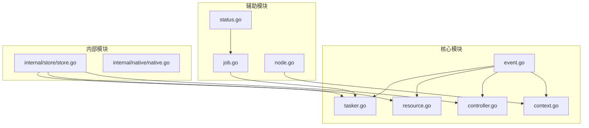
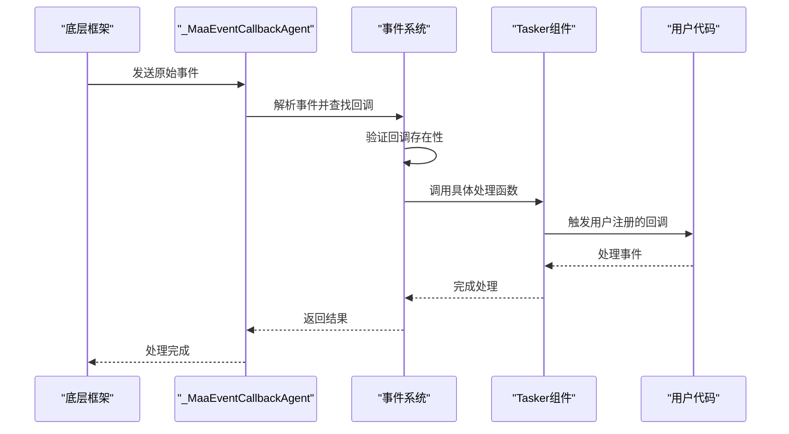
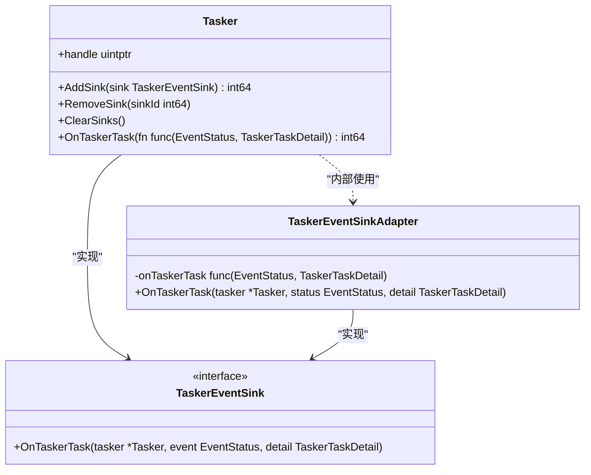
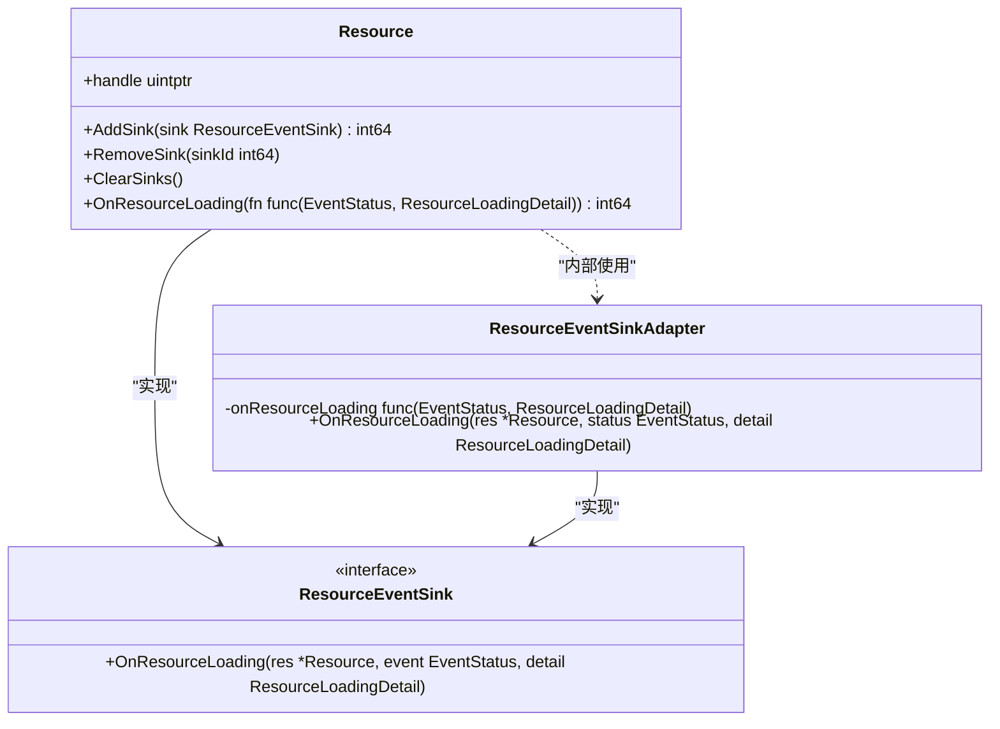
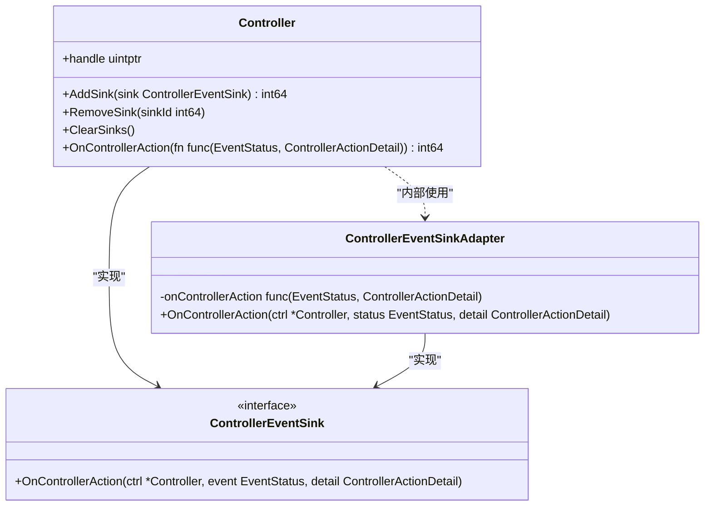
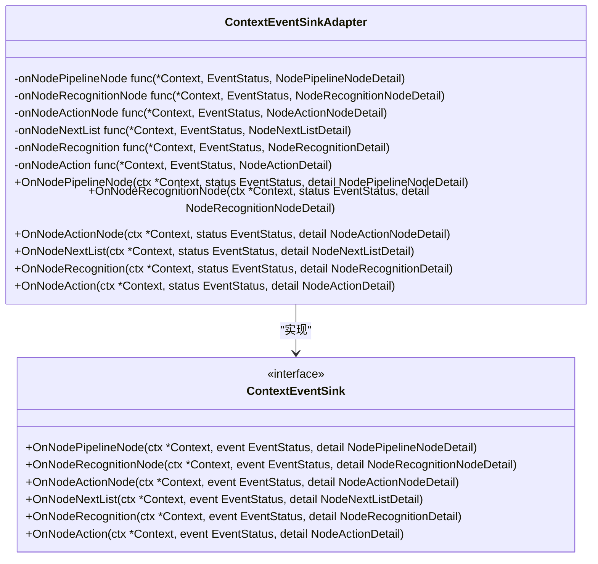
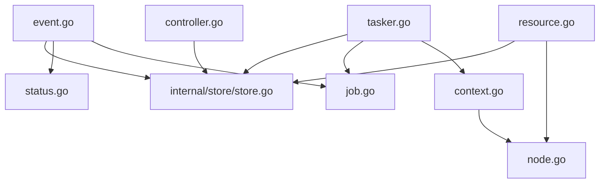

# 事件系统重构

<cite>
**本文档引用的文件**   
- [event.go](file://event.go)
- [tasker.go](file://tasker.go)
- [resource.go](file://resource.go)
- [controller.go](file://controller.go)
- [context.go](file://context.go)
- [job.go](file://job.go)
- [node.go](file://node.go)
- [status.go](file://status.go)
- [internal/store/store.go](file://internal/store/store.go)
</cite>

## 目录
1. [简介](#简介)
2. [项目结构](#项目结构)
3. [核心组件](#核心组件)
4. [架构概述](#架构概述)
5. [详细组件分析](#详细组件分析)
6. [依赖分析](#依赖分析)
7. [性能考虑](#性能考虑)
8. [故障排除指南](#故障排除指南)
9. [结论](#结论)

## 简介
本文档详细分析了 MaaFramework Go 绑定中的事件系统重构。该事件系统为自动化框架提供了强大的异步事件处理能力，支持资源加载、控制器操作、任务执行等多种事件类型。系统采用回调机制，允许用户订阅特定事件并接收状态更新，从而实现对自动化流程的精细控制和监控。

## 项目结构
项目采用模块化设计，将不同功能分离到独立的包中。事件系统核心位于根目录的 event.go 文件中，而各个组件（Tasker、Resource、Controller、Context）则分别管理自己的事件订阅和分发。内部存储系统（internal/store）用于维护组件状态和事件回调的映射关系。

**Diagram sources**
- [event.go](file://event.go#L1-L355)
- [tasker.go](file://tasker.go#L1-L590)
- [resource.go](file://resource.go#L1-L425)
- [controller.go](file://controller.go#L1-L359)
- [context.go](file://context.go#L1-L249)
- [internal/store/store.go](file://internal/store/store.go#L1-L65)

**Section sources**
- [event.go](file://event.go#L1-L355)
- [tasker.go](file://tasker.go#L1-L590)
- [resource.go](file://resource.go#L1-L425)
- [controller.go](file://controller.go#L1-L359)
- [context.go](file://context.go#L1-L249)
- [job.go](file://job.go#L1-L96)
- [node.go](file://node.go#L1-L800)
- [status.go](file://status.go#L1-L61)
- [internal/store/store.go](file://internal/store/store.go#L1-L65)

## 核心组件
事件系统的核心组件包括事件回调管理、事件状态定义、事件详情结构和事件分发机制。系统通过全局映射表管理所有注册的事件回调，并使用读写锁确保并发安全。每个事件类型都有对应的详情结构体，用于传递事件相关的具体信息。

**Section sources**
- [event.go](file://event.go#L1-L355)
- [status.go](file://status.go#L1-L61)

## 架构概述
事件系统采用观察者模式，各组件作为事件发布者，用户代码作为事件订阅者。系统通过统一的回调代理函数 _MaaEventCallbackAgent 接收来自底层框架的原始事件，然后根据事件类型和ID分发到相应的处理函数。每个组件（Tasker、Resource、Controller）都维护自己的事件订阅列表，并通过内部存储系统与全局事件回调系统关联。

**Diagram sources**
- [event.go](file://event.go#L308-L327)
- [tasker.go](file://tasker.go#L386-L440)
- [resource.go](file://resource.go#L363-L424)
- [controller.go](file://controller.go#L314-L334)

## 详细组件分析
### Tasker事件处理
Tasker组件负责任务的执行和管理，其事件系统主要关注任务状态变化。通过AddSink方法可以注册TaskerEventSink，监听Tasker.Task事件。系统使用TaskerStore来维护每个Tasker实例的事件回调ID映射，确保在销毁时能正确清理资源。

**Diagram sources**
- [tasker.go](file://tasker.go#L463-L485)
- [tasker.go](file://tasker.go#L386-L440)

**Section sources**
- [tasker.go](file://tasker.go#L386-L440)

### Resource事件处理
Resource组件管理资源加载过程，其事件系统主要关注资源加载状态。通过AddSink方法可以注册ResourceEventSink，监听Resource.Loading事件。与Tasker类似，Resource也使用ResStore来维护事件回调ID映射。

**Diagram sources**
- [resource.go](file://resource.go#L402-L424)
- [resource.go](file://resource.go#L363-L389)

**Section sources**
- [resource.go](file://resource.go#L363-L424)

### Controller事件处理
Controller组件管理设备控制操作，其事件系统主要关注控制器动作状态。通过AddSink方法可以注册ControllerEventSink，监听Controller.Action事件。Controller使用CtrlStore来维护事件回调ID映射。

**Diagram sources**
- [controller.go](file://controller.go#L336-L358)
- [controller.go](file://controller.go#L314-L334)

**Section sources**
- [controller.go](file://controller.go#L314-L358)

### Context事件处理
Context组件提供上下文相关的操作，其事件系统主要关注节点执行状态。通过AddContextSink方法可以注册ContextEventSink，监听多种节点相关事件，如Node.PipelineNode、Node.RecognitionNode等。Tasker使用TaskerStore中的ContextSinkIDToEventCallbackID映射来管理这些回调。

**Diagram sources**
- [tasker.go](file://tasker.go#L487-L588)
- [tasker.go](file://tasker.go#L425-L440)

**Section sources**
- [tasker.go](file://tasker.go#L425-L588)

## 依赖分析
事件系统依赖于内部存储系统（internal/store）来维护组件状态和事件回调的映射关系。每个组件（Tasker、Resource、Controller）都有对应的StoreValue结构体，用于存储事件回调ID的映射。事件系统本身是中心化的，通过全局的eventCallbacks映射表管理所有注册的回调。

**Diagram sources**
- [event.go](file://event.go#L16-L39)
- [internal/store/store.go](file://internal/store/store.go#L60-L64)
- [tasker.go](file://tasker.go#L24-L29)
- [resource.go](file://resource.go#L24-L29)
- [controller.go](file://controller.go#L15-L21)

**Section sources**
- [event.go](file://event.go#L16-L39)
- [internal/store/store.go](file://internal/store/store.go#L60-L64)

## 性能考虑
事件系统在设计时考虑了性能因素。使用读写锁（sync.RWMutex）而非互斥锁，允许多个读操作并发执行，提高了事件分发的效率。事件回调ID使用原子操作生成，确保了ID的唯一性和线程安全性。C字符串到Go字符串的转换通过unsafe包直接操作内存，避免了不必要的内存分配和复制。

## 故障排除指南
当事件系统出现问题时，可以按照以下步骤进行排查：
1. 检查事件回调是否正确注册，确保返回的sink ID有效
2. 验证组件是否已正确初始化并绑定到Tasker
3. 检查底层框架是否正常运行，能够产生预期的事件
4. 确认事件处理函数没有panic，否则会导致后续事件无法处理
5. 查看是否有资源泄漏，确保在组件销毁时正确清理事件回调

**Section sources**
- [event.go](file://event.go#L22-L39)
- [tasker.go](file://tasker.go#L35-L48)
- [resource.go](file://resource.go#L38-L54)
- [controller.go](file://controller.go#L122-L133)

## 结论
事件系统重构成功实现了灵活、高效、线程安全的事件处理机制。通过统一的接口和适配器模式，简化了用户代码的编写。中心化的回调管理确保了资源的正确清理，避免了内存泄漏。该系统为MaaFramework Go绑定提供了强大的异步事件处理能力，支持复杂的自动化场景。