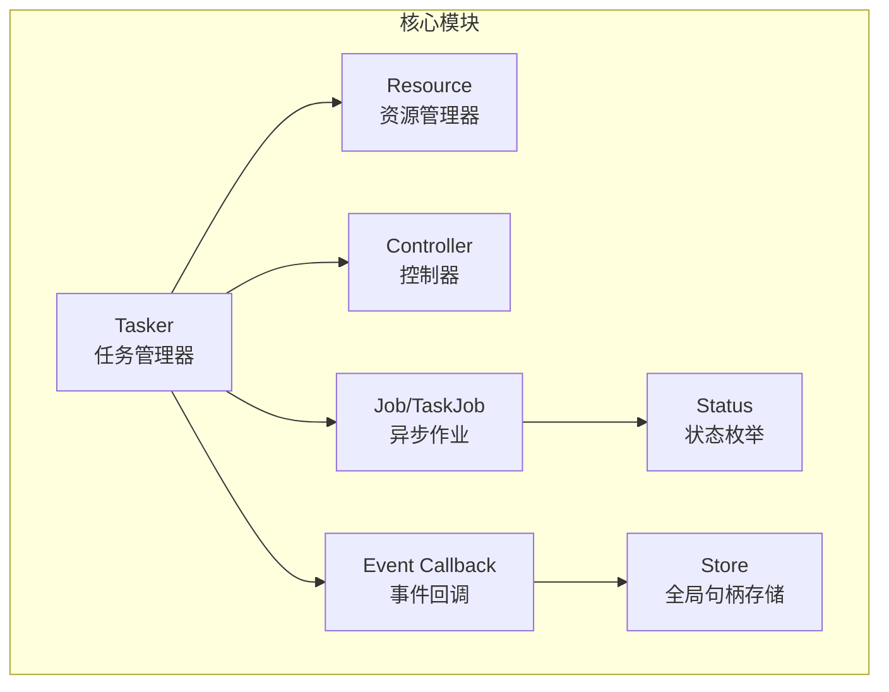
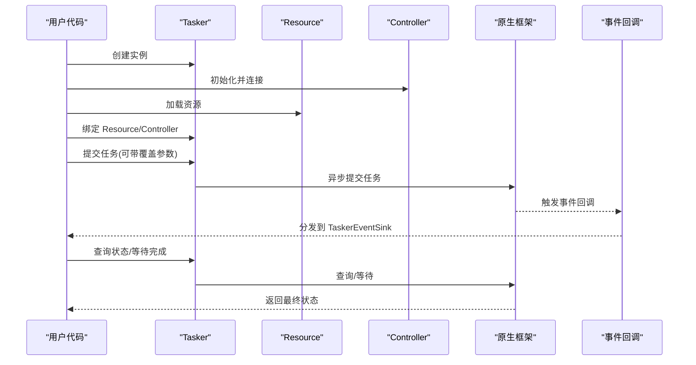
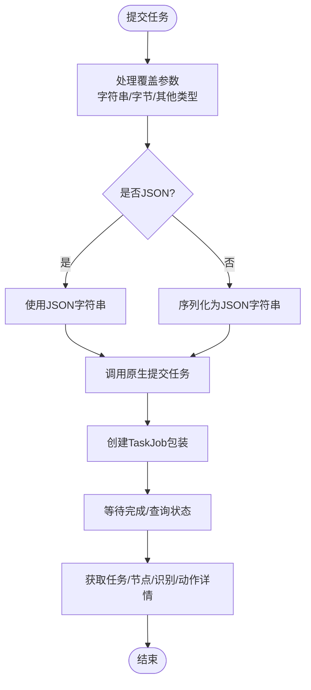
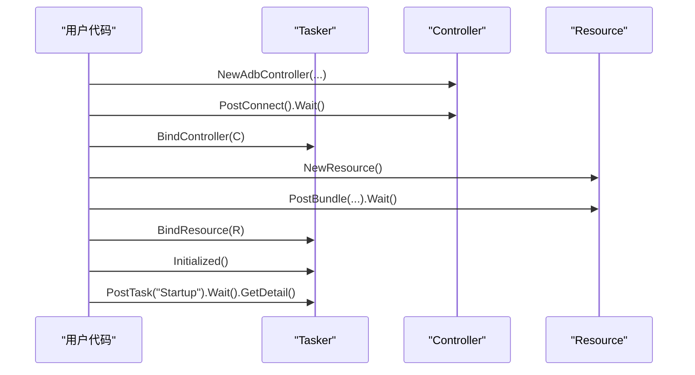
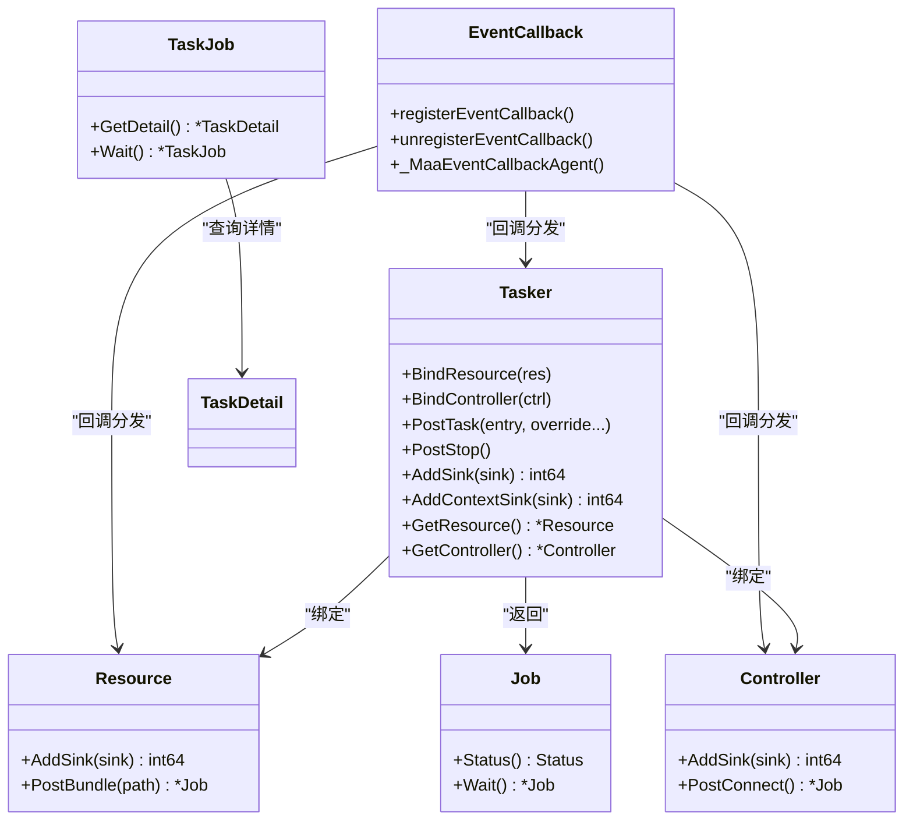
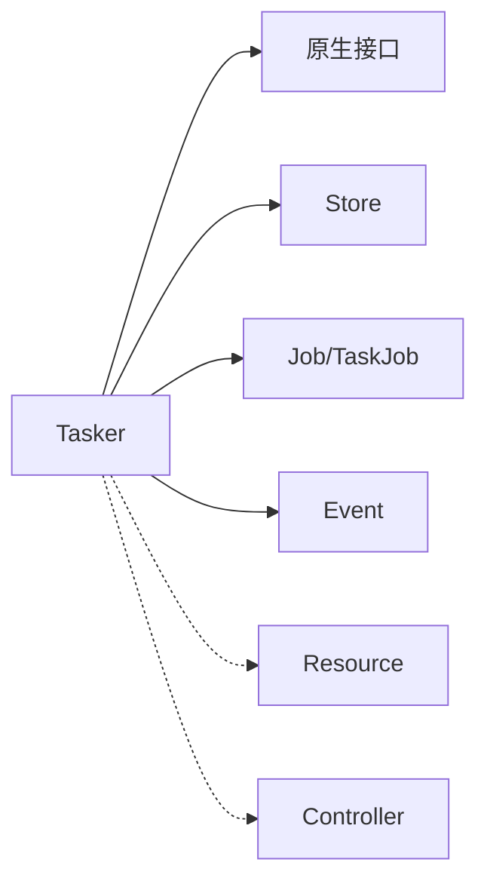

# 任务管理器（Tasker）

<cite>
**本文引用的文件列表**
- [tasker.go](file://tasker.go)
- [resource.go](file://resource.go)
- [controller.go](file://controller.go)
- [job.go](file://job.go)
- [event.go](file://event.go)
- [status.go](file://status.go)
- [internal/store/store.go](file://internal/store/store.go)
- [event_sinks_gen.go](file://event_sinks_gen.go)
- [examples/quick-start/main.go](file://examples/quick-start/main.go)
- [tasker_test.go](file://tasker_test.go)
</cite>

## 目录
1. [简介](#简介)
2. [项目结构](#项目结构)
3. [核心组件](#核心组件)
4. [架构总览](#架构总览)
5. [组件详解](#组件详解)
6. [依赖关系分析](#依赖关系分析)
7. [性能与并发](#性能与并发)
8. [故障排查指南](#故障排查指南)
9. [结论](#结论)
10. [附录](#附录)

## 简介
本文件系统性阐述 Tasker 在 maa-framework-go 中作为“任务调度与执行中枢”的核心作用。围绕结构体定义、内部句柄管理、任务生命周期（提交、等待、状态查询）、与 Resource 和 Controller 的协同、异步执行模型与事件回调集成、最佳实践与并发安全策略展开，帮助读者从原理到实战全面掌握 Tasker 的使用与优化。

## 项目结构
Tasker 所在模块位于仓库根目录，主要文件包括：
- 任务管理器：tasker.go
- 资源管理器：resource.go
- 控制器：controller.go
- 异步作业抽象：job.go
- 事件系统与回调：event.go
- 状态枚举：status.go
- 全局句柄存储：internal/store/store.go
- 事件适配器生成：event_sinks_gen.go
- 快速开始示例：examples/quick-start/main.go
- 单元测试：tasker_test.go

图表来源
- [tasker.go](file://tasker.go#L1-L120)
- [resource.go](file://resource.go#L1-L120)
- [controller.go](file://controller.go#L1-L120)
- [job.go](file://job.go#L1-L96)
- [status.go](file://status.go#L1-L61)
- [event.go](file://event.go#L1-L120)
- [internal/store/store.go](file://internal/store/store.go#L1-L65)

章节来源
- [tasker.go](file://tasker.go#L1-L120)
- [resource.go](file://resource.go#L1-L120)
- [controller.go](file://controller.go#L1-L120)
- [job.go](file://job.go#L1-L96)
- [status.go](file://status.go#L1-L61)
- [event.go](file://event.go#L1-L120)
- [internal/store/store.go](file://internal/store/store.go#L1-L65)

## 核心组件
- Tasker：封装底层句柄，提供任务提交、停止、状态查询、资源/控制器绑定、事件回调注册等能力。
- Resource：资源加载与管线覆盖，提供事件回调注册。
- Controller：设备控制（ADB/Win32/自定义），提供事件回调注册。
- Job/TaskJob：统一的异步作业抽象，支持状态查询与等待完成。
- Status：任务/作业状态枚举及判定方法。
- Event：事件回调注册、分发与适配器生成。
- Store：全局句柄存储，用于维护 Tasker/Resource/Controller 的回调映射。

章节来源
- [tasker.go](file://tasker.go#L1-L120)
- [resource.go](file://resource.go#L1-L120)
- [controller.go](file://controller.go#L1-L120)
- [job.go](file://job.go#L1-L96)
- [status.go](file://status.go#L1-L61)
- [event.go](file://event.go#L1-L120)
- [internal/store/store.go](file://internal/store/store.go#L1-L65)

## 架构总览
Tasker 作为中枢，协调 Resource 与 Controller 完成任务生命周期管理；所有操作以异步 Job 形式返回，支持 Wait 阻塞等待；事件通过回调适配器分发至用户实现的 TaskerEventSink 接口。

图表来源
- [tasker.go](file://tasker.go#L85-L122)
- [resource.go](file://resource.go#L212-L217)
- [controller.go](file://controller.go#L157-L197)
- [job.go](file://job.go#L20-L64)
- [event.go](file://event.go#L296-L334)

## 组件详解

### Tasker 结构体与句柄管理
- 字段：仅包含底层句柄，避免暴露内部细节。
- 句柄存储：创建时向全局 Store 注册映射，销毁时清理回调映射并释放句柄。
- 绑定：通过 BindResource/BindController 将 Tasker 与 Resource/Controller 绑定，供后续任务执行使用。
- 状态与运行：Initialized/Running/Stopping 提供实例状态检查。
- 缓存：ClearCache 清理运行期缓存。

章节来源
- [tasker.go](file://tasker.go#L13-L32)
- [tasker.go](file://tasker.go#L34-L48)
- [tasker.go](file://tasker.go#L50-L58)
- [tasker.go](file://tasker.go#L60-L63)
- [tasker.go](file://tasker.go#L113-L122)
- [tasker.go](file://tasker.go#L136-L139)
- [internal/store/store.go](file://internal/store/store.go#L44-L65)

### 任务生命周期：提交、等待与状态查询
- 提交任务：PostTask 支持可选覆盖参数（字符串或可 JSON 序列化的对象），内部统一转换为 JSON 字符串后调用原生接口。
- 停止任务：PostStop 发送停止信号，返回 Job。
- 状态查询：status/wait 封装原生状态查询与等待逻辑，配合 Job/TaskJob 使用。
- 任务详情：getTaskDetail/getNodeDetail/getRecognitionDetail/getActionDetail 提供节点级识别与动作详情。

图表来源
- [tasker.go](file://tasker.go#L65-L83)
- [tasker.go](file://tasker.go#L85-L88)
- [tasker.go](file://tasker.go#L90-L96)
- [tasker.go](file://tasker.go#L103-L111)
- [tasker.go](file://tasker.go#L292-L344)
- [tasker.go](file://tasker.go#L346-L355)

章节来源
- [tasker.go](file://tasker.go#L65-L122)
- [tasker.go](file://tasker.go#L292-L355)
- [job.go](file://job.go#L66-L96)

### 与 Resource 和 Controller 的协同
- 绑定：Tasker 通过 BindResource/BindController 将自身与已初始化的 Resource/Controller 关联，确保任务执行时具备资源与设备上下文。
- 获取：GetResource/GetController 提供当前绑定对象的访问。
- 示例：快速开始示例展示了从设备发现、控制器创建、连接、资源加载到任务提交的完整链路。

图表来源
- [examples/quick-start/main.go](file://examples/quick-start/main.go#L1-L41)
- [tasker.go](file://tasker.go#L50-L58)
- [tasker.go](file://tasker.go#L124-L134)
- [resource.go](file://resource.go#L212-L217)
- [controller.go](file://controller.go#L157-L197)

章节来源
- [tasker.go](file://tasker.go#L50-L58)
- [tasker.go](file://tasker.go#L124-L134)
- [examples/quick-start/main.go](file://examples/quick-start/main.go#L1-L41)

### 异步执行模型与事件回调系统
- 异步作业：Job/TaskJob 封装状态查询与等待，避免阻塞主线程。
- 事件回调：Tasker/Resource/Controller 均支持 AddSink/AddContextSink 注册回调，内部通过全局回调表进行分发。
- 回调适配器：通过生成的 TaskerEventSinkAdapter 将单一事件回调转为接口实现，便于按需注册。
- 事件分发：_MaaEventCallbackAgent 根据传入的回调ID查找适配器并调用对应 OnXxx 方法。

图表来源
- [tasker.go](file://tasker.go#L50-L122)
- [tasker.go](file://tasker.go#L357-L433)
- [resource.go](file://resource.go#L345-L383)
- [controller.go](file://controller.go#L279-L300)
- [job.go](file://job.go#L1-L96)
- [event.go](file://event.go#L1-L120)
- [event.go](file://event.go#L296-L334)
- [event_sinks_gen.go](file://event_sinks_gen.go#L1-L100)

章节来源
- [job.go](file://job.go#L1-L96)
- [event.go](file://event.go#L1-L120)
- [event.go](file://event.go#L296-L334)
- [event_sinks_gen.go](file://event_sinks_gen.go#L1-L100)

### 最佳实践：NewTasker 实例创建
- 生命周期管理：创建后务必在合适时机调用 Destroy，确保清理回调映射与底层句柄。
- 绑定顺序：先创建并初始化 Controller（连接成功）与 Resource（加载完成），再绑定到 Tasker。
- 初始化校验：使用 Initialized 检查 Tasker 是否就绪。
- 任务覆盖：PostTask 的覆盖参数建议使用结构化数据并通过 JSON 序列化，保证灵活性与可读性。
- 事件订阅：根据需要添加 TaskerEventSink 或 ContextEventSink，注意及时移除以避免内存泄漏。

章节来源
- [tasker.go](file://tasker.go#L18-L32)
- [tasker.go](file://tasker.go#L34-L48)
- [tasker.go](file://tasker.go#L50-L58)
- [tasker.go](file://tasker.go#L60-L63)
- [tasker.go](file://tasker.go#L90-L96)
- [tasker.go](file://tasker.go#L357-L433)
- [examples/quick-start/main.go](file://examples/quick-start/main.go#L1-L41)

### 多任务并发调度与线程安全
- 并发模型：Tasker 内部通过 Job/TaskJob 的状态查询与等待机制实现异步非阻塞；回调分发由全局回调表保护，注册/注销均受互斥锁保护。
- 线程安全要点：
  - Store 的 Update 采用加锁回调更新，避免竞态。
  - 事件回调注册/注销通过原子ID分配与互斥表保护，确保回调查找与删除的安全性。
  - 建议：同一 Tasker 上的多个任务应通过独立 Job 管理，避免共享状态；如需跨任务同步，应在应用层自行加锁。
- 性能考量：
  - 合理使用 Wait：批量任务可并行提交，统一 Wait 收敛，减少频繁阻塞。
  - 控制事件回调数量：过多回调会增加分发成本，建议按需订阅。
  - 资源与控制器复用：尽量复用已连接的 Controller 与已加载的 Resource，避免重复初始化。

章节来源
- [internal/store/store.go](file://internal/store/store.go#L34-L43)
- [event.go](file://event.go#L11-L40)
- [event.go](file://event.go#L296-L334)
- [tasker_test.go](file://tasker_test.go#L1-L195)

## 依赖关系分析
- Tasker 依赖：
  - 原生接口：创建/销毁、绑定、任务提交、状态查询、等待、事件回调注册。
  - Store：保存 Tasker 的回调ID映射，便于销毁时清理。
  - Job/TaskJob：封装异步作业与任务详情查询。
  - Event：事件回调注册、分发与适配器。
- 与 Resource/Controller 的耦合：
  - 通过 BindResource/BindController 进行弱耦合绑定，解耦任务执行与资源/设备管理。
  - 通过 GetResource/GetController 提供只读访问，便于调试与诊断。

图表来源
- [tasker.go](file://tasker.go#L1-L120)
- [internal/store/store.go](file://internal/store/store.go#L44-L65)
- [job.go](file://job.go#L1-L96)
- [event.go](file://event.go#L1-L120)

章节来源
- [tasker.go](file://tasker.go#L1-L120)
- [internal/store/store.go](file://internal/store/store.go#L44-L65)
- [job.go](file://job.go#L1-L96)
- [event.go](file://event.go#L1-L120)

## 性能与并发
- 异步优先：优先使用 PostTask/PostStop 返回的 Job，配合 Wait 在必要时才阻塞。
- 事件开销：回调数量与频率直接影响性能，建议仅订阅关键事件。
- 资源复用：避免重复加载资源与反复连接设备，减少初始化开销。
- 并发边界：Tasker 本身不强制并发控制，应用层应自行保证跨任务共享状态的线程安全。

[本节为通用指导，无需列出具体文件来源]

## 故障排查指南
- 初始化失败：确认已成功连接 Controller 且 Resource 已加载完成，再调用 Initialized 校验。
- 任务无响应：检查 PostTask 返回的 Job 是否被正确 Wait；若长时间 Pending/Running，查看事件回调中是否有异常。
- 回调未触发：确认 AddSink/AddContextSink 成功返回 sinkId，并在销毁前调用 RemoveSink/RemoveContextSink。
- 资源/控制器泄漏：确保在退出时调用 Destroy，以便清理回调映射与底层句柄。
- 测试参考：单元测试覆盖了绑定、初始化、运行状态、停止、资源/控制器获取、缓存清理与最新节点查询等场景，可作为行为验证的参考。

章节来源
- [tasker_test.go](file://tasker_test.go#L1-L195)
- [tasker.go](file://tasker.go#L34-L48)
- [tasker.go](file://tasker.go#L357-L433)
- [resource.go](file://resource.go#L345-L383)
- [controller.go](file://controller.go#L279-L300)

## 结论
Tasker 以简洁的结构体与完善的异步作业体系，成为 maa-framework-go 的任务中枢。通过与 Resource/Controller 的松耦合绑定、统一的状态查询与等待机制、以及强大的事件回调系统，开发者可以高效地构建自动化流程。遵循本文的最佳实践与并发安全建议，可在保证稳定性的同时获得良好的性能表现。

[本节为总结性内容，无需列出具体文件来源]

## 附录
- 快速开始示例展示了从设备发现、控制器连接、资源加载到任务提交的完整流程，可直接参考运行。
- 事件适配器生成工具自动生成 TaskerEventSink 接口与适配器，便于按需订阅特定事件。

章节来源
- [examples/quick-start/main.go](file://examples/quick-start/main.go#L1-L41)
- [event_sinks_gen.go](file://event_sinks_gen.go#L1-L100)