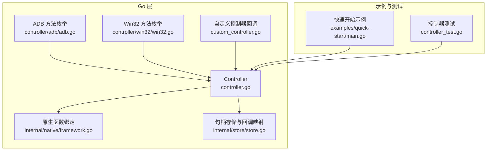
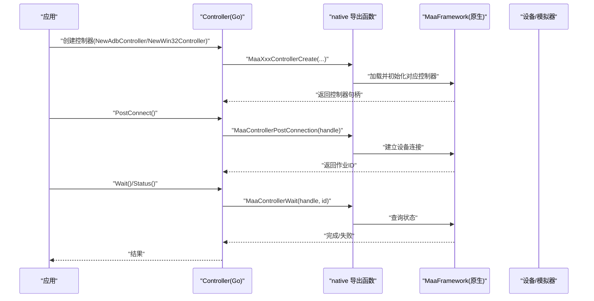
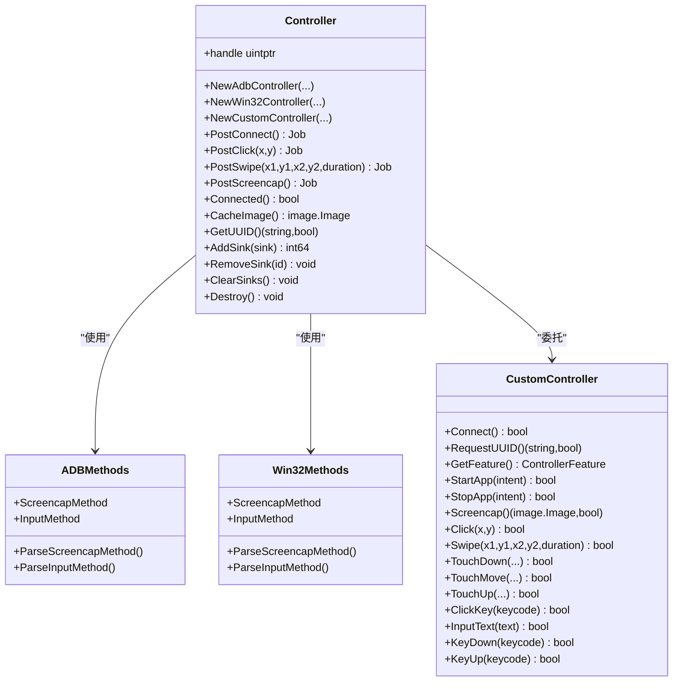

# 控制器（Controller）

<cite>
**本文引用的文件列表**
- [controller.go](file://controller.go)
- [custom_controller.go](file://custom_controller.go)
- [controller\adb\adb.go](file://controller\adb\adb.go)
- [controller\win32\win32.go](file://controller\win32\win32.go)
- [internal\native\native.go](file://internal\native\native.go)
- [internal\native\framework.go](file://internal\native\framework.go)
- [internal\store\store.go](file://internal\store\store.go)
- [controller_test.go](file://controller_test.go)
- [examples\quick-start\main.go](file://examples\quick-start\main.go)
</cite>

## 目录
1. [引言](#引言)
2. [项目结构](#项目结构)
3. [核心组件](#核心组件)
4. [架构总览](#架构总览)
5. [组件详解](#组件详解)
6. [依赖关系分析](#依赖关系分析)
7. [性能与延迟考量](#性能与延迟考量)
8. [故障排查指南](#故障排查指南)
9. [结论](#结论)
10. [附录：平台示例与配置建议](#附录平台示例与配置建议)

## 引言
本章节系统性介绍控制器（Controller）的抽象设计及其在设备控制中的关键角色。控制器作为上层任务编排与底层设备交互之间的桥梁，统一对外暴露一致的操作接口，屏蔽平台差异。本文将重点阐述：
- 抽象控制器的设计理念与职责边界
- ADB 控制器与 Win32 控制器的创建方式与参数含义
- 统一的跨平台操作接口（如 PostClick、PostSwipe、PostScreencap 等）
- 与底层原生库的交互机制（通过 native 层函数桥接）
- 设备连接、屏幕捕获、输入模拟的完整流程
- 连接管理、异常重试、性能延迟等实际问题的解决方案与配置建议

## 项目结构
控制器相关代码主要分布在以下位置：
- 核心控制器封装：controller.go
- 自定义控制器回调桥接：custom_controller.go
- 平台方法枚举与解析：controller/adb/adb.go、controller/win32/win32.go
- 原生库绑定与导出函数：internal/native/framework.go；初始化入口：internal/native/native.go
- 存储与回调映射：internal/store/store.go
- 使用示例与测试：examples/quick-start/main.go、controller_test.go

图表来源
- [controller.go](file://controller.go#L1-L300)
- [controller\adb\adb.go](file://controller\adb\adb.go#L1-L170)
- [controller\win32\win32.go](file://controller\win32\win32.go#L1-L164)
- [custom_controller.go](file://custom_controller.go#L1-L392)
- [internal\native\framework.go](file://internal\native\framework.go#L1-L465)
- [internal\store\store.go](file://internal\store\store.go#L1-L65)
- [examples\quick-start\main.go](file://examples\quick-start\main.go#L1-L41)
- [controller_test.go](file://controller_test.go#L1-L220)

章节来源
- [controller.go](file://controller.go#L1-L300)
- [controller\adb\adb.go](file://controller\adb\adb.go#L1-L170)
- [controller\win32\win32.go](file://controller\win32\win32.go#L1-L164)
- [custom_controller.go](file://custom_controller.go#L1-L392)
- [internal\native\native.go](file://internal\native\native.go#L1-L41)
- [internal\native\framework.go](file://internal\native\framework.go#L1-L465)
- [internal\store\store.go](file://internal\store\store.go#L1-L65)
- [examples\quick-start\main.go](file://examples\quick-start\main.go#L1-L41)
- [controller_test.go](file://controller_test.go#L1-L220)

## 核心组件
- 抽象控制器 Controller
  - 负责统一的设备控制接口，包括连接、点击、滑动、输入文本、启动/停止应用、触摸、按键、滚动、截图等
  - 通过原生函数桥接到底层设备驱动或模拟器 API
  - 提供异步作业模型（PostXxx 返回 Job，支持 Wait/Status 查询）
  - 支持事件回调 Sink 的添加与移除
- ADB 控制器
  - 通过 NewAdbController 创建，参数包含 ADB 可执行路径、设备地址、截图与输入方法、配置、代理二进制路径
  - 截图与输入方法采用位掩码组合，框架会自动选择最快/可用的方法
- Win32 控制器
  - 通过 NewWin32Controller 创建，参数包含窗口句柄、截图方法、鼠标与键盘输入方法
  - 输入方法为单选，直接指定一种策略
- 自定义控制器
  - 通过 NewCustomController 注册自定义实现，回调由 purego 桥接到 Go 接口
  - 提供 Feature 标志位用于扩展行为（如使用鼠标/键盘按下代替点击）

章节来源
- [controller.go](file://controller.go#L1-L300)
- [custom_controller.go](file://custom_controller.go#L1-L392)
- [controller\adb\adb.go](file://controller\adb\adb.go#L1-L170)
- [controller\win32\win32.go](file://controller\win32\win32.go#L1-L164)

## 架构总览
控制器的运行时架构如下：
- Go 层 Controller 封装所有公共 API
- 通过 native 层注册的导出函数调用底层原生库（MaaFramework）
- 原生库负责与设备（ADB/模拟器）或 Windows API 交互
- 自定义控制器通过 purego 回调桥接至 Go 实现
- 事件回调通过全局存储映射句柄与回调 ID

图表来源
- [controller.go](file://controller.go#L1-L300)
- [internal\native\framework.go](file://internal\native\framework.go#L1-L465)

## 组件详解

### 抽象控制器 Controller
- 创建与销毁
  - NewAdbController：传入 ADB 路径、设备地址、截图/输入方法、配置、代理二进制路径
  - NewWin32Controller：传入窗口句柄、截图方法、鼠标/键盘输入方法
  - NewCustomController：传入自定义实现接口，内部注册回调并通过指针传递 ID
  - Destroy：释放控制器资源，注销自定义回调与事件 Sink
- 选项设置
  - 设置截图目标长边/短边、是否使用原始尺寸等
- 异步操作
  - PostConnect、PostClick、PostSwipe、PostClickKey、PostInputText、PostStartApp、PostStopApp、PostTouchDown/Move/Up、PostKeyDown/KeyUp、PostScreencap、PostScroll
  - 每个 PostXxx 返回 Job，支持 Wait/Status 查询
- 运行时信息
  - Connected：检查连接状态
  - CacheImage：获取最近一次截图缓存图像
  - GetUUID：获取控制器唯一标识
- 事件回调
  - AddSink/RemoveSink/ClearSinks：添加/移除/清空事件回调 Sink

章节来源
- [controller.go](file://controller.go#L1-L300)
- [internal\store\store.go](file://internal\store\store.go#L1-L65)

### ADB 控制器
- 截图方法（ScreencapMethod）
  - 支持多种策略（编码写入后拉取、直接编码、压缩原始流、网络直连、Minicap 直连/流式、模拟器扩展等）
  - 可按位或组合，默认策略排除某些特定方法
- 输入方法（InputMethod）
  - 支持 ADB Shell、Minicap+ADB 键盘、Maatouch、模拟器扩展等
  - 优先级：EmulatorExtras > Maatouch > MinitouchAndAdbKey > AdbShell
- 字符串解析与回转
  - 提供 ParseXxx 与 String 方法，支持大小写不敏感、空白处理、数值字符串解析

章节来源
- [controller\adb\adb.go](file://controller\adb\adb.go#L1-L170)

### Win32 控制器
- 截图方法（ScreencapMethod）
  - GDI、FramePool、DXGI 桌面复制、窗口模式复制、PrintWindow、ScreenDC 等
- 输入方法（InputMethod）
  - 抓取窗口、发送消息、投递消息、传统事件、线程消息、带光标位置的消息、阻塞输入等
- 字符串解析与回转
  - 同样提供 ParseXxx 与 String 方法，支持大小写不敏感、空白处理、数值字符串解析

章节来源
- [controller\win32\win32.go](file://controller\win32\win32.go#L1-L164)

### 自定义控制器
- 接口定义
  - 包含 Connect、RequestUUID、GetFeature、StartApp、StopApp、Screencap、Click、Swipe、TouchDown/Move/Up、ClickKey、InputText、KeyDown/KeyUp 等
- 回调桥接
  - 通过 purego 将 Go 函数注册为 C 回调，原生库调用时携带一个 uint64 的“控制器 ID”，Go 侧据此查找实现
- 特性标志
  - 如使用鼠标/键盘按下代替点击等特性开关

章节来源
- [custom_controller.go](file://custom_controller.go#L1-L392)

### 与原生库的交互机制
- 初始化
  - native.Init 加载各模块（Framework/Toolkit/AgentServer/AgentClient），并在 native/framework.go 中注册导出函数
- 控制器创建
  - Controller 调用 native.MaaAdbControllerCreate/MaaWin32ControllerCreate/MaaCustomControllerCreate
- 控制器操作
  - PostXxx 系列最终调用 MaaControllerPostXxx，Wait/Status 调用 MaaControllerWait/MaaControllerStatus
- 缓存与元数据
  - CacheImage 通过 MaaControllerCachedImage 获取图像缓冲
  - GetUUID 通过 MaaControllerGetUuid 获取字符串缓冲

章节来源
- [internal\native\native.go](file://internal\native\native.go#L1-L41)
- [internal\native\framework.go](file://internal\native\framework.go#L1-L465)
- [controller.go](file://controller.go#L1-L300)

### 完整流程示例（Android ADB）
- 设备发现与连接
  - 使用示例中通过 FindAdbDevices 获取设备信息，随后创建 ADB 控制器并 PostConnect
- 屏幕捕获
  - PostScreencap 后 Wait 成功，再通过 CacheImage 获取图像
- 输入模拟
  - PostClick、PostSwipe、PostInputText、PostClickKey 等
- 应用控制
  - PostStartApp/PostStopApp

章节来源
- [examples\quick-start\main.go](file://examples\quick-start\main.go#L1-L41)
- [controller_test.go](file://controller_test.go#L1-L220)

## 依赖关系分析
- 组件耦合
  - Controller 对 native 层强依赖，但对平台细节（ADB/Win32）保持抽象
  - 自定义控制器通过回调 ID 与 native 解耦
- 外部依赖
  - 原生库 MaaFramework，通过 purego 注册导出函数
  - 图像缓冲与字符串缓冲由原生库提供
- 存储与映射
  - CtrlStore 记录每个控制器的事件 Sink 映射与自定义回调 ID，确保销毁时清理

图表来源
- [controller.go](file://controller.go#L1-L300)
- [controller\adb\adb.go](file://controller\adb\adb.go#L1-L170)
- [controller\win32\win32.go](file://controller\win32\win32.go#L1-L164)
- [custom_controller.go](file://custom_controller.go#L1-L392)

章节来源
- [controller.go](file://controller.go#L1-L300)
- [custom_controller.go](file://custom_controller.go#L1-L392)
- [controller\adb\adb.go](file://controller\adb\adb.go#L1-L170)
- [controller\win32\win32.go](file://controller\win32\win32.go#L1-L164)
- [internal\store\store.go](file://internal\store\store.go#L1-L65)

## 性能与延迟考量
- 截图策略选择
  - ADB：默认策略会自动排除较慢或不稳定的方法，优先选择速度与稳定性平衡的方案
  - Win32：根据目标窗口类型选择合适截图方法（如 DXGIDesktopDupWindow 针对前台窗口）
- 输入方法优先级
  - ADB：优先使用更稳定且兼容性更好的方法（如 Maatouch 或 Minicap），必要时回退到 ADB Shell
  - Win32：根据目标应用类型选择 SendMessage/PostMessage 或带光标位置的消息，减少误触
- 异步作业模型
  - 所有操作返回 Job，避免阻塞主线程；通过 Wait/Status 轮询或事件 Sink 获取完成通知
- 缓存与复用
  - CacheImage 复用最近一次截图，减少重复传输与解码开销
- 延迟优化建议
  - 在高并发场景下合并连续操作，减少设备端切换成本
  - 对于频繁点击/滑动，适当增加延时以规避系统节流
  - 合理设置截图目标尺寸，避免过大图像带来的内存与传输压力

[本节为通用性能建议，无需列出具体文件来源]

## 故障排查指南
- 连接失败
  - 确认 ADB 设备已授权、端口可达；检查 NewAdbController 参数（adbPath、address、config、agentPath）
  - 使用 PostConnect().Wait() 检查连接状态，结合事件 Sink 观察错误日志
- 截图为空或异常
  - 切换 ScreencapMethod，尝试默认或禁用压缩的 Raw 方案
  - Win32 下针对非前台窗口使用 Window 模式截图
- 输入无效
  - ADB：确认 InputMethod 是否被设备支持；必要时启用 EmulatorExtras
  - Win32：确认窗口句柄有效，必要时使用 SendMessageWithCursorPos
- 性能抖动
  - 降低截图频率，合并输入操作，合理设置 Wait 轮询间隔
- 自定义控制器未生效
  - 检查 NewCustomController 注册流程与回调 ID 映射；确保 Destroy 时正确注销

章节来源
- [controller_test.go](file://controller_test.go#L1-L220)
- [controller.go](file://controller.go#L1-L300)

## 结论
控制器通过统一抽象屏蔽了平台差异，使上层逻辑无需关心底层设备细节。借助 native 层导出函数与原生库协作，实现了稳定的设备连接、高效的屏幕捕获与可靠的输入模拟。配合异步作业模型与事件回调机制，能够满足复杂自动化场景的需求。在实际部署中，应根据设备类型与环境特征选择合适的截图与输入策略，并结合缓存与延迟优化提升整体性能与稳定性。

[本节为总结性内容，无需列出具体文件来源]

## 附录：平台示例与配置建议

### Android ADB 示例（快速开始）
- 步骤概览
  - 初始化框架与配置
  - 发现设备并创建 ADB 控制器
  - 连接设备、加载资源、绑定控制器与资源
  - 执行任务并输出结果
- 关键点
  - NewAdbController 的参数需与设备匹配（adbPath、address、screencapMethod、inputMethod、config、agentPath）
  - PostConnect 后再进行后续操作
  - 使用 CacheImage 获取截图结果

章节来源
- [examples\quick-start\main.go](file://examples\quick-start\main.go#L1-L41)
- [controller_test.go](file://controller_test.go#L1-L220)

### Windows Win32 示例（思路）
- 步骤概览
  - 获取目标窗口句柄
  - 创建 Win32 控制器（选择合适的截图与输入方法）
  - 进行点击、滑动、输入文本等操作
- 关键点
  - 截图方法建议优先考虑 DXGIDesktopDupWindow（前台窗口）
  - 输入方法可选择 SendMessage/PostMessage 或带光标位置的消息

章节来源
- [controller\win32\win32.go](file://controller\win32\win32.go#L1-L164)
- [controller_test.go](file://controller_test.go#L1-L220)

### 配置建议（按场景）
- 高帧率/低延迟
  - 截图：ADB 优先默认策略；Win32 优先 DXGI 桌面复制
  - 输入：ADB 优先 Maatouch/Minicap；Win32 优先 SendMessage
- 兼容性优先
  - ADB：启用默认策略，避免强制 Raw/Netcat
  - Win32：使用 SendMessage/PostMessage，避免阻塞输入
- 资源受限
  - 降低截图目标尺寸，启用 CacheImage 复用
  - 合并连续操作，减少设备切换次数

[本节为通用配置建议，无需列出具体文件来源]