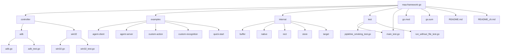
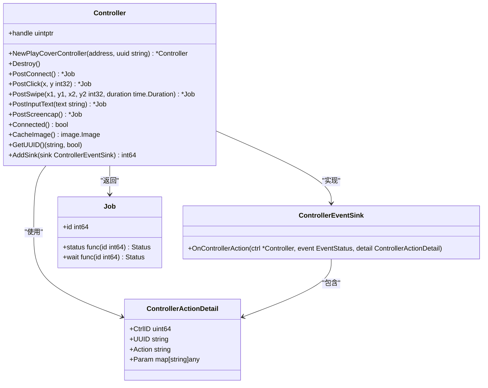
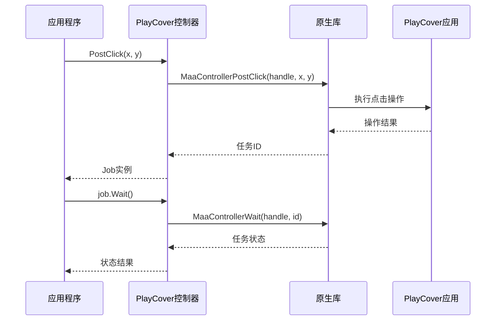
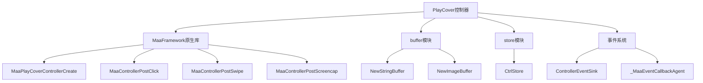

# PlayCover控制器

<cite>
**本文档中引用的文件**  
- [controller.go](file://controller.go)
- [custom_controller.go](file://custom_controller.go)
- [dbg_controller.go](file://dbg_controller.go)
- [internal/native/framework.go](file://internal/native/framework.go)
- [event.go](file://event.go)
- [controller_test.go](file://controller_test.go)
</cite>

## 目录
1. [简介](#简介)
2. [项目结构](#项目结构)
3. [核心组件](#核心组件)
4. [PlayCover控制器架构](#playcover控制器架构)
5. [详细组件分析](#详细组件分析)
6. [依赖关系分析](#依赖关系分析)
7. [性能考虑](#性能考虑)
8. [故障排除指南](#故障排除指南)
9. [结论](#结论)

## 简介

PlayCover控制器是MaaFramework Go绑定中的一个重要组件，用于与iOS设备上的PlayCover应用进行交互。PlayCover是一个允许在macOS上运行iOS应用的兼容层，而MaaFramework则提供了一套自动化测试框架，基于图像识别技术实现跨平台自动化。

PlayCover控制器通过MaaFramework的原生接口与PlayCover应用通信，实现对iOS应用的自动化控制，包括点击、滑动、输入文本等操作。该控制器的设计遵循了MaaFramework的模块化架构，与其他控制器（如ADB控制器、Win32控制器）具有相似的接口和使用模式。

本文档将深入分析PlayCover控制器的实现细节、架构设计和使用方法，为开发者提供全面的技术参考。

## 项目结构

MaaFramework Go绑定项目采用标准的Go模块结构，组织清晰，模块化程度高。项目根目录下包含多个子目录，分别负责不同的功能模块。



**Diagram sources**  
- [controller.go](file://controller.go#L1-L359)
- [internal/native/framework.go](file://internal/native/framework.go#L152-L399)

**Section sources**  
- [controller.go](file://controller.go#L1-L359)
- [internal/native/framework.go](file://internal/native/framework.go#L152-L399)

## 核心组件

PlayCover控制器的核心组件主要包括控制器创建、操作执行、状态管理和事件回调等功能。这些功能通过`Controller`结构体和相关方法实现，提供了对PlayCover应用的完整控制能力。

`Controller`结构体是所有控制器的统一接口，包含一个`handle`字段用于指向原生控制器实例。通过不同的创建函数（如`NewAdbController`、`NewWin32Controller`、`NewPlayCoverController`），可以创建针对不同平台的控制器实例。

PlayCover控制器的主要功能包括：
- 连接管理：通过`PostConnect`方法建立与PlayCover应用的连接
- 输入操作：支持点击、滑动、按键、文本输入等操作
- 屏幕截图：通过`PostScreencap`方法获取屏幕图像
- 应用管理：支持启动和停止应用
- 事件回调：提供事件监听机制，可以监控控制器的各种状态变化

这些功能的实现依赖于MaaFramework的原生库，通过Go的`purego`包实现无CGO的纯Go调用。

**Section sources**  
- [controller.go](file://controller.go#L24-L359)
- [internal/native/framework.go](file://internal/native/framework.go#L152-L399)

## PlayCover控制器架构

PlayCover控制器的架构设计遵循了MaaFramework的统一模式，通过适配器模式将Go语言的接口与原生C库的API进行桥接。这种设计使得不同平台的控制器可以共享相同的接口和使用方式，同时保持了对底层平台特性的支持。



**Diagram sources**  
- [controller.go](file://controller.go#L24-L359)
- [event.go](file://event.go#L60-L65)

**Section sources**  
- [controller.go](file://controller.go#L24-L359)
- [event.go](file://event.go#L60-L65)

## 详细组件分析

### PlayCover控制器创建与初始化

PlayCover控制器的创建通过`NewPlayCoverController`函数实现，该函数接受两个参数：`address`和`uuid`。`address`表示PlayCover应用的地址，`uuid`是控制器的唯一标识符。

```go
func NewPlayCoverController(
    address, uuid string,
) *Controller {
    handle := native.MaaPlayCoverControllerCreate(address, uuid)
    if handle == 0 {
        return nil
    }

    initControllerStore(handle)

    return &Controller{
        handle: handle,
    }
}
```

创建过程首先调用原生函数`MaaPlayCoverControllerCreate`创建控制器实例，如果创建失败则返回`nil`。创建成功后，调用`initControllerStore`初始化控制器的存储结构，最后返回一个包含`handle`的`Controller`实例。

**Section sources**  
- [controller.go](file://controller.go#L54-L68)

### 操作执行机制

PlayCover控制器的操作执行采用异步模式，所有操作方法（如`PostClick`、`PostSwipe`等）都返回一个`Job`实例。`Job`代表一个异步任务，可以通过`Wait`方法等待任务完成。



**Diagram sources**  
- [controller.go](file://controller.go#L180-L182)
- [internal/native/framework.go](file://internal/native/framework.go#L396)

**Section sources**  
- [controller.go](file://controller.go#L179-L247)
- [internal/native/framework.go](file://internal/native/framework.go#L395-L396)

### 事件回调系统

PlayCover控制器提供了事件回调机制，允许应用程序监听控制器的各种状态变化。通过`AddSink`方法可以添加事件监听器，当控制器状态发生变化时，会调用监听器的`OnControllerAction`方法。

```go
type ControllerEventSink interface {
    OnControllerAction(ctrl *Controller, event EventStatus, detail ControllerActionDetail)
}

func (c *Controller) AddSink(sink ControllerEventSink) int64 {
    id := registerEventCallback(sink)
    sinkId := native.MaaControllerAddSink(
        c.handle,
        _MaaEventCallbackAgent,
        uintptr(id),
    )
    return sinkId
}
```

事件回调系统使用了注册-通知模式，将Go语言的接口与原生C库的回调函数进行桥接。`registerEventCallback`函数将Go语言的事件监听器注册到全局映射中，并返回一个唯一的ID。原生库通过这个ID调用相应的Go函数，实现跨语言的事件通知。

**Section sources**  
- [controller.go](file://controller.go#L336-L358)
- [event.go](file://event.go#L156-L168)

## 依赖关系分析

PlayCover控制器的实现依赖于多个内部模块和外部库，这些依赖关系构成了控制器的功能基础。



**Diagram sources**  
- [controller.go](file://controller.go#L8-L13)
- [internal/native/framework.go](file://internal/native/framework.go#L164)
- [internal/store/store.go](file://internal/store/store.go#L62)
- [event.go](file://event.go#L11-L14)

**Section sources**  
- [controller.go](file://controller.go#L8-L13)
- [internal/native/framework.go](file://internal/native/framework.go#L164)
- [internal/store/store.go](file://internal/store/store.go#L62)
- [event.go](file://event.go#L11-L14)

## 性能考虑

PlayCover控制器的性能主要受以下几个因素影响：

1. **网络延迟**：由于PlayCover控制器需要通过网络与PlayCover应用通信，网络延迟会直接影响操作的响应速度。
2. **图像处理**：屏幕截图和图像识别是计算密集型操作，需要消耗大量CPU资源。
3. **序列化开销**：事件回调和参数传递需要进行序列化和反序列化，增加了额外的开销。
4. **内存管理**：频繁的内存分配和释放可能导致GC压力增大。

为了优化性能，可以采取以下措施：
- 使用`SetScreenshotTargetLongSide`或`SetScreenshotTargetShortSide`方法设置合适的截图尺寸，避免处理过大的图像。
- 合理使用事件回调，避免注册过多的监听器。
- 批量执行操作，减少网络通信次数。
- 及时释放不再使用的资源，避免内存泄漏。

## 故障排除指南

在使用PlayCover控制器时，可能会遇到一些常见问题。以下是一些故障排除建议：

1. **连接失败**：检查PlayCover应用是否正在运行，地址和UUID是否正确。
2. **操作无响应**：确认PlayCover应用有足够权限，检查网络连接是否正常。
3. **图像识别失败**：调整截图尺寸，确保图像质量足够高。
4. **内存泄漏**：确保所有创建的控制器实例都调用了`Destroy`方法。
5. **事件回调不触发**：检查事件监听器是否正确注册，确保没有发生panic导致回调链中断。

通过`GetUUID`方法可以获取控制器的UUID，用于验证连接状态。通过`Connected`方法可以检查控制器是否已成功连接。

**Section sources**  
- [controller.go](file://controller.go#L303-L312)
- [controller.go](file://controller.go#L283-L286)

## 结论

PlayCover控制器作为MaaFramework Go绑定的重要组成部分，为在macOS上自动化iOS应用提供了强大的支持。通过与PlayCover应用的集成，开发者可以使用Go语言编写跨平台的自动化测试脚本，实现对iOS应用的全面控制。

控制器的设计充分考虑了可扩展性和易用性，提供了丰富的操作接口和事件回调机制。通过异步操作模式和高效的内存管理，确保了在复杂场景下的稳定性和性能。

未来，PlayCover控制器可以进一步优化网络通信效率，增加更多针对iOS平台特性的操作支持，为开发者提供更加完善的自动化测试解决方案。