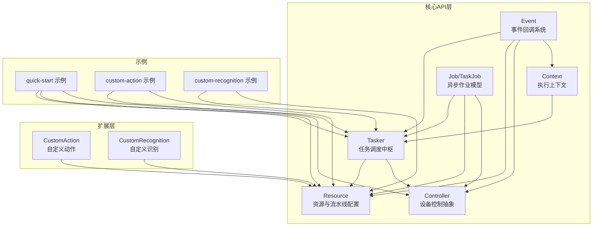
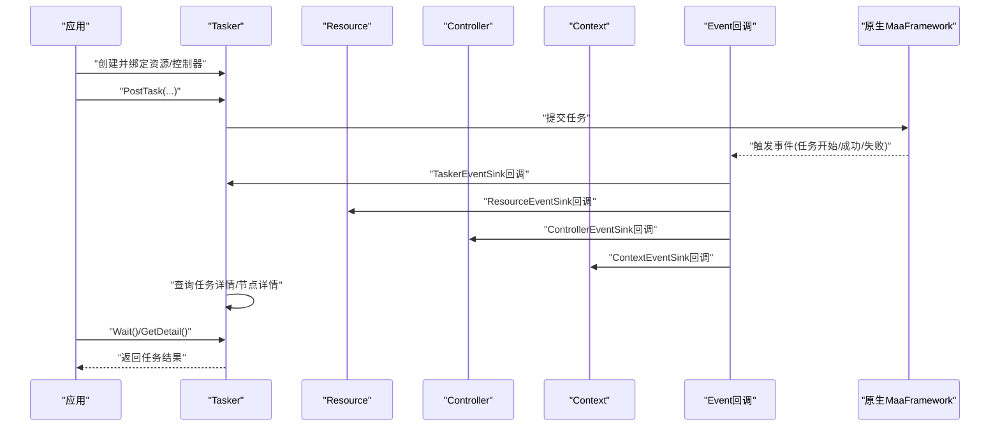
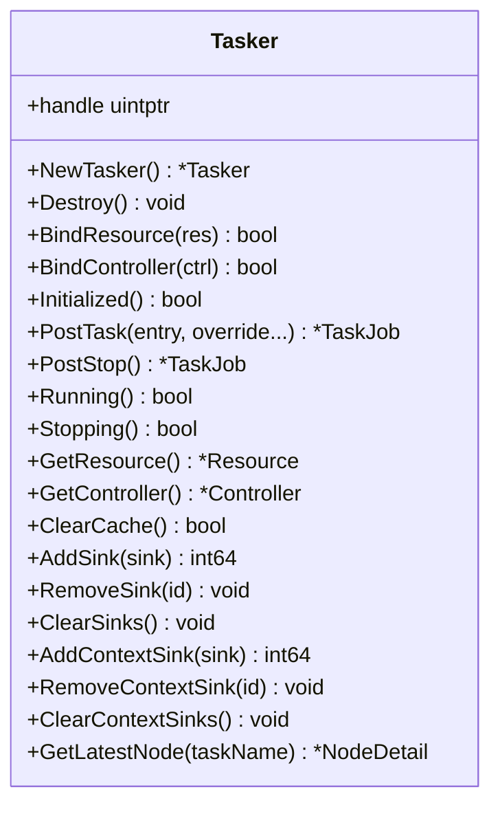
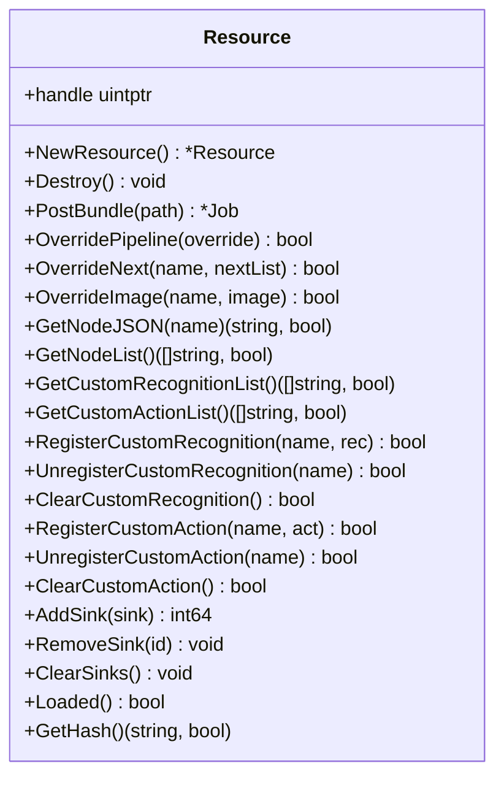
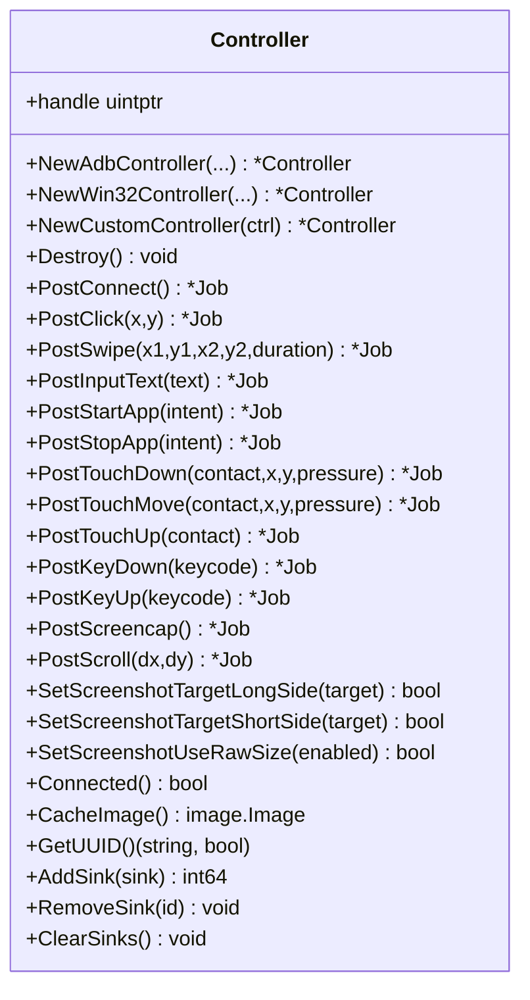
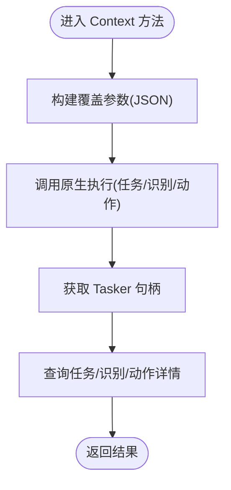
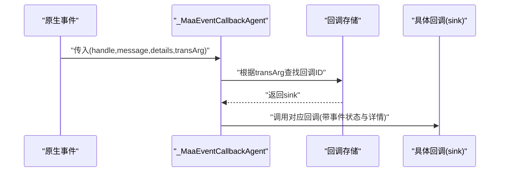
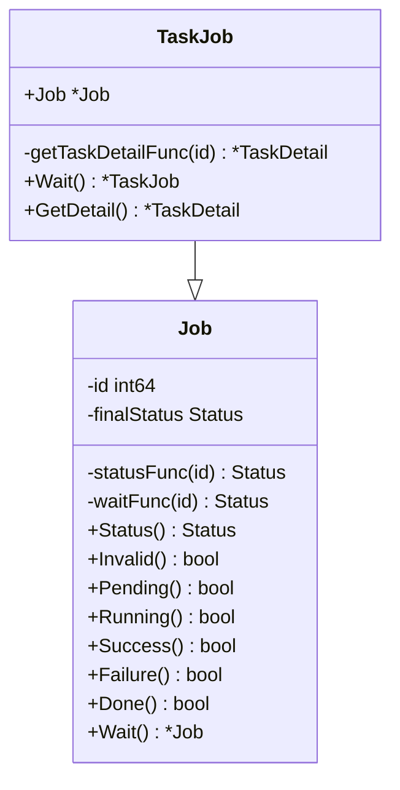
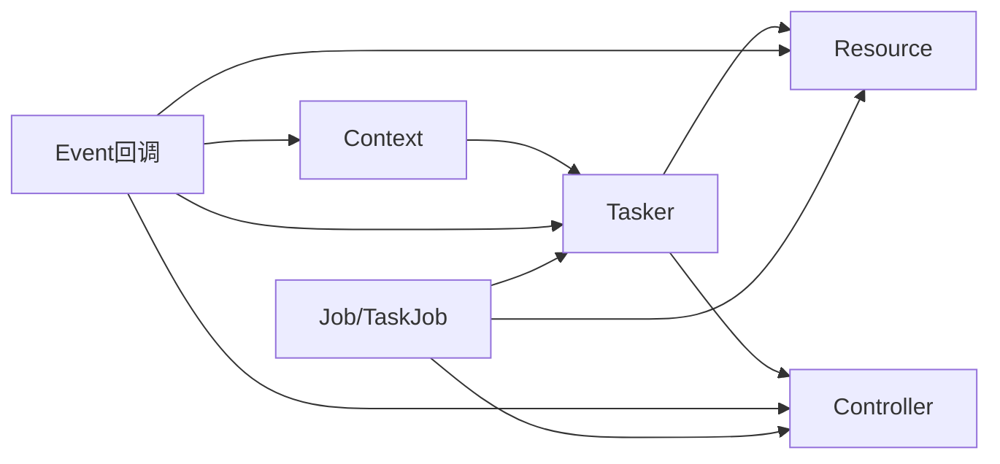

# 核心概念

<cite>
**本文引用的文件列表**
- [tasker.go](file://tasker.go)
- [resource.go](file://resource.go)
- [controller.go](file://controller.go)
- [context.go](file://context.go)
- [event.go](file://event.go)
- [job.go](file://job.go)
- [custom_action.go](file://custom_action.go)
- [custom_recognition.go](file://custom_recognition.go)
- [examples/quick-start/main.go](file://examples/quick-start/main.go)
- [examples/custom-action/main.go](file://examples/custom-action/main.go)
- [examples/custom-recognition/main.go](file://examples/custom-recognition/main.go)
- [README.md](file://README.md)
</cite>

## 目录
1. [引言](#引言)
2. [项目结构](#项目结构)
3. [核心组件](#核心组件)
4. [架构总览](#架构总览)
5. [详细组件分析](#详细组件分析)
6. [依赖关系分析](#依赖关系分析)
7. [性能考量](#性能考量)
8. [故障排查指南](#故障排查指南)
9. [结论](#结论)
10. [附录](#附录)

## 引言
本篇文档围绕 maa-framework-go 的核心概念与组件进行系统性阐述，目标是帮助开发者建立坚实的理论基础，理解 Tasker（任务调度中枢）、Resource（识别资源与流水线配置）、Controller（设备控制抽象，支持 ADB/Win32/自定义）、Context（任务执行上下文）、Event（事件回调系统）之间的协作关系与内部工作机制。文档同时结合代码库中的具体实现（如 NewTasker、PostTask、PostBundle 等），并通过图示展示组件间的数据流与依赖关系，并总结常见误用与最佳实践。

## 项目结构
该仓库采用按职责分层的组织方式：
- 核心 API 层：tasker.go、resource.go、controller.go、context.go、event.go、job.go
- 自定义扩展层：custom_action.go、custom_recognition.go
- 示例层：examples 下包含快速开始、自定义动作、自定义识别等示例
- 内部工具与桥接：internal 目录下的缓冲区、原生桥接、存储等

**章节来源**
- [README.md](file://README.md#L1-L169)

## 核心组件
- Tasker：负责任务提交、状态查询、停止信号、事件回调注册、节点详情查询等，是任务执行的中枢。
- Resource：负责资源加载、流水线覆盖、自定义识别/动作注册、事件回调注册等，承载识别与动作的配置与能力。
- Controller：负责设备连接、截图、输入、应用启停、滚动等操作，抽象出 ADB/Win32/自定义控制器。
- Context：提供在单次任务执行中运行识别/动作的能力，支持覆盖流水线、锚点、命中计数等上下文级操作。
- Event：统一的事件回调代理与分发器，将底层事件映射到 Tasker/Resource/Controller/Context 的回调接口。
- Job/TaskJob：封装异步作业的状态查询与等待逻辑，TaskJob 还可获取任务详情。

**章节来源**
- [tasker.go](file://tasker.go#L1-L120)
- [resource.go](file://resource.go#L1-L120)
- [controller.go](file://controller.go#L1-L120)
- [context.go](file://context.go#L1-L120)
- [event.go](file://event.go#L1-L120)
- [job.go](file://job.go#L1-L96)

## 架构总览
下图展示了从应用调用到底层原生交互的关键路径，以及事件回调的分发链路。

**图示来源**
- [tasker.go](file://tasker.go#L85-L120)
- [event.go](file://event.go#L296-L334)
- [context.go](file://context.go#L197-L214)

**章节来源**
- [tasker.go](file://tasker.go#L85-L120)
- [event.go](file://event.go#L120-L220)
- [context.go](file://context.go#L197-L214)

## 详细组件分析

### Tasker 组件
- 职责
  - 创建销毁、初始化检查、缓存清理
  - 绑定 Resource 与 Controller
  - 提交任务、停止任务、查询状态与等待完成
  - 查询任务详情、节点详情、最新节点
  - 注册/移除/清空事件回调（Tasker/Context 两类 Sink）
- 关键方法与行为
  - NewTasker：创建句柄并登记到全局存储，用于后续回调注销与资源回收
  - PostTask：支持字符串或任意可 JSON 序列化的覆盖参数；内部将覆盖参数序列化后传递给原生
  - PostStop：向任务器发送停止信号
  - AddSink/RemoveSink/ClearSinks：注册 TaskerEventSink 回调，保存映射以便销毁时注销
  - AddContextSink/RemoveContextSink/ClearContextSinks：注册 ContextEventSink 回调
  - 任务详情查询：getTaskDetail/getNodeDetail/getRecognitionDetail/getActionDetail
- 数据流
  - 任务提交后由原生执行，期间通过事件回调异步通知上层
  - 任务完成后可通过 Wait 获取最终状态，再通过 GetDetail 获取详细信息

**图示来源**
- [tasker.go](file://tasker.go#L1-L120)

**章节来源**
- [tasker.go](file://tasker.go#L1-L120)
- [tasker.go](file://tasker.go#L120-L220)
- [tasker.go](file://tasker.go#L220-L344)
- [tasker.go](file://tasker.go#L344-L433)

### Resource 组件
- 职责
  - 创建销毁、加载资源包、查询加载状态、获取哈希与节点列表
  - 流水线覆盖、下一跳覆盖、图像覆盖
  - 注册/注销/清空自定义识别与自定义动作
  - 注册/移除/清空事件回调（ResourceEventSink）
- 关键方法与行为
  - NewResource：创建句柄并登记到全局存储
  - PostBundle：添加资源路径并返回 Job，支持异步等待
  - OverridePipeline：支持字符串或任意可 JSON 序列化的覆盖参数
  - OverrideNext：按任务名覆盖下一跳列表
  - OverrideImage：覆盖指定图像
  - RegisterCustomRecognition/RegisterCustomAction：注册自定义识别/动作，保存回调ID映射
  - AddSink/RemoveSink/ClearSinks：注册 ResourceEventSink 回调
- 数据流
  - 资源加载完成后，可通过 Loaded 检查状态；节点列表与自定义项可通过相应接口查询

**图示来源**
- [resource.go](file://resource.go#L1-L120)

**章节来源**
- [resource.go](file://resource.go#L1-L120)
- [resource.go](file://resource.go#L120-L220)
- [resource.go](file://resource.go#L220-L383)

### Controller 组件
- 职责
  - 创建 ADB/Win32/自定义控制器实例
  - 设备连接、截图、点击、滑动、按键、输入文本、启动/停止应用、触摸/滚动等
  - 选项设置（如截图目标长边/短边、是否使用原始尺寸）
  - 缓存最近一次截图图像、获取 UUID
  - 注册/移除/清空事件回调（ControllerEventSink）
- 关键方法与行为
  - NewAdbController/NewWin32Controller/NewCustomController：三种构造方式
  - PostConnect/PostClick/PostSwipe/PostInputText/PostStartApp/PostStopApp/PostTouchDown/PostTouchMove/PostTouchUp/PostKeyDown/PostKeyUp/PostScreencap/PostScroll：各类设备操作
  - SetScreenshotTargetLongSide/SetScreenshotTargetShortSide/SetScreenshotUseRawSize：截图尺寸相关选项
  - CacheImage/GetUUID：读取缓存图像与设备 UUID
  - AddSink/RemoveSink/ClearSinks：注册 ControllerEventSink 回调
- 数据流
  - 控制器通过原生接口执行设备操作，期间通过事件回调异步通知上层

**图示来源**
- [controller.go](file://controller.go#L1-L120)

**章节来源**
- [controller.go](file://controller.go#L1-L120)
- [controller.go](file://controller.go#L120-L220)
- [controller.go](file://controller.go#L220-L300)

### Context 组件
- 职责
  - 在当前上下文中运行任务、识别、动作，并返回详细结果
  - 支持覆盖流水线、下一跳、图像覆盖
  - 获取节点 JSON、克隆上下文、设置/获取锚点、统计命中次数
  - 获取当前任务作业、当前 Tasker 实例
- 关键方法与行为
  - RunTask/RunRecognition/RunAction：在上下文中执行对应步骤，内部将覆盖参数序列化后传递给原生
  - OverridePipeline/OverrideNext/OverrideImage：覆盖上下文级配置
  - GetNodeJSON/GetNodeData：获取节点 JSON 并解析为结构化对象
  - GetTaskJob/GetTasker/Clone：获取当前任务作业、Tasker 或克隆上下文
  - SetAnchor/GetAnchor/GetHitCount/ClearHitCount：锚点与命中计数管理
- 数据流
  - 上下文通过 Tasker 执行任务，再由 Tasker 返回任务详情供 Context 使用

**图示来源**
- [context.go](file://context.go#L1-L120)

**章节来源**
- [context.go](file://context.go#L1-L120)
- [context.go](file://context.go#L120-L240)

### Event 系统（观察者模式）
- 职责
  - 统一的事件回调注册与注销
  - 将底层事件消息映射到 Tasker/Resource/Controller/Context 的回调接口
  - 事件状态（Starting/Succeeded/Failed/Unknown）解析
- 关键机制
  - registerEventCallback/unregisterEventCallback：维护回调 ID 到 sink 的映射
  - _MaaEventCallbackAgent：原生回调入口，根据 transArg 查找 sink 并分发
  - eventHandler.handleRaw：根据消息前缀路由到对应回调接口
- 模式体现
  - 观察者模式：各组件通过 AddSink 注册回调，事件发生时异步通知
  - 适配器思想：将底层通用回调适配为不同组件的特定接口

**图示来源**
- [event.go](file://event.go#L1-L120)
- [event.go](file://event.go#L296-L334)

**章节来源**
- [event.go](file://event.go#L1-L120)
- [event.go](file://event.go#L120-L220)
- [event.go](file://event.go#L220-L334)

### Job/TaskJob（异步作业模型）
- 职责
  - 封装异步作业的状态查询与等待
  - TaskJob 在 Job 基础上增加获取任务详情的能力
- 关键方法
  - Status/Done/Wait：查询状态、等待完成
  - TaskJob.GetDetail：获取任务详情

**图示来源**
- [job.go](file://job.go#L1-L96)

**章节来源**
- [job.go](file://job.go#L1-L96)

### 工厂模式与门面模式的应用
- 工厂模式
  - Tasker/Resource/Controller 的构造函数分别负责创建不同类型的实例（NewTasker、NewResource、NewAdbController、NewWin32Controller、NewCustomController），体现了工厂模式的“创建型”特征
- 门面模式
  - Context 对外提供 RunTask/RunRecognition/RunAction 等高层接口，隐藏了底层 Tasker 的细节，形成简洁易用的门面
  - Tasker/Resource/Controller 的多数方法也起到简化调用的作用，便于上层以统一方式使用

**章节来源**
- [tasker.go](file://tasker.go#L1-L120)
- [resource.go](file://resource.go#L1-L120)
- [controller.go](file://controller.go#L1-L120)
- [context.go](file://context.go#L1-L120)

## 依赖关系分析
- 组件耦合
  - Tasker 依赖 Resource 与 Controller（绑定与查询）
  - Context 依赖 Tasker（获取任务详情、当前任务作业）
  - Event 系统为 Tasker/Resource/Controller/Context 提供统一的回调入口
  - Job/TaskJob 为 Tasker/Resource/Controller 的异步操作提供统一的状态查询与等待
- 外部依赖
  - 通过 internal/native 与原生 MaaFramework 交互
  - 通过 internal/store 维护句柄到回调映射与自定义识别/动作的回调 ID 映射

**图示来源**
- [tasker.go](file://tasker.go#L1-L120)
- [resource.go](file://resource.go#L1-L120)
- [controller.go](file://controller.go#L1-L120)
- [context.go](file://context.go#L1-L120)
- [event.go](file://event.go#L1-L120)
- [job.go](file://job.go#L1-L96)

**章节来源**
- [tasker.go](file://tasker.go#L1-L120)
- [resource.go](file://resource.go#L1-L120)
- [controller.go](file://controller.go#L1-L120)
- [context.go](file://context.go#L1-L120)
- [event.go](file://event.go#L1-L120)
- [job.go](file://job.go#L1-L96)

## 性能考量
- 异步作业模型
  - 使用 Job/TaskJob 避免阻塞主线程，提高吞吐量
- 缓存与复用
  - Tasker/Resource/Controller 在销毁时会注销所有回调，避免内存泄漏
  - Context 提供 Clone，可在需要时复制上下文以减少重复配置
- 图像与缓冲
  - 识别与动作过程中大量使用图像缓冲，注意及时释放缓冲区，避免内存占用过高
- 事件回调
  - 回调注册/注销需成对出现，避免回调表膨胀导致性能下降

[本节为通用建议，不直接分析具体文件]

## 故障排查指南
- 初始化失败
  - 确认已正确初始化并配置运行库路径
  - 检查 Tasker/Resource/Controller 的初始化状态与错误返回值
- 事件未回调
  - 确认已正确注册 AddSink/RemoveSink，且回调 ID 未被重复使用
  - 检查事件消息前缀与回调类型匹配
- 任务无结果
  - 使用 Wait() 等待完成后再调用 GetDetail()
  - 检查 OverridePipeline/OverrideNext/OverrideImage 是否正确覆盖
- 设备连接问题
  - 确认 PostConnect 成功，Connected() 返回真
  - 检查截图尺寸设置与缓存图像是否可用

**章节来源**
- [tasker.go](file://tasker.go#L1-L120)
- [resource.go](file://resource.go#L1-L120)
- [controller.go](file://controller.go#L1-L120)
- [context.go](file://context.go#L1-L120)
- [event.go](file://event.go#L1-L120)

## 结论
maa-framework-go 通过 Tasker、Resource、Controller、Context、Event 与 Job/TaskJob 的协同，构建了一个清晰、可扩展且高性能的自动化框架。Tasker 作为中枢协调任务执行，Resource 管理识别资源与流水线，Controller 抽象设备控制，Context 提供上下文级的执行能力，Event 以观察者模式实现异步通知，Job/TaskJob 则提供了统一的异步作业模型。工厂模式与门面模式的应用使得 API 更加简洁易用。遵循本文的最佳实践与排错建议，可有效提升开发效率与稳定性。

## 附录
- 快速开始示例展示了从初始化、设备连接、资源加载到任务执行的完整流程
- 自定义动作与识别示例展示了如何扩展识别与动作能力

**章节来源**
- [examples/quick-start/main.go](file://examples/quick-start/main.go#L1-L41)
- [examples/custom-action/main.go](file://examples/custom-action/main.go#L1-L49)
- [examples/custom-recognition/main.go](file://examples/custom-recognition/main.go#L1-L77)