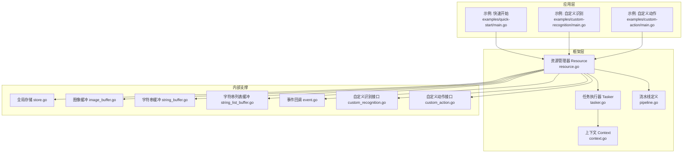
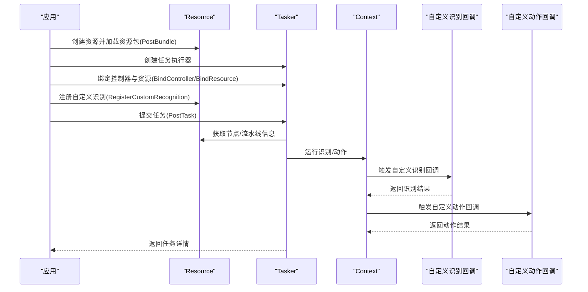
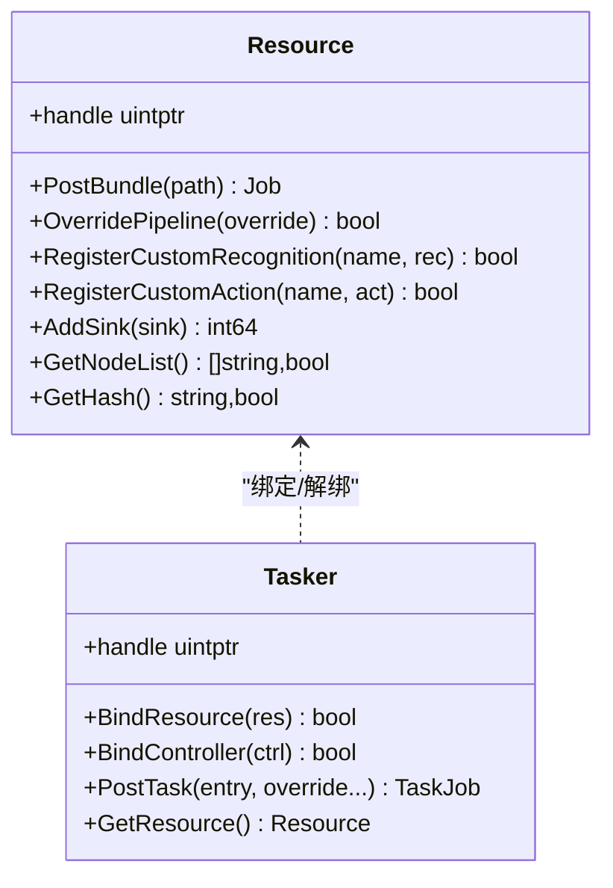
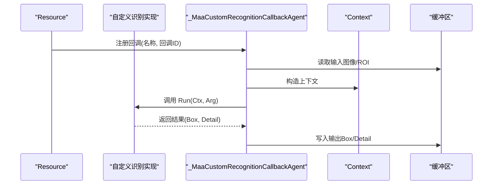
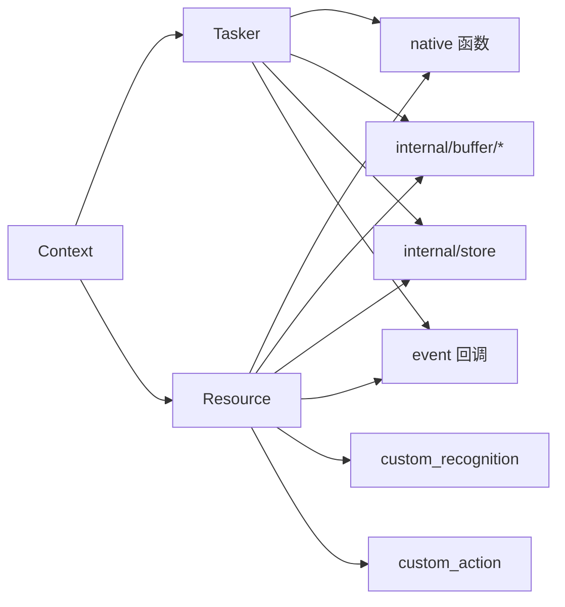

# 资源管理器（Resource）

<cite>
**本文引用的文件列表**
- [resource.go](file://resource.go)
- [tasker.go](file://tasker.go)
- [custom_recognition.go](file://custom_recognition.go)
- [custom_action.go](file://custom_action.go)
- [event.go](file://event.go)
- [internal/store/store.go](file://internal/store/store.go)
- [internal/buffer/image_buffer.go](file://internal/buffer/image_buffer.go)
- [internal/buffer/string_buffer.go](file://internal/buffer/string_buffer.go)
- [internal/buffer/string_list_buffer.go](file://internal/buffer/string_list_buffer.go)
- [examples/quick-start/main.go](file://examples/quick-start/main.go)
- [examples/quick-start/resource/pipeline/pipeline.json](file://examples/quick-start/resource/pipeline/pipeline.json)
- [examples/custom-recognition/main.go](file://examples/custom-recognition/main.go)
- [examples/custom-recognition/resource/pipeline/pipeline.json](file://examples/custom-recognition/resource/pipeline/pipeline.json)
- [examples/custom-action/main.go](file://examples/custom-action/main.go)
- [context.go](file://context.go)
- [pipeline.go](file://pipeline.go)
</cite>

## 目录
1. [简介](#简介)
2. [项目结构](#项目结构)
3. [核心组件](#核心组件)
4. [架构总览](#架构总览)
5. [关键组件详解](#关键组件详解)
6. [依赖关系分析](#依赖关系分析)
7. [性能与内存优化](#性能与内存优化)
8. [故障排查指南](#故障排查指南)
9. [结论](#结论)
10. [附录：典型流程与示例路径](#附录典型流程与示例路径)

## 简介
本篇文档围绕资源管理器（Resource）展开，系统性解析其设计目的与实现机制，重点说明：
- 如何通过 PostBundle 加载资源包
- 如何使用 OverridePipeline 动态替换识别/动作流水线
- 如何通过 RegisterCustomRecognition 注册自定义识别算法
- 结合 examples 中的 pipeline.json 配置，解释 Resource 如何解析并管理图像模板、OCR 模型、识别节点等资源
- Resource 与 Tasker 的绑定关系及其在任务执行过程中对数据的供给作用
- 资源热更新、内存占用优化与错误处理策略
- 提供实际代码示例的“片段路径”，帮助读者快速定位到典型流程

## 项目结构
Resource 组件位于顶层模块中，负责资源生命周期管理、自定义识别/动作注册、流水线覆盖、事件回调管理等；Tasker 作为任务执行引擎，通过 BindResource 与 Resource 建立绑定关系，从而获得资源提供的识别/动作能力。



图表来源
- [resource.go](file://resource.go#L1-L383)
- [tasker.go](file://tasker.go#L1-L120)
- [context.go](file://context.go#L1-L120)
- [pipeline.go](file://pipeline.go#L442-L486)
- [internal/store/store.go](file://internal/store/store.go#L1-L64)
- [internal/buffer/image_buffer.go](file://internal/buffer/image_buffer.go#L1-L200)
- [internal/buffer/string_buffer.go](file://internal/buffer/string_buffer.go#L1-L200)
- [internal/buffer/string_list_buffer.go](file://internal/buffer/string_list_buffer.go#L1-L200)
- [event.go](file://event.go#L1-L63)
- [custom_recognition.go](file://custom_recognition.go#L1-L103)
- [custom_action.go](file://custom_action.go#L1-L200)
- [examples/quick-start/main.go](file://examples/quick-start/main.go#L1-L41)
- [examples/custom-recognition/main.go](file://examples/custom-recognition/main.go#L1-L77)
- [examples/custom-action/main.go](file://examples/custom-action/main.go#L1-L49)

章节来源
- [resource.go](file://resource.go#L1-L120)
- [tasker.go](file://tasker.go#L1-L120)

## 核心组件
- Resource：资源管理器，负责创建销毁、加载资源包、注册自定义识别/动作、覆盖流水线、事件回调管理、查询节点信息等。
- Tasker：任务执行器，通过 BindResource 与 Resource 绑定，获取资源提供的识别/动作能力，并驱动任务执行。
- 自定义识别/动作：通过 Resource.RegisterCustomRecognition/RegisterCustomAction 注册，运行时由 Resource 回调转发给用户实现。
- 上下文 Context：在识别/动作回调中提供运行时上下文，支持在回调内继续触发识别/动作或覆盖流水线。
- 缓冲区与存储：用于跨语言边界传递数据（图像、字符串、字符串列表），以及全局回调映射与资源句柄关联。

章节来源
- [resource.go](file://resource.go#L1-L120)
- [tasker.go](file://tasker.go#L1-L120)
- [custom_recognition.go](file://custom_recognition.go#L1-L103)
- [custom_action.go](file://custom_action.go#L1-L200)
- [internal/store/store.go](file://internal/store/store.go#L1-L64)

## 架构总览
Resource 与 Tasker 的交互遵循“资源绑定—任务提交—流水线覆盖—识别/动作执行”的主流程。Resource 在加载资源包后，向 Tasker 提供识别/动作能力；同时支持在运行时通过 OverridePipeline 对特定节点进行覆盖，以实现热更新与灵活调度。



图表来源
- [resource.go](file://resource.go#L114-L133)
- [tasker.go](file://tasker.go#L50-L88)
- [custom_recognition.go](file://custom_recognition.go#L56-L103)
- [custom_action.go](file://custom_action.go#L1-L200)

## 关键组件详解

### Resource 设计与职责
- 句柄持有与生命周期管理：Resource 内部持有底层句柄，创建时将资源映射写入全局存储，销毁时清理所有回调与映射。
- 资源加载：PostBundle 将资源路径加入加载队列，返回 Job 以便异步等待加载完成。
- 流水线覆盖：OverridePipeline 支持字符串/字节/任意可序列化对象，统一转换为 JSON 后下发至底层。
- 自定义识别/动作注册：RegisterCustomRecognition/RegisterCustomAction 将用户实现注册为回调，并维护名称到回调 ID 的映射，便于后续覆盖与清理。
- 事件回调：AddSink/RemoveSink/ClearSinks 提供资源加载事件订阅能力。
- 查询能力：GetNodeList/GetNodeJSON/GetCustomRecognitionList/GetCustomActionList 等辅助调试与运维。
- 数据覆盖：OverrideNext/OverrideImage 支持按节点名覆盖下一跳列表与图像覆盖，实现热更新与动态替换。

章节来源
- [resource.go](file://resource.go#L1-L120)
- [resource.go](file://resource.go#L114-L133)
- [resource.go](file://resource.go#L212-L238)
- [resource.go](file://resource.go#L240-L264)
- [resource.go](file://resource.go#L266-L303)
- [resource.go](file://resource.go#L345-L383)
- [internal/store/store.go](file://internal/store/store.go#L1-L64)

### Resource 与 Tasker 的绑定关系
- Tasker.BindResource 将已初始化的 Resource 绑定到 Tasker，使 Tasker 能够从 Resource 获取识别/动作能力与节点信息。
- Tasker.GetResource 可反向获取绑定的 Resource 句柄，便于在回调中进行上下文操作（如 OverridePipeline/OverrideNext）。
- Resource 与 Tasker 的事件回调通过全局存储进行映射，确保资源销毁时能正确释放回调。



图表来源
- [resource.go](file://resource.go#L1-L120)
- [tasker.go](file://tasker.go#L1-L120)

章节来源
- [tasker.go](file://tasker.go#L50-L88)
- [tasker.go](file://tasker.go#L124-L134)

### 自定义识别与动作回调机制
- 注册流程：Resource.RegisterCustomRecognition 将用户实现注册为回调，生成全局唯一 ID，并在 Resource 层维护名称到 ID 的映射。
- 回调代理：_MaaCustomRecognitionCallbackAgent 接收底层回调参数，构造 Context/CustomRecognitionArg，调用用户实现的 Run 方法，并将结果写回底层缓冲区。
- 清理策略：Destroy/Clear* 会遍历并注销所有已注册的回调，避免悬挂引用。



图表来源
- [resource.go](file://resource.go#L114-L133)
- [custom_recognition.go](file://custom_recognition.go#L56-L103)
- [internal/buffer/image_buffer.go](file://internal/buffer/image_buffer.go#L1-L200)
- [internal/buffer/string_buffer.go](file://internal/buffer/string_buffer.go#L1-L200)

章节来源
- [custom_recognition.go](file://custom_recognition.go#L1-L103)
- [custom_action.go](file://custom_action.go#L1-L200)
- [resource.go](file://resource.go#L114-L133)

### 流水线覆盖与节点解析
- OverridePipeline：支持字符串/字节/任意可序列化对象，统一转为 JSON 字符串后下发到底层。
- 节点解析：pipeline.go 中对 NodeRecognition 的 JSON 解析根据类型选择不同参数结构体，从而支持模板匹配、特征匹配、OCR、神经网络分类/检测、自定义识别等。
- 节点数据查询：Resource.GetNodeJSON 可获取指定节点的原始 JSON，便于调试与二次加工。

```mermaid
flowchart TD
Start(["进入 OverridePipeline"]) --> TypeCheck{"输入类型？"}
TypeCheck --> |string| UseStr["直接使用字符串"]
TypeCheck --> |[]byte| ToStr["转为字符串"]
TypeCheck --> |其他| Marshal["JSON 序列化"]
UseStr --> Apply["调用底层覆盖接口"]
ToStr --> Apply
Marshal --> Apply
Apply --> End(["返回布尔结果"])
```

图表来源
- [resource.go](file://resource.go#L224-L237)
- [pipeline.go](file://pipeline.go#L442-L486)

章节来源
- [resource.go](file://resource.go#L224-L237)
- [pipeline.go](file://pipeline.go#L442-L486)

### 资源热更新与数据供给
- 图像覆盖：OverriderImage 支持在运行时替换指定图像名称，实现资源热更新。
- 下一跳覆盖：OverrideNext 支持按节点名覆盖下一跳列表，实现动态路由。
- 节点数据查询：GetNodeJSON 可获取节点原始 JSON，便于在回调中进行二次覆盖或调试。

章节来源
- [resource.go](file://resource.go#L240-L264)
- [resource.go](file://resource.go#L266-L272)

### 与 examples 的结合
- 快速开始：示例展示了 PostBundle 加载资源、BindResource 绑定资源、PostTask 提交任务的基本流程。
- 自定义识别：示例展示了 RegisterCustomRecognition 注册自定义识别，并在回调中使用 Context.RunRecognition/OverridePipeline/OverrideNext 等能力。
- 自定义动作：示例展示了 RegisterCustomAction 注册自定义动作并在任务中使用。

章节来源
- [examples/quick-start/main.go](file://examples/quick-start/main.go#L1-L41)
- [examples/custom-recognition/main.go](file://examples/custom-recognition/main.go#L1-L77)
- [examples/custom-action/main.go](file://examples/custom-action/main.go#L1-L49)
- [examples/quick-start/resource/pipeline/pipeline.json](file://examples/quick-start/resource/pipeline/pipeline.json#L1-L5)
- [examples/custom-recognition/resource/pipeline/pipeline.json](file://examples/custom-recognition/resource/pipeline/pipeline.json#L1-L12)

## 依赖关系分析
- Resource 依赖：
  - native 层函数（创建/销毁/设置选项/覆盖/查询）
  - internal/buffer（图像、字符串、字符串列表缓冲区）
  - internal/store（全局存储，维护回调映射与句柄）
  - event 回调注册/注销
  - custom_recognition/custom_action（自定义识别/动作回调代理）
- Tasker 依赖：
  - native 层函数（创建/销毁/绑定/任务提交/状态查询）
  - internal/store（事件回调映射）
  - internal/buffer（查询细节所需缓冲区）
- 上下文 Context：
  - 在自定义识别/动作回调中提供运行时上下文，支持在回调中继续触发识别/动作或覆盖流水线。



图表来源
- [resource.go](file://resource.go#L1-L120)
- [tasker.go](file://tasker.go#L1-L120)
- [custom_recognition.go](file://custom_recognition.go#L1-L103)
- [custom_action.go](file://custom_action.go#L1-L200)
- [internal/store/store.go](file://internal/store/store.go#L1-L64)
- [internal/buffer/image_buffer.go](file://internal/buffer/image_buffer.go#L1-L200)
- [internal/buffer/string_buffer.go](file://internal/buffer/string_buffer.go#L1-L200)
- [internal/buffer/string_list_buffer.go](file://internal/buffer/string_list_buffer.go#L1-L200)

## 性能与内存优化
- 回调映射与句柄管理：通过全局存储维护 Resource/Tasker/Controller 的回调映射，避免重复注册与悬挂引用；销毁时统一注销，降低泄漏风险。
- 缓冲区复用：图像、字符串、字符串列表缓冲区在方法内部创建与销毁，减少跨语言边界的数据拷贝与内存碎片。
- 异步加载：PostBundle 返回 Job，支持 Wait/Status 查询，避免阻塞主线程。
- 执行设备选择：UseCPU/UseDirectml/UseCoreml/UseAutoExecutionProvider 提供推理设备选择，便于在不同硬件上优化性能。
- 清理策略：ClearCustomRecognition/ClearCustomAction/ClearSinks 提供批量清理，便于在热更新场景快速回收资源。

章节来源
- [internal/store/store.go](file://internal/store/store.go#L1-L64)
- [resource.go](file://resource.go#L1-L120)
- [resource.go](file://resource.go#L114-L133)
- [resource.go](file://resource.go#L163-L210)
- [resource.go](file://resource.go#L345-L383)

## 故障排查指南
- 资源未加载：检查 PostBundle 是否成功，Loaded() 返回值是否为真；必要时通过 AddSink 订阅资源加载事件，查看 ResourceLoadingDetail。
- 自定义识别不可用：确认 RegisterCustomRecognition 是否返回真；若已注销或清理，需重新注册；在回调中注意返回值与缓冲区写入。
- 流水线覆盖失败：确认 OverridePipeline 输入类型正确（字符串/字节/可序列化对象）；检查 JSON 格式是否合法。
- 事件回调泄漏：确保在 Resource/Tasker 销毁前调用 ClearSinks/ClearCustomRecognition/ClearCustomAction 或 RemoveSink/UnregisterCustomRecognition。
- 图像覆盖无效：确认 OverriderImage 的图像名称与资源中一致；检查图像格式与 ROI 设置。

章节来源
- [event.go](file://event.go#L1-L63)
- [resource.go](file://resource.go#L37-L53)
- [tasker.go](file://tasker.go#L34-L48)
- [resource.go](file://resource.go#L224-L237)
- [resource.go](file://resource.go#L240-L264)

## 结论
Resource 作为识别与任务流水线配置的管理中心，承担了资源加载、自定义识别/动作注册、流水线覆盖、事件回调管理等关键职责。通过与 Tasker 的绑定，Resource 将资源能力注入到任务执行链路中；借助 OverridePipeline/OverrideNext/OverrideImage 等能力，实现了运行时的灵活调度与热更新。配合完善的回调映射与缓冲区管理，Resource 在保证易用性的同时兼顾了性能与稳定性。

## 附录：典型流程与示例路径
- 资源加载与绑定（快速开始）
  - 示例入口：[examples/quick-start/main.go](file://examples/quick-start/main.go#L1-L41)
  - 资源包加载：[resource.go](file://resource.go#L212-L217)
  - 绑定资源：[tasker.go](file://tasker.go#L50-L58)
- 自定义识别注册与回调
  - 注册接口：[resource.go](file://resource.go#L114-L133)
  - 回调代理与结果写回：[custom_recognition.go](file://custom_recognition.go#L56-L103)
  - 示例用法：[examples/custom-recognition/main.go](file://examples/custom-recognition/main.go#L1-L77)
- 流水线覆盖与节点解析
  - 覆盖接口：[resource.go](file://resource.go#L224-L237)
  - 节点解析：[pipeline.go](file://pipeline.go#L442-L486)
  - 示例配置：[examples/custom-recognition/resource/pipeline/pipeline.json](file://examples/custom-recognition/resource/pipeline/pipeline.json#L1-L12)，[examples/quick-start/resource/pipeline/pipeline.json](file://examples/quick-start/resource/pipeline/pipeline.json#L1-L5)
- 事件回调与资源状态
  - 添加/移除事件回调：[resource.go](file://resource.go#L345-L383)，[tasker.go](file://tasker.go#L357-L433)
  - 资源加载事件结构：[event.go](file://event.go#L52-L63)
- 数据覆盖与查询
  - 图像覆盖：[resource.go](file://resource.go#L259-L264)
  - 节点 JSON 查询：[resource.go](file://resource.go#L266-L272)
  - 资源哈希与节点列表：[resource.go](file://resource.go#L293-L303)，[resource.go](file://resource.go#L305-L317)