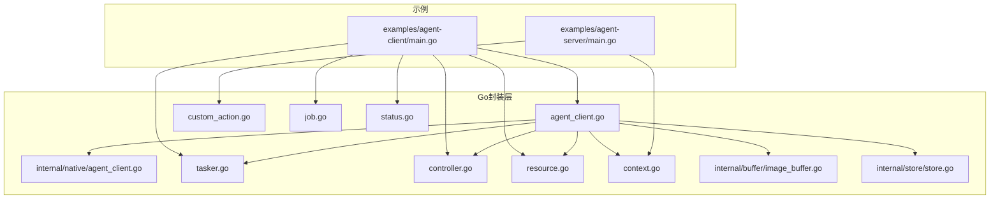
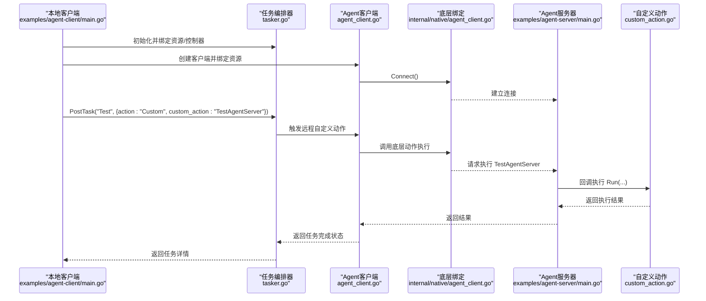
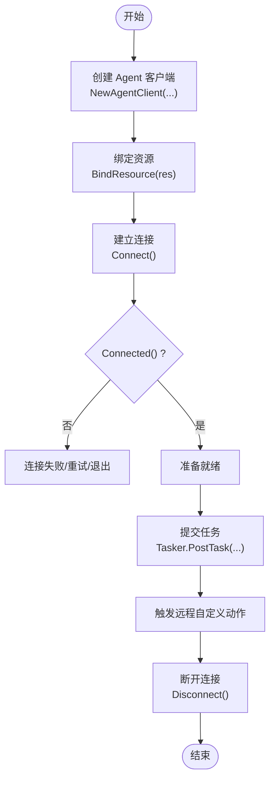
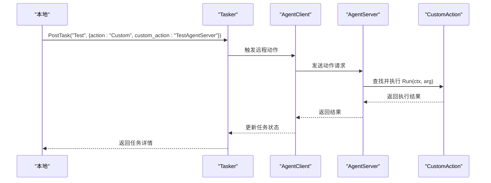
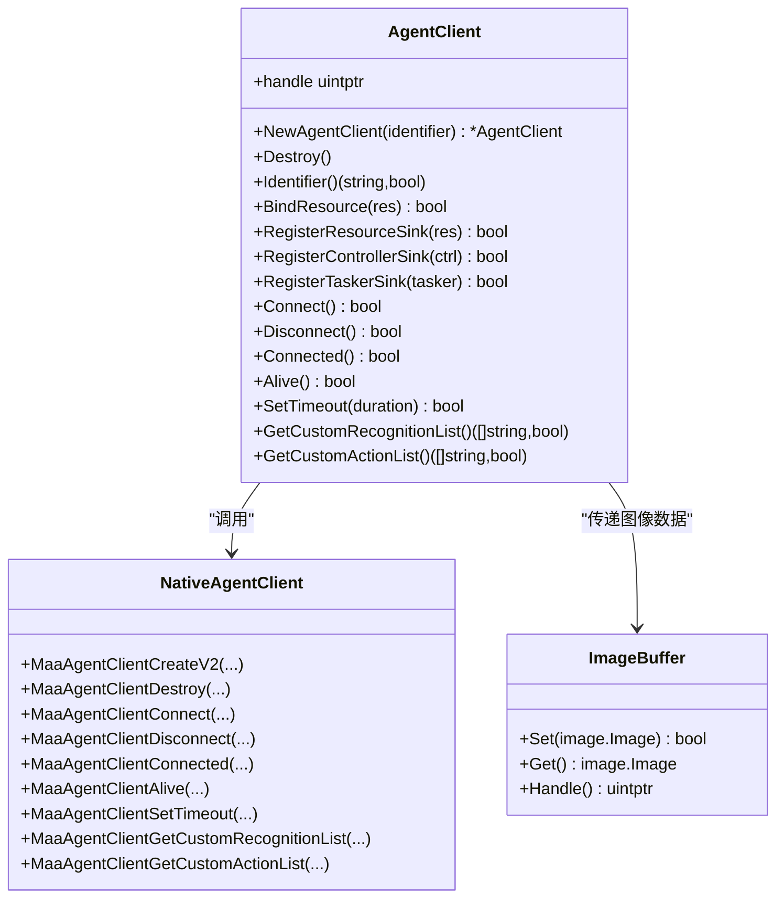
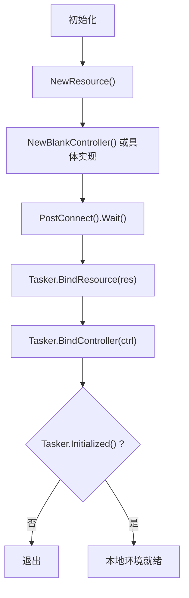
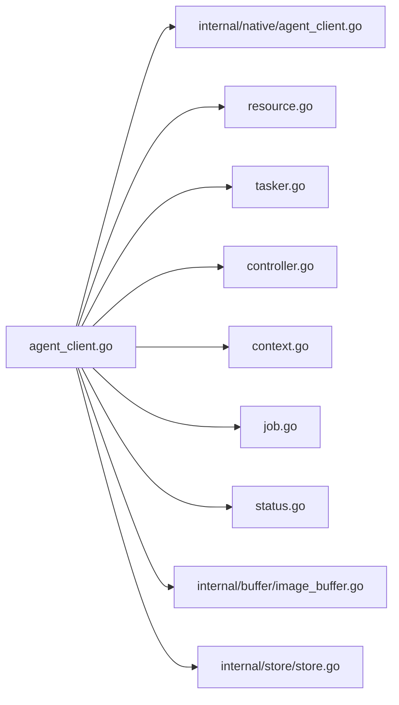

# Agent客户端示例

<cite>
**本文引用的文件列表**
- [examples/agent-client/main.go](file://examples/agent-client/main.go)
- [examples/agent-server/main.go](file://examples/agent-server/main.go)
- [agent_client.go](file://agent_client.go)
- [internal/native/agent_client.go](file://internal/native/agent_client.go)
- [tasker.go](file://tasker.go)
- [controller.go](file://controller.go)
- [resource.go](file://resource.go)
- [custom_action.go](file://custom_action.go)
- [context.go](file://context.go)
- [job.go](file://job.go)
- [status.go](file://status.go)
- [internal/buffer/image_buffer.go](file://internal/buffer/image_buffer.go)
- [internal/store/store.go](file://internal/store/store.go)
</cite>

## 目录
1. [简介](#简介)
2. [项目结构](#项目结构)
3. [核心组件](#核心组件)
4. [架构总览](#架构总览)
5. [详细组件分析](#详细组件分析)
6. [依赖关系分析](#依赖关系分析)
7. [性能考量](#性能考量)
8. [故障排查指南](#故障排查指南)
9. [结论](#结论)
10. [附录](#附录)

## 简介
本文件围绕 examples/agent-client/main.go 中的 Agent 客户端示例，系统性解读其工作流程：从 NewAgentClient 创建客户端实例，到 BindResource 绑定资源，再到 Connect 建立连接；随后通过 PostTask 触发远程自定义动作（Custom），并结合 agent_client.go 分析客户端与服务器之间的通信协议与数据交换机制。文档还阐述该架构在分布式自动化系统中的应用价值（如将计算密集型识别任务 offload 到专用服务器），并给出部署建议、网络配置注意事项，以及连接超时、序列化失败等潜在问题的排查思路。

## 项目结构
Agent 客户端示例位于 examples/agent-client，配合 examples/agent-server 提供服务端侧的自定义动作实现。Go 语言封装层位于 agent_client.go，底层调用通过 internal/native/agent_client.go 动态绑定系统库函数。任务编排与控制器、资源管理分别由 tasker.go、controller.go、resource.go 提供；自定义动作回调机制由 custom_action.go 实现；上下文与任务详情查询由 context.go、job.go、status.go 支撑；图像缓冲与存储工具由 internal/buffer 与 internal/store 提供。

图表来源
- [examples/agent-client/main.go](file://examples/agent-client/main.go#L1-L56)
- [examples/agent-server/main.go](file://examples/agent-server/main.go#L1-L37)
- [agent_client.go](file://agent_client.go#L1-L112)
- [internal/native/agent_client.go](file://internal/native/agent_client.go#L1-L79)
- [tasker.go](file://tasker.go#L1-L433)
- [controller.go](file://controller.go#L1-L300)
- [resource.go](file://resource.go#L1-L383)
- [custom_action.go](file://custom_action.go#L1-L92)
- [context.go](file://context.go#L1-L240)
- [job.go](file://job.go#L1-L96)
- [status.go](file://status.go#L1-L61)
- [internal/buffer/image_buffer.go](file://internal/buffer/image_buffer.go#L1-L130)
- [internal/store/store.go](file://internal/store/store.go#L1-L65)

章节来源
- [examples/agent-client/main.go](file://examples/agent-client/main.go#L1-L56)
- [examples/agent-server/main.go](file://examples/agent-server/main.go#L1-L37)

## 核心组件
- AgentClient：Go 封装的 Agent 客户端，负责创建、销毁、连接、断开、超时设置、自定义动作/识别列表获取等。
- Tasker：任务编排器，负责绑定资源、绑定控制器、初始化检查、提交任务、查询任务详情等。
- Controller：控制器抽象，支持 ADB/Win32/自定义控制器，提供连接、输入、截图等异步操作。
- Resource：资源管理器，加载资源、注册自定义识别/动作、覆盖管线、事件回调等。
- CustomAction：自定义动作接口及回调分发，将远端动作参数转换为本地调用。
- Context/Job/Status：上下文查询、任务详情、作业状态机与等待机制。
- Buffer/Store：图像缓冲、字符串/列表缓冲、全局存储映射（回调ID、SinkID等）。

章节来源
- [agent_client.go](file://agent_client.go#L1-L112)
- [tasker.go](file://tasker.go#L1-L433)
- [controller.go](file://controller.go#L1-L300)
- [resource.go](file://resource.go#L1-L383)
- [custom_action.go](file://custom_action.go#L1-L92)
- [context.go](file://context.go#L1-L240)
- [job.go](file://job.go#L1-L96)
- [status.go](file://status.go#L1-L61)
- [internal/buffer/image_buffer.go](file://internal/buffer/image_buffer.go#L1-L130)
- [internal/store/store.go](file://internal/store/store.go#L1-L65)

## 架构总览
Agent 客户端示例采用“本地任务编排 + 远程动作执行”的分布式模式：
- 本地：创建 Tasker、Resource、Controller，初始化并绑定；通过 AgentClient 绑定资源、连接服务器。
- 远程：AgentServer 注册自定义动作，启动监听并阻塞等待；当收到自定义动作请求时，在服务器侧执行对应逻辑。

图表来源
- [examples/agent-client/main.go](file://examples/agent-client/main.go#L1-L56)
- [agent_client.go](file://agent_client.go#L1-L112)
- [internal/native/agent_client.go](file://internal/native/agent_client.go#L1-L79)
- [examples/agent-server/main.go](file://examples/agent-server/main.go#L1-L37)
- [custom_action.go](file://custom_action.go#L1-L92)
- [tasker.go](file://tasker.go#L1-L433)

## 详细组件分析

### Agent 客户端创建与连接流程
- NewAgentClient(identifier)：创建 Agent 客户端实例，内部通过 native 层动态加载对应平台的库并注册符号，返回 Go 封装对象。
- BindResource(res)：将本地 Resource 绑定到 Agent 客户端，使远端可共享资源信息。
- Connect()：发起连接，底层通过 purego 注册的函数与服务器建立通道。
- Connected()/Alive()：查询连接状态与服务器存活。
- SetTimeout(dur)：设置超时时间，dur<0 将被拒绝。
- GetCustomActionList()/GetCustomRecognitionList()：获取远端可用的自定义动作与识别名称列表。

图表来源
- [agent_client.go](file://agent_client.go#L1-L112)
- [examples/agent-client/main.go](file://examples/agent-client/main.go#L1-L56)

章节来源
- [agent_client.go](file://agent_client.go#L1-L112)
- [internal/native/agent_client.go](file://internal/native/agent_client.go#L1-L79)
- [examples/agent-client/main.go](file://examples/agent-client/main.go#L1-L56)

### 任务提交与远程自定义动作执行
- Tasker.PostTask(entry, override...)：提交任务，override 可为 JSON 字符串或可序列化对象，内部会进行序列化失败兜底。
- Tasker.getTaskDetail()/getNodeDetail()/getRecognitionDetail()/getActionDetail()：查询任务链路节点、识别与动作详情。
- 自定义动作参数：在示例中通过 TaskDetail 的 action 字段指定为 Custom，并传入 custom_action 名称，服务器侧据此路由到已注册的动作实现。

图表来源
- [examples/agent-client/main.go](file://examples/agent-client/main.go#L1-L56)
- [tasker.go](file://tasker.go#L1-L433)
- [custom_action.go](file://custom_action.go#L1-L92)
- [examples/agent-server/main.go](file://examples/agent-server/main.go#L1-L37)

章节来源
- [tasker.go](file://tasker.go#L1-L433)
- [custom_action.go](file://custom_action.go#L1-L92)
- [examples/agent-client/main.go](file://examples/agent-client/main.go#L1-L56)

### 通信协议与数据交换机制
- 底层通过 purego 动态绑定系统库函数，包括创建/销毁、标识、绑定资源/控制器/Tasker、连接/断开、存活检测、超时设置、自定义动作/识别列表获取等。
- 图像与缓冲：使用 ImageBuffer、StringBuffer、StringListBuffer 等在本地与远端之间传递原始数据（如截图、节点 JSON、动作参数）。
- 回调与事件：Resource/Controller/Tasker 内部维护 SinkID 到回调ID的映射，用于事件回调的注册与注销，确保生命周期安全。

图表来源
- [agent_client.go](file://agent_client.go#L1-L112)
- [internal/native/agent_client.go](file://internal/native/agent_client.go#L1-L79)
- [internal/buffer/image_buffer.go](file://internal/buffer/image_buffer.go#L1-L130)

章节来源
- [agent_client.go](file://agent_client.go#L1-L112)
- [internal/native/agent_client.go](file://internal/native/agent_client.go#L1-L79)
- [internal/buffer/image_buffer.go](file://internal/buffer/image_buffer.go#L1-L130)

### 资源绑定与控制器连接
- Resource：负责资源加载、自定义识别/动作注册、管线覆盖、事件回调等。
- Controller：提供 PostConnect/PostClick/PostSwipe/PostScreencap 等异步操作，支持 ADB/Win32/自定义控制器。
- Tasker：BindResource/BoundController/Initialized 检查，确保本地环境就绪后再与 Agent 交互。

图表来源
- [examples/agent-client/main.go](file://examples/agent-client/main.go#L1-L56)
- [resource.go](file://resource.go#L1-L383)
- [controller.go](file://controller.go#L1-L300)
- [tasker.go](file://tasker.go#L1-L433)

章节来源
- [examples/agent-client/main.go](file://examples/agent-client/main.go#L1-L56)
- [resource.go](file://resource.go#L1-L383)
- [controller.go](file://controller.go#L1-L300)
- [tasker.go](file://tasker.go#L1-L433)

## 依赖关系分析
- AgentClient 依赖 native 层函数表，通过 purego 注册符号，避免硬编码平台差异。
- Tasker/Resource/Controller 通过内部 store 映射回调ID与SinkID，保证回调注册/注销一致性。
- Context 提供对 Tasker 的访问与任务详情查询，Job/Status 提供异步状态轮询与等待。

图表来源
- [agent_client.go](file://agent_client.go#L1-L112)
- [internal/native/agent_client.go](file://internal/native/agent_client.go#L1-L79)
- [resource.go](file://resource.go#L1-L383)
- [tasker.go](file://tasker.go#L1-L433)
- [controller.go](file://controller.go#L1-L300)
- [context.go](file://context.go#L1-L240)
- [job.go](file://job.go#L1-L96)
- [status.go](file://status.go#L1-L61)
- [internal/buffer/image_buffer.go](file://internal/buffer/image_buffer.go#L1-L130)
- [internal/store/store.go](file://internal/store/store.go#L1-L65)

章节来源
- [agent_client.go](file://agent_client.go#L1-L112)
- [internal/native/agent_client.go](file://internal/native/agent_client.go#L1-L79)
- [resource.go](file://resource.go#L1-L383)
- [tasker.go](file://tasker.go#L1-L433)
- [controller.go](file://controller.go#L1-L300)
- [context.go](file://context.go#L1-L240)
- [job.go](file://job.go#L1-L96)
- [status.go](file://status.go#L1-L61)
- [internal/buffer/image_buffer.go](file://internal/buffer/image_buffer.go#L1-L130)
- [internal/store/store.go](file://internal/store/store.go#L1-L65)

## 性能考量
- 异步作业模型：PostTask/PostConnect 等均返回 Job，通过 Wait() 阻塞等待，避免忙轮询。
- 缓冲区复用：ImageBuffer/StringBuffer/列表缓冲在本地与远端间传递原始数据，减少不必要的拷贝与格式转换。
- 超时控制：SetTimeout 可限制远端动作执行时间，防止阻塞影响整体吞吐。
- 资源与回调管理：通过 Store 维护回调ID映射，避免泄漏与重复注销。

[本节为通用指导，不直接分析具体文件]

## 故障排查指南
- 连接失败
  - 检查 AgentClient.Connect() 返回值与 Connected() 状态。
  - 确认服务器已启动并监听相应 socketID。
  - 使用 Alive() 检测服务器存活。
- 任务提交失败
  - Tasker.Initialized() 失败时需先完成资源/控制器绑定与连接。
  - PostTask 的 override 参数若无法序列化，将回退为空对象，导致动作行为异常。
- 自定义动作未执行
  - 确认服务器已注册对应动作名（示例中为 "TestAgentServer"）。
  - 检查客户端是否正确传入 custom_action 名称。
- 超时与序列化问题
  - 设置合理超时时间，避免长时间阻塞。
  - override 传入非字符串且不可序列化的对象时，将被忽略，建议统一使用字符串或可序列化结构体。
- 网络与部署
  - 确保服务器与客户端在同一网络或可互通的环境中。
  - 如跨主机，需开放对应端口并配置防火墙策略。
  - 服务器启动后应保持运行，示例中通过 Join() 阻塞主线程以维持服务。

章节来源
- [agent_client.go](file://agent_client.go#L1-L112)
- [tasker.go](file://tasker.go#L1-L433)
- [examples/agent-client/main.go](file://examples/agent-client/main.go#L1-L56)
- [examples/agent-server/main.go](file://examples/agent-server/main.go#L1-L37)

## 结论
Agent 客户端示例展示了将本地任务编排与远端自定义动作执行解耦的分布式自动化架构。通过 AgentClient 的资源绑定、连接管理与超时控制，结合 Tasker 的任务提交与详情查询，可在不改变本地逻辑的前提下，将计算密集型识别或复杂动作 offload 至专用服务器，提升整体吞吐与稳定性。实践中需关注连接状态、序列化兼容性与网络可达性，并通过合理的超时与错误处理保障鲁棒性。

[本节为总结性内容，不直接分析具体文件]

## 附录
- 分布式自动化应用场景
  - 识别任务 offload：将 OCR/模板匹配/特征匹配等高成本识别放在服务器侧执行，本地仅负责调度与结果汇总。
  - 动作编排集中化：将复杂的点击/滑动/输入序列集中在服务器侧，降低本地设备资源占用。
- 部署建议
  - 服务器端：保持长驻进程，注册所需自定义动作；客户端按需连接并提交任务。
  - 网络配置：确保服务器监听端口开放，客户端可访问；必要时启用 TLS/鉴权（如后续扩展）。
- 典型问题定位清单
  - 连接：Connect/Connected/Alive 状态检查；服务器日志确认监听与握手成功。
  - 任务：PostTask 返回的 Job 状态；TaskDetail/NodeDetail 是否包含预期动作与识别结果。
  - 参数：override 序列化失败时的行为；custom_action 名称与服务器注册一致。

[本节为补充说明，不直接分析具体文件]