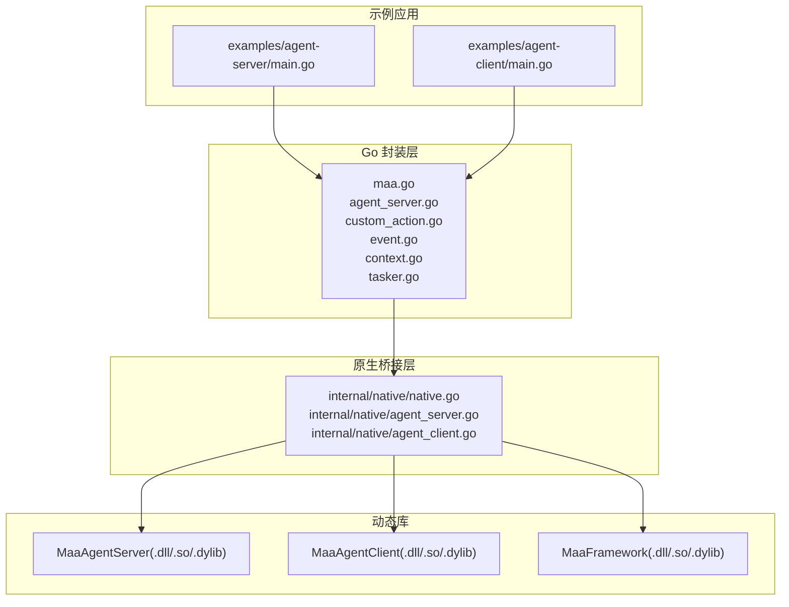
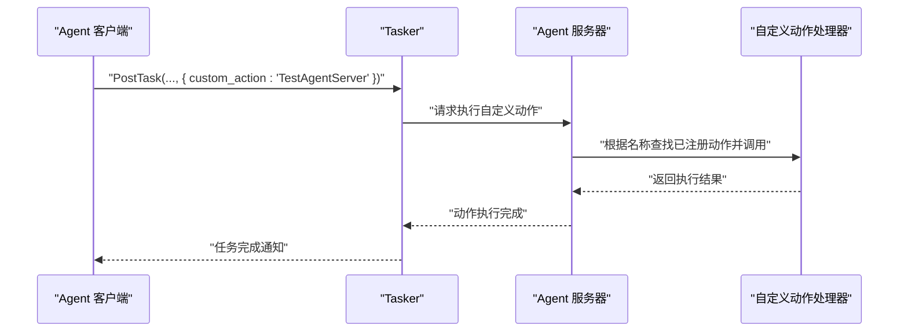
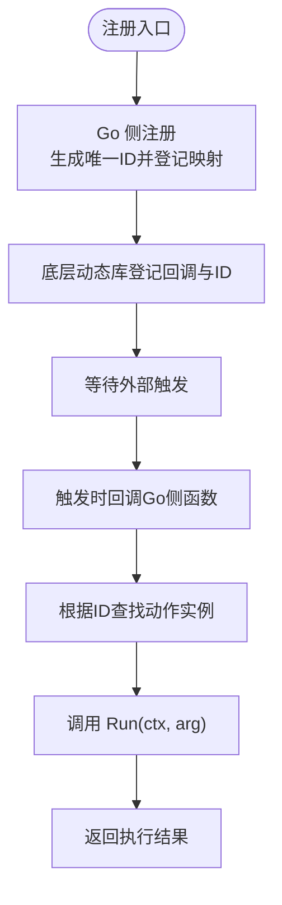
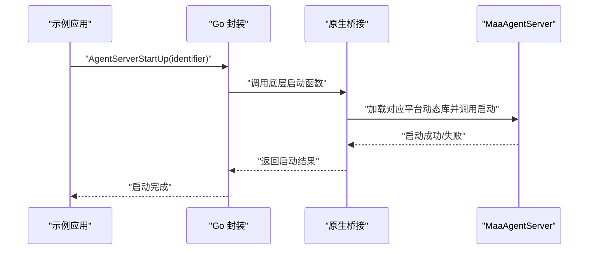
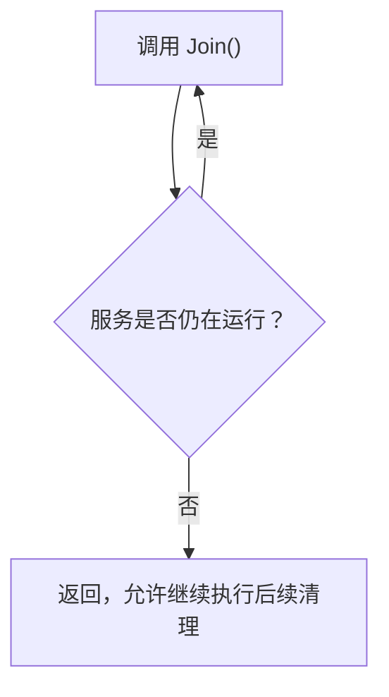
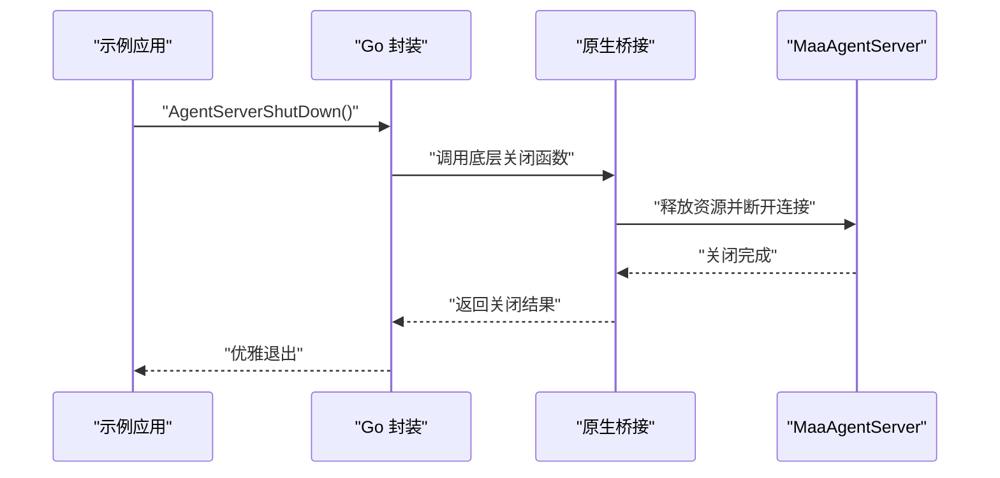
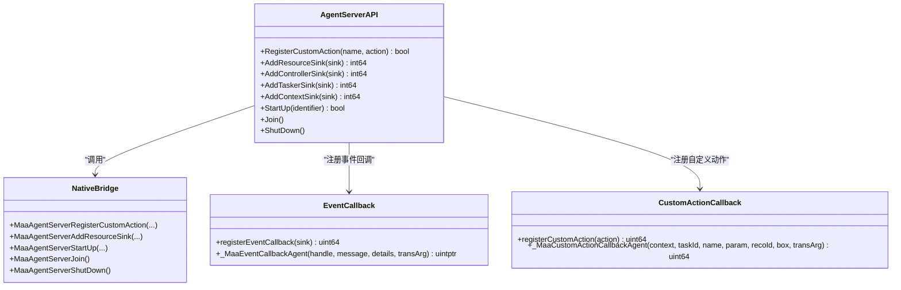
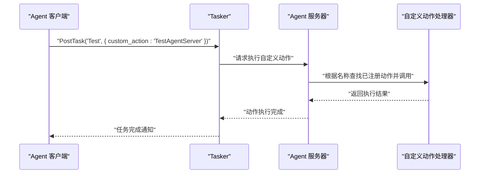
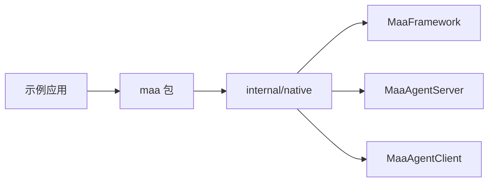

# Agent服务器示例

<cite>
**本文引用的文件**
- [examples/agent-server/main.go](file://examples/agent-server/main.go)
- [examples/agent-client/main.go](file://examples/agent-client/main.go)
- [agent_server.go](file://agent_server.go)
- [internal/native/agent_server.go](file://internal/native/agent_server.go)
- [internal/native/native.go](file://internal/native/native.go)
- [maa.go](file://maa.go)
- [custom_action.go](file://custom_action.go)
- [event.go](file://event.go)
- [agent_client.go](file://agent_client.go)
- [internal/native/agent_client.go](file://internal/native/agent_client.go)
- [context.go](file://context.go)
- [tasker.go](file://tasker.go)
</cite>

## 目录
1. [简介](#简介)
2. [项目结构](#项目结构)
3. [核心组件](#核心组件)
4. [架构总览](#架构总览)
5. [详细组件分析](#详细组件分析)
6. [依赖关系分析](#依赖关系分析)
7. [性能与可扩展性](#性能与可扩展性)
8. [故障排查指南](#故障排查指南)
9. [结论](#结论)
10. [附录：安全与资源隔离建议](#附录安全与资源隔离建议)

## 简介
本文件围绕示例程序 examples/agent-server/main.go 中的 Agent 服务器实现进行深入剖析，重点解释以下关键点：
- 如何通过 AgentServerRegisterCustomAction 注册名为 “TestAgentServer” 的动作处理器；
- AgentServerStartUp 如何启动监听；
- AgentServerJoin 的阻塞等待机制；
- AgentServerShutDown 的优雅关闭；
- 结合 agent_server.go 分析服务器端事件循环与请求分发机制；
- 该模式如何支持跨语言扩展与微服务架构；
- 提供安全考虑（连接验证、资源隔离）建议。

## 项目结构
示例工程包含一个 Agent 服务器示例与一个 Agent 客户端示例，二者通过动态库桥接实现通信。Go 侧通过 maa 包封装调用，底层由 internal/native 层加载对应平台的动态库并注册符号。

图表来源
- [examples/agent-server/main.go](file://examples/agent-server/main.go#L1-L37)
- [examples/agent-client/main.go](file://examples/agent-client/main.go#L1-L56)
- [maa.go](file://maa.go#L1-L211)
- [agent_server.go](file://agent_server.go#L1-L102)
- [internal/native/native.go](file://internal/native/native.go#L1-L40)
- [internal/native/agent_server.go](file://internal/native/agent_server.go#L1-L72)
- [internal/native/agent_client.go](file://internal/native/agent_client.go#L1-L79)

章节来源
- [examples/agent-server/main.go](file://examples/agent-server/main.go#L1-L37)
- [examples/agent-client/main.go](file://examples/agent-client/main.go#L1-L56)
- [maa.go](file://maa.go#L1-L211)
- [internal/native/native.go](file://internal/native/native.go#L1-L40)

## 核心组件
- AgentServer 封装：提供注册自定义动作、添加事件回调、启动/停止、阻塞等待等高层 API。
- 原生桥接：根据运行平台加载对应的动态库并注册符号，将 Go 函数指针传递给 C/C++ 实现。
- 回调注册与分发：Go 侧维护回调映射表，将 C/C++ 回调转换为 Go 接口调用；事件回调按消息类型路由到具体 Sink。
- 自定义动作：通过注册名在流水线中被识别，执行时注入上下文与参数。

章节来源
- [agent_server.go](file://agent_server.go#L1-L102)
- [internal/native/agent_server.go](file://internal/native/agent_server.go#L1-L72)
- [custom_action.go](file://custom_action.go#L1-L92)
- [event.go](file://event.go#L1-L334)

## 架构总览
Agent 服务器示例采用“Go 封装 + 原生桥接 + 动态库”的分层设计。服务器端负责：
- 注册自定义动作处理器；
- 启动监听；
- 阻塞等待服务线程结束；
- 优雅关闭。

客户端负责：
- 绑定资源与控制器；
- 连接服务器；
- 触发任务，其中包含自定义动作名；
- 断开连接。

图表来源
- [examples/agent-client/main.go](file://examples/agent-client/main.go#L1-L56)
- [tasker.go](file://tasker.go#L85-L96)
- [agent_server.go](file://agent_server.go#L22-L33)
- [custom_action.go](file://custom_action.go#L50-L92)

## 详细组件分析

### AgentServerRegisterCustomAction：注册名为 “TestAgentServer” 的动作处理器
- 步骤概览
  - 在示例中，通过 AgentServerRegisterCustomAction(name, action) 完成注册。name 为 “TestAgentServer”，action 为自定义实现。
  - Go 侧会将传入的 CustomAction 实例包装为全局映射表中的唯一 ID，并将该 ID 作为“透传参数”传递给底层动态库。
  - 底层动态库保存回调指针与该 ID，后续触发时再回传给 Go 侧回调函数。
- 关键要点
  - 注册名必须与流水线配置一致，否则无法匹配到目标动作。
  - 回调函数内部会从映射表中取出对应实例并执行 Run(ctx, arg)，然后返回状态码。
  - 示例中 NewAgentServerAction 返回实现了 CustomAction 接口的对象，其 Run 方法打印提示并返回成功。

图表来源
- [agent_server.go](file://agent_server.go#L22-L33)
- [custom_action.go](file://custom_action.go#L16-L24)
- [custom_action.go](file://custom_action.go#L50-L92)
- [examples/agent-server/main.go](file://examples/agent-server/main.go#L13-L21)

章节来源
- [agent_server.go](file://agent_server.go#L22-L33)
- [custom_action.go](file://custom_action.go#L16-L24)
- [custom_action.go](file://custom_action.go#L50-L92)
- [examples/agent-server/main.go](file://examples/agent-server/main.go#L13-L21)

### AgentServerStartUp：启动监听
- 行为说明
  - 调用底层动态库的启动函数，使用传入的标识符（示例中来自命令行参数）建立监听或连接通道。
  - 启动后，服务器进入事件循环，等待客户端请求。
- 平台差异
  - 原生层按操作系统选择对应动态库文件名并加载，确保跨平台可用。

图表来源
- [examples/agent-server/main.go](file://examples/agent-server/main.go#L17-L17)
- [agent_server.go](file://agent_server.go#L83-L86)
- [internal/native/agent_server.go](file://internal/native/agent_server.go#L27-L41)
- [internal/native/agent_server.go](file://internal/native/agent_server.go#L43-L54)

章节来源
- [examples/agent-server/main.go](file://examples/agent-server/main.go#L17-L17)
- [agent_server.go](file://agent_server.go#L83-L86)
- [internal/native/agent_server.go](file://internal/native/agent_server.go#L27-L41)

### AgentServerJoin：阻塞等待机制
- 行为说明
  - AgentServerJoin 会阻塞当前线程，直到服务线程完成或收到退出信号。
  - 该模式适合单线程服务场景，便于统一管理生命周期。
- 与 Detach 的配合
  - 若使用 AgentServerDetach，则服务线程独立运行，不阻塞主线程；此时需自行处理退出信号与资源回收。

图表来源
- [agent_server.go](file://agent_server.go#L93-L96)
- [examples/agent-server/main.go](file://examples/agent-server/main.go#L19-L19)

章节来源
- [agent_server.go](file://agent_server.go#L93-L96)
- [examples/agent-server/main.go](file://examples/agent-server/main.go#L19-L19)

### AgentServerShutDown：优雅关闭
- 行为说明
  - AgentServerShutDown 调用底层动态库的关闭函数，释放资源并断开连接。
  - 通常在 Join 返回后调用，确保所有工作线程已结束。
- 初始化与释放
  - 框架初始化时会加载动态库并注册符号；释放时按相反顺序卸载，避免资源泄漏。

图表来源
- [examples/agent-server/main.go](file://examples/agent-server/main.go#L21-L21)
- [agent_server.go](file://agent_server.go#L88-L91)
- [internal/native/native.go](file://internal/native/native.go#L25-L40)

章节来源
- [examples/agent-server/main.go](file://examples/agent-server/main.go#L21-L21)
- [agent_server.go](file://agent_server.go#L88-L91)
- [internal/native/native.go](file://internal/native/native.go#L25-L40)

### 服务器端事件循环与请求分发机制
- 事件回调注册
  - 通过 AgentServerAddResourceSink/ControllerSink/TaskerSink/ContextSink 等接口，将事件回调注册到底层动态库。
  - Go 侧为每个 Sink 生成唯一 ID，并将其作为透传参数传递给底层回调。
- 回调分发
  - 底层动态库在事件发生时调用 _MaaEventCallbackAgent，Go 侧根据 ID 查找 Sink 并分发到具体实现。
  - 事件类型通过消息字符串前缀判断，分别路由到 Resource、Controller、Tasker、Context 等不同 Sink 类型。
- 自定义动作分发
  - 当流水线触发自定义动作节点时，底层动态库调用 _MaaCustomActionCallbackAgent，Go 侧根据 ID 查找动作实例并执行 Run。

图表来源
- [agent_server.go](file://agent_server.go#L1-L102)
- [internal/native/agent_server.go](file://internal/native/agent_server.go#L14-L25)
- [event.go](file://event.go#L22-L33)
- [event.go](file://event.go#L300-L323)
- [custom_action.go](file://custom_action.go#L16-L24)
- [custom_action.go](file://custom_action.go#L50-L92)

章节来源
- [agent_server.go](file://agent_server.go#L1-L102)
- [internal/native/agent_server.go](file://internal/native/agent_server.go#L14-L25)
- [event.go](file://event.go#L1-L334)
- [custom_action.go](file://custom_action.go#L1-L92)

### 与客户端交互：从触发到执行
- 客户端绑定资源与控制器，连接服务器后，向 Tasker 提交任务，其中包含自定义动作名。
- 服务器侧根据注册名找到对应动作处理器并执行。
- 执行结果通过事件回调反馈给客户端或上层系统。

图表来源
- [examples/agent-client/main.go](file://examples/agent-client/main.go#L1-L56)
- [tasker.go](file://tasker.go#L85-L96)
- [agent_server.go](file://agent_server.go#L22-L33)
- [custom_action.go](file://custom_action.go#L50-L92)

章节来源
- [examples/agent-client/main.go](file://examples/agent-client/main.go#L1-L56)
- [tasker.go](file://tasker.go#L85-L96)

## 依赖关系分析
- 初始化链路
  - maa.Init 加载动态库并注册符号；
  - internal/native/native.go 依次初始化框架、工具集、Agent 服务器与 Agent 客户端；
  - Agent 服务器与 Agent 客户端各自维护平台相关的动态库加载与符号注册。
- 调用链路
  - 示例应用 -> Go 封装 API -> 原生桥接 -> 动态库；
  - 回调链路：动态库回调 -> Go 侧回调函数 -> 映射表查找 -> 具体实现。

图表来源
- [maa.go](file://maa.go#L108-L139)
- [internal/native/native.go](file://internal/native/native.go#L1-L23)
- [internal/native/agent_server.go](file://internal/native/agent_server.go#L27-L41)
- [internal/native/agent_client.go](file://internal/native/agent_client.go#L30-L44)

章节来源
- [maa.go](file://maa.go#L108-L139)
- [internal/native/native.go](file://internal/native/native.go#L1-L23)

## 性能与可扩展性
- 回调映射与锁
  - 回调注册与查找使用原子计数生成 ID，并配合读写锁保护映射表，保证并发安全与低开销。
- 事件分发
  - 事件回调按消息前缀快速分流，减少分支判断成本。
- 跨语言扩展
  - 通过动态库与纯 Go 的回调桥接，可在其他语言中实现相同签名的回调函数，从而扩展 Agent 服务器能力。
- 微服务架构支持
  - 服务器与客户端通过动态库接口解耦，可在进程内或跨进程部署；结合网络通信可进一步扩展为分布式微服务。

[本节为通用指导，无需列出章节来源]

## 故障排查指南
- 未初始化错误
  - 若未先调用 maa.Init，直接调用 Agent 服务器 API 可能导致空指针或未注册符号。
- 注册名不匹配
  - 流水线中指定的 custom_action 名称需与注册时一致，否则无法找到动作处理器。
- 事件回调未生效
  - 确认已正确注册对应类型的事件 Sink，并检查消息前缀是否符合预期。
- 连接问题
  - 客户端连接失败时，检查服务器是否已启动、标识符是否正确、资源与控制器是否绑定成功。

章节来源
- [maa.go](file://maa.go#L108-L139)
- [examples/agent-client/main.go](file://examples/agent-client/main.go#L1-L56)

## 结论
Agent 服务器示例展示了通过 Go 封装 + 原生桥接 + 动态库实现的完整事件驱动与动作执行链路。其关键特性包括：
- 易于注册与发现的自定义动作机制；
- 清晰的启动/阻塞/优雅关闭生命周期管理；
- 基于消息前缀的事件分发与回调映射；
- 良好的跨语言扩展与微服务部署潜力。

[本节为总结，无需列出章节来源]

## 附录：安全与资源隔离建议
- 连接验证
  - 在服务器端对客户端标识符进行白名单校验，拒绝未知标识符接入；
  - 对自定义动作的调用参数进行严格校验与白名单过滤，防止恶意输入。
- 资源隔离
  - 将不同客户端的资源与上下文隔离，避免共享状态污染；
  - 控制器与任务执行应限制在受控线程池中，防止阻塞事件循环。
- 事件与动作的权限控制
  - 对敏感动作设置访问控制列表，仅授权客户端可调用；
  - 记录关键操作日志，便于审计与追踪。
- 超时与重试
  - 为动作执行设置超时阈值，避免长时间阻塞；
  - 对网络异常或资源不可用的情况设计重试策略与熔断机制。

[本节为通用指导，无需列出章节来源]