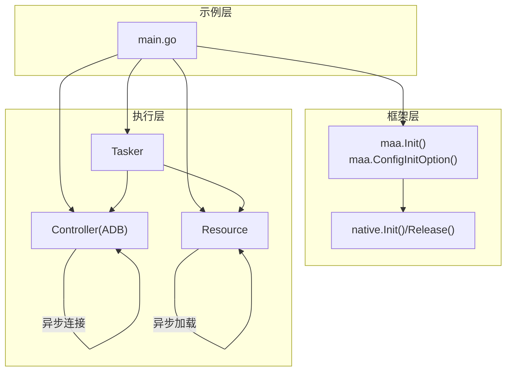
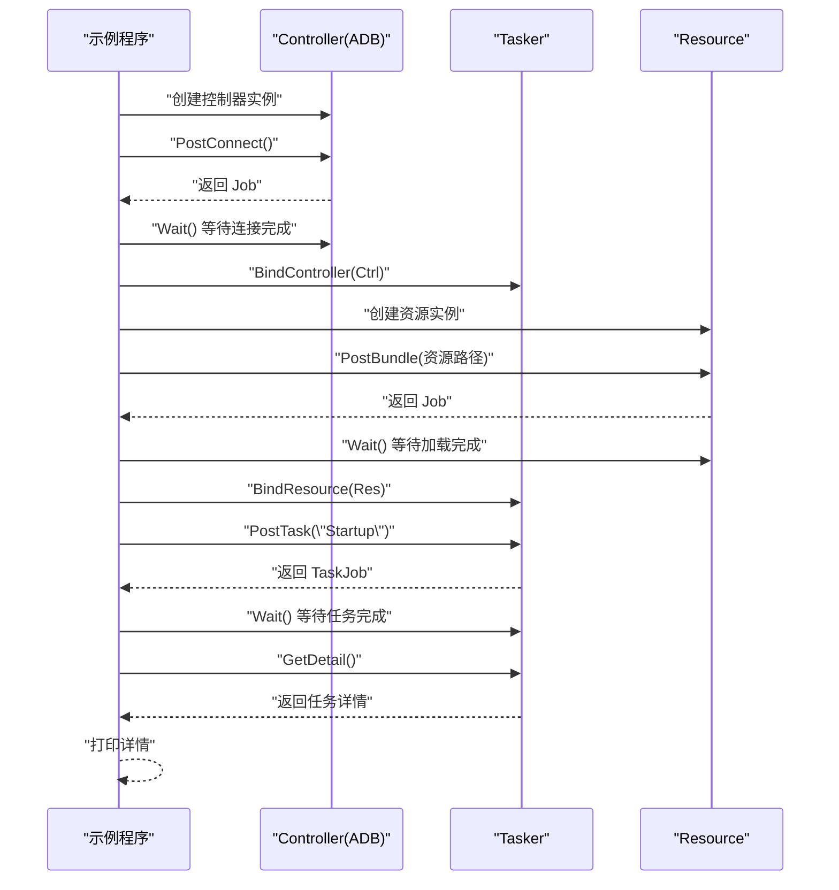
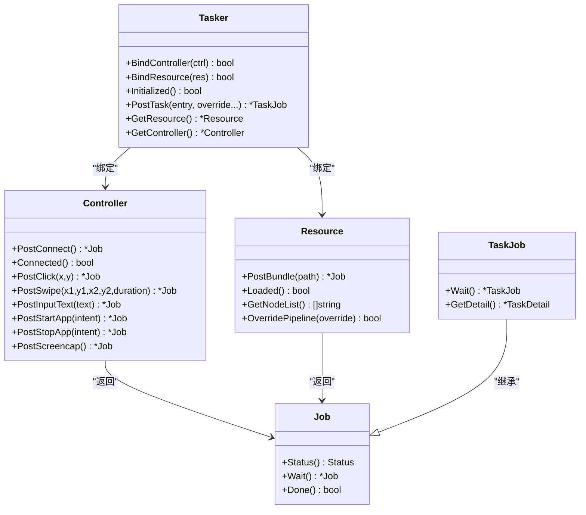
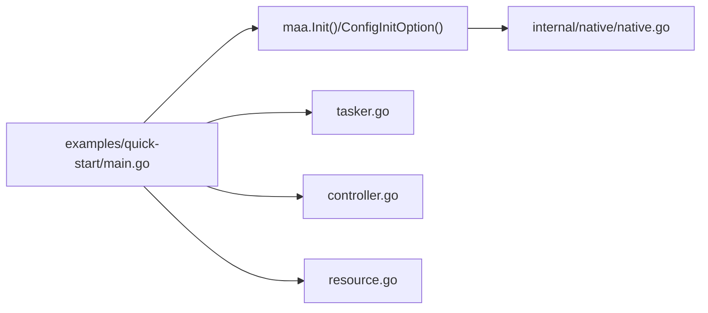

# 快速开始示例

<cite>
**本文引用的文件**
- [examples/quick-start/main.go](file://examples/quick-start/main.go)
- [examples/quick-start/resource/pipeline/pipeline.json](file://examples/quick-start/resource/pipeline/pipeline.json)
- [maa.go](file://maa.go)
- [tasker.go](file://tasker.go)
- [controller.go](file://controller.go)
- [resource.go](file://resource.go)
- [job.go](file://job.go)
- [controller/adb/adb.go](file://controller/adb/adb.go)
- [toolkit.go](file://toolkit.go)
- [internal/native/native.go](file://internal/native/native.go)
</cite>

## 目录
1. [简介](#简介)
2. [项目结构](#项目结构)
3. [核心组件](#核心组件)
4. [架构总览](#架构总览)
5. [详细组件分析](#详细组件分析)
6. [依赖分析](#依赖分析)
7. [性能考虑](#性能考虑)
8. [故障排查指南](#故障排查指南)
9. [结论](#结论)
10. [附录](#附录)

## 简介
本文件对 examples/quick-start/main.go 示例进行逐行解析，帮助初学者理解如何使用 MAA 框架完成以下关键步骤：
- 初始化框架与全局选项
- 创建并绑定 Tasker
- 连接 ADB 控制器（异步连接）
- 加载资源（资源包）
- 执行基础任务（Startup）

同时，本文将解释 Tasker、Controller、Resource 三者之间的绑定关系，说明该示例作为入门模板的价值，并提供常见问题排查建议与优化建议（日志配置、异常处理）。

## 项目结构
该示例位于 examples/quick-start，包含一个可运行的 main.go 以及一个最小化的资源管道定义 pipeline.json。其核心调用链如下图所示：

```mermaid
graph TB
A["示例程序 main.go"] --> B["初始化框架<br/>maa.Init()"]
A --> C["配置初始化选项<br/>maa.ConfigInitOption()"]
A --> D["创建 Tasker<br/>maa.NewTasker()"]
A --> E["查找 ADB 设备<br/>maa.FindAdbDevices()"]
A --> F["创建 ADB 控制器<br/>maa.NewAdbController(...)"]
A --> G["异步连接控制器<br/>ctrl.PostConnect().Wait()"]
A --> H["绑定控制器到 Tasker<br/>tasker.BindController(ctrl)"]
A --> I["创建资源对象<br/>maa.NewResource()"]
A --> J["加载资源包<br/>res.PostBundle(\"./resource\").Wait()"]
A --> K["绑定资源到 Tasker<br/>tasker.BindResource(res)"]
A --> L["检查初始化状态<br/>tasker.Initialized()"]
A --> M["提交任务 Startup<br/>tasker.PostTask(\"Startup\").Wait().GetDetail()"]
```

图表来源
- [examples/quick-start/main.go](file://examples/quick-start/main.go#L1-L41)
- [maa.go](file://maa.go#L108-L139)
- [tasker.go](file://tasker.go#L17-L32)
- [controller.go](file://controller.go#L28-L52)
- [resource.go](file://resource.go#L17-L35)
- [job.go](file://job.go#L58-L96)

章节来源
- [examples/quick-start/main.go](file://examples/quick-start/main.go#L1-L41)

## 核心组件
- 框架初始化与全局选项
  - 初始化：调用初始化函数以加载底层动态库并注册相关函数，必须在其他 MAA 调用之前执行。
  - 全局选项：通过选项函数设置日志目录、保存绘图、标准输出日志级别、调试模式、插件路径等。
- Tasker
  - 任务执行器，负责接收任务、调度节点、返回任务详情。
  - 支持绑定 Controller 与 Resource，支持事件回调 Sink。
- Controller（ADB）
  - 通过 ADB 连接设备，提供截图、输入、应用控制等操作。
  - 提供异步连接方法，返回 Job 并可通过 Wait 阻塞等待完成。
- Resource
  - 资源管理器，负责加载资源包、覆盖管线、查询节点信息等。
  - 提供异步加载方法，返回 Job 并可通过 Wait 阻塞等待完成。
- Job/TaskJob
  - 异步作业抽象，提供状态查询与阻塞等待；TaskJob 增加任务详情获取能力。

章节来源
- [maa.go](file://maa.go#L108-L210)
- [tasker.go](file://tasker.go#L17-L120)
- [controller.go](file://controller.go#L28-L161)
- [resource.go](file://resource.go#L17-L120)
- [job.go](file://job.go#L1-L96)

## 架构总览
下图展示了示例中各组件之间的交互关系与数据流：



图表来源
- [examples/quick-start/main.go](file://examples/quick-start/main.go#L1-L41)
- [maa.go](file://maa.go#L108-L139)
- [internal/native/native.go](file://internal/native/native.go#L5-L23)
- [tasker.go](file://tasker.go#L50-L60)
- [controller.go](file://controller.go#L157-L161)
- [resource.go](file://resource.go#L212-L218)

## 详细组件分析

### 初始化流程与全局选项
- 初始化入口
  - 在示例中，先调用初始化函数加载底层库并注册函数，随后设置初始化选项（日志目录、保存绘图、标准输出级别、调试模式、插件路径等），最后标记框架已初始化。
- 初始化选项函数
  - 提供多种选项函数用于设置库目录、日志目录、是否保存绘图、标准输出日志级别、调试模式、插件路径等。
- 全局选项设置
  - 将选项值传递给底层全局选项接口，确保后续行为符合预期。

章节来源
- [maa.go](file://maa.go#L108-L210)
- [internal/native/native.go](file://internal/native/native.go#L5-L23)

### Tasker 的创建与绑定
- 创建 Tasker
  - 通过工厂函数创建 Tasker 实例，并在内部维护回调映射表，便于事件回调的注册与注销。
- 绑定 Controller 与 Resource
  - Tasker 需要绑定已初始化的 Controller 与 Resource 才能正常工作；绑定后可执行任务并获取任务详情。
- 初始化状态检查
  - 在提交任务前检查 Tasker 是否已初始化，避免未绑定导致的失败。

章节来源
- [tasker.go](file://tasker.go#L17-L60)
- [tasker.go](file://tasker.go#L50-L60)
- [tasker.go](file://tasker.go#L60-L64)

### ADB 控制器的创建与异步连接
- 设备发现
  - 使用工具函数查找可用的 ADB 设备，返回包含 ADB 路径、地址、截图与输入方法、配置等信息的设备列表。
- 创建 ADB 控制器
  - 通过构造函数传入设备信息与代理二进制路径，创建控制器实例。
- 异步连接
  - 调用异步连接方法返回 Job，通过 Wait 阻塞直到连接完成；连接成功后可进行截图、输入、应用控制等操作。
- 输入/截图方法
  - 控制器提供点击、滑动、按键、文本输入、启动/停止应用、触控、滚动、截图等操作，均以异步方式返回 Job。

章节来源
- [toolkit.go](file://toolkit.go#L32-L66)
- [controller.go](file://controller.go#L28-L52)
- [controller.go](file://controller.go#L157-L161)
- [controller.go](file://controller.go#L163-L237)
- [controller/adb/adb.go](file://controller/adb/adb.go#L1-L170)

### 资源加载与任务提交
- 创建资源对象
  - 工厂函数创建资源实例，并维护自定义识别/动作回调映射表。
- 加载资源包
  - 通过异步加载方法添加资源包路径，返回 Job 并 Wait 等待完成；完成后可查询节点列表、覆盖管线等。
- 绑定资源到 Tasker
  - 将已加载的资源绑定到 Tasker，使其具备执行任务所需的资源。
- 提交任务
  - 通过 Tasker 提交任务名称（示例为 Startup），返回 TaskJob；Wait 等待完成后获取任务详情并打印。

章节来源
- [resource.go](file://resource.go#L17-L35)
- [resource.go](file://resource.go#L212-L218)
- [tasker.go](file://tasker.go#L85-L96)
- [job.go](file://job.go#L66-L96)

### 逐行解析与作用说明
- 第 1 行：导入 fmt、os 与 MAA 包。
- 第 11 行：初始化框架，加载底层库并注册函数。
- 第 12 行：配置初始化选项（用户路径与默认 JSON），用于工具集初始化。
- 第 13 行：创建 Tasker 实例。
- 第 14 行：defer 在退出时销毁 Tasker，释放资源。
- 第 16 行：查找第一个可用的 ADB 设备。
- 第 17-24 行：使用设备信息创建 ADB 控制器，参数包括 ADB 路径、设备地址、截图方法、输入方法、配置、代理二进制路径。
- 第 25 行：defer 在退出时销毁控制器。
- 第 26 行：异步发起连接，Wait 阻塞直到连接完成。
- 第 27 行：将控制器绑定到 Tasker。
- 第 29 行：创建资源对象。
- 第 30 行：defer 在退出时销毁资源。
- 第 31 行：异步加载资源包路径，Wait 阻塞直到加载完成。
- 第 32 行：将资源绑定到 Tasker。
- 第 33-36 行：检查 Tasker 初始化状态，若未初始化则输出错误并退出。
- 第 38 行：提交名为 Startup 的任务，Wait 等待完成。
- 第 39 行：获取任务详情并打印。

章节来源
- [examples/quick-start/main.go](file://examples/quick-start/main.go#L1-L41)

### 关键流程时序图：异步连接与任务提交


图表来源
- [controller.go](file://controller.go#L157-L161)
- [resource.go](file://resource.go#L212-L218)
- [tasker.go](file://tasker.go#L85-L96)
- [job.go](file://job.go#L58-L96)
- [examples/quick-start/main.go](file://examples/quick-start/main.go#L1-L41)

### 类关系图：核心对象与职责


图表来源
- [tasker.go](file://tasker.go#L50-L120)
- [controller.go](file://controller.go#L157-L237)
- [resource.go](file://resource.go#L212-L286)
- [job.go](file://job.go#L1-L96)

## 依赖分析
- 组件耦合
  - Tasker 依赖 Controller 与 Resource；Controller 与 Resource 分别依赖底层原生接口。
  - 示例程序直接依赖 Tasker、Controller、Resource 的公共 API。
- 外部依赖
  - 通过 native 层加载动态库并注册函数，再由上层封装调用。
- 可能的循环依赖
  - 当前结构清晰，无明显循环依赖迹象。



图表来源
- [examples/quick-start/main.go](file://examples/quick-start/main.go#L1-L41)
- [maa.go](file://maa.go#L108-L139)
- [internal/native/native.go](file://internal/native/native.go#L5-L23)

章节来源
- [examples/quick-start/main.go](file://examples/quick-start/main.go#L1-L41)
- [maa.go](file://maa.go#L108-L139)
- [internal/native/native.go](file://internal/native/native.go#L5-L23)

## 性能考虑
- 日志与调试
  - 合理设置日志目录与标准输出级别，避免在生产环境输出过多日志。
  - 调试模式会增加额外开销，仅在开发阶段启用。
- 资源加载
  - 资源包加载为异步操作，建议在连接设备后尽早触发加载，减少任务执行时的等待时间。
- 截图与输入
  - 控制器的截图与输入方法均为异步，应避免在同一时间大量并发请求，以免造成设备端压力。
- 插件加载
  - 插件路径应在初始化阶段配置，避免运行时频繁切换。

[本节为通用建议，不涉及具体文件分析]

## 故障排查指南
- 设备未识别
  - 确认 ADB 已正确安装且设备处于允许调试状态。
  - 使用设备发现函数检查设备列表是否为空或包含目标设备。
  - 若设备列表为空，检查 ADB 路径与设备地址配置。
- 资源路径错误
  - 确认资源包路径存在且可读，加载资源包时使用相对或绝对路径均可。
  - 若加载失败，检查资源包内节点定义是否正确。
- 连接失败
  - 异步连接返回 Job，需调用 Wait 等待完成；若长时间未完成，检查设备网络、ADB 服务与代理二进制路径。
- 任务未执行
  - 确认 Tasker 已绑定 Controller 与 Resource，且初始化状态为已初始化。
  - 检查任务名称是否与资源包中的节点一致（示例为 Startup）。
- 日志定位
  - 设置日志目录与标准输出级别，观察连接、加载、任务执行过程中的日志输出，有助于快速定位问题。

章节来源
- [toolkit.go](file://toolkit.go#L32-L66)
- [controller.go](file://controller.go#L157-L161)
- [resource.go](file://resource.go#L212-L218)
- [tasker.go](file://tasker.go#L60-L64)
- [examples/quick-start/resource/pipeline/pipeline.json](file://examples/quick-start/resource/pipeline/pipeline.json#L1-L5)

## 结论
该快速开始示例完整演示了 MAA 框架从初始化到任务执行的关键流程：初始化框架与全局选项、创建并绑定 Tasker、连接 ADB 控制器（异步）、加载资源包、提交并执行任务。通过该示例，读者可以快速掌握 Tasker、Controller、Resource 三者的绑定关系与协作方式，作为进一步扩展功能（如自定义识别/动作、事件回调、资源覆盖等）的入门模板。

[本节为总结性内容，不涉及具体文件分析]

## 附录
- 示例资源定义
  - 示例中使用了一个最小化的资源管道定义，包含一个名为 Startup 的节点，其动作类型为启动应用。
- 最佳实践
  - 在初始化阶段统一配置日志与调试选项。
  - 使用异步 API 并合理等待，避免阻塞主线程。
  - 对外暴露的资源与控制器在退出时及时销毁，防止资源泄漏。

章节来源
- [examples/quick-start/resource/pipeline/pipeline.json](file://examples/quick-start/resource/pipeline/pipeline.json#L1-L5)