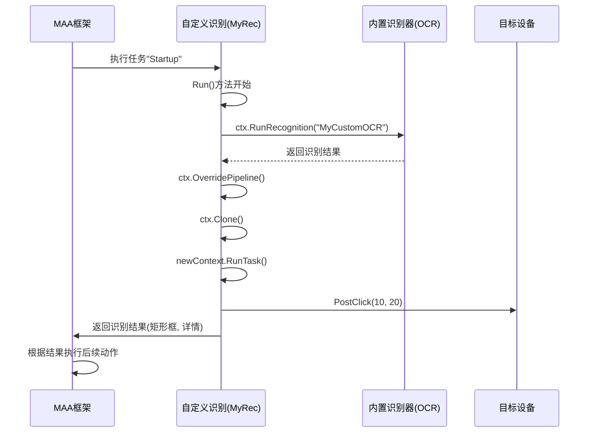
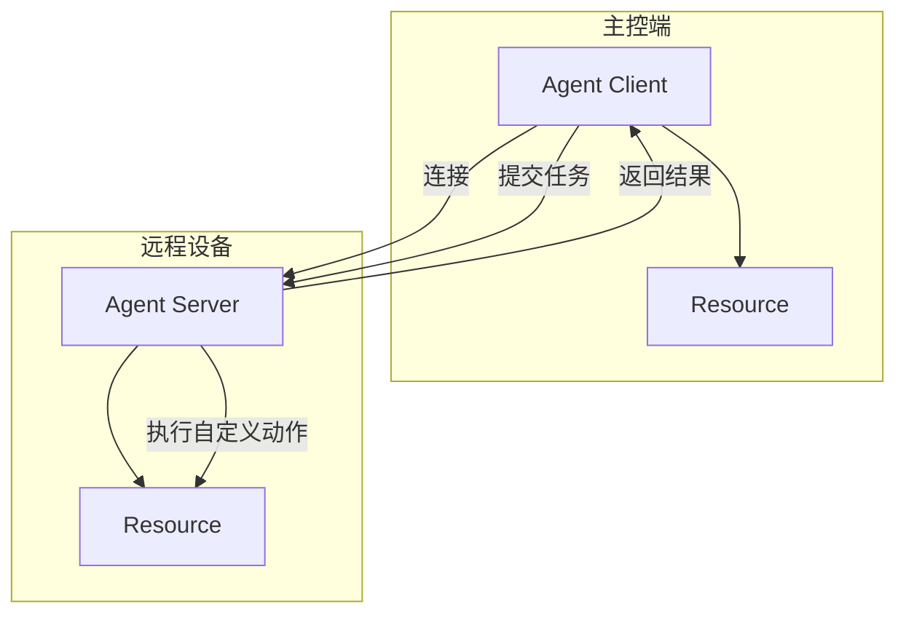

# 示例与用例

<cite>
**本文档中引用的文件**  
- [quick-start/main.go](file://examples/quick-start/main.go)
- [quick-start/resource/pipeline/pipeline.json](file://examples/quick-start/resource/pipeline/pipeline.json)
- [custom-action/main.go](file://examples/custom-action/main.go)
- [custom-action/resource/pipeline/pipeline.json](file://examples/custom-action/resource/pipeline/pipeline.json)
- [custom-recognition/main.go](file://examples/custom-recognition/main.go)
- [custom-recognition/resource/pipeline/pipeline.json](file://examples/custom-recognition/resource/pipeline/pipeline.json)
- [agent-client/main.go](file://examples/agent-client/main.go)
- [agent-server/main.go](file://examples/agent-server/main.go)
- [maa.go](file://maa.go)
- [context.go](file://context.go)
- [custom_action.go](file://custom_action.go)
- [custom_recognition.go](file://custom_recognition.go)
- [agent_client.go](file://agent_client.go)
- [agent_server.go](file://agent_server.go)
</cite>

## 目录
1. [简介](#简介)
2. [快速入门示例](#快速入门示例)
3. [自定义动作示例](#自定义动作示例)
4. [自定义识别示例](#自定义识别示例)
5. [Agent 客户端与服务端示例](#agent-客户端与服务端示例)
6. [实际应用场景扩展](#实际应用场景扩展)
7. [最佳实践与建议](#最佳实践与建议)
8. [结论](#结论)

## 简介
本文档旨在深入解析 `maa-framework-go` 项目中 `examples` 目录下的五个核心示例：`quick-start`、`custom-action`、`custom-recognition`、`agent-client` 和 `agent-server`。通过对每个示例的逐行代码逻辑分析，揭示其设计目的与实现机制，并将其扩展为实用的开发教程和真实用例。文档不仅说明“如何做”，更解释“为什么这样做”，帮助开发者理解框架的核心概念，如任务调度、资源绑定、自定义动作与识别、分布式通信等，从而将这些模式灵活应用于自己的自动化项目中。

## 快速入门示例

该示例展示了如何使用 MAA 框架快速启动一个基本的自动化流程。代码从初始化框架开始，创建任务器（Tasker），连接 ADB 设备，加载资源，并执行一个名为 "Startup" 的预定义任务。

其核心流程包括：调用 `maa.Init()` 初始化框架，使用 `NewTasker()` 创建任务管理器，通过 `FindAdbDevices()` 发现设备并创建 `AdbController` 进行设备控制，加载本地资源包（Resource Bundle），最后通过 `PostTask("Startup")` 异步提交任务并等待执行结果。资源文件 `pipeline.json` 定义了 "Startup" 任务的具体行为为 `StartApp`，即启动应用。

此示例是所有更复杂应用的基础，它确立了框架使用的基本模板：初始化 -> 创建控制器 -> 创建资源 -> 绑定 -> 执行任务。

**Section sources**
- [quick-start/main.go](file://examples/quick-start/main.go#L1-L41)
- [quick-start/resource/pipeline/pipeline.json](file://examples/quick-start/resource/pipeline/pipeline.json#L1-L5)
- [maa.go](file://maa.go#L108-L137)

## 自定义动作示例

此示例在快速入门的基础上，演示了如何向框架注册一个自定义的动作（Custom Action）。开发者可以实现 `CustomAction` 接口，定义自己的业务逻辑。

代码中定义了一个名为 `MyAct` 的结构体，并实现了 `Run` 方法。在 `main` 函数中，通过 `res.RegisterCustomAction("MyAct", &MyAct{})` 将其实例注册到资源中，注册名称为 "MyAct"。随后，`pipeline.json` 文件将 "Startup" 任务的动作类型设置为 `Custom`，并指定 `custom_action` 为 "MyAct"。当任务执行到此步骤时，框架会回调 `MyAct.Run` 方法。

`Run` 方法接收一个 `*Context` 和 `*CustomActionArg` 参数，允许开发者访问当前执行上下文和任务详情。此机制提供了极大的灵活性，使开发者可以在自动化流程中插入任意的 Go 代码，如数据处理、外部 API 调用或复杂的条件判断。

**Section sources**
- [custom-action/main.go](file://examples/custom-action/main.go#L1-L49)
- [custom-action/resource/pipeline/pipeline.json](file://examples/custom-action/resource/pipeline/pipeline.json#L1-L6)
- [custom_action.go](file://custom_action.go#L46-L48)
- [context.go](file://context.go#L205-L208)

## 自定义识别示例

此示例展示了如何实现一个自定义的识别逻辑（Custom Recognition），用于处理标准识别方式（如模板匹配、OCR）无法满足的场景。

代码中定义了 `MyRec` 结构体并实现了 `CustomRecognition` 接口的 `Run` 方法。该方法接收图像（`arg.Img`）和感兴趣区域（ROI）等参数，并返回一个包含识别结果（矩形框和详情）的 `*CustomRecognitionResult`。

示例中的 `Run` 方法展示了 `Context` 的强大功能：
- **嵌套识别**：通过 `ctx.RunRecognition` 调用框架内置的 "MyCustomOCR" 识别器。
- **动态覆盖**：使用 `ctx.OverridePipeline` 动态修改识别流程的参数，如 ROI。
- **上下文克隆**：通过 `ctx.Clone()` 创建新的上下文实例，避免影响主流程。
- **执行任务**：使用 `newContext.RunTask` 在新上下文中执行其他任务。
- **控制流程**：调用 `ctx.OverrideNext` 动态修改后续任务的执行顺序。
- **设备交互**：通过 `ctx.GetTasker().GetController().PostClick` 发送点击指令。

`pipeline.json` 文件将 "Startup" 任务的识别方式设置为 `Custom`，并指向 "MyRec"，从而触发自定义识别逻辑。

**Diagram sources**
- [custom-recognition/main.go](file://examples/custom-recognition/main.go#L46-L76)
- [context.go](file://context.go#L56-L92)

**Section sources**
- [custom-recognition/main.go](file://examples/custom-recognition/main.go#L1-L77)
- [custom-recognition/resource/pipeline/pipeline.json](file://examples/custom-recognition/resource/pipeline/pipeline.json#L1-L12)
- [custom_recognition.go](file://custom_recognition.go#L52-L54)

## Agent 客户端与服务端示例

这两个示例共同演示了 MAA 框架的分布式能力。`agent-server` 运行在远程设备上，提供自定义动作的执行能力；`agent-client` 运行在主控端，负责任务的调度和协调。

在 `agent-server` 示例中，程序通过 `os.Args[1]` 接收一个 socket ID，调用 `AgentServerRegisterCustomAction` 注册名为 "TestAgentServer" 的自定义动作，并通过 `AgentServerStartUp` 启动服务。服务启动后，它会进入等待状态（`AgentServerJoin`），直到收到客户端的请求。

在 `agent-client` 示例中，程序创建一个 `AgentClient` 实例，连接到指定的 socket ID。它不直接创建控制器或资源，而是通过 `client.BindResource(res)` 将资源绑定到客户端。当客户端提交一个任务，且该任务的动作是 `Custom` 并指向远程注册的动作名（如 "TestAgentServer"）时，框架会自动将执行请求转发给 `agent-server`。服务端执行完自定义动作后，将结果返回给客户端。

这种架构实现了计算与控制的分离，适用于需要在多台设备上集中管理自动化任务的场景。

**Diagram sources**
- [agent-client/main.go](file://examples/agent-client/main.go#L1-L56)
- [agent-server/main.go](file://examples/agent-server/main.go#L1-L37)
- [agent_client.go](file://agent_client.go#L14-L29)
- [agent_server.go](file://agent_server.go#L23-L33)

**Section sources**
- [agent-client/main.go](file://examples/agent-client/main.go#L1-L56)
- [agent-server/main.go](file://examples/agent-server/main.go#L1-L37)
- [agent_client.go](file://agent_client.go#L1-L112)
- [agent_server.go](file://agent_server.go#L1-L102)

## 实际应用场景扩展

### 如何实现一个简单的游戏自动化脚本
基于 `quick-start` 示例，可以轻松构建游戏自动化脚本。首先，通过 ADB 连接手机，确保游戏应用的包名和活动名已知。在 `pipeline.json` 中定义一系列任务，如 `Login`（登录）、`DailyCheckIn`（每日签到）、`FarmResources`（资源采集）。每个任务可以配置为 `Click` 动作，指定屏幕坐标，或使用 `TemplateMatch` 进行图像识别。通过 `PostTask` 按顺序执行这些任务，即可实现全自动的日常任务处理。

### 如何集成OCR进行文本识别
`custom-recognition` 示例为此提供了基础。开发者可以集成第三方 OCR 库（如 Tesseract 或 PaddleOCR）。在 `CustomRecognition.Run` 方法中，接收框架传入的图像，调用 OCR 库进行识别，将结果与预期文本（如 `arg.CustomRecognitionParam`）进行比对。如果匹配，则返回识别到的矩形区域，框架将在此区域执行后续动作（如点击）。这使得脚本能够根据屏幕上的动态文本做出决策。

### 如何构建一个分布式的自动化系统
`agent-client` 和 `agent-server` 示例是构建分布式系统的核心。设想一个场景：一台中央服务器（运行 `agent-client`）管理着多台手机（每台运行 `agent-server`）。中央服务器可以：
1.  维护一个全局的任务队列。
2.  根据每台手机的状态（空闲/忙碌）动态分配任务。
3.  将需要特定设备能力（如特定型号手机）的任务定向发送。
4.  收集所有设备的执行日志进行统一分析。
通过这种方式，可以实现大规模、高可用的自动化集群。

## 最佳实践与建议

- **资源管理**：始终使用 `defer resource.Destroy()` 确保资源被正确释放，避免内存泄漏。
- **错误处理**：在生产环境中，应检查 `Initialized()` 和各种 `Post` 操作的返回值，实现健壮的错误处理和重试机制。
- **配置初始化**：利用 `maa.Init` 的 `InitOption` 函数式选项，可以精确控制日志目录、日志级别和调试模式，便于问题排查。
- **自定义动作的幂等性**：设计自定义动作时，尽量使其具有幂等性，即多次执行不会产生副作用，这有助于在任务失败时安全地重试。
- **性能考量**：频繁的 `OverridePipeline` 和 `Clone` 操作可能带来性能开销，应在必要时使用，并进行性能测试。

## 结论
通过对 `maa-framework-go` 中五个核心示例的深入分析，我们不仅掌握了框架的基本使用方法，还理解了其扩展机制和分布式架构的设计精髓。从简单的任务执行到复杂的自定义逻辑，再到跨设备的协同工作，MAA 框架为开发者提供了一套强大而灵活的工具。开发者应基于这些基础示例，结合自身需求，不断探索和实践，以构建出高效、可靠的自动化解决方案。