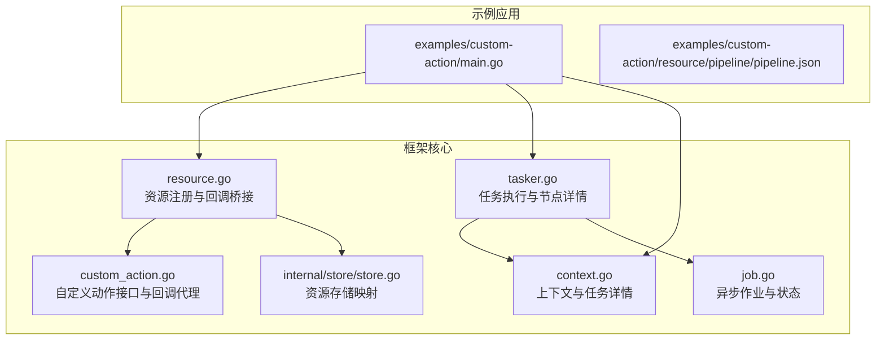
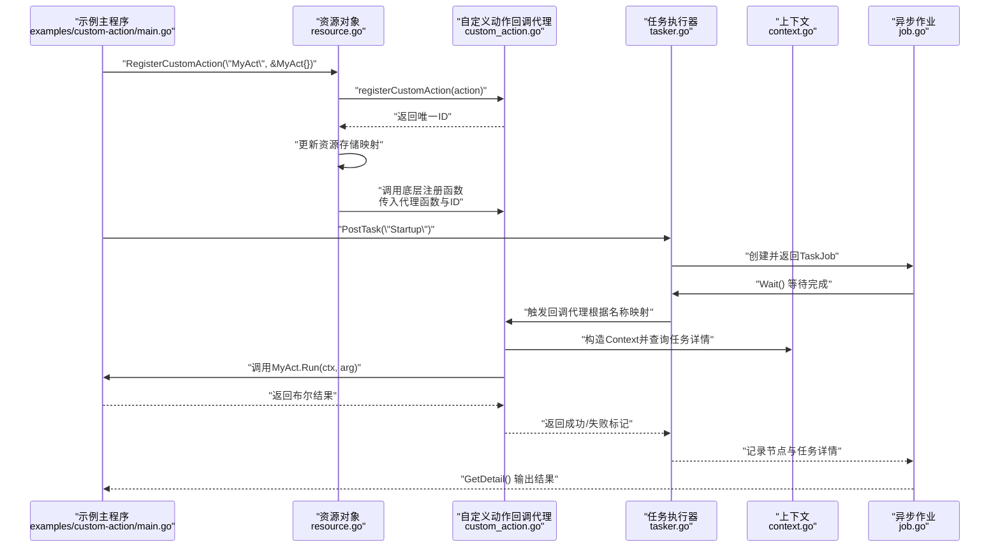
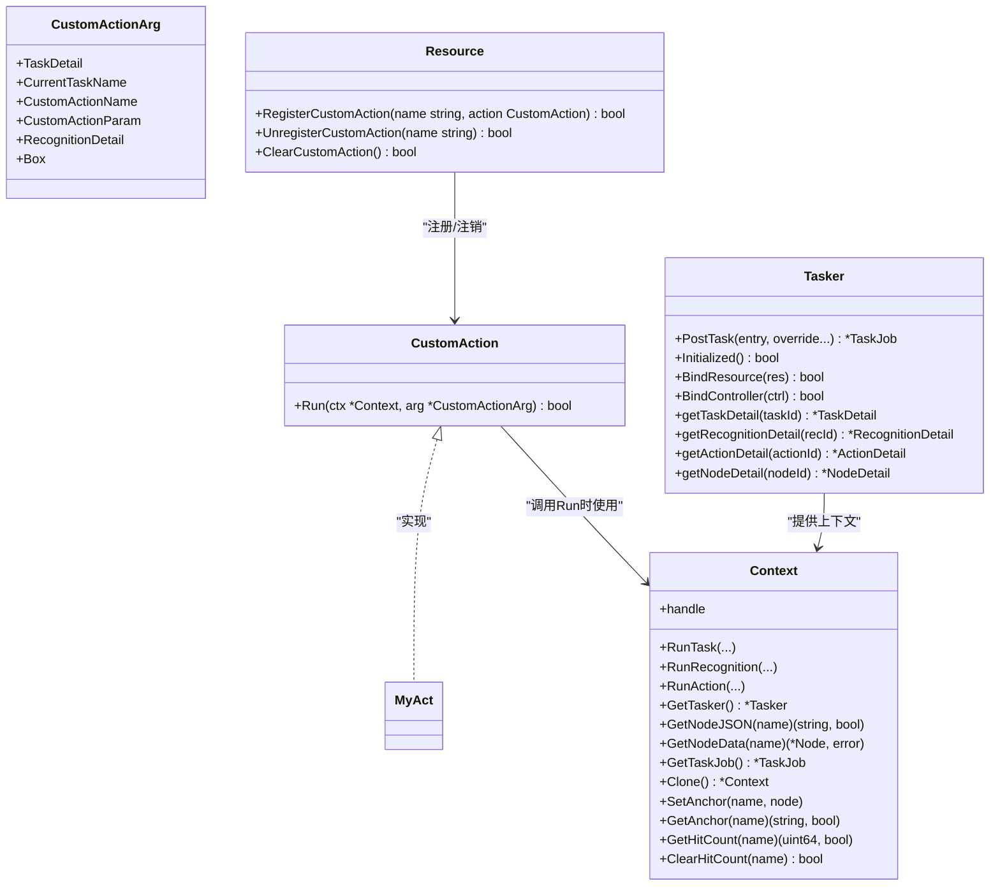
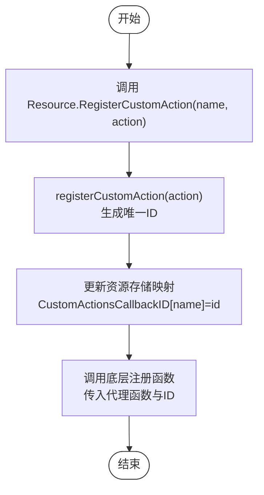
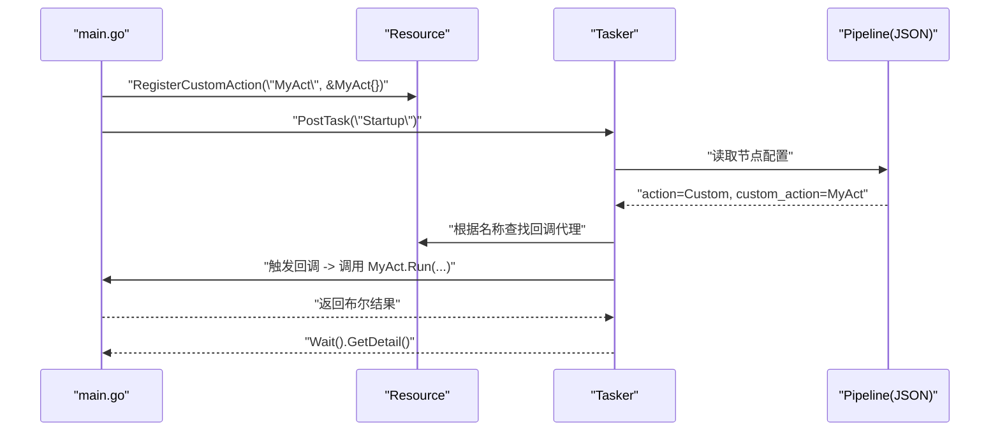
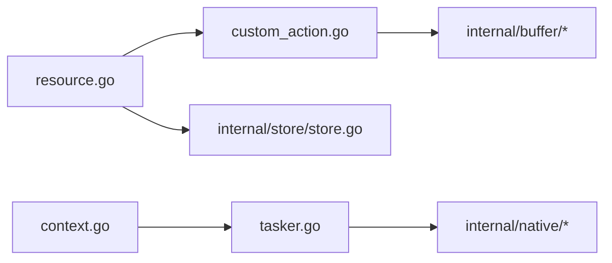

# 自定义动作示例

<cite>
**本文引用的文件**
- [examples/custom-action/main.go](file://examples/custom-action/main.go)
- [custom_action.go](file://custom_action.go)
- [resource.go](file://resource.go)
- [context.go](file://context.go)
- [tasker.go](file://tasker.go)
- [job.go](file://job.go)
- [examples/custom-action/resource/pipeline/pipeline.json](file://examples/custom-action/resource/pipeline/pipeline.json)
- [internal/store/store.go](file://internal/store/store.go)
</cite>

## 目录
1. [简介](#简介)
2. [项目结构](#项目结构)
3. [核心组件](#核心组件)
4. [架构总览](#架构总览)
5. [详细组件分析](#详细组件分析)
6. [依赖关系分析](#依赖关系分析)
7. [性能考量](#性能考量)
8. [故障排查指南](#故障排查指南)
9. [结论](#结论)
10. [附录](#附录)

## 简介
本文件围绕 examples/custom-action 示例，深入解析“自定义动作”的实现机制与调用流程。重点说明：
- 如何通过 Resource.RegisterCustomAction 注册名为 “MyAct” 的自定义动作；
- MyAct 结构体如何实现 CustomAction 接口的 Run 方法；
- CustomAction 的调用时机与上下文传递机制；
- 该模式在扩展框架能力方面的价值（复杂业务逻辑、第三方服务集成）；
- 实际应用场景（如游戏中执行特殊操作）及常见错误（方法签名不匹配、返回值处理不当等）。

## 项目结构
该示例位于 examples/custom-action，包含一个最小可运行的主程序与对应的资源管道配置。核心代码分布在框架层的自定义动作接口、资源绑定与回调代理、任务执行与上下文等模块中。

图表来源
- [examples/custom-action/main.go](file://examples/custom-action/main.go#L1-L49)
- [custom_action.go](file://custom_action.go#L1-L92)
- [resource.go](file://resource.go#L163-L182)
- [context.go](file://context.go#L1-L240)
- [tasker.go](file://tasker.go#L1-L433)
- [job.go](file://job.go#L1-L96)
- [internal/store/store.go](file://internal/store/store.go#L1-L65)

章节来源
- [examples/custom-action/main.go](file://examples/custom-action/main.go#L1-L49)
- [examples/custom-action/resource/pipeline/pipeline.json](file://examples/custom-action/resource/pipeline/pipeline.json#L1-L6)

## 核心组件
- 自定义动作接口与回调代理：定义 CustomAction 接口与回调代理函数，负责将底层回调转换为 Go 层的接口调用，并传递上下文与参数。
- 资源注册与桥接：Resource.RegisterCustomAction 将自定义动作注册到资源，并建立从名称到回调代理的映射，同时将代理函数与唯一标识传给底层。
- 上下文与任务详情：Context 提供任务执行上下文，Tasker 提供任务、识别、动作的详细信息查询。
- 异步作业：Job/TaskJob 封装任务执行的异步状态与结果获取。

章节来源
- [custom_action.go](file://custom_action.go#L1-L92)
- [resource.go](file://resource.go#L163-L182)
- [context.go](file://context.go#L1-L240)
- [tasker.go](file://tasker.go#L1-L433)
- [job.go](file://job.go#L1-L96)

## 架构总览
下面的时序图展示了从示例主程序注册自定义动作，到任务执行触发回调并返回结果的完整链路。

图表来源
- [examples/custom-action/main.go](file://examples/custom-action/main.go#L38-L42)
- [resource.go](file://resource.go#L163-L182)
- [custom_action.go](file://custom_action.go#L16-L24)
- [custom_action.go](file://custom_action.go#L50-L91)
- [tasker.go](file://tasker.go#L85-L112)
- [context.go](file://context.go#L197-L209)
- [job.go](file://job.go#L58-L96)

## 详细组件分析

### 自定义动作接口与回调代理
- 接口定义：CustomAction 定义 Run(ctx, arg) bool，要求实现者在 Run 中完成具体动作逻辑并返回是否成功。
- 回调代理：_MaaCustomActionCallbackAgent 负责从底层回调中提取参数，构造 Context 与 CustomActionArg，然后调用用户实现的 Run，并将布尔结果转回底层。
- 注册与注销：registerCustomAction 生成唯一ID并保存到全局映射；unregisterCustomAction 用于清理。

图表来源
- [custom_action.go](file://custom_action.go#L37-L48)
- [custom_action.go](file://custom_action.go#L50-L91)
- [context.go](file://context.go#L1-L240)
- [tasker.go](file://tasker.go#L1-L433)
- [resource.go](file://resource.go#L163-L182)

章节来源
- [custom_action.go](file://custom_action.go#L1-L92)
- [context.go](file://context.go#L1-L240)
- [tasker.go](file://tasker.go#L1-L433)
- [resource.go](file://resource.go#L163-L182)

### 资源注册与回调桥接
- Resource.RegisterCustomAction：
  - 调用 registerCustomAction 获取唯一ID；
  - 更新资源存储映射（ResStore），将名称映射到ID；
  - 调用底层注册函数，传入代理函数与ID（以指针形式传递ID）。
- 资源存储映射：
  - ResStoreValue 中维护 CustomActionsCallbackID，确保同一名称的覆盖与清理。
- 反注册与清空：
  - UnregisterCustomAction 与 ClearCustomAction 对应清理逻辑。

图表来源
- [resource.go](file://resource.go#L163-L182)
- [custom_action.go](file://custom_action.go#L16-L24)
- [internal/store/store.go](file://internal/store/store.go#L54-L65)

章节来源
- [resource.go](file://resource.go#L163-L182)
- [internal/store/store.go](file://internal/store/store.go#L54-L65)

### 示例主程序与调用时机
- 主程序初始化框架、控制器、资源与任务执行器；
- 通过 Resource.RegisterCustomAction 注册名为 “MyAct” 的自定义动作；
- 通过 Tasker.PostTask 触发任务，任务配置中指定 action 为 “Custom”，custom_action 为 “MyAct”；
- 任务执行过程中，当遇到自定义动作节点时，底层会回调代理函数，最终调用 MyAct.Run 并返回结果；
- 最终通过 TaskJob.Wait().GetDetail() 获取任务详情并输出。

图表来源
- [examples/custom-action/main.go](file://examples/custom-action/main.go#L38-L42)
- [examples/custom-action/resource/pipeline/pipeline.json](file://examples/custom-action/resource/pipeline/pipeline.json#L1-L6)
- [resource.go](file://resource.go#L163-L182)
- [tasker.go](file://tasker.go#L85-L112)

章节来源
- [examples/custom-action/main.go](file://examples/custom-action/main.go#L1-L49)
- [examples/custom-action/resource/pipeline/pipeline.json](file://examples/custom-action/resource/pipeline/pipeline.json#L1-L6)

### MyAct 结构体与 Run 接口实现
- MyAct 是一个空结构体，仅实现 CustomAction.Run(ctx, arg) bool；
- 在示例中，Run 返回 true，表示动作执行成功；
- 实际开发中，应在 Run 中完成复杂业务逻辑（如调用第三方服务、设备交互、图像处理等），并在完成后返回布尔结果以控制流程。

章节来源
- [examples/custom-action/main.go](file://examples/custom-action/main.go#L44-L49)
- [custom_action.go](file://custom_action.go#L46-L48)

## 依赖关系分析
- Resource 依赖 custom_action 的注册/注销与回调代理；
- custom_action 依赖 internal/buffer 进行底层数据缓冲转换；
- Tasker 依赖 native 层进行任务执行与详情查询；
- Context 作为上下文载体贯穿任务执行链路；
- ResStore 维护资源级别的名称到ID映射，避免冲突与泄漏。

图表来源
- [resource.go](file://resource.go#L163-L182)
- [custom_action.go](file://custom_action.go#L1-L92)
- [tasker.go](file://tasker.go#L1-L433)
- [context.go](file://context.go#L1-L240)
- [internal/store/store.go](file://internal/store/store.go#L54-L65)

章节来源
- [resource.go](file://resource.go#L163-L182)
- [custom_action.go](file://custom_action.go#L1-L92)
- [tasker.go](file://tasker.go#L1-L433)
- [context.go](file://context.go#L1-L240)
- [internal/store/store.go](file://internal/store/store.go#L54-L65)

## 性能考量
- 回调代理的线程安全：全局映射使用读写锁保护，避免并发访问冲突；
- 底层数据缓冲：通过内部缓冲区减少跨语言边界拷贝；
- 异步作业：通过 Job/TaskJob 避免阻塞主线程，提高吞吐；
- 资源映射：ResStore 使用按句柄分组的映射，便于资源生命周期管理与清理。

[本节为通用指导，无需特定文件来源]

## 故障排查指南
- 方法签名不匹配
  - 症状：编译报错或运行时崩溃；
  - 原因：未实现 CustomAction.Run 或参数类型不一致；
  - 处理：确保实现 Run(ctx *Context, arg *CustomActionArg) bool。
- 返回值处理不当
  - 症状：任务被判定为失败或流程中断；
  - 原因：Run 返回 false 导致底层认为动作失败；
  - 处理：在 Run 内部根据实际执行结果返回正确布尔值。
- 名称冲突或未注册
  - 症状：任务执行找不到自定义动作；
  - 原因：名称未注册或被覆盖；
  - 处理：确认 RegisterCustomAction 已调用且名称唯一；必要时先 Unregister 再重新注册。
- 上下文丢失或无效
  - 症状：Run 中无法获取任务详情或节点信息；
  - 原因：Context 句柄失效或未正确构造；
  - 处理：使用 Tasker.GetTasker() 获取 Context，或在回调代理中正确构造。
- 资源清理
  - 症状：重复注册导致内存泄漏或行为异常；
  - 处理：使用 UnregisterCustomAction 或 ClearCustomAction 清理。

章节来源
- [custom_action.go](file://custom_action.go#L16-L24)
- [custom_action.go](file://custom_action.go#L50-L91)
- [resource.go](file://resource.go#L184-L210)
- [context.go](file://context.go#L197-L209)

## 结论
自定义动作通过“名称映射 + 回调代理 + 接口实现”的模式，将底层事件与上层业务逻辑解耦。示例展示了从注册、配置、触发到结果获取的完整闭环。该模式适合扩展复杂业务逻辑与第三方服务集成，同时具备良好的可维护性与可扩展性。

[本节为总结性内容，无需特定文件来源]

## 附录
- 实际应用场景建议
  - 游戏自动化：执行特殊操作（如登录、切换角色、执行剧情对话）；
  - 第三方服务集成：调用外部 API 或 SDK 完成业务校验；
  - 设备交互：通过控制器执行点击、滑动、截图等复合动作。
- 开发最佳实践
  - 在 Run 中保持幂等与可重试；
  - 合理使用 Context 获取任务详情与锚点；
  - 对外暴露的参数通过 CustomActionParam 传递，避免硬编码；
  - 注意清理与资源回收，防止句柄泄漏。

[本节为概念性内容，无需特定文件来源]