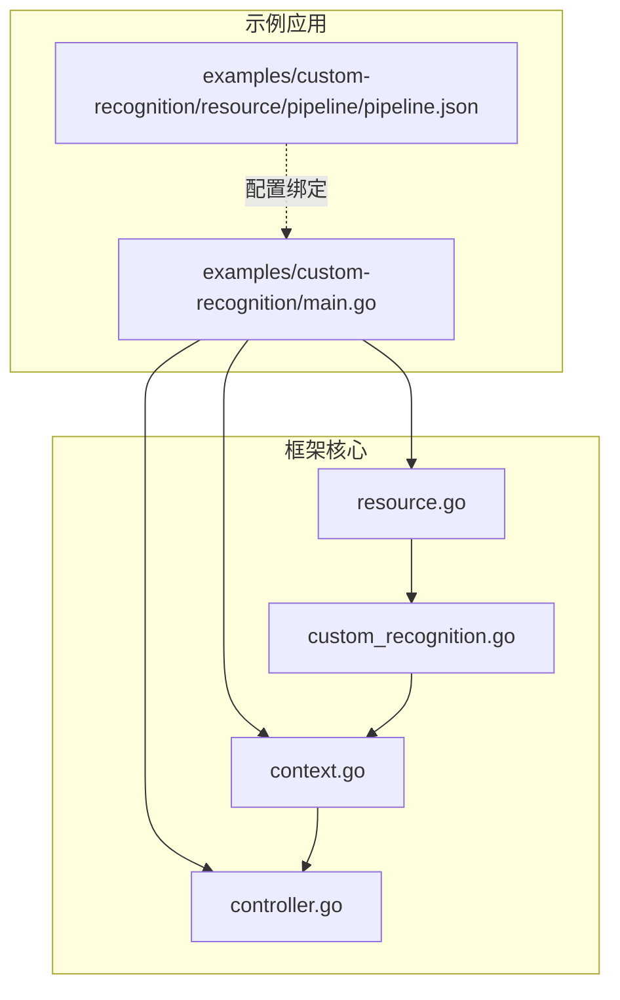
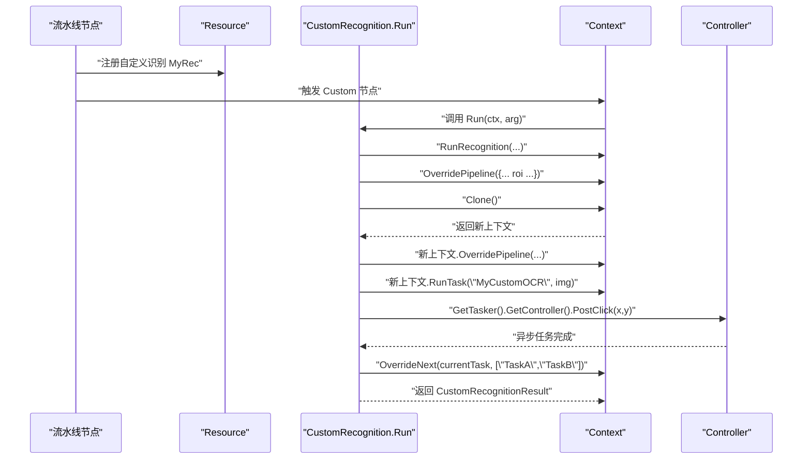
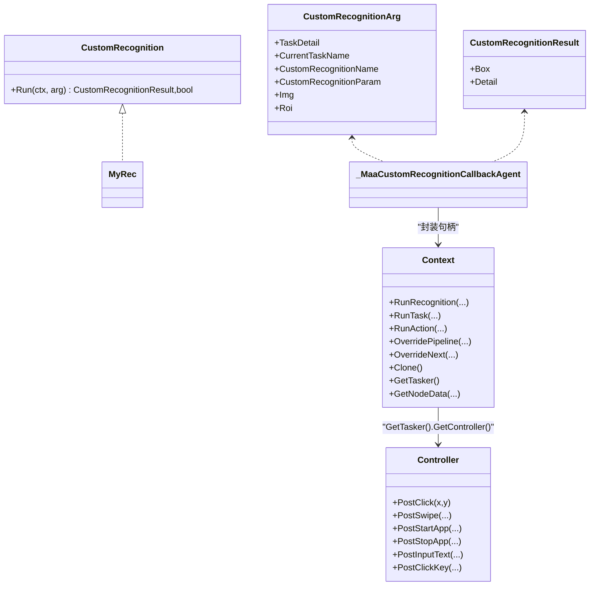
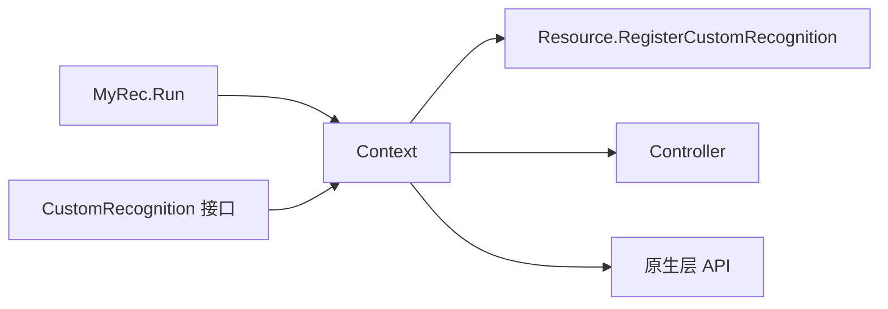

# 自定义识别示例

<cite>
**本文引用的文件**
- [examples/custom-recognition/main.go](file://examples/custom-recognition/main.go)
- [custom_recognition.go](file://custom_recognition.go)
- [context.go](file://context.go)
- [resource.go](file://resource.go)
- [controller.go](file://controller.go)
- [examples/custom-recognition/resource/pipeline/pipeline.json](file://examples/custom-recognition/resource/pipeline/pipeline.json)
</cite>

## 目录
1. [简介](#简介)
2. [项目结构](#项目结构)
3. [核心组件](#核心组件)
4. [架构总览](#架构总览)
5. [详细组件分析](#详细组件分析)
6. [依赖关系分析](#依赖关系分析)
7. [性能考量](#性能考量)
8. [故障排查指南](#故障排查指南)
9. [结论](#结论)
10. [附录](#附录)

## 简介
本文件围绕 examples/custom-recognition/main.go 中的自定义识别实现展开，系统性解析 MyRec 结构体如何在 Run 方法中完成以下关键能力：
- 嵌套识别：通过 ctx.RunRecognition 在当前上下文中运行另一个识别节点（例如 OCR）。
- 动态修改识别区域：通过 OverridePipeline 对指定节点的参数（如 ROI）进行覆盖。
- 创建独立上下文：使用 Clone 获取一个可独立操作的新上下文，避免影响主流程。
- 设备控制：通过 ctx.GetTasker().GetController().PostClick 执行点击等设备控制动作。
- 控制任务流跳转：使用 OverrideNext 将当前任务的后续节点列表替换为自定义顺序。

同时，结合 custom_recognition.go 和 context.go 的 API，说明自定义识别与框架的深度集成方式，并给出动态 ROI 调整、多阶段图像分析等实用场景，以及性能注意事项（避免频繁克隆上下文）。

## 项目结构
该示例位于 examples/custom-recognition 目录，包含入口程序、资源与流水线配置。核心代码与接口分布在根目录的若干 Go 文件中。



图表来源
- [examples/custom-recognition/main.go](file://examples/custom-recognition/main.go#L1-L77)
- [examples/custom-recognition/resource/pipeline/pipeline.json](file://examples/custom-recognition/resource/pipeline/pipeline.json#L1-L12)
- [context.go](file://context.go#L1-L240)
- [custom_recognition.go](file://custom_recognition.go#L1-L103)
- [resource.go](file://resource.go#L114-L133)
- [controller.go](file://controller.go#L163-L167)

章节来源
- [examples/custom-recognition/main.go](file://examples/custom-recognition/main.go#L1-L77)
- [examples/custom-recognition/resource/pipeline/pipeline.json](file://examples/custom-recognition/resource/pipeline/pipeline.json#L1-L12)

## 核心组件
- 自定义识别接口与回调代理
  - CustomRecognition 接口定义了 Run(ctx, arg) -> (result, bool) 的签名，用于实现自定义识别逻辑。
  - _MaaCustomRecognitionCallbackAgent 是框架侧回调代理，负责将原生传入的上下文句柄、任务信息、图像与 ROI 包装为 Go 层对象后调用用户实现的 Run 方法，并回写结果。
- 上下文 Context
  - 提供 RunRecognition、RunTask、RunAction、OverridePipeline、OverrideNext、Clone、GetTasker、GetNodeData 等方法，是自定义识别与框架交互的核心。
- 资源 Resource
  - 提供 RegisterCustomRecognition(name, recognition) 将自定义识别注册到资源，使流水线节点可通过名称调用。
- 控制器 Controller
  - 提供 PostClick、PostSwipe、PostStartApp 等设备控制方法，自定义识别可通过 ctx.GetTasker().GetController() 访问。

章节来源
- [custom_recognition.go](file://custom_recognition.go#L38-L103)
- [context.go](file://context.go#L30-L166)
- [resource.go](file://resource.go#L114-L133)
- [controller.go](file://controller.go#L163-L167)

## 架构总览
下面的序列图展示了从流水线节点触发自定义识别，到嵌套识别、动态覆盖、独立上下文执行、设备控制与任务流跳转的整体流程。



图表来源
- [examples/custom-recognition/main.go](file://examples/custom-recognition/main.go#L38-L76)
- [custom_recognition.go](file://custom_recognition.go#L56-L103)
- [context.go](file://context.go#L56-L166)
- [controller.go](file://controller.go#L163-L167)

## 详细组件分析

### MyRec.Run 的实现要点
- 嵌套识别：在 Run 方法内调用 ctx.RunRecognition("MyCustomOCR", arg.Img, map) 运行另一个识别节点，实现“识别内的识别”。
- 动态修改识别区域：通过 ctx.OverridePipeline(map) 对目标节点的参数（如 roi）进行覆盖，从而在不改变全局配置的情况下局部调整识别范围。
- 独立上下文：使用 ctx.Clone() 获取新上下文，避免对主流程上下文产生副作用；随后对该新上下文再次调用 OverridePipeline 并执行 RunTask。
- 设备控制：通过 ctx.GetTasker().GetController().PostClick(x, y) 发起点击动作，等待完成后继续流程。
- 任务流跳转：使用 ctx.OverrideNext(arg.CurrentTaskName, []string{"TaskA","TaskB"}) 将当前任务的后续节点列表替换为自定义顺序，实现灵活的任务流控制。

章节来源
- [examples/custom-recognition/main.go](file://examples/custom-recognition/main.go#L46-L76)

### 自定义识别接口与回调代理
- CustomRecognition 接口
  - Run(ctx *Context, arg *CustomRecognitionArg) (*CustomRecognitionResult, bool)
  - 返回值包含识别框与详情字符串，布尔值表示是否成功。
- 回调代理 _MaaCustomRecognitionCallbackAgent
  - 将原生传入的上下文句柄、任务 ID、当前任务名、自定义识别名、参数、图像与 ROI 包装为 Go 层对象，调用用户实现的 Run，并将结果回写到输出缓冲区。



图表来源
- [custom_recognition.go](file://custom_recognition.go#L38-L103)
- [context.go](file://context.go#L1-L240)
- [controller.go](file://controller.go#L163-L167)

章节来源
- [custom_recognition.go](file://custom_recognition.go#L38-L103)

### 上下文 API 深度解析
- RunRecognition
  - 作用：在当前上下文中运行指定识别节点，支持通过 override 参数临时覆盖节点配置（如 roi）。
  - 复杂度：主要受底层识别算法与图像大小影响，时间复杂度通常与像素数成正比。
- OverridePipeline
  - 作用：以 JSON 或可序列化对象形式覆盖节点配置，常用于动态调整 ROI、阈值等参数。
  - 注意：仅覆盖指定节点的参数，不影响其他节点。
- Clone
  - 作用：复制当前上下文，生成可独立操作的新上下文，适合多分支或并行处理。
  - 性能：Clone 会复制内部状态，频繁克隆可能带来额外开销。
- OverrideNext
  - 作用：将当前任务的后续节点列表替换为自定义顺序，实现灵活的任务流控制。
- GetTasker / GetNodeData
  - 作用：获取 Tasker 实例与节点数据，便于进一步操作或读取节点配置。

章节来源
- [context.go](file://context.go#L30-L166)

### 设备控制 API
- PostClick(x, y)
  - 作用：向设备发送点击事件，常用于自定义识别后的自动化操作。
  - 使用：通过 ctx.GetTasker().GetController() 获取控制器实例后调用。
- 其他常用控制
  - PostSwipe、PostStartApp、PostStopApp、PostInputText、PostClickKey 等，均以类似模式提供。

章节来源
- [controller.go](file://controller.go#L163-L167)

### 流水线与注册机制
- 注册自定义识别
  - Resource.RegisterCustomRecognition(name, recognition) 将自定义识别注册到资源，使其可在流水线节点中通过名称调用。
- 流水线配置
  - pipeline.json 中的 Startup 节点使用 recognition: "Custom" 且 custom_recognition: "MyRec"，从而触发自定义识别。

```mermaid
flowchart TD
Start(["启动"]) --> Reg["Resource.RegisterCustomRecognition(\"MyRec\", &MyRec{})"]
Reg --> Bind["绑定资源与控制器"]
Bind --> Pipeline["pipeline.json 定义 Custom 节点"]
Pipeline --> Trigger["触发 Startup 节点"]
Trigger --> Callback["_MaaCustomRecognitionCallbackAgent 调用 MyRec.Run(...)"]
Callback --> End(["结束"])
```

图表来源
- [examples/custom-recognition/main.go](file://examples/custom-recognition/main.go#L38-L41)
- [examples/custom-recognition/resource/pipeline/pipeline.json](file://examples/custom-recognition/resource/pipeline/pipeline.json#L1-L12)
- [resource.go](file://resource.go#L114-L133)
- [custom_recognition.go](file://custom_recognition.go#L56-L103)

章节来源
- [examples/custom-recognition/main.go](file://examples/custom-recognition/main.go#L38-L41)
- [examples/custom-recognition/resource/pipeline/pipeline.json](file://examples/custom-recognition/resource/pipeline/pipeline.json#L1-L12)
- [resource.go](file://resource.go#L114-L133)

## 依赖关系分析
- 自定义识别与框架的耦合
  - MyRec.Run 依赖 Context 的 RunRecognition、OverridePipeline、Clone、OverrideNext 等方法。
  - Resource.RegisterCustomRecognition 将自定义识别与资源绑定，使流水线节点可直接调用。
  - 控制器通过 Context.GetTasker().GetController() 暴露给自定义识别，实现设备控制。
- 可能的循环依赖
  - 自定义识别通过回调代理间接依赖 Context，但未直接持有 Context 引用，避免循环引用。
- 外部依赖
  - 图像与 ROI 数据由框架侧传递至回调代理，再由 Go 层 Context 使用。



图表来源
- [examples/custom-recognition/main.go](file://examples/custom-recognition/main.go#L46-L76)
- [custom_recognition.go](file://custom_recognition.go#L56-L103)
- [context.go](file://context.go#L1-L240)
- [resource.go](file://resource.go#L114-L133)
- [controller.go](file://controller.go#L163-L167)

章节来源
- [custom_recognition.go](file://custom_recognition.go#L56-L103)
- [context.go](file://context.go#L1-L240)
- [resource.go](file://resource.go#L114-L133)
- [controller.go](file://controller.go#L163-L167)

## 性能考量
- 避免频繁克隆上下文
  - Clone 会复制内部状态，频繁克隆可能导致内存与 CPU 开销增加。建议在需要并行或隔离状态时才使用 Clone，并尽量复用已有的上下文。
- 合理使用 OverridePipeline
  - 仅覆盖必要的节点参数，减少不必要的 JSON 序列化与状态变更。
- 图像与 ROI
  - 优先在较小 ROI 内进行识别，降低计算量；必要时使用缓存图像以减少重复截图。
- 设备控制
  - PostClick 等操作为异步任务，应合理等待与重试，避免阻塞主线程。

[本节为通用指导，无需特定文件来源]

## 故障排查指南
- 自定义识别未被调用
  - 检查 Resource.RegisterCustomRecognition 是否正确注册，以及 pipeline.json 中 custom_recognition 名称是否一致。
- ROI 设置无效
  - 确认 OverridePipeline 的节点名与 pipeline.json 中一致，且覆盖的参数键（如 roi）正确。
- 设备控制失败
  - 确认控制器已连接，PostClick 返回的 Job 已 Wait 成功。
- 任务流未按预期跳转
  - 检查 OverrideNext 的第一个参数（当前任务名）是否与实际一致，第二个参数（后续节点列表）是否正确。

章节来源
- [examples/custom-recognition/main.go](file://examples/custom-recognition/main.go#L38-L76)
- [examples/custom-recognition/resource/pipeline/pipeline.json](file://examples/custom-recognition/resource/pipeline/pipeline.json#L1-L12)
- [context.go](file://context.go#L132-L166)
- [controller.go](file://controller.go#L158-L167)

## 结论
examples/custom-recognition/main.go 展示了自定义识别与框架的深度融合：通过 Context 的 RunRecognition、OverridePipeline、Clone、OverrideNext 等能力，实现了嵌套识别、动态 ROI 调整、独立上下文执行与任务流跳转；配合 Resource.RegisterCustomRecognition 与 pipeline.json 的配置，形成完整的可扩展识别链路。实践中应关注上下文克隆与参数覆盖的性能影响，确保识别与控制流程稳定高效。

[本节为总结，无需特定文件来源]

## 附录
- 实用场景建议
  - 动态 ROI 调整：根据上一步识别结果动态设置 ROI，提升定位精度与速度。
  - 多阶段图像分析：先粗略识别（如模板匹配），再在细 ROI 内进行 OCR 或神经网络检测。
  - 条件跳转：根据识别结果决定下一步任务，实现智能分支流程。

[本节为概念性内容，无需特定文件来源]