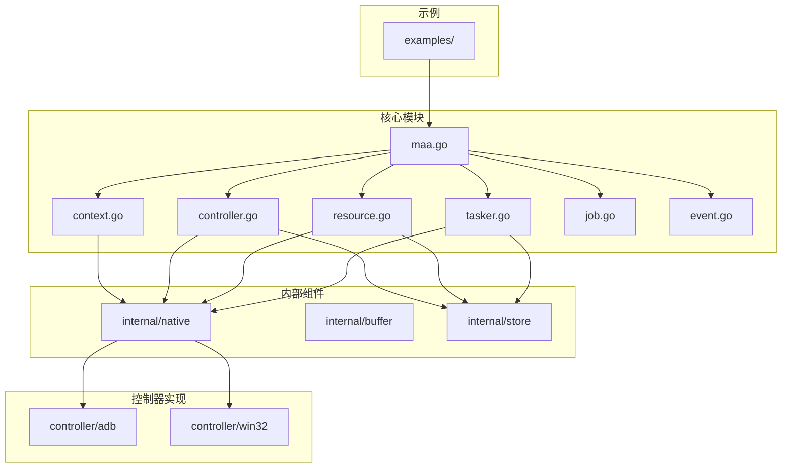
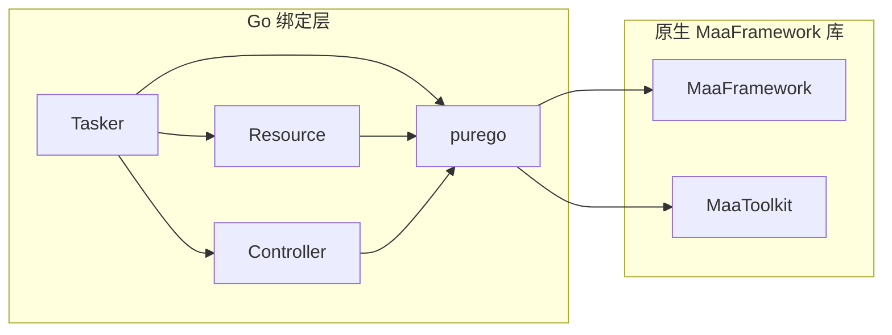
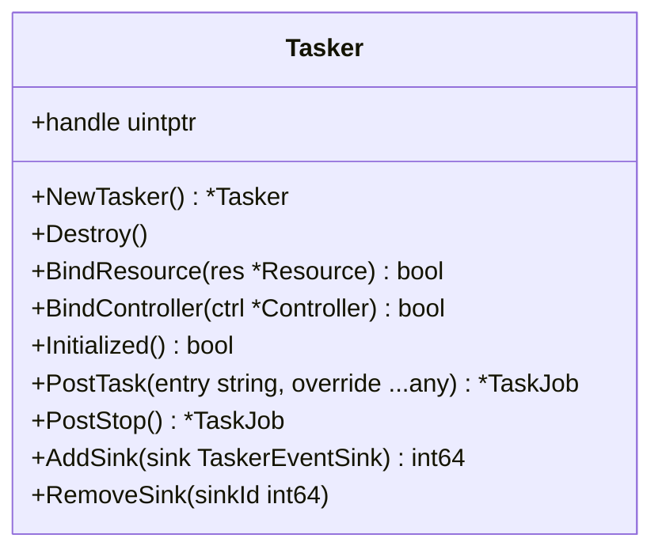
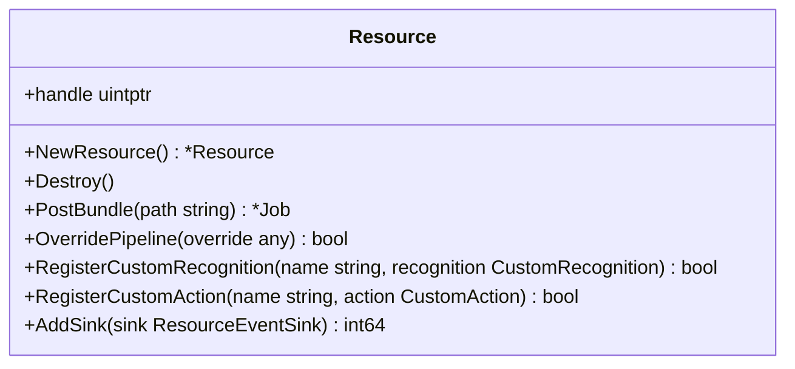
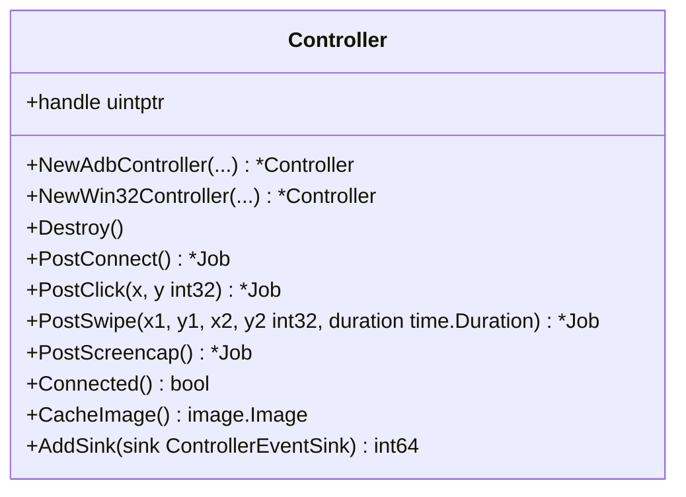
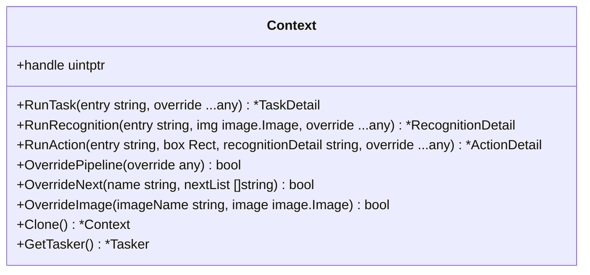
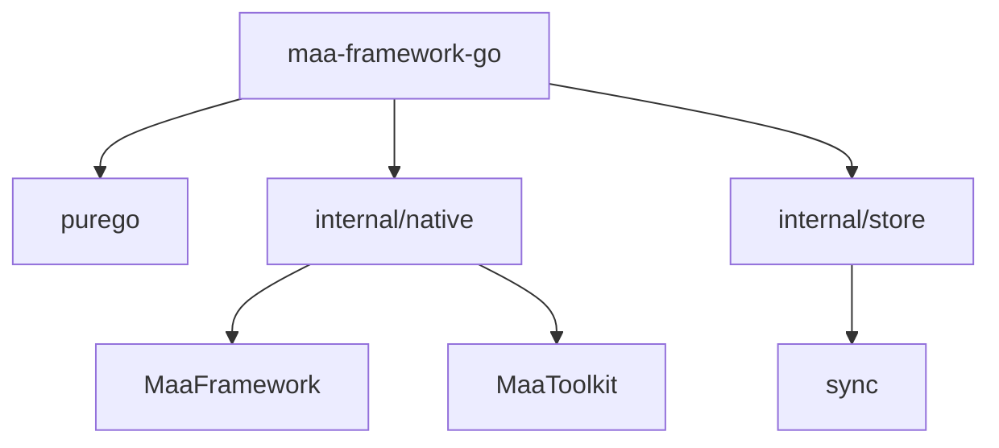

# 项目概述

<cite>
**本文档中引用的文件**  
- [maa.go](file://maa.go)
- [tasker.go](file://tasker.go)
- [resource.go](file://resource.go)
- [controller.go](file://controller.go)
- [context.go](file://context.go)
- [job.go](file://job.go)
- [event.go](file://event.go)
- [internal/native/native.go](file://internal/native/native.go)
- [controller/adb/adb.go](file://controller/adb/adb.go)
- [controller/win32/win32.go](file://controller/win32/win32.go)
- [internal/store/store.go](file://internal/store/store.go)
- [examples/quick-start/main.go](file://examples/quick-start/main.go)
- [examples/custom-action/main.go](file://examples/custom-action/main.go)
- [examples/custom-recognition/main.go](file://examples/custom-recognition/main.go)
</cite>

## 目录
1. [简介](#简介)
2. [项目结构](#项目结构)
3. [核心组件](#核心组件)
4. [架构概述](#架构概述)
5. [详细组件分析](#详细组件分析)
6. [依赖分析](#依赖分析)
7. [性能考虑](#性能考虑)
8. [故障排除指南](#故障排除指南)
9. [结论](#结论)

## 简介

maa-framework-go 是 MaaFramework 的 Go 语言绑定，这是一个基于图像识别的跨平台自动化测试框架。该项目的核心目标是为 Go 开发者提供一个无需 CGO 的纯 Go 实现，通过 purego 库调用原生 MaaFramework 动态库，从而实现 Android ADB 和 Windows Win32 平台的自动化控制。该框架支持声明式的 JSON 配置任务流（pipeline-based），并允许用户实现自定义识别算法和自定义操作逻辑，适用于游戏自动化、应用测试和 RPA（机器人流程自动化）等场景。

## 项目结构

项目结构清晰地分离了核心功能、控制器实现、内部工具和示例代码。`controller` 目录包含针对 ADB 和 Win32 的具体实现；`internal` 目录包含与原生库交互、数据缓冲和状态存储的核心内部组件；`examples` 目录提供了从快速入门到高级自定义功能的完整示例。

**图源**
- [maa.go](file://maa.go)
- [tasker.go](file://tasker.go)
- [resource.go](file://resource.go)
- [controller.go](file://controller.go)
- [context.go](file://context.go)
- [job.go](file://job.go)
- [event.go](file://event.go)
- [internal/native/native.go](file://internal/native/native.go)
- [internal/store/store.go](file://internal/store/store.go)
- [controller/adb/adb.go](file://controller/adb/adb.go)
- [controller/win32/win32.go](file://controller/win32/win32.go)

**本节来源**
- [maa.go](file://maa.go)
- [tasker.go](file://tasker.go)
- [resource.go](file://resource.go)
- [controller.go](file://controller.go)
- [context.go](file://context.go)
- [job.go](file://job.go)
- [event.go](file://event.go)
- [internal/native/native.go](file://internal/native/native.go)
- [internal/store/store.go](file://internal/store/store.go)
- [controller/adb/adb.go](file://controller/adb/adb.go)
- [controller/win32/win32.go](file://controller/win32/win32.go)

## 核心组件

maa-framework-go 的核心由四个主要组件构成：`Tasker`、`Resource`、`Controller` 和 `Context`。`Tasker` 是自动化任务的协调中心，负责管理任务的执行流程。`Resource` 负责加载和管理任务所需的资源，如图像模板和 JSON 配置。`Controller` 负责与目标设备或应用程序进行交互，执行点击、滑动等操作，并获取屏幕截图。`Context` 提供了在任务执行过程中进行更精细控制的接口，允许在运行时动态修改任务流程和执行自定义逻辑。

**本节来源**
- [tasker.go](file://tasker.go)
- [resource.go](file://resource.go)
- [controller.go](file://controller.go)
- [context.go](file://context.go)

## 架构概述

maa-framework-go 的系统架构是一个分层设计，上层是纯 Go 实现的绑定层，下层是用 C++ 编写的原生 MaaFramework 库。Go 绑定层通过 purego 库以纯 Go 的方式调用原生库的 C API，避免了 CGO 带来的跨平台编译和部署复杂性。`Tasker` 作为核心协调者，绑定 `Resource` 和 `Controller`，并根据 `Resource` 中定义的 pipeline 执行自动化任务。`Controller` 根据平台（ADB 或 Win32）与设备通信，而 `Resource` 则提供任务执行所需的识别和操作逻辑。

**图源**
- [maa.go](file://maa.go)
- [tasker.go](file://tasker.go)
- [resource.go](file://resource.go)
- [controller.go](file://controller.go)
- [internal/native/native.go](file://internal/native/native.go)

## 详细组件分析

### Tasker 分析

`Tasker` 是整个自动化流程的入口和控制中心。它通过 `BindResource` 和 `BindController` 方法将资源和控制器关联起来。一旦初始化完成，就可以通过 `PostTask` 方法提交任务。`Tasker` 还提供了事件回调机制（`AddSink`），允许用户监听任务执行过程中的各种事件，如任务开始、成功或失败。

**图源**
- [tasker.go](file://tasker.go)

### Resource 分析

`Resource` 组件负责管理所有与任务相关的静态资源。它通过 `PostBundle` 方法从指定路径加载资源包。`Resource` 的一个关键特性是支持自定义识别（`RegisterCustomRecognition`）和自定义操作（`RegisterCustomAction`），这使得开发者可以扩展框架的功能。此外，`OverridePipeline` 方法允许在运行时动态修改任务流程。

**图源**
- [resource.go](file://resource.go)

### Controller 分析

`Controller` 是与目标设备交互的桥梁。`maa-framework-go` 提供了两种具体的控制器：`NewAdbController` 用于 Android 设备，`NewWin32Controller` 用于 Windows 应用程序。`Controller` 提供了异步的 `Post` 系列方法（如 `PostClick`, `PostSwipe`）来执行操作，并通过 `Job` 对象来跟踪操作状态。`CacheImage` 方法可以获取最近一次截图的图像数据。

**图源**
- [controller.go](file://controller.go)
- [controller/adb/adb.go](file://controller/adb/adb.go)
- [controller/win32/win32.go](file://controller/win32/win32.go)

### Context 分析

`Context` 提供了比 `Tasker` 更底层的控制能力。它通常在自定义识别或自定义操作的实现中使用。`Context` 允许在运行时克隆自身（`Clone`）、动态修改下一个任务列表（`OverrideNext`）、覆盖图像资源（`OverrideImage`）以及执行子任务（`RunTask`）。这为实现复杂的、条件驱动的自动化逻辑提供了极大的灵活性。

**图源**
- [context.go](file://context.go)

## 依赖分析

该项目的主要外部依赖是 `github.com/ebitengine/purego`，它使得项目能够以纯 Go 方式调用原生动态库，这是项目“无 CGO”特性的技术基础。项目内部通过 `internal/native` 包封装了对原生 MaaFramework 库的调用。`internal/store` 包使用 Go 的 `sync` 包来管理 `Tasker`、`Resource` 和 `Controller` 的状态映射，确保了线程安全。

**图源**
- [go.mod](file://go.mod)
- [internal/native/native.go](file://internal/native/native.go)
- [internal/store/store.go](file://internal/store/store.go)

**本节来源**
- [go.mod](file://go.mod)
- [internal/native/native.go](file://internal/native/native.go)
- [internal/store/store.go](file://internal/store/store.go)

## 性能考虑

由于框架需要频繁地进行图像识别和设备交互，性能是关键考量。`Controller` 的 `Post` 系列方法是异步的，这允许将多个操作指令批量发送，减少通信开销。`Resource` 的 `UseCPU`、`UseDirectml` 等方法允许用户根据硬件条件选择最优的推理后端，以加速图像识别过程。此外，框架支持缓存机制（`ClearCache`），可以避免重复计算。

## 故障排除指南

当遇到问题时，首先应检查 MaaFramework 原生库是否已正确安装并位于运行时可找到的路径中。可以通过 `maa.Init()` 的 `WithLogDir` 选项启用日志记录，日志文件将提供详细的执行信息和错误堆栈。如果任务执行失败，应检查 `TaskDetail` 和 `NodeDetail` 中的详细信息，以确定是识别失败还是操作失败。对于自定义功能，确保 `RegisterCustomRecognition` 或 `RegisterCustomAction` 已正确调用。

**本节来源**
- [maa.go](file://maa.go)
- [tasker.go](file://tasker.go)
- [resource.go](file://resource.go)
- [controller.go](file://controller.go)

## 结论

maa-framework-go 成功地为 MaaFramework 提供了一个现代化、高性能的 Go 语言绑定。其纯 Go 实现（无 CGO）极大地简化了跨平台部署。通过 `Tasker`、`Resource` 和 `Controller` 的清晰职责划分，以及 `Context` 提供的强大运行时控制能力，该框架为开发者构建复杂的自动化应用提供了坚实的基础。结合提供的示例，开发者可以快速上手并实现从简单点击到高级自定义逻辑的各种自动化场景。