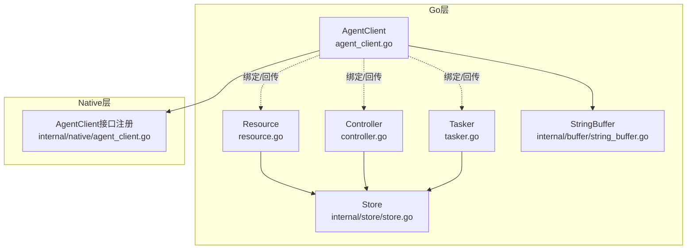
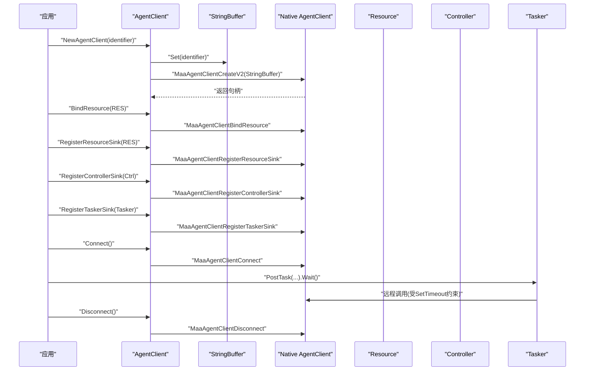
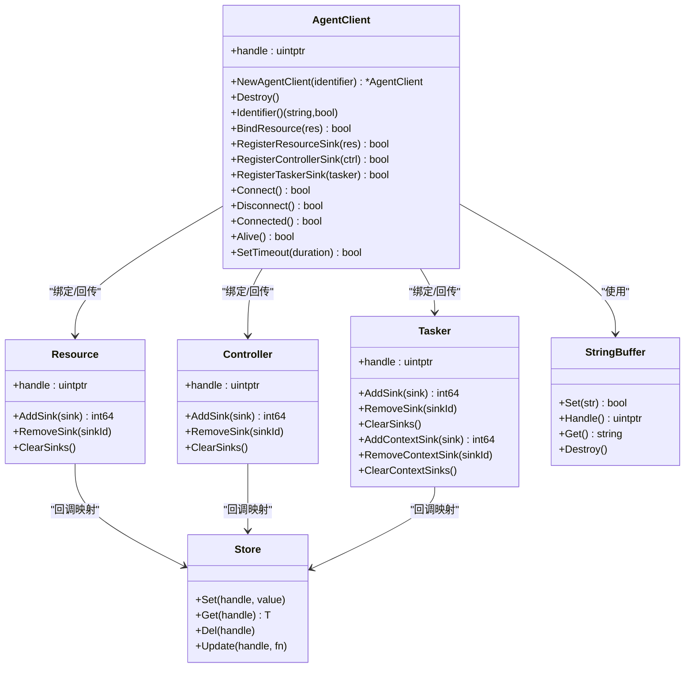

# Agent客户端

<cite>
**本文引用的文件**
- [agent_client.go](file://agent_client.go)
- [internal/native/agent_client.go](file://internal/native/agent_client.go)
- [examples/agent-client/main.go](file://examples/agent-client/main.go)
- [resource.go](file://resource.go)
- [controller.go](file://controller.go)
- [tasker.go](file://tasker.go)
- [internal/buffer/string_buffer.go](file://internal/buffer/string_buffer.go)
- [internal/store/store.go](file://internal/store/store.go)
</cite>

## 目录
1. [简介](#简介)
2. [项目结构](#项目结构)
3. [核心组件](#核心组件)
4. [架构总览](#架构总览)
5. [详细组件分析](#详细组件分析)
6. [依赖关系分析](#依赖关系分析)
7. [性能考量](#性能考量)
8. [故障排查指南](#故障排查指南)
9. [结论](#结论)
10. [附录](#附录)

## 简介
本文件系统性讲解 Agent 客户端的连接管理与资源集成机制，围绕 NewAgentClient 的创建流程、标识符生成策略、底层句柄初始化展开；重点阐述 Connect 与 Disconnect 的连接建立与断开逻辑，Connected 与 Alive 在连接状态检测上的差异与适用场景；详解 SetTimeout 如何设置与 Agent 服务器通信的超时阈值并影响后续所有远程调用；深入分析 BindResource、RegisterResourceSink、RegisterControllerSink、RegisterTaskerSink 四个关键方法，解释它们如何将本地 Resource、Controller 和 Tasker 实例与远程服务器进行绑定并启用事件回传；最后结合 examples/agent-client/main.go 演示完整的客户端集成流程，并给出连接超时、资源绑定失败等常见问题的成因与解决方案，以及性能调优建议。

## 项目结构
Agent 客户端位于 Go 层的 maa 包中，通过 internal/native 层动态加载底层库函数，完成与 Agent 服务端的交互。资源、控制器与任务器分别由各自模块提供，Agent 客户端负责将这些本地对象与远端服务建立联系并启用事件回传。

图表来源
- [agent_client.go](file://agent_client.go#L1-L112)
- [internal/native/agent_client.go](file://internal/native/agent_client.go#L1-L79)
- [resource.go](file://resource.go#L1-L383)
- [controller.go](file://controller.go#L1-L300)
- [tasker.go](file://tasker.go#L1-L433)
- [internal/buffer/string_buffer.go](file://internal/buffer/string_buffer.go#L1-L58)
- [internal/store/store.go](file://internal/store/store.go#L1-L65)

章节来源
- [agent_client.go](file://agent_client.go#L1-L112)
- [internal/native/agent_client.go](file://internal/native/agent_client.go#L1-L79)

## 核心组件
- AgentClient：封装底层句柄，提供连接管理与资源绑定能力。
- Resource/Controller/Tasker：本地业务对象，通过 AgentClient 与远端服务交互并启用事件回传。
- StringBuffer：字符串缓冲区，用于跨语言传递标识符等字符串参数。
- Store：全局存储，维护各对象的回调映射，确保事件回传正确路由。

章节来源
- [agent_client.go](file://agent_client.go#L1-L112)
- [resource.go](file://resource.go#L1-L383)
- [controller.go](file://controller.go#L1-L300)
- [tasker.go](file://tasker.go#L1-L433)
- [internal/buffer/string_buffer.go](file://internal/buffer/string_buffer.go#L1-L58)
- [internal/store/store.go](file://internal/store/store.go#L1-L65)

## 架构总览
Agent 客户端通过 NewAgentClient 创建实例，内部使用 StringBuffer 将标识符传入底层库，获得非零句柄后封装为 Go 对象。随后可通过 BindResource/BindController/BindTasker 将本地对象与远端服务绑定，再通过 Register*Sink 启用事件回传。连接生命周期由 Connect/Disconnect 管理，Connected/Alive 提供不同粒度的状态检测。SetTimeout 设置整体通信超时阈值，影响后续所有远程调用。

图表来源
- [agent_client.go](file://agent_client.go#L14-L111)
- [internal/native/agent_client.go](file://internal/native/agent_client.go#L59-L74)
- [internal/buffer/string_buffer.go](file://internal/buffer/string_buffer.go#L1-L58)
- [resource.go](file://resource.go#L345-L383)
- [controller.go](file://controller.go#L279-L300)
- [tasker.go](file://tasker.go#L357-L433)

## 详细组件分析

### NewAgentClient 创建流程与标识符生成策略
- 标识符生成策略：
  - 若调用方未提供 identifier，则底层库会自动生成一个唯一标识符。
  - Go 层通过 StringBuffer 将 identifier 写入缓冲区，再传给底层创建函数。
- 底层句柄初始化：
  - 调用 MaaAgentClientCreateV2 返回非零句柄，封装为 AgentClient 对象；若返回 0 则创建失败。
- 销毁资源：
  - 通过 Destroy 调用底层 MaaAgentClientDestroy 释放资源。

章节来源
- [agent_client.go](file://agent_client.go#L14-L34)
- [internal/buffer/string_buffer.go](file://internal/buffer/string_buffer.go#L1-L58)
- [internal/native/agent_client.go](file://internal/native/agent_client.go#L59-L61)

### 连接建立与断开：Connect 与 Disconnect
- Connect：
  - 调用底层 MaaAgentClientConnect 建立与 Agent 服务器的连接。
  - 成功返回 true，否则 false。
- Disconnect：
  - 调用底层 MaaAgentClientDisconnect 断开连接。
  - 成功返回 true，否则 false。

章节来源
- [agent_client.go](file://agent_client.go#L64-L72)
- [internal/native/agent_client.go](file://internal/native/agent_client.go#L67-L68)

### 连接状态检测：Connected 与 Alive 的差异与场景
- Connected：
  - 仅检查是否已成功建立到 Agent 服务器的连接（网络层面）。
  - 适用于快速判断“是否连上”，不关心服务器是否仍在响应。
- Alive：
  - 检查 Agent 服务器是否仍处于可响应状态（包含心跳或健康探测）。
  - 适用于需要确认服务器“可用且活跃”的场景，例如在执行远程调用前做一次健康检查。

章节来源
- [agent_client.go](file://agent_client.go#L74-L82)
- [internal/native/agent_client.go](file://internal/native/agent_client.go#L68-L69)

### 超时配置：SetTimeout 的作用域与影响
- 设置方式：
  - 接收 time.Duration，内部转换为毫秒整数传给底层 MaaAgentClientSetTimeout。
  - 当 duration < 0 时直接返回 false，防止非法输入。
- 影响范围：
  - 设置的是与 Agent 服务器通信的整体超时阈值，影响后续所有远程调用（如资源加载、任务下发、事件回传等）。
  - 该超时通常用于控制阻塞等待（如 Connect、远程操作完成等）的最大等待时间。

章节来源
- [agent_client.go](file://agent_client.go#L84-L93)
- [internal/native/agent_client.go](file://internal/native/agent_client.go#L70-L70)

### 资源绑定与事件回传：BindResource、RegisterResourceSink、RegisterControllerSink、RegisterTaskerSink
- BindResource：
  - 将本地 Resource 与 Agent 服务器进行绑定，使远端能够访问本地资源数据。
- RegisterResourceSink：
  - 注册 Resource 的事件回传，使远端事件（如资源加载进度、错误等）能回调到本地 Resource。
- RegisterControllerSink：
  - 注册 Controller 的事件回传，使远端控制器相关事件（如连接状态、输入反馈等）能回调到本地 Controller。
- RegisterTaskerSink：
  - 注册 Tasker 的事件回传，使远端任务执行相关事件（如节点运行、动作执行等）能回调到本地 Tasker。

上述四个方法均通过底层对应函数完成绑定与回传注册，返回布尔值表示操作是否成功。

章节来源
- [agent_client.go](file://agent_client.go#L44-L62)
- [internal/native/agent_client.go](file://internal/native/agent_client.go#L63-L66)
- [resource.go](file://resource.go#L345-L383)
- [controller.go](file://controller.go#L279-L300)
- [tasker.go](file://tasker.go#L357-L433)

### 完整集成流程：examples/agent-client/main.go
- 初始化框架后创建 Tasker、Resource、Controller，并按顺序完成：
  - Tasker 绑定 Resource；
  - Controller 连接（PostConnect.Wait）；
  - Tasker 绑定 Controller；
  - Tasker 初始化校验；
  - 创建 AgentClient 并绑定 Resource；
  - Connect 建立连接；
  - 下发任务（PostTask），等待执行完成；
  - Disconnect 断开连接。
- 该示例展示了从本地对象准备到与 Agent 服务器建立连接并执行任务的完整闭环。

章节来源
- [examples/agent-client/main.go](file://examples/agent-client/main.go#L1-L56)

## 依赖关系分析
- AgentClient 依赖：
  - internal/native/agent_client.go 中的函数指针注册，提供底层库调用入口。
  - internal/buffer/string_buffer.go 提供字符串缓冲区，用于标识符传递。
  - internal/store/store.go 提供全局存储，维护各对象的回调映射，保障事件回传正确路由。
- 与 Resource/Controller/Tasker 的关系：
  - 通过 Bind* 与 Register* 方法建立绑定与事件回传通道。
  - 事件回传依赖底层回调桥接与 Store 中的回调 ID 映射。

图表来源
- [agent_client.go](file://agent_client.go#L1-L112)
- [resource.go](file://resource.go#L1-L383)
- [controller.go](file://controller.go#L1-L300)
- [tasker.go](file://tasker.go#L1-L433)
- [internal/buffer/string_buffer.go](file://internal/buffer/string_buffer.go#L1-L58)
- [internal/store/store.go](file://internal/store/store.go#L1-L65)

## 性能考量
- 合理设置超时时间：
  - SetTimeout 会影响所有远程调用的阻塞等待上限。过短可能导致频繁超时，过长可能延长失败感知时间。
  - 建议根据网络环境与任务复杂度分场景设置，如连接建立、资源加载、任务执行分别采用不同的超时策略。
- 事件回传与回调映射：
  - 使用 Store 维护回调 ID 映射，避免重复注册与泄漏；及时清理不再使用的 Sink，减少回调链路开销。
- 连接复用：
  - 在同一会话内尽量复用已建立的连接，避免频繁 Connect/Disconnect 带来的额外开销。
- 资源绑定顺序：
  - 先完成 Resource/Controller 的初始化与绑定，再建立 Agent 连接，有助于减少首次远程调用的等待时间。

[本节为通用指导，无需特定文件来源]

## 故障排查指南
- 连接超时：
  - 现象：Connect 或后续远程调用返回失败或超时。
  - 排查：检查 SetTimeout 是否过小；确认网络连通性；使用 Alive 检测服务器健康状态；必要时增大超时阈值。
- 资源绑定失败：
  - 现象：BindResource/BindController/BindTasker 返回 false。
  - 排查：确认本地对象已正确初始化；检查对象句柄有效性；确保绑定顺序符合要求（先绑定 Resource/Controller，再绑定 Tasker）。
- 事件回传无效：
  - 现象：Register*Sink 返回 true，但未收到回调。
  - 排查：确认已调用 Register*Sink；检查 Store 中的回调映射是否存在；确保回调处理逻辑正确。
- 断开异常：
  - 现象：Disconnect 返回 false 或资源未释放。
  - 排查：确认连接状态；确保在合适的时机调用 Destroy 释放底层资源。

章节来源
- [agent_client.go](file://agent_client.go#L84-L93)
- [resource.go](file://resource.go#L345-L383)
- [controller.go](file://controller.go#L279-L300)
- [tasker.go](file://tasker.go#L357-L433)
- [internal/store/store.go](file://internal/store/store.go#L1-L65)

## 结论
Agent 客户端通过 NewAgentClient 创建实例，借助 StringBuffer 与底层库完成句柄初始化；通过 BindResource/Register*Sink 将本地对象与远端服务绑定并启用事件回传；Connect/Disconnect 管理连接生命周期，Connected/Alive 提供不同粒度的状态检测；SetTimeout 统一设定通信超时阈值，影响后续所有远程调用。结合 examples/agent-client/main.go 的集成流程，可以构建稳定可靠的 Agent 客户端应用。针对常见问题，应从超时配置、绑定顺序、事件回传映射与资源释放等方面综合排查与优化。

[本节为总结性内容，无需特定文件来源]

## 附录
- 示例入口参考：examples/agent-client/main.go
- 关键方法路径参考：
  - NewAgentClient：[agent_client.go](file://agent_client.go#L14-L29)
  - Connect/Disconnect/Connected/Alive/SetTimeout：[agent_client.go](file://agent_client.go#L64-L93)
  - BindResource/RegisterResourceSink/RegisterControllerSink/RegisterTaskerSink：[agent_client.go](file://agent_client.go#L44-L62)
  - Resource/Controller/Tasker 的事件回传注册：[resource.go](file://resource.go#L345-L383)、[controller.go](file://controller.go#L279-L300)、[tasker.go](file://tasker.go#L357-L433)