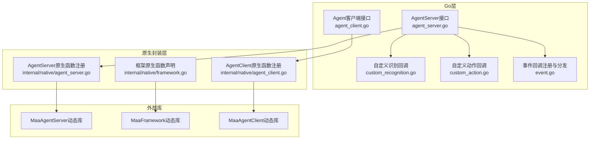
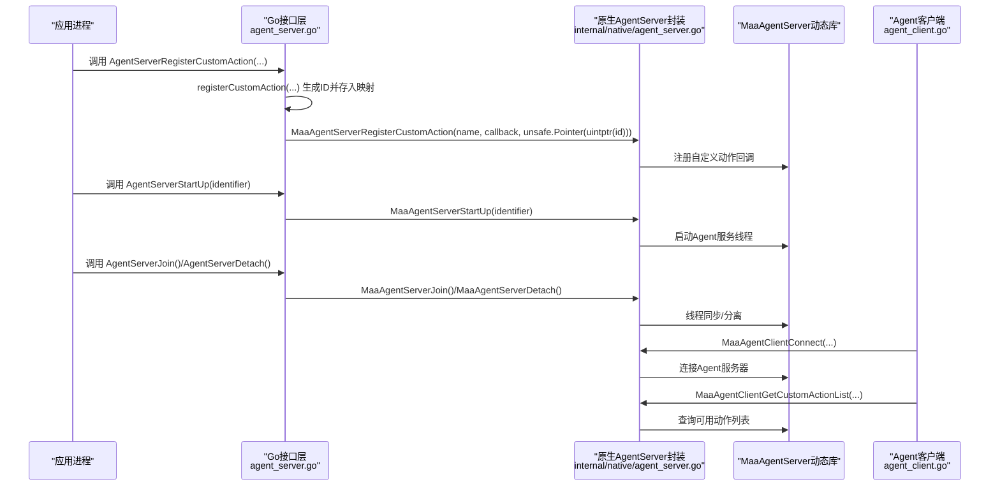
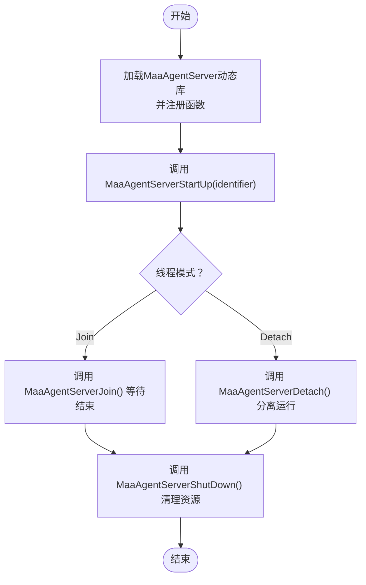
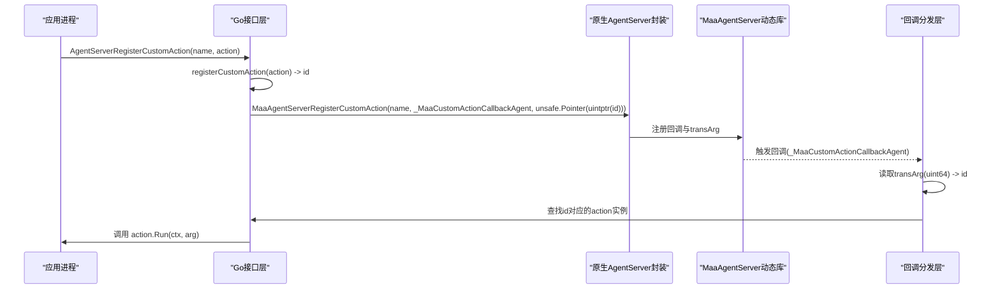
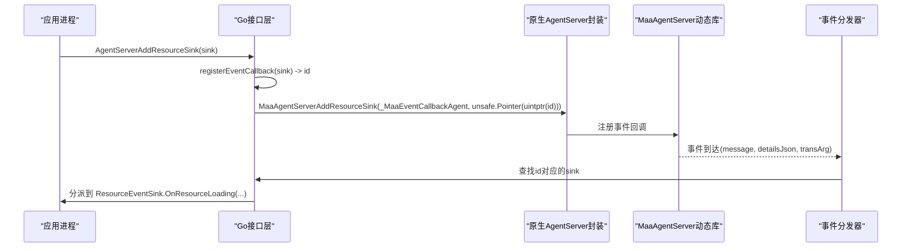
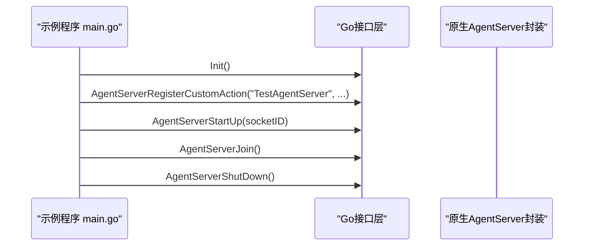
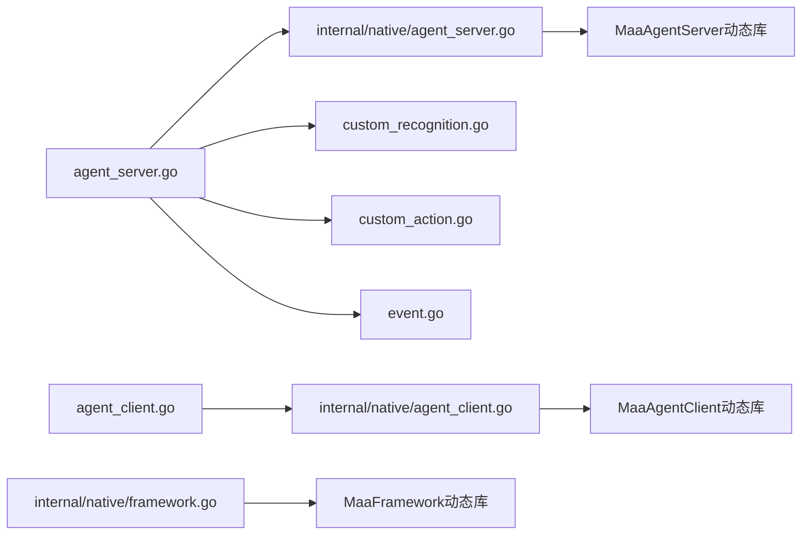

# Agent服务器

<cite>
**本文引用的文件列表**
- [agent_server.go](file://agent_server.go)
- [internal/native/agent_server.go](file://internal/native/agent_server.go)
- [internal/native/framework.go](file://internal/native/framework.go)
- [custom_recognition.go](file://custom_recognition.go)
- [custom_action.go](file://custom_action.go)
- [event.go](file://event.go)
- [examples/agent-server/main.go](file://examples/agent-server/main.go)
- [agent_client.go](file://agent_client.go)
- [internal/native/agent_client.go](file://internal/native/agent_client.go)
</cite>

## 目录
1. [简介](#简介)
2. [项目结构](#项目结构)
3. [核心组件](#核心组件)
4. [架构总览](#架构总览)
5. [详细组件分析](#详细组件分析)
6. [依赖关系分析](#依赖关系分析)
7. [性能考量](#性能考量)
8. [故障排查指南](#故障排查指南)
9. [结论](#结论)
10. [附录](#附录)

## 简介
本文件围绕Agent服务器（Agent Server）在框架中的核心功能与实现机制进行系统化解析，重点覆盖以下方面：
- 生命周期管理：AgentServerStartUp与AgentServerShutDown的启动与关闭流程，包括标识符绑定、内部线程初始化与资源清理。
- 自定义能力注册：AgentServerRegisterCustomRecognition与AgentServerRegisterCustomAction如何将自定义识别与动作逻辑注册到全局服务，并解释通过unsafe.Pointer传递上下文ID的底层机制。
- 事件回调注册：AgentServerAddResourceSink、AddControllerSink、AddTaskerSink、AddContextSink等方法如何实现跨进程事件订阅。
- 工作流示例：结合examples/agent-server/main.go展示服务器端完整工作流配置。
- 线程模型：AgentServerJoin与AgentServerDetach的同步等待与分离运行模式选择及其在不同部署环境下的适用性。
- 排障建议：常见启动失败或注册异常的排查思路。

## 项目结构
Agent服务器相关代码主要分布在以下位置：
- 公共Go接口层：agent_server.go
- 原生库封装层：internal/native/agent_server.go
- 框架原生函数声明：internal/native/framework.go
- 自定义识别/动作回调注册与分发：custom_recognition.go、custom_action.go
- 通用事件回调注册与分发：event.go
- 示例：examples/agent-server/main.go
- 客户端侧对接：agent_client.go、internal/native/agent_client.go

图表来源
- [agent_server.go](file://agent_server.go#L1-L102)
- [internal/native/agent_server.go](file://internal/native/agent_server.go#L1-L72)
- [internal/native/framework.go](file://internal/native/framework.go#L1-L465)
- [custom_recognition.go](file://custom_recognition.go#L1-L103)
- [custom_action.go](file://custom_action.go#L1-L92)
- [event.go](file://event.go#L1-L334)
- [agent_client.go](file://agent_client.go#L1-L111)
- [internal/native/agent_client.go](file://internal/native/agent_client.go#L1-L78)

章节来源
- [agent_server.go](file://agent_server.go#L1-L102)
- [internal/native/agent_server.go](file://internal/native/agent_server.go#L1-L72)
- [internal/native/framework.go](file://internal/native/framework.go#L1-L465)

## 核心组件
- AgentServer接口层：提供启动、关闭、线程控制以及各类事件回调注册方法。
- 原生AgentServer封装：负责加载MaaAgentServer动态库并注册对应导出函数。
- 自定义识别/动作回调：维护本地映射表，通过transArg携带的uint64 ID在回调时反查具体实例。
- 事件回调：统一注册与分发，支持资源、控制器、任务器、上下文等多类事件。
- 客户端对接：AgentClient用于连接Agent服务器并获取可用的自定义识别/动作清单。

章节来源
- [agent_server.go](file://agent_server.go#L1-L102)
- [internal/native/agent_server.go](file://internal/native/agent_server.go#L1-L72)
- [custom_recognition.go](file://custom_recognition.go#L1-L103)
- [custom_action.go](file://custom_action.go#L1-L92)
- [event.go](file://event.go#L1-L334)
- [agent_client.go](file://agent_client.go#L1-L111)
- [internal/native/agent_client.go](file://internal/native/agent_client.go#L1-L78)

## 架构总览
Agent服务器通过原生封装层加载MaaAgentServer动态库，Go层提供高层API，包括：
- 启动/关闭：AgentServerStartUp/AgentServerShutDown
- 线程控制：AgentServerJoin/AgentServerDetach
- 注册自定义识别/动作：AgentServerRegisterCustomRecognition/AgentServerRegisterCustomAction
- 注册事件回调：AgentServerAddResourceSink/AgentServerAddControllerSink/AgentServerAddTaskerSink/AgentServerAddContextSink
- 客户端侧：AgentClient用于连接并查询可用能力

图表来源
- [agent_server.go](file://agent_server.go#L1-L102)
- [internal/native/agent_server.go](file://internal/native/agent_server.go#L1-L72)
- [agent_client.go](file://agent_client.go#L1-L111)
- [internal/native/agent_client.go](file://internal/native/agent_client.go#L1-L78)

## 详细组件分析

### 生命周期管理：AgentServerStartUp 与 AgentServerShutDown
- 启动流程
  - AgentServerStartUp接收identifier字符串，调用原生MaaAgentServerStartUp完成服务启动。
  - 原生封装通过purego按平台加载MaaAgentServer动态库并注册对应函数。
- 关闭流程
  - AgentServerShutDown调用原生MaaAgentServerShutDown执行服务关闭。
- 线程控制
  - AgentServerJoin：阻塞等待服务线程结束。
  - AgentServerDetach：将服务线程分离为独立运行，主线程可继续执行后续逻辑。

图表来源
- [internal/native/agent_server.go](file://internal/native/agent_server.go#L27-L67)
- [agent_server.go](file://agent_server.go#L83-L101)

章节来源
- [agent_server.go](file://agent_server.go#L83-L101)
- [internal/native/agent_server.go](file://internal/native/agent_server.go#L27-L67)

### 自定义识别与动作注册：AgentServerRegisterCustomRecognition / AgentServerRegisterCustomAction
- 注册流程
  - Go层先调用registerCustomRecognition/registerCustomAction生成唯一ID并保存到映射表。
  - 将该ID以unsafe.Pointer(uintptr(id))形式传给原生函数，作为transArg。
  - 原生函数将回调指针与transArg一并注册到Agent服务。
- 回调分发
  - 当Agent服务触发回调时，会将transArg作为uint64 ID回传。
  - Go层根据ID从映射表查找具体实例，构造参数并调用用户实现的Run方法。
- 上下文ID传递机制
  - 使用unsafe.Pointer传递uint64 ID，不直接解引用指针，避免内存安全问题，同时保证跨语言边界传递稳定。

图表来源
- [agent_server.go](file://agent_server.go#L1-L33)
- [custom_action.go](file://custom_action.go#L1-L92)
- [custom_recognition.go](file://custom_recognition.go#L1-L103)
- [internal/native/agent_server.go](file://internal/native/agent_server.go#L15-L25)

章节来源
- [agent_server.go](file://agent_server.go#L1-L33)
- [custom_action.go](file://custom_action.go#L1-L92)
- [custom_recognition.go](file://custom_recognition.go#L1-L103)

### 事件回调注册：AgentServerAddResourceSink / AddControllerSink / AddTaskerSink / AddContextSink
- 注册流程
  - Go层调用registerEventCallback生成唯一ID并保存到映射表。
  - 将该ID以unsafe.Pointer(uintptr(id))形式传给原生函数，作为transArg。
  - 原生函数将统一的事件回调函数与transArg注册到Agent服务。
- 事件分发
  - Agent服务在发生事件时，将事件消息、详情JSON及transArg传递给回调。
  - Go层根据transArg查找sink并按事件类型分派到对应接口（Tasker/Resource/Controller/Context）。
- 跨进程订阅
  - 通过AgentClient连接Agent服务器后，可订阅资源、控制器、任务器、上下文等事件，实现跨进程事件传播。

图表来源
- [agent_server.go](file://agent_server.go#L35-L81)
- [event.go](file://event.go#L1-L334)
- [internal/native/agent_server.go](file://internal/native/agent_server.go#L15-L25)

章节来源
- [agent_server.go](file://agent_server.go#L35-L81)
- [event.go](file://event.go#L1-L334)

### 示例工作流：examples/agent-server/main.go
- 初始化：调用Init完成框架初始化。
- 注册自定义动作：注册名为“TestAgentServer”的自定义动作。
- 启动Agent服务器：使用socketID作为identifier启动服务。
- 线程控制：调用Join等待服务线程结束；如需后台运行可改为Detach。
- 关闭：调用ShutDown释放资源。

图表来源
- [examples/agent-server/main.go](file://examples/agent-server/main.go#L1-L37)
- [agent_server.go](file://agent_server.go#L1-L102)

章节来源
- [examples/agent-server/main.go](file://examples/agent-server/main.go#L1-L37)

### 线程同步等待与分离运行：Join 与 Detach 的选择
- Join（同步等待）
  - 场景：需要确保服务线程结束后再退出主进程，便于资源有序释放与日志输出。
  - 适用：单进程内嵌式Agent服务、调试阶段。
- Detach（分离运行）
  - 场景：服务线程独立运行，主进程继续执行其他逻辑或等待外部信号。
  - 适用：守护进程、容器化部署、多服务协同。

章节来源
- [agent_server.go](file://agent_server.go#L93-L101)

## 依赖关系分析
- Go层依赖原生封装层提供的函数签名，原生封装层通过purego按平台加载动态库并注册函数。
- 自定义识别/动作与事件回调均依赖统一的ID映射表，transArg仅承载ID，避免跨语言内存共享风险。
- 客户端侧通过AgentClient连接Agent服务器，查询可用能力并订阅事件。

图表来源
- [agent_server.go](file://agent_server.go#L1-L102)
- [internal/native/agent_server.go](file://internal/native/agent_server.go#L1-L72)
- [custom_recognition.go](file://custom_recognition.go#L1-L103)
- [custom_action.go](file://custom_action.go#L1-L92)
- [event.go](file://event.go#L1-L334)
- [agent_client.go](file://agent_client.go#L1-L111)
- [internal/native/agent_client.go](file://internal/native/agent_client.go#L1-L78)
- [internal/native/framework.go](file://internal/native/framework.go#L1-L465)

章节来源
- [internal/native/agent_server.go](file://internal/native/agent_server.go#L1-L72)
- [internal/native/framework.go](file://internal/native/framework.go#L1-L465)
- [internal/native/agent_client.go](file://internal/native/agent_client.go#L1-L78)

## 性能考量
- 回调路径开销：每次回调都会进行ID映射查找与参数构造，建议在自定义识别/动作中尽量减少重复计算与大对象拷贝。
- 事件分发：事件回调统一入口，注意避免在回调中执行耗时操作，必要时异步处理或限流。
- 线程模型：Join适合简单场景，Detached适合高并发或长生命周期服务，但需关注资源泄漏与优雅退出。

## 故障排查指南
- 启动失败
  - 检查identifier是否有效且未被占用。
  - 确认MaaAgentServer动态库存在且与当前平台匹配。
  - 查看原生封装加载与函数注册是否成功。
- 注册异常
  - 自定义识别/动作注册返回false：检查名称是否冲突、实例是否正确创建。
  - 事件回调未触发：确认已成功注册sink并保持引用，避免被GC回收。
- 回调未命中
  - transArg仅传递ID，确保映射表未被清理且ID未过期。
- 客户端无法连接
  - 检查AgentClient连接状态与超时设置，确认Agent服务器已启动并监听指定identifier。

章节来源
- [agent_server.go](file://agent_server.go#L1-L102)
- [internal/native/agent_server.go](file://internal/native/agent_server.go#L27-L67)
- [agent_client.go](file://agent_client.go#L84-L111)
- [internal/native/agent_client.go](file://internal/native/agent_client.go#L1-L78)

## 结论
Agent服务器通过清晰的Go层API与原生封装，实现了自定义识别/动作的注册与回调分发、事件回调的统一注册与跨进程订阅，并提供了Join/Detach两种线程控制模式以适配不同部署场景。理解transArg传递ID的机制有助于在复杂环境中安全地管理回调实例与资源生命周期。

## 附录
- 平台动态库命名规则由原生封装自动选择，确保在Windows、Linux、macOS上正确加载。
- 客户端侧可通过AgentClient查询可用自定义识别/动作列表，辅助调试与验证。