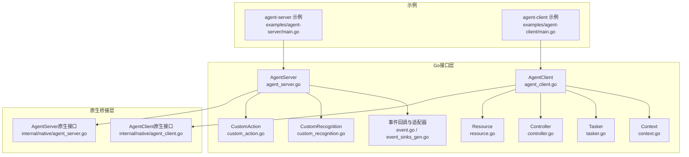
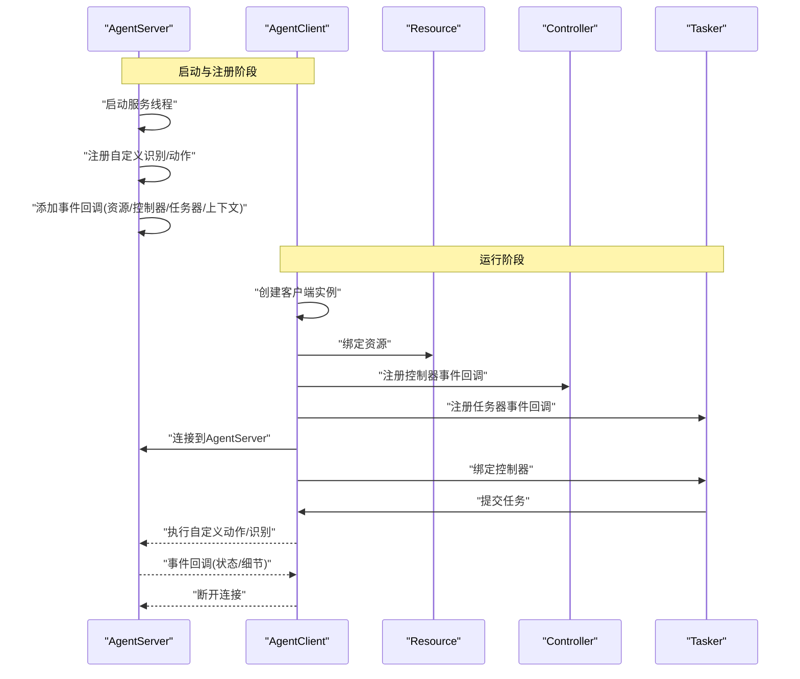
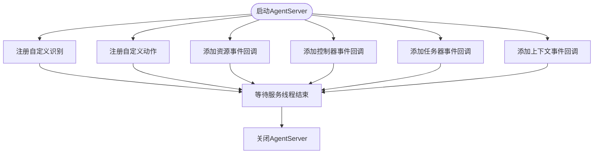
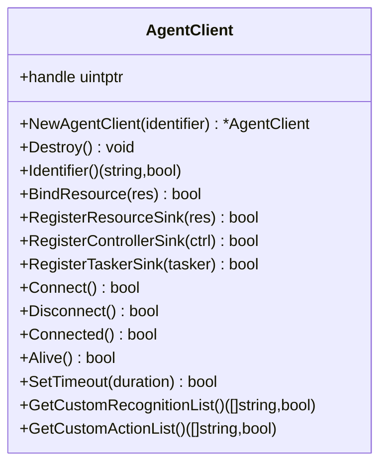
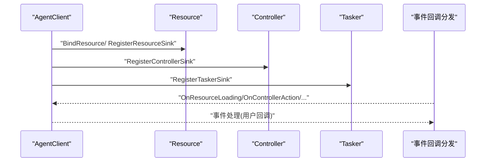
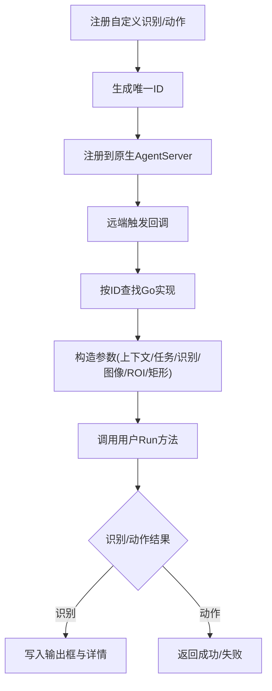
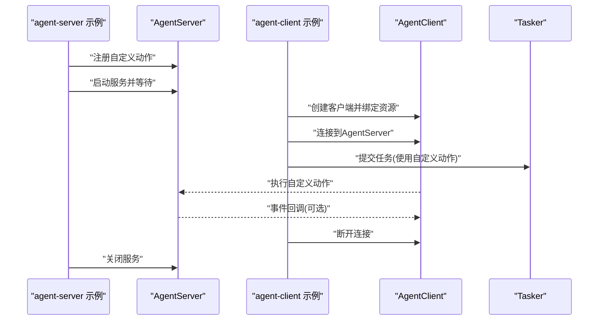
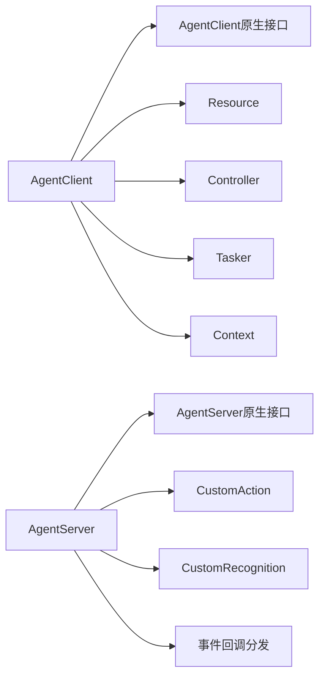

# Agent架构

<cite>
**本文引用的文件**
- [agent_server.go](file://agent_server.go)
- [agent_client.go](file://agent_client.go)
- [internal/native/agent_server.go](file://internal/native/agent_server.go)
- [internal/native/agent_client.go](file://internal/native/agent_client.go)
- [examples/agent-server/main.go](file://examples/agent-server/main.go)
- [examples/agent-client/main.go](file://examples/agent-client/main.go)
- [custom_action.go](file://custom_action.go)
- [custom_recognition.go](file://custom_recognition.go)
- [event.go](file://event.go)
- [event_sinks_gen.go](file://event_sinks_gen.go)
- [resource.go](file://resource.go)
- [controller.go](file://controller.go)
- [tasker.go](file://tasker.go)
- [context.go](file://context.go)
</cite>

## 目录
1. [引言](#引言)
2. [项目结构](#项目结构)
3. [核心组件](#核心组件)
4. [架构总览](#架构总览)
5. [详细组件分析](#详细组件分析)
6. [依赖关系分析](#依赖关系分析)
7. [性能考量](#性能考量)
8. [故障排查指南](#故障排查指南)
9. [结论](#结论)
10. [附录](#附录)

## 引言
本文件系统性阐述 maa-framework-go 的 Agent 客户端-服务器架构：AgentServer 的生命周期与自定义能力注册，AgentClient 的连接、状态查询与超时配置，以及资源、控制器与任务器的远程绑定与事件订阅机制。通过 examples/agent-client 与 agent-server 示例，展示跨进程通信的完整工作流，并总结该架构在解耦与复用方面的优势及网络延迟、序列化开销等挑战，最后给出实用的故障排查建议。

## 项目结构
围绕 Agent 架构的关键代码分布在以下模块：
- 公共 Go 接口层：agent_server.go、agent_client.go、custom_action.go、custom_recognition.go、event.go、event_sinks_gen.go、resource.go、controller.go、tasker.go、context.go
- 原生桥接层：internal/native/agent_server.go、internal/native/agent_client.go
- 示例：examples/agent-server/main.go、examples/agent-client/main.go

图表来源
- [agent_server.go](file://agent_server.go#L1-L102)
- [agent_client.go](file://agent_client.go#L1-L112)
- [internal/native/agent_server.go](file://internal/native/agent_server.go#L1-L72)
- [internal/native/agent_client.go](file://internal/native/agent_client.go#L1-L79)
- [examples/agent-server/main.go](file://examples/agent-server/main.go#L1-L37)
- [examples/agent-client/main.go](file://examples/agent-client/main.go#L1-L56)

章节来源
- [agent_server.go](file://agent_server.go#L1-L102)
- [agent_client.go](file://agent_client.go#L1-L112)
- [internal/native/agent_server.go](file://internal/native/agent_server.go#L1-L72)
- [internal/native/agent_client.go](file://internal/native/agent_client.go#L1-L79)
- [examples/agent-server/main.go](file://examples/agent-server/main.go#L1-L37)
- [examples/agent-client/main.go](file://examples/agent-client/main.go#L1-L56)

## 核心组件
- AgentServer：负责启动/停止服务线程、注册自定义识别与动作、添加资源/控制器/任务器/上下文事件回调。
- AgentClient：负责创建实例、绑定资源、注册事件回调、连接/断开、状态查询、超时设置、列举自定义识别/动作。
- 自定义能力：CustomAction、CustomRecognition 通过统一的回调适配器桥接到原生 AgentServer。
- 事件系统：基于字符串消息与 JSON 细节，分发到 Tasker/Resource/Controller/Context 事件适配器。
- 资源/控制器/任务器：提供绑定、事件订阅、运行控制等能力，支持跨进程的远程绑定与事件订阅。

章节来源
- [agent_server.go](file://agent_server.go#L1-L102)
- [agent_client.go](file://agent_client.go#L1-L112)
- [custom_action.go](file://custom_action.go#L1-L92)
- [custom_recognition.go](file://custom_recognition.go#L1-L103)
- [event.go](file://event.go#L1-L334)
- [event_sinks_gen.go](file://event_sinks_gen.go#L1-L200)
- [resource.go](file://resource.go#L1-L383)
- [controller.go](file://controller.go#L1-L300)
- [tasker.go](file://tasker.go#L1-L433)
- [context.go](file://context.go#L1-L240)

## 架构总览
AgentServer 与 AgentClient 通过原生库函数进行交互，AgentServer 负责承载自定义识别/动作与事件回调；AgentClient 负责连接远端 AgentServer 并绑定本地资源/控制器/任务器以参与跨进程协作。

图表来源
- [agent_server.go](file://agent_server.go#L83-L102)
- [agent_client.go](file://agent_client.go#L44-L112)
- [resource.go](file://resource.go#L345-L383)
- [controller.go](file://controller.go#L279-L300)
- [tasker.go](file://tasker.go#L357-L433)
- [examples/agent-server/main.go](file://examples/agent-server/main.go#L10-L22)
- [examples/agent-client/main.go](file://examples/agent-client/main.go#L10-L56)

## 详细组件分析

### AgentServer 生命周期与自定义能力注册
- 启动/停止/等待/分离：提供启动服务线程、等待服务线程结束、分离独立运行的能力，便于示例中长驻服务。
- 自定义识别/动作注册：将 Go 层的 CustomRecognition/CustomAction 实例映射为唯一 ID，并通过原生接口注册到 AgentServer，使远端客户端可调用。
- 事件回调注册：为资源、控制器、任务器、上下文分别添加事件回调，返回 sink ID 以便后续移除或清理。

图表来源
- [agent_server.go](file://agent_server.go#L1-L102)
- [custom_action.go](file://custom_action.go#L1-L92)
- [custom_recognition.go](file://custom_recognition.go#L1-L103)
- [event.go](file://event.go#L1-L334)

章节来源
- [agent_server.go](file://agent_server.go#L1-L102)
- [custom_action.go](file://custom_action.go#L1-L92)
- [custom_recognition.go](file://custom_recognition.go#L1-L103)
- [event.go](file://event.go#L1-L334)

### AgentClient 连接机制与状态查询
- 创建与销毁：创建客户端实例并持有底层句柄，销毁时释放资源。
- 绑定与事件订阅：支持绑定 Resource，注册 Resource/Controller/Tasker 事件回调，用于接收远端事件。
- 连接/断开/状态：提供连接远端 AgentServer、断开连接、检查连接状态与远端存活状态的方法。
- 超时设置：设置请求超时时间，避免阻塞。
- 自定义能力列表：查询远端已注册的自定义识别/动作名称列表，便于动态调度。

图表来源
- [agent_client.go](file://agent_client.go#L1-L112)

章节来源
- [agent_client.go](file://agent_client.go#L1-L112)

### 资源、控制器与任务器的远程绑定与事件订阅
- 绑定资源：AgentClient 可将本地 Resource 绑定到远端 AgentServer，使其成为远端可用的资源。
- 事件订阅：通过 AddSink/AddResourceSink/AddControllerSink/AddTaskerSink/AddContextSink 等方法，将事件回调注册到对应对象，返回 sink ID 以便移除。
- 事件分发：事件回调根据消息前缀匹配，分发到 Tasker/Resource/Controller/Context 对应的事件适配器，适配器再调用用户实现的回调。

图表来源
- [agent_client.go](file://agent_client.go#L44-L112)
- [resource.go](file://resource.go#L345-L383)
- [controller.go](file://controller.go#L279-L300)
- [tasker.go](file://tasker.go#L357-L433)
- [event.go](file://event.go#L120-L282)
- [event_sinks_gen.go](file://event_sinks_gen.go#L1-L200)

章节来源
- [resource.go](file://resource.go#L1-L383)
- [controller.go](file://controller.go#L1-L300)
- [tasker.go](file://tasker.go#L1-L433)
- [event.go](file://event.go#L1-L334)
- [event_sinks_gen.go](file://event_sinks_gen.go#L1-L200)

### 自定义识别与动作的桥接
- 回调适配器：将 Go 层的 CustomRecognition/CustomAction 映射为原生回调，通过传入的 transArg（uint64 ID）在回调中反查并调用用户实现。
- 数据缓冲：使用内部缓冲区处理图像、矩形、字符串等数据的传递，确保跨语言边界安全。
- 返回值：识别结果包含框与详情字符串，动作返回布尔值表示是否成功。

图表来源
- [custom_action.go](file://custom_action.go#L1-L92)
- [custom_recognition.go](file://custom_recognition.go#L1-L103)
- [agent_server.go](file://agent_server.go#L1-L82)

章节来源
- [custom_action.go](file://custom_action.go#L1-L92)
- [custom_recognition.go](file://custom_recognition.go#L1-L103)
- [agent_server.go](file://agent_server.go#L1-L82)

### 示例工作流：跨进程通信
- AgentServer 示例：初始化框架、注册自定义动作、启动服务并等待，示例中注册了一个名为 “TestAgentServer” 的自定义动作。
- AgentClient 示例：创建任务器与资源，绑定资源与控制器，初始化任务器，创建 AgentClient 并绑定资源，连接到 AgentServer，提交一个使用自定义动作的任务，最后断开连接。

图表来源
- [examples/agent-server/main.go](file://examples/agent-server/main.go#L10-L22)
- [examples/agent-client/main.go](file://examples/agent-client/main.go#L10-L56)
- [agent_server.go](file://agent_server.go#L83-L102)
- [agent_client.go](file://agent_client.go#L44-L112)

章节来源
- [examples/agent-server/main.go](file://examples/agent-server/main.go#L1-L37)
- [examples/agent-client/main.go](file://examples/agent-client/main.go#L1-L56)

## 依赖关系分析
- AgentServer 依赖原生 AgentServer 库函数，负责注册自定义能力与事件回调。
- AgentClient 依赖原生 AgentClient 库函数，负责连接、绑定与状态查询。
- 事件系统通过统一的回调适配器分发到不同对象类型，降低耦合度。
- 资源/控制器/任务器各自维护事件回调 ID 到 Go 层回调的映射，便于清理与扩展。

图表来源
- [agent_server.go](file://agent_server.go#L1-L102)
- [agent_client.go](file://agent_client.go#L1-L112)
- [internal/native/agent_server.go](file://internal/native/agent_server.go#L1-L72)
- [internal/native/agent_client.go](file://internal/native/agent_client.go#L1-L79)
- [event.go](file://event.go#L1-L334)

章节来源
- [agent_server.go](file://agent_server.go#L1-L102)
- [agent_client.go](file://agent_client.go#L1-L112)
- [internal/native/agent_server.go](file://internal/native/agent_server.go#L1-L72)
- [internal/native/agent_client.go](file://internal/native/agent_client.go#L1-L79)
- [event.go](file://event.go#L1-L334)

## 性能考量
- 序列化与缓冲：事件细节以 JSON 字符串传递，识别/动作参数通过缓冲区传递图像与矩形，避免频繁内存拷贝。
- 超时控制：通过 SetTimeout 控制请求超时，防止长时间阻塞影响整体吞吐。
- 并发与锁：回调映射表使用读写锁保护，减少竞争；资源/控制器/任务器存储结构在销毁时批量清理回调与自定义能力，降低泄漏风险。
- 跨进程通信：连接/断开与事件回调均通过原生库函数完成，尽量减少 Go 层额外开销。

[本节为通用性能讨论，不直接分析具体文件]

## 故障排查指南
- 连接失败
  - 检查 AgentServer 是否已启动且标识符正确。
  - 使用 Connected/Alive 方法确认连接状态与远端存活。
  - 设置合理超时，避免因网络延迟导致误判。
- 无法执行自定义动作/识别
  - 确认已在 AgentServer 端注册了对应名称的自定义动作/识别。
  - 在 AgentClient 端通过 GetCustomRecognitionList/GetCustomActionList 校验远端可用列表。
- 事件未到达
  - 确认已调用 RegisterResourceSink/RegisterControllerSink/RegisterTaskerSink 等注册方法。
  - 检查事件消息前缀与细节 JSON 格式是否符合预期。
- 资源/控制器/任务器绑定问题
  - 确保 Resource/Controller/Tasker 已初始化且处于可用状态。
  - 在销毁前确保已移除所有事件回调，避免悬挂回调导致异常。
- 性能问题
  - 关注网络延迟与序列化开销，必要时减少事件频率或合并任务。
  - 合理设置超时与重试策略，避免阻塞主线程。

章节来源
- [agent_client.go](file://agent_client.go#L44-L112)
- [agent_server.go](file://agent_server.go#L1-L102)
- [event.go](file://event.go#L1-L334)
- [resource.go](file://resource.go#L1-L383)
- [controller.go](file://controller.go#L1-L300)
- [tasker.go](file://tasker.go#L1-L433)

## 结论
该 Agent 架构通过清晰的生命周期管理与统一的事件回调机制，实现了 AgentServer 与 AgentClient 的高效协作。AgentServer 承载自定义能力与事件，AgentClient 提供连接、绑定与状态查询，配合资源/控制器/任务器的远程绑定与事件订阅，形成高内聚、低耦合的跨进程工作流。在实际应用中，需关注网络延迟与序列化开销，并通过合理的超时与事件策略提升稳定性与性能。

[本节为总结性内容，不直接分析具体文件]

## 附录
- 示例入口
  - AgentServer 示例：examples/agent-server/main.go
  - AgentClient 示例：examples/agent-client/main.go
- 关键接口路径
  - AgentServer：AgentServerStartUp、AgentServerShutDown、AgentServerJoin、AgentServerDetach、AgentServerRegisterCustomRecognition、AgentServerRegisterCustomAction、AgentServerAddResourceSink、AgentServerAddControllerSink、AgentServerAddTaskerSink、AgentServerAddContextSink
  - AgentClient：NewAgentClient、Destroy、Identifier、BindResource、RegisterResourceSink、RegisterControllerSink、RegisterTaskerSink、Connect、Disconnect、Connected、Alive、SetTimeout、GetCustomRecognitionList、GetCustomActionList

章节来源
- [examples/agent-server/main.go](file://examples/agent-server/main.go#L1-L37)
- [examples/agent-client/main.go](file://examples/agent-client/main.go#L1-L56)
- [agent_server.go](file://agent_server.go#L1-L102)
- [agent_client.go](file://agent_client.go#L1-L112)