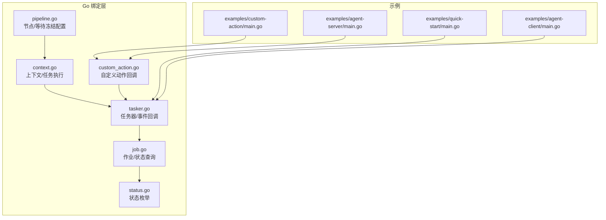
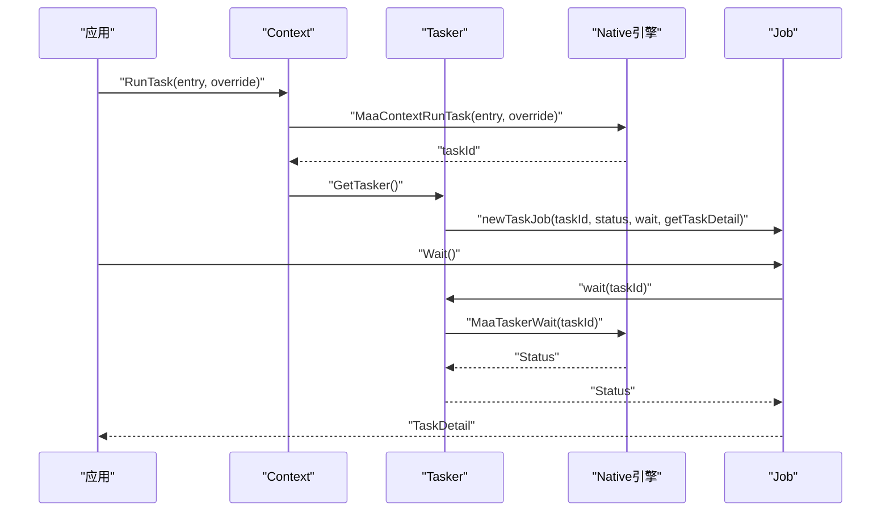
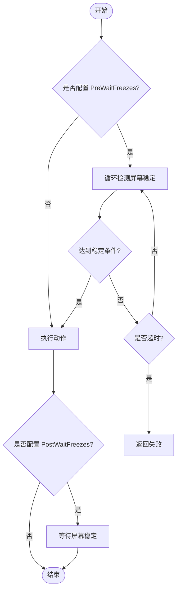
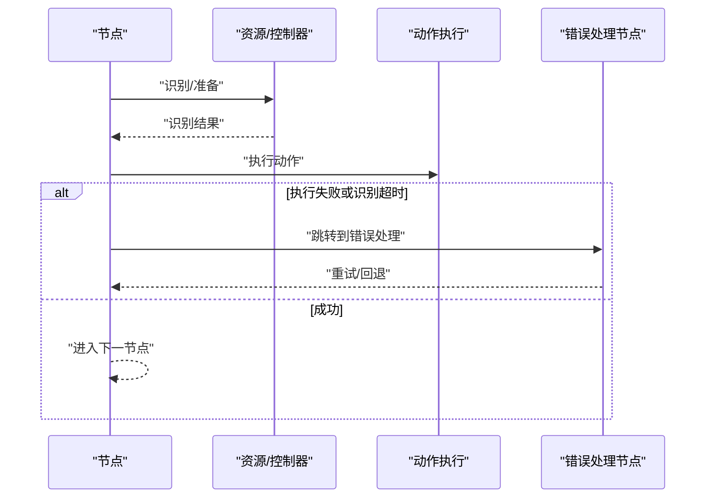
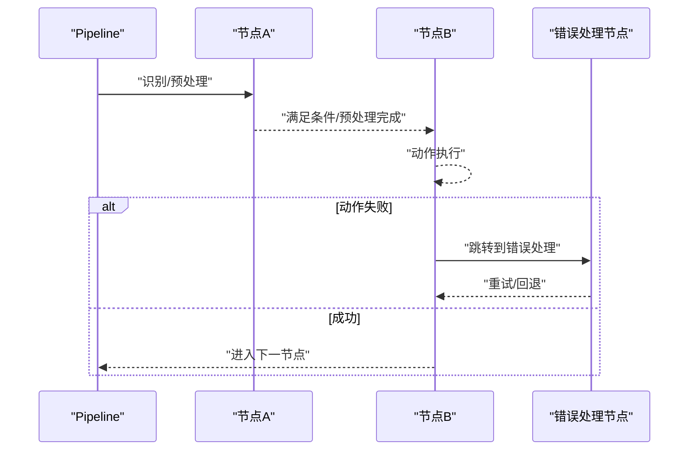
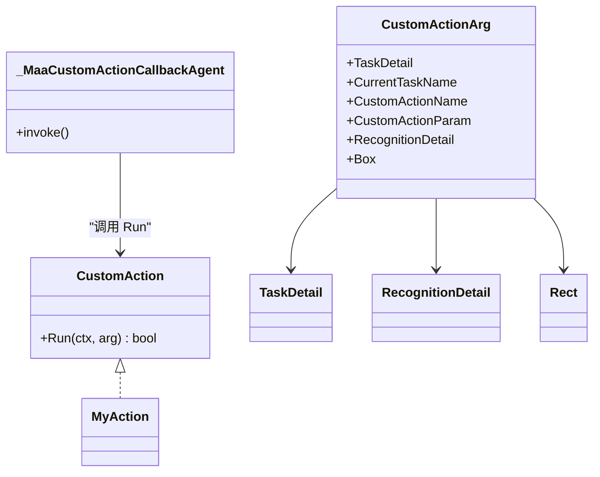
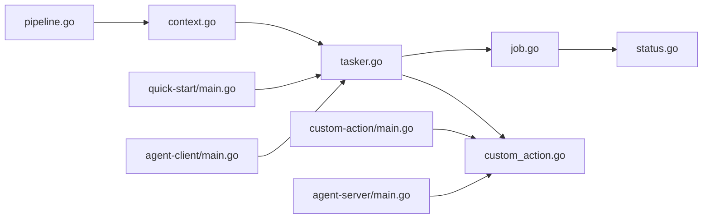

# 动作执行机制

<cite>
**本文引用的文件**
- [pipeline.go](file://pipeline.go)
- [context.go](file://context.go)
- [tasker.go](file://tasker.go)
- [job.go](file://job.go)
- [status.go](file://status.go)
- [custom_action.go](file://custom_action.go)
- [context_test.go](file://context_test.go)
- [examples/quick-start/main.go](file://examples/quick-start/main.go)
- [examples/custom-action/main.go](file://examples/custom-action/main.go)
- [examples/agent-client/main.go](file://examples/agent-client/main.go)
- [examples/agent-server/main.go](file://examples/agent-server/main.go)
</cite>

## 目录
1. [引言](#引言)
2. [项目结构](#项目结构)
3. [核心组件](#核心组件)
4. [架构总览](#架构总览)
5. [详细组件分析](#详细组件分析)
6. [依赖关系分析](#依赖关系分析)
7. [性能考量](#性能考量)
8. [故障排查指南](#故障排查指南)
9. [结论](#结论)
10. [附录](#附录)

## 引言
本篇文档围绕“动作执行的预处理与后处理”展开，系统讲解以下关键点：
- PreDelay 与 PostDelay 参数在动作执行前后的延时作用及合理配置建议
- PreWaitFreezes 与 PostWaitFreezes 的工作原理与屏幕冻结检测机制
- 动作执行失败时的处理策略（重试、错误传播）与最佳实践
- 复杂动作序列的执行流程与性能优化技巧

通过对 Go 绑定层的节点模型、任务执行器、作业状态机以及自定义动作回调等模块进行深入分析，并结合示例工程，帮助读者在不同设备性能下稳定、高效地完成自动化任务。

## 项目结构
本仓库提供 Go 绑定层，核心与动作执行相关的模块包括：
- 节点与流水线：定义动作节点、识别节点、等待冻结配置等
- 上下文与任务器：封装任务提交、状态查询、细节获取
- 作业与状态：抽象异步作业与生命周期状态
- 自定义动作：扩展动作类型与回调代理
- 示例工程：快速上手与自定义动作演示

图表来源
- [pipeline.go](file://pipeline.go#L36-L72)
- [context.go](file://context.go#L1-L240)
- [tasker.go](file://tasker.go#L1-L120)
- [job.go](file://job.go#L1-L96)
- [status.go](file://status.go#L1-L61)
- [custom_action.go](file://custom_action.go#L1-L92)
- [examples/quick-start/main.go](file://examples/quick-start/main.go#L1-L41)
- [examples/custom-action/main.go](file://examples/custom-action/main.go#L1-L49)
- [examples/agent-client/main.go](file://examples/agent-client/main.go#L1-L56)
- [examples/agent-server/main.go](file://examples/agent-server/main.go#L1-L37)

章节来源
- [pipeline.go](file://pipeline.go#L36-L72)
- [context.go](file://context.go#L1-L240)
- [tasker.go](file://tasker.go#L1-L120)
- [job.go](file://job.go#L1-L96)
- [status.go](file://status.go#L1-L61)
- [custom_action.go](file://custom_action.go#L1-L92)
- [examples/quick-start/main.go](file://examples/quick-start/main.go#L1-L41)

## 核心组件
- 节点模型与动作执行控制
  - 节点包含动作与识别配置，以及预/后处理参数：PreDelay、PostDelay、PreWaitFreezes、PostWaitFreezes
  - 预处理：在识别成功后、执行动作前等待一段时间或等待屏幕稳定
  - 后处理：在动作执行完成后等待一段时间或等待屏幕稳定
- 上下文与任务器
  - 上下文提供 RunTask/RunRecognition/RunAction 等接口，内部委托任务器获取任务详情
  - 任务器负责提交任务、查询状态、获取节点/识别/动作细节
- 作业与状态
  - 作业封装任务生命周期状态查询与等待，支持 Success/Failure/Done 判断
  - 状态枚举包含 Invalid/Pending/Running/Success/Failure
- 自定义动作
  - 提供注册/注销机制与回调代理，将任务详情、识别结果、目标区域等透传给用户实现

章节来源
- [pipeline.go](file://pipeline.go#L36-L72)
- [context.go](file://context.go#L30-L126)
- [tasker.go](file://tasker.go#L85-L122)
- [job.go](file://job.go#L20-L64)
- [status.go](file://status.go#L1-L61)
- [custom_action.go](file://custom_action.go#L16-L92)

## 架构总览
下面的序列图展示了从提交任务到获取任务详情的关键调用链，体现预/后处理参数在执行流程中的位置。

图表来源
- [context.go](file://context.go#L30-L58)
- [tasker.go](file://tasker.go#L85-L122)
- [job.go](file://job.go#L58-L64)

## 详细组件分析

### 预处理与后处理参数：PreDelay 与 PostDelay
- 定义与默认值
  - 节点字段 PreDelay/PostDelay 以毫秒为单位，默认值分别为 200 毫秒
- 作用机制
  - 预处理：识别成功后、执行动作前等待指定时长
  - 后处理：动作执行完成后等待指定时长
- 设置方式
  - 通过 NodeOption 或 Node.SetPreDelay/SetPostDelay 进行配置
- 合理设置建议
  - 设备性能较弱：适当增大 PreDelay/PostDelay，避免操作过快导致误判或未生效
  - 高帧率/高刷新率设备：可适度减小，提升吞吐
  - 与 PostWaitFreezes 结合使用时，优先保证 PostWaitFreezes 的稳定性，再微调延时

章节来源
- [pipeline.go](file://pipeline.go#L61-L64)
- [pipeline.go](file://pipeline.go#L143-L157)
- [pipeline.go](file://pipeline.go#L262-L274)
- [context_test.go](file://context_test.go#L1135-L1136)

### 屏幕冻结检测：PreWaitFreezes 与 PostWaitFreezes
- 定义与关键参数
  - NodeWaitFreezes 包含：
    - Time：屏幕需保持稳定的最小持续时间
    - Target/TargetOffset：监测区域
    - Threshold：模板匹配阈值（用于判断变化）
    - Method：模板匹配算法
    - RateLimit：检查间隔
    - Timeout：最大等待时间
- 工作原理
  - 预处理：在动作执行前，对指定区域进行稳定性检测，达到稳定后再继续
  - 后处理：在动作执行后，对指定区域进行稳定性检测，达到稳定后再结束当前节点
- 默认值与典型取值
  - Time 默认 1 毫秒；Threshold 默认 0.95；RateLimit 默认 1000 毫秒；Timeout 默认 20000 毫秒
- 合理设置建议
  - 对于界面频繁抖动的场景（如弹窗、加载动画），应提高 Time 与阈值，缩短 RateLimit 以更敏感地感知变化
  - 对于静态界面，可降低 Time 与阈值，提高检测效率
  - 若设备性能较差，可适当放宽 RateLimit 与 Timeout，避免误判超时

图表来源
- [pipeline.go](file://pipeline.go#L2037-L2052)
- [context_test.go](file://context_test.go#L1138-L1148)

章节来源
- [pipeline.go](file://pipeline.go#L65-L67)
- [pipeline.go](file://pipeline.go#L2037-L2052)
- [pipeline.go](file://pipeline.go#L159-L171)
- [pipeline.go](file://pipeline.go#L276-L286)
- [context_test.go](file://context_test.go#L1138-L1148)

### 动作执行失败处理：重试策略与错误传播
- 错误传播路径
  - 节点支持 OnError 列表，当识别超时或动作执行失败时，可跳转到指定错误处理节点
  - 通过 NodeNextItem 的 JumpBack/Anchor 等属性，实现回溯与锚点复用
- 重试策略建议
  - 在 OnError 中串联“重试节点”，并配合 RateLimit 控制频率
  - 使用 MaxHit 限制最大命中次数，避免无限循环
  - 将不稳定因素（如网络波动、资源加载）前置到独立节点，便于隔离与重试
- 与作业状态的关系
  - 作业状态 Success/Failure/Done 可用于外部判断与日志输出
  - 任务器提供 Wait 接口阻塞至完成，便于统一处理

图表来源
- [pipeline.go](file://pipeline.go#L48-L53)
- [pipeline.go](file://pipeline.go#L300-L309)
- [job.go](file://job.go#L20-L64)
- [status.go](file://status.go#L14-L42)

章节来源
- [pipeline.go](file://pipeline.go#L48-L53)
- [pipeline.go](file://pipeline.go#L300-L309)
- [job.go](file://job.go#L20-L64)
- [status.go](file://status.go#L14-L42)

### 复杂动作序列的执行流程与性能优化
- 典型流程
  - 识别阶段：按 RateLimit 与 Timeout 控制扫描节奏与上限
  - 预处理阶段：PreDelay/PreWaitFreezes 确保时机准确
  - 动作阶段：执行动作并记录动作详情
  - 后处理阶段：PostDelay/PostWaitFreezes 等待界面稳定
  - 错误处理：OnError 跳转与重试
- 性能优化技巧
  - 合理设置 RateLimit/Timeout，避免频繁扫描与超时浪费
  - 将耗时识别与动作拆分到不同节点，减少耦合
  - 使用锚点（Anchor）与 JumpBack 实现灵活回溯，避免重复扫描
  - 在高负载设备上，优先使用 PostWaitFreezes 替代固定延时，提升鲁棒性
  - 通过 TaskDetail/NodeDetail 获取运行细节，辅助定位瓶颈

图表来源
- [pipeline.go](file://pipeline.go#L36-L72)
- [pipeline.go](file://pipeline.go#L300-L309)
- [tasker.go](file://tasker.go#L285-L344)

章节来源
- [pipeline.go](file://pipeline.go#L36-L72)
- [pipeline.go](file://pipeline.go#L300-L309)
- [tasker.go](file://tasker.go#L285-L344)

### 自定义动作与回调代理
- 注册与回调
  - 通过注册函数将自定义动作对象映射到唯一 ID，并在回调中注入上下文、任务详情、识别详情与目标区域
  - 回调代理负责将原始指针转换为 Go 对象，调用用户实现的 Run 方法
- 使用场景
  - 需要跨进程或跨设备的动作执行（如 Agent Server）
  - 需要复杂业务逻辑与状态管理的动作封装

图表来源
- [custom_action.go](file://custom_action.go#L37-L92)
- [tasker.go](file://tasker.go#L197-L238)

章节来源
- [custom_action.go](file://custom_action.go#L16-L92)
- [tasker.go](file://tasker.go#L197-L238)

## 依赖关系分析
- 模块内聚与耦合
  - pipeline.go 定义节点与等待冻结配置，是动作执行的“契约层”
  - context.go 作为高层入口，委托任务器获取任务详情
  - tasker.go 与 native 层交互，提供任务状态查询与细节获取
  - job.go 与 status.go 提供作业生命周期与状态判断
  - custom_action.go 与任务器协作，实现自定义动作回调
- 外部依赖
  - 示例工程展示了如何初始化、绑定资源与控制器、提交任务与等待完成

图表来源
- [pipeline.go](file://pipeline.go#L36-L72)
- [context.go](file://context.go#L1-L240)
- [tasker.go](file://tasker.go#L1-L120)
- [job.go](file://job.go#L1-L96)
- [status.go](file://status.go#L1-L61)
- [custom_action.go](file://custom_action.go#L1-L92)
- [examples/quick-start/main.go](file://examples/quick-start/main.go#L1-L41)
- [examples/custom-action/main.go](file://examples/custom-action/main.go#L1-L49)
- [examples/agent-client/main.go](file://examples/agent-client/main.go#L1-L56)
- [examples/agent-server/main.go](file://examples/agent-server/main.go#L1-L37)

章节来源
- [pipeline.go](file://pipeline.go#L36-L72)
- [context.go](file://context.go#L1-L240)
- [tasker.go](file://tasker.go#L1-L120)
- [job.go](file://job.go#L1-L96)
- [status.go](file://status.go#L1-L61)
- [custom_action.go](file://custom_action.go#L1-L92)
- [examples/quick-start/main.go](file://examples/quick-start/main.go#L1-L41)
- [examples/custom-action/main.go](file://examples/custom-action/main.go#L1-L49)
- [examples/agent-client/main.go](file://examples/agent-client/main.go#L1-L56)
- [examples/agent-server/main.go](file://examples/agent-server/main.go#L1-L37)

## 性能考量
- 延时与稳定性权衡
  - PreDelay/PostDelay 适合简单场景；若界面存在动态变化，建议优先使用 WaitFreezes
- 检测参数调优
  - Time、Threshold、RateLimit、Timeout 应根据目标区域变化速率与设备性能调整
- 扫描节奏
  - RateLimit 与 Timeout 影响整体吞吐；在高并发场景下，建议集中化控制与去抖
- 任务细节与可视化
  - 通过 TaskDetail/NodeDetail 获取识别与动作详情，辅助定位性能瓶颈

## 故障排查指南
- 常见问题
  - 动作执行后立即进入下一节点导致误判：增加 PostDelay 或启用 PostWaitFreezes
  - 识别不稳定导致反复尝试：提高 RateLimit、延长 Timeout、优化 Threshold
  - 错误处理未触发：确认 OnError 配置与节点名称正确
- 状态判断
  - 使用作业的 Success/Failure/Done 判断任务最终结果
  - 使用 Tasker 的 Wait 阻塞直至完成，便于统一处理
- 日志与诊断
  - 通过 TaskDetail/NodeDetail 获取识别命中、动作成功与否、详细 JSON 等信息

章节来源
- [job.go](file://job.go#L20-L64)
- [status.go](file://status.go#L14-L42)
- [tasker.go](file://tasker.go#L285-L344)

## 结论
- PreDelay/PostDelay 是基础的时序控制手段，适用于简单稳定场景
- PreWaitFreezes/PostWaitFreezes 提供基于屏幕稳定性的智能等待，更适合复杂界面与多设备环境
- OnError 与重试策略结合，可显著提升任务鲁棒性
- 通过任务细节与状态机，可以实现可观测、可调试、可优化的自动化流程

## 附录
- 快速上手示例
  - 快速开始：初始化、连接设备、绑定资源与控制器、提交任务并等待
  - 自定义动作：注册自定义动作并在任务中调用
  - Agent 客户端/服务端：跨进程动作执行与回调

章节来源
- [examples/quick-start/main.go](file://examples/quick-start/main.go#L1-L41)
- [examples/custom-action/main.go](file://examples/custom-action/main.go#L1-L49)
- [examples/agent-client/main.go](file://examples/agent-client/main.go#L1-L56)
- [examples/agent-server/main.go](file://examples/agent-server/main.go#L1-L37)