# 动作系统配置

<cite>
**本文引用的文件**
- [pipeline.go](file://pipeline.go)
- [context_test.go](file://context_test.go)
- [examples/quick-start/resource/pipeline/pipeline.json](file://examples/quick-start/resource/pipeline/pipeline.json)
- [examples/custom-action/main.go](file://examples/custom-action/main.go)
</cite>

## 目录
1. [简介](#简介)
2. [项目结构与定位](#项目结构与定位)
3. [核心组件总览](#核心组件总览)
4. [架构概览](#架构概览)
5. [详细组件分析](#详细组件分析)
6. [依赖关系分析](#依赖关系分析)
7. [性能与稳定性考量](#性能与稳定性考量)
8. [故障排查指南](#故障排查指南)
9. [结论](#结论)
10. [附录：常见用法与示例](#附录常见用法与示例)

## 简介
本文件系统化梳理了 NodeAction 类型在本仓库中的动作体系，覆盖 Click、Swipe、StartApp、StopApp、Text（InputText）、Key（ClickKey/LongPressKey/KeyDown/KeyUp）、LongPress、Scroll、Command、Custom 等动作类型，并详细说明各动作的参数含义与设置方式；同时结合 Node 层的预处理与后处理机制（PreDelay、PostDelay、PreWaitFreezes、PostWaitFreezes），给出组合复杂自动化场景的实践建议。

## 项目结构与定位
- 动作类型与参数定义集中在 pipeline.go 中，包含 NodeAction、NodeActionType、各类 NodeXxxParam 结构体及 ActXxx 工厂函数。
- 行为验证与参数示例主要来自 context_test.go 的单元测试用例，涵盖多种动作类型与节点属性。
- 示例工程展示了如何注册自定义动作与启动应用的基本流程。

图表来源
- [pipeline.go](file://pipeline.go#L1229-L1303)
- [context_test.go](file://context_test.go#L401-L413)
- [examples/custom-action/main.go](file://examples/custom-action/main.go#L38-L42)
- [examples/quick-start/resource/pipeline/pipeline.json](file://examples/quick-start/resource/pipeline/pipeline.json#L1-L5)

章节来源
- [pipeline.go](file://pipeline.go#L1229-L1303)
- [context_test.go](file://context_test.go#L401-L413)
- [examples/custom-action/main.go](file://examples/custom-action/main.go#L38-L42)
- [examples/quick-start/resource/pipeline/pipeline.json](file://examples/quick-start/resource/pipeline/pipeline.json#L1-L5)

## 核心组件总览
- NodeAction：节点动作的统一载体，包含 Type 与 Param。
- NodeActionType：枚举所有可用动作类型。
- NodeActionParam：动作参数接口，具体类型由各动作实现。
- 各动作工厂函数 ActXxx：用于便捷构建对应 NodeAction。
- NodeWaitFreezes：屏幕稳定等待配置，配合 PreWaitFreezes/PostWaitFreezes 使用。

章节来源
- [pipeline.go](file://pipeline.go#L1229-L1303)
- [pipeline.go](file://pipeline.go#L1305-L1378)
- [pipeline.go](file://pipeline.go#L2036-L2115)

## 架构概览
下图展示动作类型与参数之间的关系，以及与 Node 的组合方式。

```mermaid
classDiagram
class NodeAction {
+string Type
+NodeActionParam Param
}
class NodeActionParam {
<<interface>>
}
class NodeClickParam
class NodeLongPressParam
class NodeSwipeParam
class NodeMultiSwipeParam
class NodeTouchDownParam
class NodeTouchMoveParam
class NodeTouchUpParam
class NodeClickKeyParam
class NodeLongPressKeyParam
class NodeKeyDownParam
class NodeKeyUpParam
class NodeInputTextParam
class NodeStartAppParam
class NodeStopAppParam
class NodeStopTaskParam
class NodeScrollParam
class NodeCommandParam
class NodeCustomActionParam
class NodeWaitFreezes
NodeAction --> NodeActionParam : "Param"
NodeClickParam ..|> NodeActionParam
NodeLongPressParam ..|> NodeActionParam
NodeSwipeParam ..|> NodeActionParam
NodeMultiSwipeParam ..|> NodeActionParam
NodeTouchDownParam ..|> NodeActionParam
NodeTouchMoveParam ..|> NodeActionParam
NodeTouchUpParam ..|> NodeActionParam
NodeClickKeyParam ..|> NodeActionParam
NodeLongPressKeyParam ..|> NodeActionParam
NodeKeyDownParam ..|> NodeActionParam
NodeKeyUpParam ..|> NodeActionParam
NodeInputTextParam ..|> NodeActionParam
NodeStartAppParam ..|> NodeActionParam
NodeStopAppParam ..|> NodeActionParam
NodeStopTaskParam ..|> NodeActionParam
NodeScrollParam ..|> NodeActionParam
NodeCommandParam ..|> NodeActionParam
NodeCustomActionParam ..|> NodeActionParam
NodeWaitFreezes .. NodeAction : "PreWaitFreezes/PostWaitFreezes"
```

图表来源
- [pipeline.go](file://pipeline.go#L1229-L1303)
- [pipeline.go](file://pipeline.go#L1305-L1378)
- [pipeline.go](file://pipeline.go#L1420-L1517)
- [pipeline.go](file://pipeline.go#L1519-L1610)
- [pipeline.go](file://pipeline.go#L1755-L1776)
- [pipeline.go](file://pipeline.go#L1778-L1867)
- [pipeline.go](file://pipeline.go#L1869-L1913)
- [pipeline.go](file://pipeline.go#L1915-L1945)
- [pipeline.go](file://pipeline.go#L1947-L2035)
- [pipeline.go](file://pipeline.go#L2036-L2115)

## 详细组件分析

### 动作类型与参数一览
- Click：点击目标位置，支持目标偏移与接触点标识。
- LongPress：长按，支持目标、偏移、时长、接触点。
- Swipe：单指滑动，支持起止位置、偏移、时长、结束停留、仅悬停模式、接触点。
- MultiSwipe：多指滑动，支持多个子项的时间起点、起止位置、偏移、时长、结束停留、仅悬停模式、接触点。
- TouchDown/TouchMove/TouchUp：底层触摸事件，分别表示按下、移动、抬起，支持压力与接触点。
- ClickKey/LongPressKey/KeyDown/KeyUp：键盘按键系列，支持按键码数组或单个按键码。
- InputText：输入文本，支持字符串内容。
- StartApp/StopApp：启动/停止应用，支持包名或活动。
- Scroll：滚动，支持 dx/dy。
- Command：执行外部命令，支持可插值参数与分离模式。
- Custom：自定义动作，支持目标与自定义参数。
- DoNothing：空动作（无实际操作）。

章节来源
- [pipeline.go](file://pipeline.go#L1283-L1303)
- [pipeline.go](file://pipeline.go#L1305-L1378)
- [pipeline.go](file://pipeline.go#L1420-L1517)
- [pipeline.go](file://pipeline.go#L1519-L1610)
- [pipeline.go](file://pipeline.go#L1755-L1867)
- [pipeline.go](file://pipeline.go#L1869-L1913)
- [pipeline.go](file://pipeline.go#L1915-L1945)
- [pipeline.go](file://pipeline.go#L1947-L2035)
- [pipeline.go](file://pipeline.go#L2036-L2115)

### 参数与设置要点
- 坐标与区域
  - Target：通常以四元组形式表达矩形区域或中心点+尺寸，部分动作支持 TargetOffset 进一步偏移。
  - Rect：用于描述偏移量，常与 TargetOffset 搭配使用。
- 持续时间
  - 多数动作的时长字段以毫秒为单位，例如 LongPress、Swipe、MultiSwipe 的 duration/end_hold。
- 文本内容
  - InputText 的输入文本，控制器可能仅支持 ASCII。
- 按键码
  - ClickKey/LongPressKey/KeyDown/KeyUp 的 key 字段支持整数编码，ClickKey 可传入数组批量触发。
- 接触点/鼠标按键
  - Contact 字段在 ADB 控制器中通常代表“手指索引”，在 Win32 控制器中代表“鼠标按键”（0=左，1=右，2=中）。
- 多指滑动
  - MultiSwipe 支持每个子项的 Starting 时间，实现交错或并行的多指手势。

章节来源
- [pipeline.go](file://pipeline.go#L1420-L1517)
- [pipeline.go](file://pipeline.go#L1519-L1610)
- [pipeline.go](file://pipeline.go#L1778-L1867)
- [pipeline.go](file://pipeline.go#L1869-L1913)
- [pipeline.go](file://pipeline.go#L1915-L1945)
- [pipeline.go](file://pipeline.go#L1947-L2035)
- [pipeline.go](file://pipeline.go#L2036-L2115)

### 预处理与后处理机制
- PreDelay：动作执行前的延迟（毫秒），默认 200。
- PostDelay：动作执行后的延迟（毫秒），默认 200。
- PreWaitFreezes：在动作执行前等待屏幕稳定，支持监控区域、阈值、算法、检查间隔与超时。
- PostWaitFreezes：在动作执行后等待屏幕稳定，支持相同参数。

这些节点属性可通过 WithPreDelay/WithPostDelay/WithPreWaitFreezes/WithPostWaitFreezes 或对应的 Set 方法设置。

章节来源
- [pipeline.go](file://pipeline.go#L60-L68)
- [pipeline.go](file://pipeline.go#L142-L171)
- [pipeline.go](file://pipeline.go#L262-L286)
- [pipeline.go](file://pipeline.go#L2036-L2115)
- [context_test.go](file://context_test.go#L1108-L1222)

### 典型动作参数示例（来自测试）
- Click
  - 关键字段：target、target_offset、contact
  - 参考路径：[click 示例](file://context_test.go#L401-L413)
- LongPress
  - 关键字段：target、duration、contact
  - 参考路径：[long press 示例](file://context_test.go#L682-L705)
- Swipe
  - 关键字段：begin、begin_offset、end、end_offset、duration、end_hold、only_hover、contact
  - 参考路径：[swipe 示例](file://context_test.go#L707-L736)
- MultiSwipe
  - 关键字段：swipes[].starting、begin、end、duration、contact
  - 参考路径：[multi swipe 示例](file://context_test.go#L738-L776)
- TouchDown/TouchMove/TouchUp
  - 关键字段：target、pressure、contact
  - 参考路径：[touch down 示例](file://context_test.go#L778-L801)，[touch move 示例](file://context_test.go#L803-L831)，[touch up 示例](file://context_test.go#L832-L849)
- ClickKey/LongPressKey/KeyDown/KeyUp
  - 关键字段：key[]
  - 参考路径：[click key 示例](file://context_test.go#L851-L872)，[long press key 示例](file://context_test.go#L874-L893)，[key down 示例](file://context_test.go#L913-L943)，[key up 示例](file://context_test.go#L937-L943)
- InputText
  - 关键字段：input_text
  - 参考路径：[input text 示例](file://context_test.go#L945-L966)
- StartApp/StopApp
  - 关键字段：package
  - 参考路径：[start app 示例](file://context_test.go#L968-L989)，[stop app 示例](file://context_test.go#L991-L1012)
- Scroll
  - 关键字段：dx、dy
  - 参考路径：[scroll 示例](file://context_test.go#L1057-L1080)
- Command
  - 关键字段：exec、args[]、detach
  - 参考路径：[command 示例](file://context_test.go#L1030-L1055)
- Custom
  - 关键字段：custom_action、custom_action_param
  - 参考路径：[custom 示例](file://context_test.go#L1082-L1106)

章节来源
- [context_test.go](file://context_test.go#L401-L413)
- [context_test.go](file://context_test.go#L682-L705)
- [context_test.go](file://context_test.go#L707-L736)
- [context_test.go](file://context_test.go#L738-L776)
- [context_test.go](file://context_test.go#L778-L849)
- [context_test.go](file://context_test.go#L851-L943)
- [context_test.go](file://context_test.go#L945-L1012)
- [context_test.go](file://context_test.go#L1030-L1080)
- [context_test.go](file://context_test.go#L1082-L1106)

### 动作执行序列（概念流程）
以下序列图展示一次典型动作执行的时序，包括预处理与后处理阶段：

图表来源
- [pipeline.go](file://pipeline.go#L60-L68)
- [pipeline.go](file://pipeline.go#L142-L171)
- [pipeline.go](file://pipeline.go#L262-L286)
- [pipeline.go](file://pipeline.go#L2036-L2115)

## 依赖关系分析
- NodeAction 与 NodeActionParam 之间为组合关系，具体参数类型由 NodeActionType 决定。
- 各 ActXxx 工厂函数负责创建对应 NodeAction，并填充 Param。
- NodeWaitFreezes 作为独立配置对象，被 Node 的 PreWaitFreezes/PostWaitFreezes 引用。

图表来源
- [pipeline.go](file://pipeline.go#L1229-L1303)
- [pipeline.go](file://pipeline.go#L1305-L1378)
- [pipeline.go](file://pipeline.go#L2036-L2115)

章节来源
- [pipeline.go](file://pipeline.go#L1229-L1303)
- [pipeline.go](file://pipeline.go#L1305-L1378)
- [pipeline.go](file://pipeline.go#L2036-L2115)

## 性能与稳定性考量
- 合理设置 PreDelay/PostDelay：避免过短导致系统未响应，过长导致流程卡顿。
- 使用 PreWaitFreezes/PostWaitFreezes：在关键交互前后等待屏幕稳定，提升成功率与鲁棒性。
- 多指滑动（MultiSwipe）时注意 Starting 时间与接触点分配，避免冲突。
- 键盘动作（ClickKey/LongPressKey/KeyDown/KeyUp）需确保目标应用处于焦点状态，且按键码正确。
- 输入文本（InputText）在非 ASCII 场景需确认控制器支持范围。

[本节为通用指导，不直接分析具体文件]

## 故障排查指南
- 动作类型不支持
  - 当 NodeActionType 未在解析分支中出现时会返回错误。请确认类型名称拼写与大小写一致。
  - 参考路径：[动作类型解析与错误处理](file://pipeline.go#L1229-L1278)
- 参数缺失或类型不匹配
  - 测试用例覆盖了多种动作的参数校验，可对照示例修正 JSON 或构造参数。
  - 参考路径：[Click 示例](file://context_test.go#L401-L413)、[LongPress 示例](file://context_test.go#L682-L705)、[Swipe 示例](file://context_test.go#L707-L736)、[InputText 示例](file://context_test.go#L945-L966)、[StartApp 示例](file://context_test.go#L968-L989)、[StopApp 示例](file://context_test.go#L991-L1012)、[Command 示例](file://context_test.go#L1030-L1055)、[Scroll 示例](file://context_test.go#L1057-L1080)、[Custom 示例](file://context_test.go#L1082-L1106)
- 预处理/后处理未生效
  - 确认已通过 WithPreDelay/WithPostDelay/WithPreWaitFreezes/WithPostWaitFreezes 设置节点属性。
  - 参考路径：[节点属性设置与验证](file://pipeline.go#L142-L171)、[节点属性验证](file://context_test.go#L1108-L1222)

章节来源
- [pipeline.go](file://pipeline.go#L1229-L1278)
- [context_test.go](file://context_test.go#L401-L413)
- [context_test.go](file://context_test.go#L682-L705)
- [context_test.go](file://context_test.go#L707-L736)
- [context_test.go](file://context_test.go#L945-L966)
- [context_test.go](file://context_test.go#L968-L989)
- [context_test.go](file://context_test.go#L991-L1012)
- [context_test.go](file://context_test.go#L1030-L1055)
- [context_test.go](file://context_test.go#L1057-L1080)
- [context_test.go](file://context_test.go#L1082-L1106)
- [pipeline.go](file://pipeline.go#L142-L171)
- [context_test.go](file://context_test.go#L1108-L1222)

## 结论
本仓库的动作系统以 NodeAction 为核心，通过明确的动作类型与参数结构，提供了从基础点击、滑动、键盘输入到高级多指滑动、滚动、命令执行与自定义动作的完整能力。配合 PreDelay、PostDelay、PreWaitFreezes、PostWaitFreezes 的预后处理机制，能够有效提升自动化流程的稳定性与成功率。建议在复杂场景中结合 MultiSwipe、WaitFreezes 与合理的延时策略，逐步构建稳健的自动化脚本。

[本节为总结性内容，不直接分析具体文件]

## 附录：常见用法与示例

### 最小启动示例（StartApp）
- 示例路径：[pipeline.json](file://examples/quick-start/resource/pipeline/pipeline.json#L1-L5)
- 说明：该示例将 Startup 节点的动作设为 StartApp，适合快速启动目标应用。

章节来源
- [examples/quick-start/resource/pipeline/pipeline.json](file://examples/quick-start/resource/pipeline/pipeline.json#L1-L5)

### 注册自定义动作示例
- 示例路径：[custom-action/main.go](file://examples/custom-action/main.go#L38-L42)
- 说明：通过 Resource.RegisterCustomAction 注册自定义动作名称与处理器，随后在流水线中以 Custom 动作调用。

章节来源
- [examples/custom-action/main.go](file://examples/custom-action/main.go#L38-L42)

### 组合复杂自动化场景建议
- 场景一：长按后滑动
  - 步骤：先执行 LongPress（设置 target、duration、contact），再执行 Swipe（设置 begin、end、duration、end_hold、contact）。
  - 参考路径：[LongPress 参数](file://pipeline.go#L1380-L1418)、[Swipe 参数](file://pipeline.go#L1420-L1517)
- 场景二：多指滑动
  - 步骤：使用 MultiSwipe，为每个子项设置不同的 Starting、begin/end、duration、contact，实现交错或并行手势。
  - 参考路径：[MultiSwipe 参数](file://pipeline.go#L1519-L1610)
- 场景三：输入文本并等待稳定
  - 步骤：执行 InputText，随后设置 PostWaitFreezes 等待界面稳定。
  - 参考路径：[InputText 参数](file://pipeline.go#L1853-L1867)、[WaitFreezes 参数](file://pipeline.go#L2036-L2115)
- 场景四：启动应用后执行命令
  - 步骤：先 StartApp，再 Command 执行外部脚本（可使用占位符传递资源路径、节点名、截图路径等）。
  - 参考路径：[StartApp 参数](file://pipeline.go#L1869-L1899)、[Command 参数](file://pipeline.go#L1947-L2035)

章节来源
- [pipeline.go](file://pipeline.go#L1380-L1418)
- [pipeline.go](file://pipeline.go#L1420-L1517)
- [pipeline.go](file://pipeline.go#L1519-L1610)
- [pipeline.go](file://pipeline.go#L1853-L1867)
- [pipeline.go](file://pipeline.go#L1869-L1899)
- [pipeline.go](file://pipeline.go#L1947-L2035)
- [pipeline.go](file://pipeline.go#L2036-L2115)