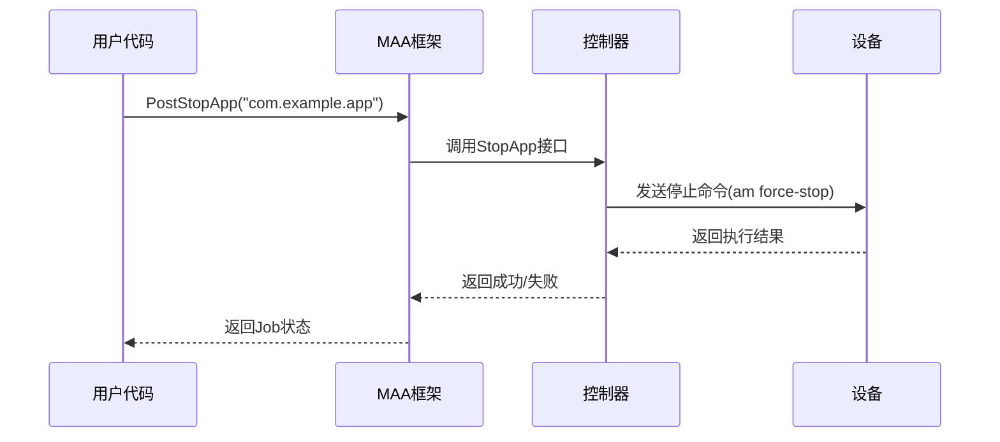

# 应用控制动作配置

<cite>
**本文档引用文件**  
- [pipeline.go](file://pipeline.go#L1869-L1921)
- [controller.go](file://controller.go#L187-L196)
- [custom_controller.go](file://custom_controller.go#L161-L197)
- [examples/quick-start/resource/pipeline/pipeline.json](file://examples/quick-start/resource/pipeline/pipeline.json#L1-L5)
- [context_test.go](file://context_test.go#L979-L1012)
</cite>

## 目录
1. [启动应用动作配置](#启动应用动作配置)
2. [停止应用动作配置](#停止应用动作配置)
3. [应用控制与其他识别动作的配合使用](#应用控制与其他识别动作的配合使用)
4. [完整流程配置示例](#完整流程配置示例)
5. [常见问题排查](#常见问题排查)

## 启动应用动作配置

`StartApp` 动作用于启动目标设备上的指定应用程序。该动作通过 `PackageName` 参数来指定要启动的应用程序包名或完整活动名。

在配置 `StartApp` 动作时，需要在管道配置文件中定义 `action` 类型为 `StartApp`，并在 `param` 中设置 `package` 参数。参数值可以是完整的包名（如 `com.example.app`），也可以是包含活动名的完整启动意图（如 `com.example.app/com.example.MainActivity`）。

`StartApp` 动作的参数结构定义在 `NodeStartAppParam` 类型中，其中 `Package` 字段为必需参数，用于指定目标应用的包名或启动意图。通过调用 `ActStartApp(pkg string)` 函数可以创建一个带有指定包名的 `StartApp` 动作。

**Section sources**
- [pipeline.go](file://pipeline.go#L1869-L1883)
- [examples/quick-start/resource/pipeline/pipeline.json](file://examples/quick-start/resource/pipeline/pipeline.json#L1-L5)

## 停止应用动作配置

`StopApp` 动作用于停止目标设备上运行的指定应用程序。该动作通过 `PackageName` 参数来指定要停止的应用程序包名。

`StopApp` 动作的执行机制基于底层控制器的实现。当调用 `PostStopApp` 方法时，框架会向控制器发送停止应用的请求，控制器根据具体平台（如 ADB 或 Win32）的特性执行相应的停止操作。对于 Android 平台，通常是通过 ADB 命令 `am force-stop` 来强制停止应用；对于 Windows 平台，则可能通过进程管理方式结束应用。

需要注意的是，`StopApp` 动作与正常退出的区别在于：`StopApp` 是强制性的进程终止，不会给应用留出执行清理代码的机会；而正常退出是应用自身响应退出信号并完成资源释放的过程。因此，在需要确保应用状态一致性时，应优先考虑模拟正常退出操作而非直接使用 `StopApp`。

`StopApp` 动作的参数结构定义在 `NodeStopAppParam` 类型中，其中 `Package` 字段为必需参数。通过调用 `ActStopApp(pkg string)` 函数可以创建一个带有指定包名的 `StopApp` 动作。



**Diagram sources**
- [pipeline.go](file://pipeline.go#L1884-L1899)
- [controller.go](file://controller.go#L193-L196)
- [custom_controller.go](file://custom_controller.go#L180-L197)

**Section sources**
- [pipeline.go](file://pipeline.go#L1884-L1899)
- [context_test.go](file://context_test.go#L991-L1012)

## 应用控制与其他识别动作的配合使用

应用控制动作通常需要与其他识别动作配合使用，以实现完整的自动化流程。典型的使用模式是在启动应用后等待应用加载完成，这可以通过循环识别特定界面元素来实现。

配置时，可以将 `StartApp` 动作与后续的识别动作（如图像识别或模板匹配）组合在一个任务节点中。首先执行 `StartApp` 启动应用，然后通过 `Recognition` 配置等待特定图像出现。可以设置重试次数和超时时间，确保在合理时间内完成加载检测。

例如，在启动游戏应用后，可以配置识别启动画面或主界面标志图像，一旦识别成功即表示应用已完全加载，可以继续执行后续操作。这种模式确保了自动化流程的稳定性和可靠性，避免因应用加载时间不确定而导致的操作失败。

此外，还可以结合 `Wait` 动作进行固定时间的等待，或者使用 `Loop` 结构实现更复杂的等待逻辑。通过合理配置识别阈值和区域，可以提高识别的准确性和效率。

**Section sources**
- [pipeline.go](file://pipeline.go#L1869-L1899)
- [controller.go](file://controller.go#L187-L196)

## 完整流程配置示例

以下是一个完整的应用自动化启动和关闭流程配置示例：

```json
{
    "Startup": {
        "action": "StartApp",
        "param": {
            "package": "com.example.app"
        }
    },
    "WaitForLaunch": {
        "recognition": "TemplateMatch",
        "template": "home_screen.png",
        "target": "screen",
        "timeout": 30000
    },
    "PerformTasks": {
        "action": "Click",
        "target": {
            "x": 500,
            "y": 800
        }
    },
    "Shutdown": {
        "action": "StopApp",
        "param": {
            "package": "com.example.app"
        }
    }
}
```

此配置首先启动指定包名的应用，然后等待主界面出现（超时时间为30秒），接着执行点击操作，最后停止应用。整个流程通过任务节点的顺序执行实现自动化控制。

**Section sources**
- [examples/quick-start/resource/pipeline/pipeline.json](file://examples/quick-start/resource/pipeline/pipeline.json#L1-L5)
- [pipeline.go](file://pipeline.go#L1869-L1899)

## 常见问题排查

当遇到应用无法启动的问题时，可按照以下步骤进行排查：

1. **检查包名正确性**：确认配置的包名是否准确无误，可通过设备命令行工具（如 `adb shell pm list packages`）验证包名是否存在。

2. **验证设备连接状态**：确保设备已正确连接且控制器处于连接状态，可通过 `Connected()` 方法检查连接状态。

3. **查看日志输出**：启用框架的详细日志功能，检查启动过程中的错误信息，定位具体失败原因。

4. **权限检查**：确认应用是否具有必要的运行权限，某些应用可能需要特殊权限才能正常启动。

5. **资源占用情况**：检查设备是否存在资源不足的情况，如内存占用过高可能导致新应用无法启动。

6. **框架版本兼容性**：确认使用的 MAA 框架版本与设备平台兼容，必要时更新到最新版本。

通过系统化的排查流程，可以有效解决大多数应用启动问题，确保自动化任务的稳定执行。

**Section sources**
- [controller.go](file://controller.go#L248-L251)
- [pipeline.go](file://pipeline.go#L1869-L1899)