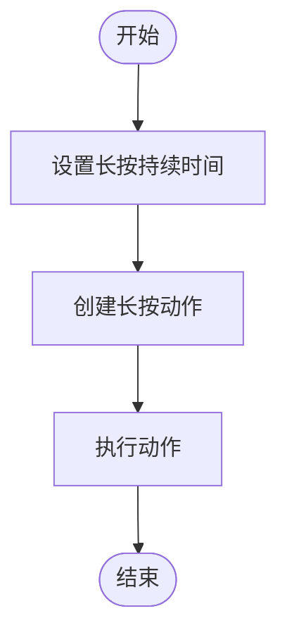

# 按键输入动作配置

<cite>
**本文档引用文件**  
- [pipeline.go](file://pipeline.go)
- [controller.go](file://controller.go)
- [custom_controller.go](file://custom_controller.go)
- [adb/adb.go](file://controller/adb/adb.go)
- [win32/win32.go](file://controller/win32/win32.go)
</cite>

## 目录
1. [简介](#简介)
2. [按键动作类型](#按键动作类型)
3. [KeyCode参数定义](#keycode参数定义)
4. [按键持续时间设置](#按键持续时间设置)
5. [应用场景](#应用场景)
6. [组合键实现](#组合键实现)
7. [设备按键映射差异处理](#设备按键映射差异处理)
8. [结论](#结论)

## 简介
MAA Framework Go 提供了一套完整的按键输入系统，支持多种按键动作类型，包括点击、长按、按下和释放等。该系统通过虚拟键码（KeyCode）来标识不同的按键，并支持在不同设备平台（如ADB和Win32）上进行按键操作。本文档将详细介绍按键动作的配置参数和使用方法，以及如何在游戏控制和系统操作等场景中应用这些功能。

## 按键动作类型
MAA Framework Go 支持以下几种按键动作类型：

- **点击按键（ClickKey）**：模拟一次按键点击操作。
- **长按按键（LongPressKey）**：模拟按键长按操作，可设置持续时间。
- **按下按键（KeyDown）**：模拟按键按下操作，不自动释放。
- **释放按键（KeyUp）**：模拟按键释放操作，通常与KeyDown配对使用。

这些动作类型通过不同的函数创建，如`ActClickKey`、`ActLongPressKey`、`ActKeyDown`和`ActKeyUp`。

**Section sources**
- [pipeline.go](file://pipeline.go#L1778-L1849)

## KeyCode参数定义
KeyCode参数用于指定要操作的按键，支持硬件按键、功能按键和特殊按键。KeyCode是一个整数数组，可以同时指定多个按键。

### 硬件按键
硬件按键通常指物理键盘上的按键，如字母键、数字键等。在Win32平台上，这些按键的KeyCode遵循Windows虚拟键码标准。

### 功能按键
功能按键包括F1-F12、Ctrl、Alt、Shift等。这些按键在不同操作系统和设备上可能有不同的KeyCode值。

### 特殊按键
特殊按键包括音量加减、电源键、返回键等。在ADB平台上，这些按键的KeyCode遵循Android系统的KeyEvent标准。

**Section sources**
- [pipeline.go](file://pipeline.go#L1779-L1782)
- [pipeline.go](file://pipeline.go#L1796-L1798)

## 按键持续时间设置
按键持续时间的设置主要用于长按操作。通过`WithLongPressKeyDuration`选项可以设置长按的持续时间，单位为毫秒。



**Diagram sources**
- [pipeline.go](file://pipeline.go#L1807-L1810)

## 应用场景
按键动作在多种场景下都有广泛应用，如游戏控制、系统操作等。

### 音量调节
通过发送音量加减键的KeyCode，可以实现音量的调节。例如，在Android设备上，可以使用KEYCODE_VOLUME_UP和KEYCODE_VOLUME_DOWN来调节音量。

### 返回键操作
在移动设备上，返回键是一个常用的操作。通过发送KEYCODE_BACK的KeyCode，可以实现返回上一级界面的功能。

**Section sources**
- [pipeline.go](file://pipeline.go#L1786-L1792)
- [pipeline.go](file://pipeline.go#L1812-L1819)

## 组合键实现
组合键的实现可以通过同时指定多个KeyCode来完成。例如，要实现Ctrl+C的复制操作，可以将Ctrl和C的KeyCode同时传递给`ActClickKey`函数。

```go
keys := []int{KEYCODE_CTRL_LEFT, KEYCODE_C}
action := ActClickKey(keys)
```

**Section sources**
- [pipeline.go](file://pipeline.go#L1787-L1791)

## 设备按键映射差异处理
不同设备平台上的按键映射可能存在差异。例如，Win32平台和ADB平台的KeyCode值可能不同。为了处理这种差异，可以在代码中根据设备类型进行条件判断，并选择相应的KeyCode值。

```go
if device.IsAdb() {
    key = KEYCODE_VOLUME_UP
} else {
    key = VK_VOLUME_UP
}
```

**Section sources**
- [controller/adb/adb.go](file://controller/adb/adb.go#L22-L44)
- [controller/win32/win32.go](file://controller/win32/win32.go#L28-L38)

## 结论
MAA Framework Go 提供了灵活且强大的按键输入系统，支持多种按键动作类型和复杂的按键组合。通过合理配置KeyCode参数和持续时间，可以在各种应用场景中实现精确的按键控制。同时，通过处理不同设备平台的按键映射差异，确保了跨平台的兼容性和稳定性。