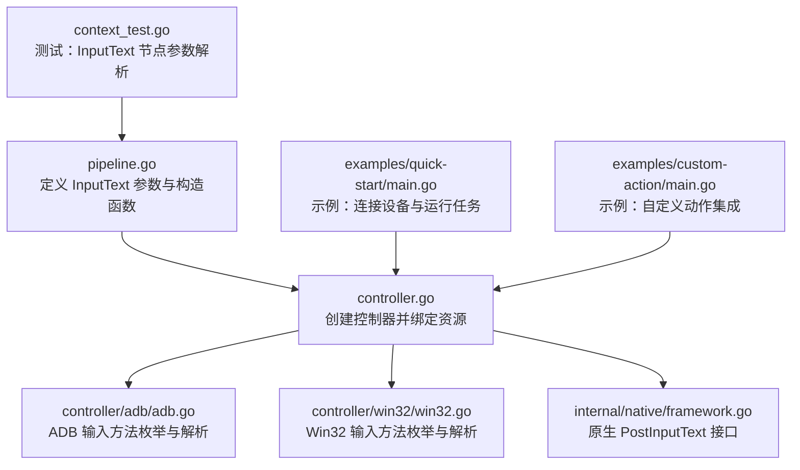
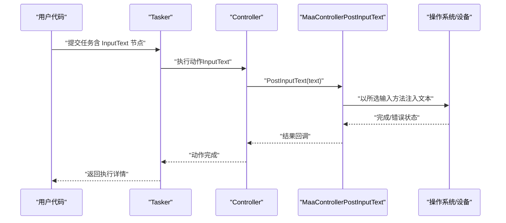
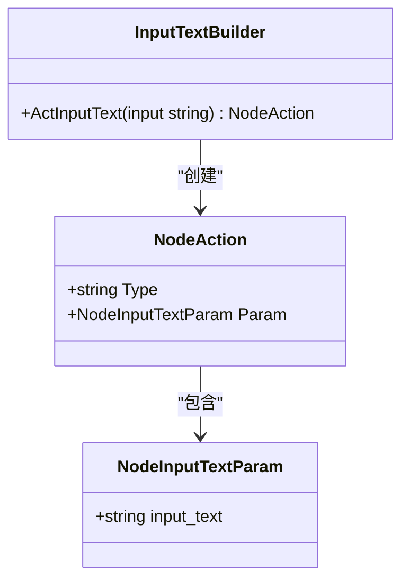
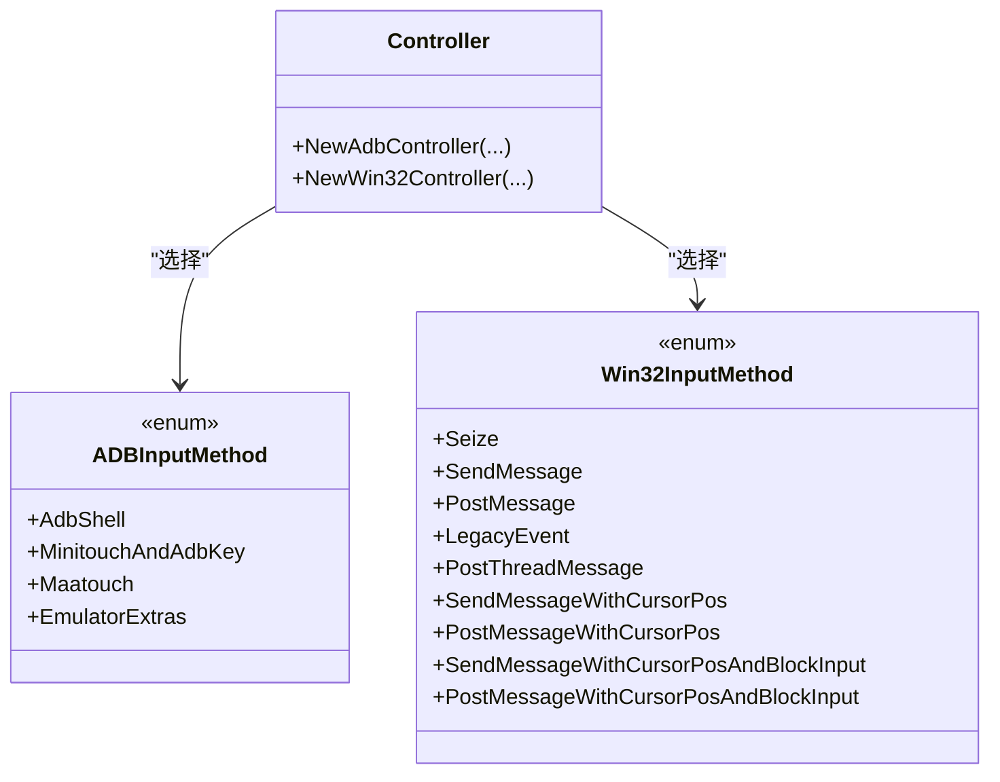
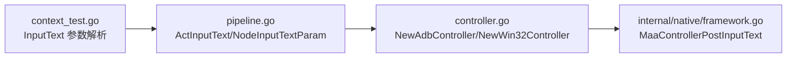

# 文本输入动作配置

<cite>
**本文引用的文件**
- [pipeline.go](file://pipeline.go)
- [controller.go](file://controller.go)
- [controller/adb/adb.go](file://controller/adb/adb.go)
- [controller/win32/win32.go](file://controller/win32/win32.go)
- [internal/native/framework.go](file://internal/native/framework.go)
- [context_test.go](file://context_test.go)
- [examples/quick-start/main.go](file://examples/quick-start/main.go)
- [examples/custom-action/main.go](file://examples/custom-action/main.go)
- [README.md](file://README.md)
</cite>

## 目录
1. [简介](#简介)
2. [项目结构](#项目结构)
3. [核心组件](#核心组件)
4. [架构总览](#架构总览)
5. [详细组件分析](#详细组件分析)
6. [依赖关系分析](#依赖关系分析)
7. [性能与输入节奏建议](#性能与输入节奏建议)
8. [故障排查指南](#故障排查指南)
9. [结论](#结论)
10. [附录](#附录)

## 简介
本文件系统性介绍 MAA Framework Go 绑定中的“文本输入”动作（InputText），包括：
- 如何通过节点参数配置要输入的文本内容，支持 Unicode 字符与特殊字符
- 输入延迟与时序控制的配置思路与实现边界
- 在不同输入场景（登录表单、聊天消息等）的应用方式
- 与点击输入框等动作的组合使用模式
- 输入法切换与平台差异的注意事项与解决方案

## 项目结构
围绕文本输入动作的关键代码分布在以下模块：
- 动作定义与参数：pipeline.go 中定义了 InputText 动作及其参数类型
- 控制器输入方法：controller/adb/adb.go 与 controller/win32/win32.go 定义了各平台控制器的输入方法枚举与解析
- 控制器创建与绑定：controller.go 提供 NewAdbController/NewWin32Controller 的创建入口
- 原生桥接：internal/native/framework.go 暴露 PostInputText 等原生接口
- 示例与测试：examples 与 context_test 展示了 InputText 的使用与参数解析

图表来源
- [pipeline.go](file://pipeline.go#L1853-L1867)
- [controller.go](file://controller.go#L24-L76)
- [controller/adb/adb.go](file://controller/adb/adb.go#L37-L44)
- [controller/win32/win32.go](file://controller/win32/win32.go#L28-L38)
- [internal/native/framework.go](file://internal/native/framework.go#L157-L174)
- [examples/quick-start/main.go](file://examples/quick-start/main.go#L1-L41)
- [examples/custom-action/main.go](file://examples/custom-action/main.go#L1-L49)
- [context_test.go](file://context_test.go#L945-L966)

章节来源
- [pipeline.go](file://pipeline.go#L1853-L1867)
- [controller.go](file://controller.go#L24-L76)
- [controller/adb/adb.go](file://controller/adb/adb.go#L37-L44)
- [controller/win32/win32.go](file://controller/win32/win32.go#L28-L38)
- [internal/native/framework.go](file://internal/native/framework.go#L157-L174)
- [examples/quick-start/main.go](file://examples/quick-start/main.go#L1-L41)
- [examples/custom-action/main.go](file://examples/custom-action/main.go#L1-L49)
- [context_test.go](file://context_test.go#L945-L966)

## 核心组件
- 文本输入动作参数
  - NodeInputTextParam：包含 input_text 字段，用于指定要输入的文本内容
  - ActInputText：便捷构造函数，返回一个带有 InputText 类型的动作节点
- 控制器输入方法
  - ADB 平台：InputMethod 枚举包含多种输入方法（如 AdbShell、MinitouchAndAdbKey、Maatouch、EmulatorExtras）
  - Win32 平台：InputMethod 枚举包含多种消息派发方式（如 SendMessage、PostMessage、LegacyEvent 等）
- 原生接口
  - MaaControllerPostInputText：将文本输入请求转发至底层框架

章节来源
- [pipeline.go](file://pipeline.go#L1853-L1867)
- [controller/adb/adb.go](file://controller/adb/adb.go#L37-L44)
- [controller/win32/win32.go](file://controller/win32/win32.go#L28-L38)
- [internal/native/framework.go](file://internal/native/framework.go#L157-L174)

## 架构总览
从调用链看，文本输入动作的执行路径如下：

图表来源
- [controller.go](file://controller.go#L24-L76)
- [internal/native/framework.go](file://internal/native/framework.go#L157-L174)

## 详细组件分析

### 文本输入动作参数与使用
- 参数结构
  - NodeInputTextParam：包含 input_text 字段，用于传入待输入的字符串
- 构造函数
  - ActInputText：快速创建一个 InputText 动作节点，参数为要输入的字符串
- 测试验证
  - context_test 中对 InputText 节点的参数解析进行了覆盖，确保 input_text 能被正确识别与提取

图表来源
- [pipeline.go](file://pipeline.go#L1853-L1867)
- [context_test.go](file://context_test.go#L945-L966)

章节来源
- [pipeline.go](file://pipeline.go#L1853-L1867)
- [context_test.go](file://context_test.go#L945-L966)

### 输入方法与平台差异
- ADB 平台输入方法
  - 支持的方法：AdbShell、MinitouchAndAdbKey、Maatouch、EmulatorExtras
  - 默认策略：优先级顺序为 EmulatorExtras > Maatouch > MinitouchAndAdbKey > AdbShell
- Win32 平台输入方法
  - 支持的方法：Seize、SendMessage、PostMessage、LegacyEvent、PostThreadMessage、带光标位置的消息变体等
  - 解析与字符串映射：提供 ParseInputMethod 与 String 方法，支持大小写不敏感与空白处理
- 控制器创建
  - NewAdbController/NewWin32Controller 分别在创建时选择合适的输入方法，并将句柄保存到内部存储中

图表来源
- [controller/adb/adb.go](file://controller/adb/adb.go#L37-L44)
- [controller/win32/win32.go](file://controller/win32/win32.go#L28-L38)
- [controller.go](file://controller.go#L24-L76)

章节来源
- [controller/adb/adb.go](file://controller/adb/adb.go#L37-L44)
- [controller/win32/win32.go](file://controller/win32/win32.go#L28-L38)
- [controller.go](file://controller.go#L24-L76)

### 输入延迟与时序控制
- 当前实现边界
  - 文本输入动作本身未提供显式的“输入延迟/速度”参数
  - 延迟与时序通常通过上层流程控制（如节点间等待、重试策略、OCR/点击后等待）实现
- 实践建议
  - 在需要模拟真实用户节奏时，可在 InputText 前后插入等待节点或使用长按/滑动等动作进行节奏控制
  - 对于需要逐字节输入的场景，可考虑拆分为多个 InputText 节点并插入等待，但需结合目标应用的输入法行为进行验证

章节来源
- [pipeline.go](file://pipeline.go#L1853-L1867)

### Unicode 与特殊字符支持
- 参数层面
  - input_text 为字符串字段，理论上可承载任意 UTF-8 文本
- 平台差异
  - 注释中明确指出：某些控制器仅支持 ASCII；这意味着在非 ASCII 场景下，应优先选择支持更广的输入方法或平台
- 建议
  - 在多语言输入场景（如日文、韩文、表情符号）中，优先使用 Win32 或具备 IME 支持的输入方法
  - 若目标应用存在输入法切换问题，可在输入前先触发一次键盘事件或点击输入框以激活输入法

章节来源
- [pipeline.go](file://pipeline.go#L1853-L1867)
- [controller/adb/adb.go](file://controller/adb/adb.go#L37-L44)
- [controller/win32/win32.go](file://controller/win32/win32.go#L28-L38)

### 典型应用场景
- 登录表单填写
  - 步骤：点击用户名输入框 -> InputText -> 点击密码输入框 -> InputText -> 点击登录按钮
  - 注意：若输入法未激活，可在 InputText 前插入点击输入框或键盘事件
- 聊天消息发送
  - 步骤：定位输入框 -> InputText -> 定位发送按钮 -> 点击发送
  - 注意：部分应用在输入法切换后会改变焦点或布局，建议在发送前加入等待或二次确认

章节来源
- [context_test.go](file://context_test.go#L945-L966)
- [examples/quick-start/main.go](file://examples/quick-start/main.go#L1-L41)

### 与其他动作的组合模式
- 点击输入框
  - 在 InputText 前先点击输入框，确保焦点已就绪
- 键盘事件
  - 可在输入前后插入 KeyDown/KeyUp 或 ClickKey，用于触发输入法切换或回车键
- 等待与重试
  - 使用等待节点或重试机制，确保输入框可用、IME 已激活后再执行 InputText

章节来源
- [pipeline.go](file://pipeline.go#L1853-L1867)
- [context_test.go](file://context_test.go#L945-L966)

### 输入法切换与特殊情况
- 输入法未激活
  - 方案：在 InputText 前插入点击输入框或键盘事件，确保输入法处于激活状态
- 多语言输入
  - 方案：优先使用 Win32 或具备 IME 支持的输入方法；必要时在输入前切换输入法
- 应用特定行为
  - 部分应用会在输入法切换后自动聚焦或刷新界面，建议在关键节点后增加等待或二次识别

章节来源
- [controller/adb/adb.go](file://controller/adb/adb.go#L37-L44)
- [controller/win32/win32.go](file://controller/win32/win32.go#L28-L38)

## 依赖关系分析
- 控制器创建与绑定
  - NewAdbController/NewWin32Controller 将输入方法作为参数传入，并初始化内部存储
- 原生接口
  - MaaControllerPostInputText 将文本输入请求传递给底层框架
- 参数解析与测试
  - context_test 对 InputText 节点参数进行解析验证，确保 input_text 字段正确提取

图表来源
- [pipeline.go](file://pipeline.go#L1853-L1867)
- [controller.go](file://controller.go#L24-L76)
- [internal/native/framework.go](file://internal/native/framework.go#L157-L174)
- [context_test.go](file://context_test.go#L945-L966)

章节来源
- [controller.go](file://controller.go#L24-L76)
- [internal/native/framework.go](file://internal/native/framework.go#L157-L174)
- [context_test.go](file://context_test.go#L945-L966)

## 性能与输入节奏建议
- 输入方法选择
  - ADB：优先 EmulatorExtras > Maatouch > MinitouchAndAdbKey > AdbShell
  - Win32：根据目标应用稳定性选择 SendMessage/PostMessage 等，必要时启用带光标位置的消息变体
- 节流与等待
  - 在高频输入或复杂输入法场景下，适当增加节点间的等待时间，避免输入缓冲区溢出
- 逐字节输入
  - 对于需要严格模拟人类节奏的场景，可将长文本拆分为多个 InputText 节点并插入等待，但需结合目标应用行为进行验证

章节来源
- [controller/adb/adb.go](file://controller/adb/adb.go#L37-L44)
- [controller/win32/win32.go](file://controller/win32/win32.go#L28-L38)

## 故障排查指南
- 输入法未激活导致无法输入
  - 症状：InputText 后无任何字符出现
  - 处理：在 InputText 前插入点击输入框或键盘事件，确保输入法处于激活状态
- 非 ASCII 字符乱码
  - 症状：中文、日文、表情符号显示异常
  - 处理：更换为支持更广的输入方法或平台；在输入前切换输入法
- 节点参数解析失败
  - 症状：Pipeline 中 InputText 参数未生效
  - 处理：检查 input_text 字段是否正确拼写与赋值；参考测试用例验证参数解析

章节来源
- [context_test.go](file://context_test.go#L945-L966)
- [controller/adb/adb.go](file://controller/adb/adb.go#L37-L44)
- [controller/win32/win32.go](file://controller/win32/win32.go#L28-L38)

## 结论
- 文本输入动作通过 NodeInputTextParam.input_text 提供基础能力，支持 Unicode 与特殊字符
- 输入延迟与时序控制需通过上层流程设计实现，当前版本未提供显式延迟参数
- 不同平台与输入方法对 Unicode 的支持存在差异，应优先选择具备 IME 支持的方法
- 在实际应用中，建议与点击输入框、键盘事件等动作组合使用，并在关键节点增加等待与重试机制

## 附录
- 快速开始示例展示了如何连接设备并运行任务，可作为编写 InputText 流程的基础模板
- 自定义动作示例展示了如何扩展自动化逻辑，便于在 InputText 前后插入业务前置/后置处理

章节来源
- [examples/quick-start/main.go](file://examples/quick-start/main.go#L1-L41)
- [examples/custom-action/main.go](file://examples/custom-action/main.go#L1-L49)
- [README.md](file://README.md#L1-L169)