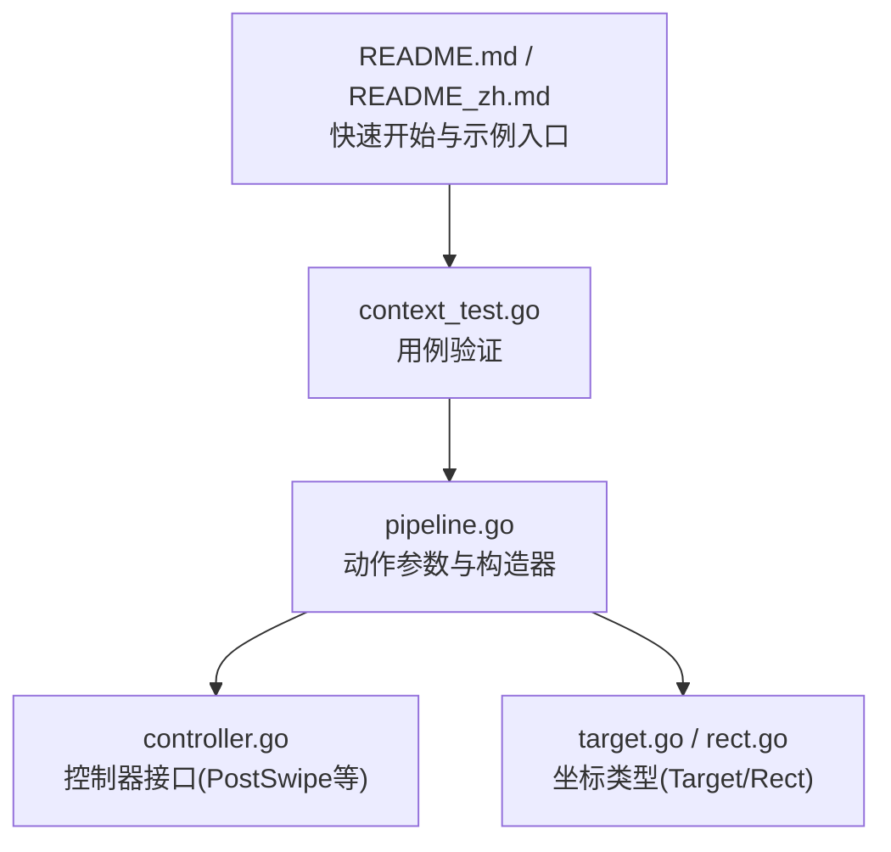
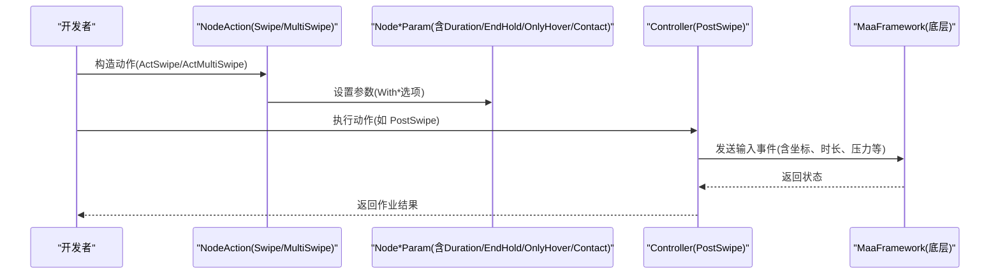
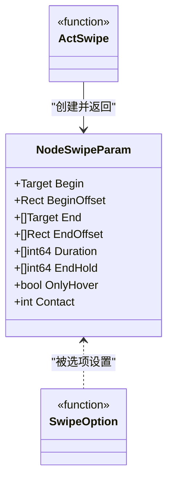
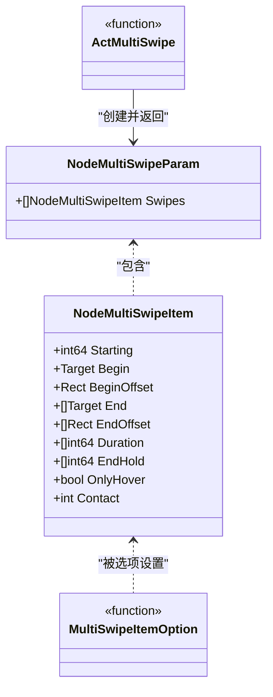
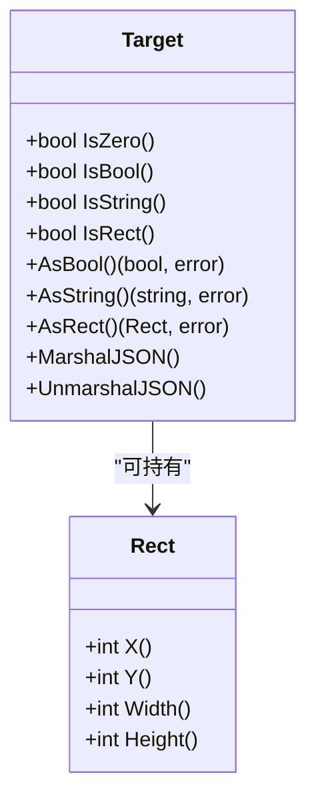
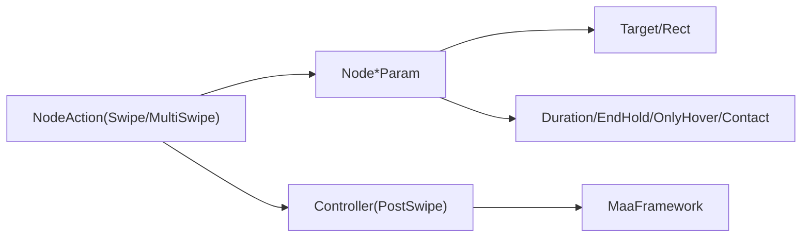

# 滑动动作配置

<cite>
**本文引用的文件**
- [pipeline.go](file://pipeline.go)
- [context_test.go](file://context_test.go)
- [controller.go](file://controller.go)
- [target.go](file://target.go)
- [rect.go](file://rect.go)
- [README.md](file://README.md)
- [README_zh.md](file://README_zh.md)
</cite>

## 目录
1. [简介](#简介)
2. [项目结构](#项目结构)
3. [核心组件](#核心组件)
4. [架构总览](#架构总览)
5. [详细组件分析](#详细组件分析)
6. [依赖关系分析](#依赖关系分析)
7. [性能考虑](#性能考虑)
8. [故障排查指南](#故障排查指南)
9. [结论](#结论)
10. [附录](#附录)

## 简介
本文件系统化梳理 MAA Framework Go 绑定中的“滑动”动作配置，覆盖以下主题：
- 基础滑动参数：起始点、结束点、持续时间、接触点ID、悬停模式、结束停留等
- 复杂路径与多指滑动：通过 MultiSwipeItem 配置多段路径与多指并发
- 曲线滑动思路：通过分段路径与时间分配实现近似曲线轨迹
- 延迟与等待：PreDelay、PostDelay 的合理范围；PreWaitFreezes、PostWaitFreezes 对流畅性的影响
- 实战案例：从直线滑动到复杂手势（如页面翻页）的配置方法
- 性能优化与常见问题

## 项目结构
与滑动相关的核心代码集中在 pipeline.go 中的动作参数定义与构造函数，配合 controller.go 的底层控制器接口，以及 target/rect 类型用于坐标表达。

图表来源
- [pipeline.go](file://pipeline.go#L1420-L1645)
- [controller.go](file://controller.go#L169-L173)
- [target.go](file://target.go#L1-L18)
- [rect.go](file://rect.go#L1-L6)
- [context_test.go](file://context_test.go#L707-L767)
- [README.md](file://README.md#L78-L134)
- [README_zh.md](file://README_zh.md#L78-L134)

章节来源
- [pipeline.go](file://pipeline.go#L1420-L1645)
- [controller.go](file://controller.go#L169-L173)
- [target.go](file://target.go#L1-L18)
- [rect.go](file://rect.go#L1-L6)
- [context_test.go](file://context_test.go#L707-L767)
- [README.md](file://README.md#L78-L134)
- [README_zh.md](file://README_zh.md#L78-L134)

## 核心组件
- 单指滑动参数：NodeSwipeParam
  - 起始点 Begin 与偏移 BeginOffset
  - 结束点 End 列表与偏移 EndOffset 列表
  - 持续时间 Duration（毫秒）
  - 结束停留 EndHold（毫秒）
  - 悬停 OnlyHover（不按压/抬起）
  - 接触点 Contact（ADB：手指索引；Win32：鼠标按键）
- 多指滑动参数：NodeMultiSwipeParam
  - Swipes：NodeMultiSwipeItem 数组
- 多指滑动项：NodeMultiSwipeItem
  - Starting：该子滑动在动作内的启动时刻（毫秒）
  - Begin/End/BeginOffset/EndOffset/Duration/EndHold/OnlyHover/Contact 同上

章节来源
- [pipeline.go](file://pipeline.go#L1420-L1645)

## 架构总览
滑动动作从高层配置到底层执行的流程如下：

图表来源
- [pipeline.go](file://pipeline.go#L1420-L1645)
- [controller.go](file://controller.go#L169-L173)

## 详细组件分析

### 单指滑动：NodeSwipeParam
- 参数要点
  - Begin/BeginOffset：起点与偏移
  - End/EndOffset：终点列表与偏移列表（支持多段路径）
  - Duration：每段持续时间（毫秒）
  - EndHold：每段结束前额外等待（毫秒）
  - OnlyHover：悬停模式（无按压/抬起）
  - Contact：接触点ID（ADB为手指索引，Win32为鼠标按键）
- 选项构造器
  - WithSwipeBegin/WithSwipeBeginOffset
  - WithSwipeEnd/WithSwipeEndOffset
  - WithSwipeDuration
  - WithSwipeEndHold
  - WithSwipeOnlyHover
  - WithSwipeContact
  - ActSwipe

图表来源
- [pipeline.go](file://pipeline.go#L1420-L1517)

章节来源
- [pipeline.go](file://pipeline.go#L1420-L1517)

### 多指滑动：NodeMultiSwipeParam 与 NodeMultiSwipeItem
- 参数要点
  - Swipes：多个子滑动项
  - 每个子项包含：
    - Starting：在动作内启动时刻（毫秒）
    - Begin/End/BeginOffset/EndOffset/Duration/EndHold/OnlyHover/Contact
- 选项构造器
  - WithMultiSwipeItemStarting
  - WithMultiSwipeItemBegin/WithMultiSwipeItemBeginOffset
  - WithMultiSwipeItemEnd/WithMultiSwipeItemEndOffset
  - WithMultiSwipeItemDuration
  - WithMultiSwipeItemEndHold
  - WithMultiSwipeItemOnlyHover
  - WithMultiSwipeItemContact
  - NewMultiSwipeItem
  - ActMultiSwipe

图表来源
- [pipeline.go](file://pipeline.go#L1519-L1645)

章节来源
- [pipeline.go](file://pipeline.go#L1519-L1645)

### 坐标与区域类型：Target 与 Rect
- Rect：四元组[x, y, width, height]
- Target：可持有布尔、字符串或 Rect 的类型安全变体
- 作用：作为位置与区域的统一表达，用于 Begin/End、Offset 等参数

图表来源
- [rect.go](file://rect.go#L1-L6)
- [target.go](file://target.go#L1-L18)
- [internal/target/target.go](file://internal/target/target.go#L1-L121)
- [internal/rect/rect.go](file://internal/rect/rect.go#L1-L20)

章节来源
- [rect.go](file://rect.go#L1-L6)
- [target.go](file://target.go#L1-L18)
- [internal/target/target.go](file://internal/target/target.go#L1-L121)
- [internal/rect/rect.go](file://internal/rect/rect.go#L1-L20)

### 延迟与等待：PreDelay、PostDelay、PreWaitFreezes、PostWaitFreezes
- PreDelay：节点执行前的延迟（毫秒）
- PostDelay：节点执行后的延迟（毫秒）
- PreWaitFreezes：执行前等待画面稳定（监控区域、阈值、检查间隔、超时等）
- PostWaitFreezes：执行后等待画面稳定
- 影响：合理的延迟与等待可避免误判与抖动，提升滑动后识别的稳定性

章节来源
- [pipeline.go](file://pipeline.go#L143-L2114)

### 底层控制器接口：PostSwipe
- 控制器提供 PostSwipe(x1, y1, x2, y2, duration) 方法，将滑动事件下发到底层框架
- 作用：将高层配置转换为底层输入事件

章节来源
- [controller.go](file://controller.go#L169-L173)

## 依赖关系分析
- NodeAction(Swipe/MultiSwipe) 依赖 Node*Param（含坐标、时序、接触点等）
- Node*Param 依赖 Target/Rect 表达位置与区域
- 执行阶段依赖 Controller.PostSwipe 等接口将事件下发至底层框架

图表来源
- [pipeline.go](file://pipeline.go#L1420-L1645)
- [controller.go](file://controller.go#L169-L173)
- [target.go](file://target.go#L1-L18)
- [rect.go](file://rect.go#L1-L6)

章节来源
- [pipeline.go](file://pipeline.go#L1420-L1645)
- [controller.go](file://controller.go#L169-L173)
- [target.go](file://target.go#L1-L18)
- [rect.go](file://rect.go#L1-L6)

## 性能考虑
- 分段滑动与时间分配
  - 使用 NodeSwipeParam.End 列表与 Duration 列表，将长距离滑动拆分为多段，降低单次轨迹复杂度
  - 通过 EndHold 在关键点增加停留，便于识别稳定
- 多指并发
  - 使用 NodeMultiSwipeItem.Starting 差异实现多指并发，减少总时长
- 接触点与平台差异
  - ADB：Contact 为手指索引；Win32：Contact 为鼠标按键
  - 合理选择 Contact 可避免冲突与误触
- 延迟与等待
  - PreDelay/PostDelay 用于规避系统响应抖动
  - PreWaitFreezes/PostWaitFreezes 用于等待画面稳定，提高后续识别成功率
- 坐标精度
  - BeginOffset/EndOffset 与 Target/Rect 的组合可微调起点与终点，减少误差

[本节为通用指导，不直接分析具体文件]

## 故障排查指南
- 参数未生效
  - 确认已正确使用 With* 选项设置 Node*Param，并通过 Act* 创建 NodeAction
  - 参考用例验证参数映射是否正确
- 坐标不准确
  - 检查 Target/Rect 的四元组含义（x,y,width,height），确保与设备分辨率一致
  - 使用 BeginOffset/EndOffset 微调
- 多指冲突
  - 检查各 NodeMultiSwipeItem 的 Contact 是否冲突
  - 使用 Starting 差异错峰触发
- 识别不稳定
  - 增加 PostDelay 或启用 PostWaitFreezes
  - 在关键点增加 EndHold
- 示例参考
  - 单指滑动与多指滑动的 JSON/Go 构造均可参考测试用例

章节来源
- [context_test.go](file://context_test.go#L707-L767)

## 结论
- 单指滑动通过 NodeSwipeParam 提供了丰富的时序与位置控制能力
- 多指滑动通过 NodeMultiSwipeParam/NodeMultiSwipeItem 支持并发与复杂路径
- 延迟与等待机制可显著提升滑动后识别的稳定性
- 坐标类型 Target/Rect 保证了位置表达的一致性与扩展性
- 实战中应结合业务场景（如页面翻页）进行分段与并发设计，并通过延迟与等待保障稳定性

[本节为总结，不直接分析具体文件]

## 附录

### 实战案例：从直线滑动到复杂手势
- 直线滑动
  - 使用 ActSwipe + WithSwipeBegin/WithSwipeEnd/WithSwipeDuration
  - 若需在终点短暂停留，使用 WithSwipeEndHold
- 页面翻页
  - 使用 NodeSwipeParam.End 列表与 Duration 列表分段滑动
  - 在关键帧增加 EndHold，等待页面稳定后再继续
- 多指手势
  - 使用 ActMultiSwipe + NewMultiSwipeItem 构建多子滑动
  - 通过 WithMultiSwipeItemStarting 差异实现并发
  - 通过 WithMultiSwipeItemContact 为不同手指分配接触点
- 游戏操作
  - 使用 OnlyHover 模式模拟悬停（如长按前的准备）
  - 使用 EndHold 与 PostDelay 控制节奏

章节来源
- [pipeline.go](file://pipeline.go#L1420-L1645)
- [context_test.go](file://context_test.go#L707-L767)

### 参数对照表（摘要）
- NodeSwipeParam
  - Begin/BeginOffset：起点与偏移
  - End/EndOffset：终点列表与偏移列表
  - Duration：每段持续时间（毫秒）
  - EndHold：每段结束前等待（毫秒）
  - OnlyHover：悬停模式
  - Contact：接触点ID
- NodeMultiSwipeParam
  - Swipes：NodeMultiSwipeItem 列表
- NodeMultiSwipeItem
  - Starting：子滑动在动作内的启动时刻（毫秒）
  - Begin/End/Offset/Duration/EndHold/OnlyHover/Contact：同上

章节来源
- [pipeline.go](file://pipeline.go#L1420-L1645)