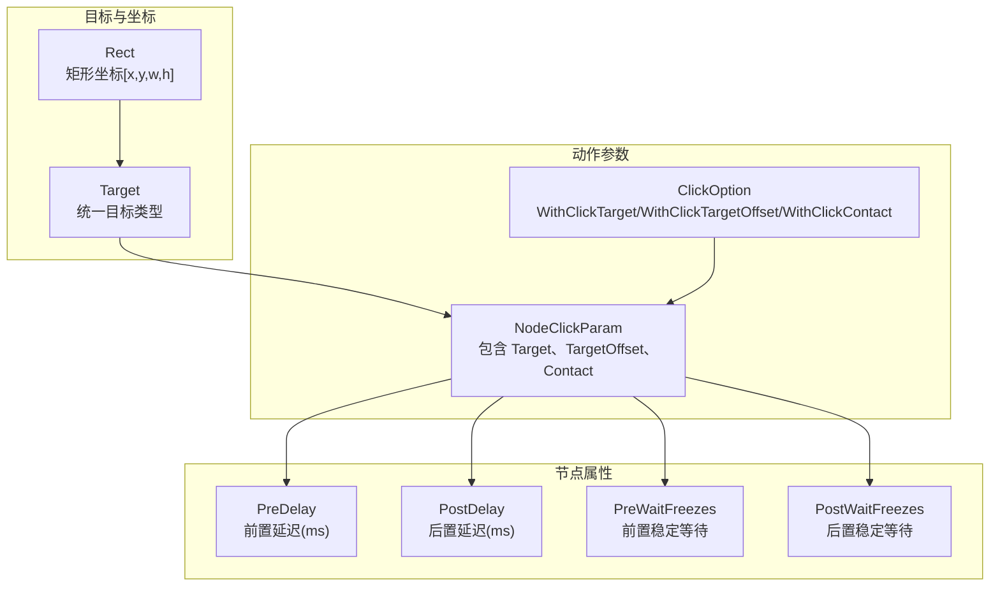
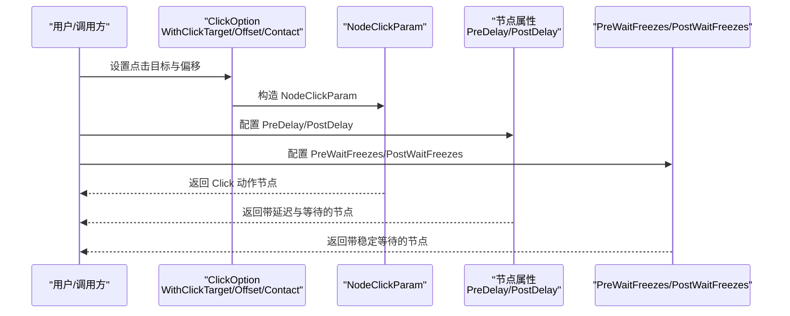
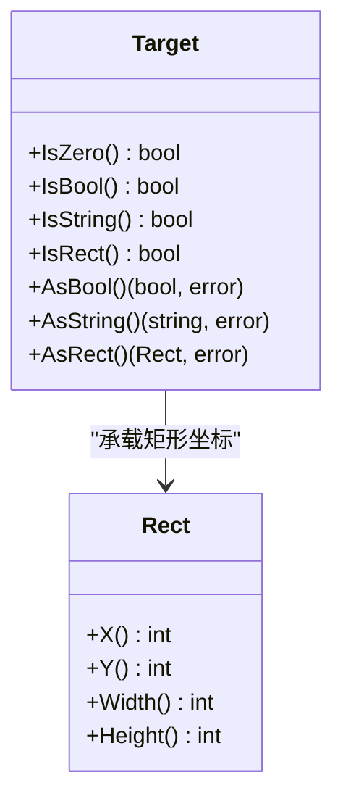
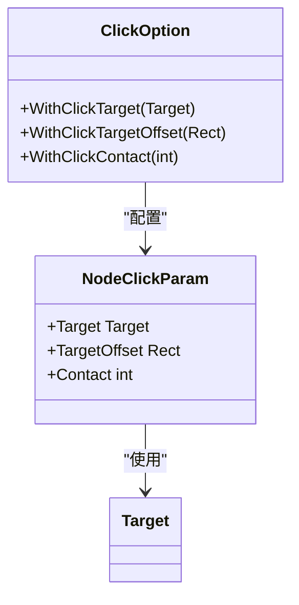
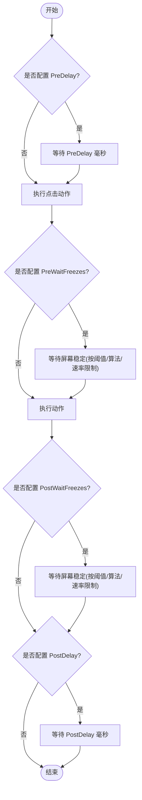
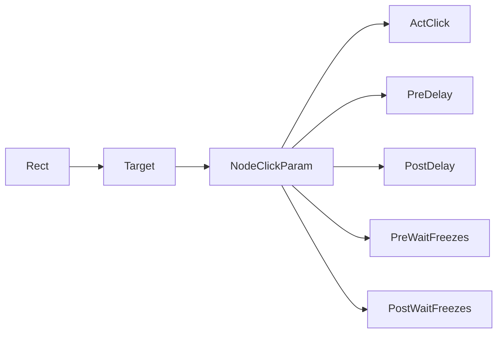

# 点击动作配置

<cite>
**本文引用的文件列表**
- [target.go](file://target.go)
- [internal/target/target.go](file://internal/target/target.go)
- [rect.go](file://rect.go)
- [internal/rect/rect.go](file://internal/rect/rect.go)
- [pipeline.go](file://pipeline.go)
- [context_test.go](file://context_test.go)
</cite>

## 目录
1. [简介](#简介)
2. [项目结构与定位](#项目结构与定位)
3. [核心组件](#核心组件)
4. [架构总览](#架构总览)
5. [详细组件分析](#详细组件分析)
6. [依赖关系分析](#依赖关系分析)
7. [性能与稳定性考量](#性能与稳定性考量)
8. [故障排查指南](#故障排查指南)
9. [结论](#结论)
10. [附录：配置示例与最佳实践](#附录配置示例与最佳实践)

## 简介
本章节面向需要在自动化流程中使用“点击”动作的用户，系统性说明点击动作的配置参数与使用方法，重点覆盖：
- Target 参数如何定义点击坐标，支持的坐标类型（绝对坐标、相对坐标、偏移坐标）
- PreDelay 与 PostDelay 在点击前后设置延迟
- PreWaitFreezes 与 PostWaitFreezes 如何确保屏幕稳定
- 实战案例：按钮点击、随机区域点击等场景下的配置方式
- 与其他动作的组合使用模式
- 常见问题排查思路（如点击无效）

## 项目结构与定位
为实现点击动作的可配置性，框架将“目标位置”抽象为统一的 Target 类型，并通过 NodeClickParam 将其与节点动作参数绑定；同时提供预/后置等待稳定（WaitFreezes）与延迟（PreDelay/PostDelay）等通用节点属性。

图表来源
- [target.go](file://target.go#L1-L17)
- [internal/target/target.go](file://internal/target/target.go#L1-L122)
- [rect.go](file://rect.go#L1-L6)
- [internal/rect/rect.go](file://internal/rect/rect.go#L1-L21)
- [pipeline.go](file://pipeline.go#L1323-L1366)

章节来源
- [target.go](file://target.go#L1-L17)
- [internal/target/target.go](file://internal/target/target.go#L1-L122)
- [rect.go](file://rect.go#L1-L6)
- [internal/rect/rect.go](file://internal/rect/rect.go#L1-L21)
- [pipeline.go](file://pipeline.go#L1323-L1366)

## 核心组件
- Target：统一的目标类型，可承载布尔值、字符串或矩形坐标，用于表达点击目标位置或条件。
- Rect：二维矩形坐标，通常以 [x, y, width, height] 表达绝对坐标或区域。
- NodeClickParam：点击动作的参数载体，包含 Target、TargetOffset、Contact 等字段。
- ClickOption：函数式选项，用于便捷地设置 NodeClickParam 的各字段。
- 节点通用属性：PreDelay、PostDelay、PreWaitFreezes、PostWaitFreezes，用于控制点击时机与稳定性。

章节来源
- [target.go](file://target.go#L1-L17)
- [internal/target/target.go](file://internal/target/target.go#L1-L122)
- [rect.go](file://rect.go#L1-L6)
- [internal/rect/rect.go](file://internal/rect/rect.go#L1-L21)
- [pipeline.go](file://pipeline.go#L1323-L1366)
- [pipeline.go](file://pipeline.go#L61-L63)

## 架构总览
点击动作从“目标定义”到“执行”的关键路径如下：

图表来源
- [pipeline.go](file://pipeline.go#L1323-L1366)
- [pipeline.go](file://pipeline.go#L61-L63)
- [pipeline.go](file://pipeline.go#L2036-L2114)

## 详细组件分析

### 目标类型与坐标体系（Target 与 Rect）
- Target 支持三种值类型：布尔、字符串、矩形坐标。在点击动作中，Target 通常承载矩形坐标，表示点击目标区域。
- Rect 由四个整数构成：[x, y, width, height]，分别代表左上角坐标与宽高。
- 通过 NewTargetRect 可将 Rect 包装为 Target，供 NodeClickParam 使用。

图表来源
- [internal/target/target.go](file://internal/target/target.go#L1-L122)
- [internal/rect/rect.go](file://internal/rect/rect.go#L1-L21)
- [target.go](file://target.go#L1-L17)
- [rect.go](file://rect.go#L1-L6)

章节来源
- [internal/target/target.go](file://internal/target/target.go#L1-L122)
- [internal/rect/rect.go](file://internal/rect/rect.go#L1-L21)
- [target.go](file://target.go#L1-L17)
- [rect.go](file://rect.go#L1-L6)

### 点击动作参数（NodeClickParam）
- 字段说明
  - Target：点击目标位置（建议使用矩形坐标，表示绝对坐标或区域）
  - TargetOffset：对目标坐标的额外偏移（可叠加）
  - Contact：触点标识（ADB：手指索引；Win32：鼠标按键）
- 构造方式
  - 使用 ActClick 并传入 ClickOption，如 WithClickTarget、WithClickTargetOffset、WithClickContact
  - 也可直接构造 NodeClickParam 后交由节点使用

图表来源
- [pipeline.go](file://pipeline.go#L1323-L1366)

章节来源
- [pipeline.go](file://pipeline.go#L1323-L1366)

### 坐标类型与含义
- 绝对坐标：Target 直接指定 [x, y, width, height]，表示屏幕上的固定位置与区域
- 相对坐标：通过 Target 承载的矩形坐标表达相对比例或相对区域（具体相对基准由控制器实现决定）
- 偏移坐标：TargetOffset 作为二次偏移叠加到 Target 上，常用于微调点击位置或扩大点击区域

章节来源
- [internal/target/target.go](file://internal/target/target.go#L1-L122)
- [internal/rect/rect.go](file://internal/rect/rect.go#L1-L21)
- [pipeline.go](file://pipeline.go#L1323-L1366)

### 延迟与稳定等待（PreDelay/PostDelay 与 WaitFreezes）
- PreDelay：在执行点击动作前等待指定毫秒数
- PostDelay：在执行点击动作后等待指定毫秒数
- PreWaitFreezes：在点击前等待屏幕稳定一段时间（基于模板匹配检测）
- PostWaitFreezes：在点击后等待屏幕稳定一段时间（基于模板匹配检测）

图表来源
- [pipeline.go](file://pipeline.go#L61-L63)
- [pipeline.go](file://pipeline.go#L2036-L2114)

章节来源
- [pipeline.go](file://pipeline.go#L61-L63)
- [pipeline.go](file://pipeline.go#L2036-L2114)

### 与其他动作的组合使用模式
- 与滑动/长按等动作组合：先通过 WaitFreezes 确保界面稳定，再执行点击；点击后再 WaitFreezes 等待新界面稳定
- 与自定义动作组合：在自定义动作中调用 ActClick 或通过节点参数传递 Target/Offset/Contact
- 与键盘动作组合：在点击前后插入 ClickKey/LongPressKey 等键位操作，注意合理设置 PreDelay/PostDelay

章节来源
- [pipeline.go](file://pipeline.go#L1323-L1366)
- [pipeline.go](file://pipeline.go#L2036-L2114)

## 依赖关系分析
- NodeClickParam 依赖 Target 与 Rect，用于表达点击目标与偏移
- 节点通用属性（PreDelay/PostDelay）与 WaitFreezes（PreWaitFreezes/PostWaitFreezes）独立于具体动作，但与点击动作配合使用
- ClickOption 提供函数式配置，降低调用复杂度

图表来源
- [internal/rect/rect.go](file://internal/rect/rect.go#L1-L21)
- [internal/target/target.go](file://internal/target/target.go#L1-L122)
- [pipeline.go](file://pipeline.go#L1323-L1366)
- [pipeline.go](file://pipeline.go#L61-L63)
- [pipeline.go](file://pipeline.go#L2036-L2114)

章节来源
- [internal/rect/rect.go](file://internal/rect/rect.go#L1-L21)
- [internal/target/target.go](file://internal/target/target.go#L1-L122)
- [pipeline.go](file://pipeline.go#L1323-L1366)
- [pipeline.go](file://pipeline.go#L61-L63)
- [pipeline.go](file://pipeline.go#L2036-L2114)

## 性能与稳定性考量
- 合理设置 WaitFreezes 的阈值、算法与检查速率，避免过度扫描导致性能开销
- 预/后置延迟应结合目标响应时间与界面动画时长进行权衡
- TargetOffset 过大可能导致点击区域超出预期，建议小步微调并结合截图验证

[本节为通用指导，不直接分析具体文件]

## 故障排查指南
- 点击无效
  - 检查 Target 是否正确设置为矩形坐标，且在当前分辨率与缩放下有效
  - 检查 TargetOffset 是否叠加导致目标偏移过大
  - 检查 PreWaitFreezes/PostWaitFreezes 是否过短或过长，必要时调整阈值与速率限制
  - 检查 PreDelay/PostDelay 是否影响了后续识别或交互时机
- 点击不稳定
  - 增加 PostWaitFreezes 的时间或降低阈值，确保界面稳定后再继续
  - 对频繁变化的界面，适当提高 RateLimit，减少检测频率
- 触点/按键异常
  - 确认 Contact 的取值与平台对应关系（ADB/Win32），避免误用

章节来源
- [pipeline.go](file://pipeline.go#L2036-L2114)
- [pipeline.go](file://pipeline.go#L61-L63)

## 结论
点击动作的配置围绕“目标位置”“偏移”“触点”“延迟”“稳定等待”五个维度展开。通过 Target/Rect 抽象与 ClickOption 组合，可以灵活表达绝对/相对/偏移坐标，并与 WaitFreezes、Pre/PostDelay 协同，提升自动化流程的稳定性与成功率。

[本节为总结性内容，不直接分析具体文件]

## 附录：配置示例与最佳实践

### 示例一：按钮点击（绝对坐标）
- 目标：点击屏幕某固定按钮
- 配置要点：
  - Target：使用 [x, y, width, height] 表示按钮区域
  - TargetOffset：如需微调，叠加较小偏移
  - PreWaitFreezes/PostWaitFreezes：根据界面动画时长设置
  - PreDelay/PostDelay：如需等待过渡效果完成，设置相应延迟

章节来源
- [context_test.go](file://context_test.go#L400-L416)
- [pipeline.go](file://pipeline.go#L1323-L1366)
- [pipeline.go](file://pipeline.go#L2036-L2114)

### 示例二：随机区域点击（相对坐标）
- 目标：在屏幕范围内随机点击
- 配置要点：
  - Target：使用相对坐标表达区域范围
  - TargetOffset：可叠加随机偏移，扩大点击容错
  - PreWaitFreezes：确保界面稳定后再生成随机点
  - PostWaitFreezes：等待界面变化后再继续

章节来源
- [internal/target/target.go](file://internal/target/target.go#L1-L122)
- [pipeline.go](file://pipeline.go#L1323-L1366)
- [pipeline.go](file://pipeline.go#L2036-L2114)

### 示例三：点击后等待界面稳定
- 目标：点击后等待新界面稳定
- 配置要点：
  - PostWaitFreezes：设置合理的 time、threshold、method、rate_limit、timeout
  - PostDelay：如需进一步等待，再追加延迟

章节来源
- [context_test.go](file://context_test.go#L1130-L1160)
- [pipeline.go](file://pipeline.go#L2036-L2114)

### 最佳实践清单
- 先 WaitFreezes 再点击，再 WaitFreezes 等待结果
- TargetOffset 控制在合理范围内，避免越界
- 预/后置延迟与 WaitFreezes 参数相互印证，避免冗余等待
- 不同平台（ADB/Win32）的 Contact 取值要与平台一致

章节来源
- [pipeline.go](file://pipeline.go#L61-L63)
- [pipeline.go](file://pipeline.go#L2036-L2114)