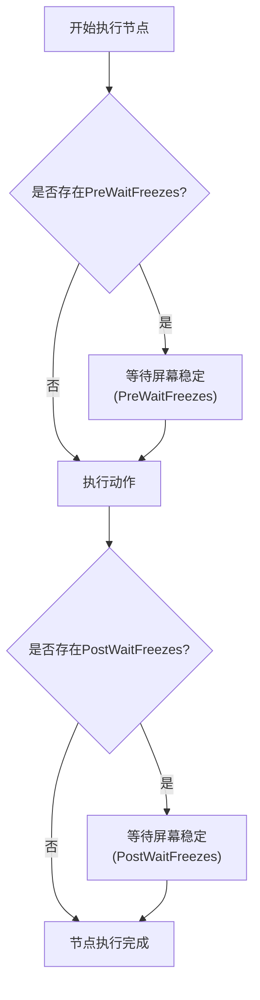
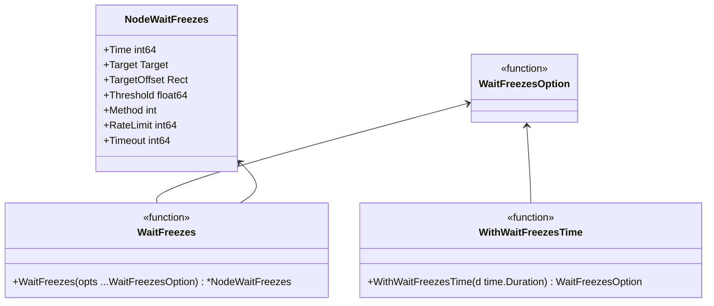
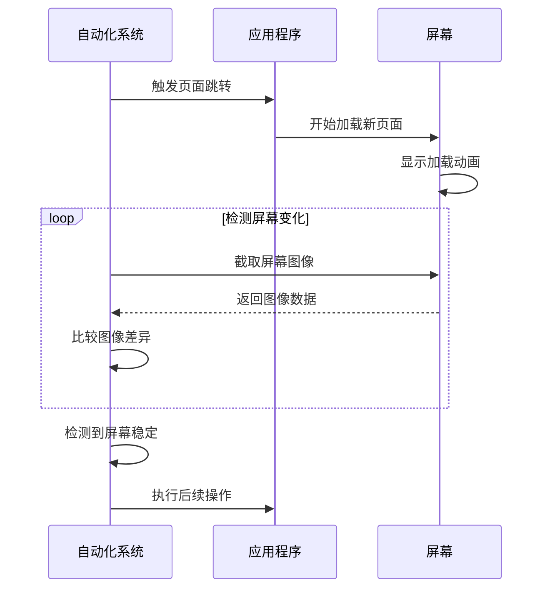
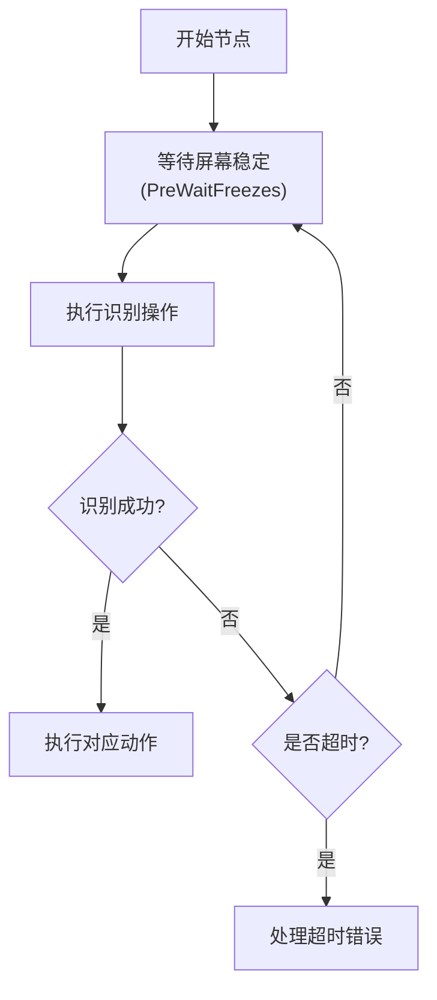

# 等待动作配置

<cite>
**本文档引用文件**  
- [pipeline.go](file://pipeline.go#L65-L2114)
- [context.go](file://context.go#L200)
- [job.go](file://job.go#L58-L63)
- [context_test.go](file://context_test.go#L1137-L1211)
- [examples/custom-action/main.go](file://examples/custom-action/main.go#L26-L31)
</cite>

## 目录
1. [等待动作概述](#等待动作概述)
2. [Duration参数配置](#duration参数配置)
3. [Wait动作在自动化流程中的作用](#wait动作在自动化流程中的作用)
4. [Wait动作与其他动作的组合使用](#wait动作与其他动作的组合使用)
5. [实际应用场景与等待策略](#实际应用场景与等待策略)
6. [优化建议与避免过度等待](#优化建议与避免过度等待)

## 等待动作概述

等待动作（Wait）是MAA框架中用于控制流程执行节奏的核心机制。与传统的PreDelay/PostDelay不同，Wait动作提供了更精确的等待控制能力，支持毫秒级精度的等待时长设置。Wait动作主要通过`PreWaitFreezes`和`PostWaitFreezes`两个配置项来实现，分别用于在动作执行前和执行后等待屏幕稳定。

Wait动作的核心优势在于其智能化的等待机制——它不是简单地等待固定时间，而是通过监控屏幕变化来判断是否达到稳定状态。当屏幕在指定时间内保持不变时，等待过程才会结束，从而确保后续操作在合适的时机执行。



**图示来源**  
- [pipeline.go](file://pipeline.go#L65-L68)
- [context_test.go](file://context_test.go#L1137-L1148)

**本节来源**  
- [pipeline.go](file://pipeline.go#L65-L68)
- [context_test.go](file://context_test.go#L1137-L1148)

## Duration参数配置

Duration参数用于精确设置等待时长，支持毫秒级精度。在MAA框架中，Duration参数主要通过`WithWaitFreezesTime`函数进行配置，该函数接受一个`time.Duration`类型的参数，并将其转换为毫秒值存储。



**图示来源**  
- [pipeline.go](file://pipeline.go#L2036-L2114)

**本节来源**  
- [pipeline.go](file://pipeline.go#L2058-L2063)
- [pipeline.go](file://pipeline.go#L2108-L2113)

Duration参数的配置示例如下：
- `100 * time.Millisecond`：设置100毫秒的等待时间
- `500 * time.Millisecond`：设置500毫秒的等待时间
- `1 * time.Second`：设置1秒的等待时间

在实际配置中，可以通过`WaitFreezes`函数组合多个选项来创建完整的等待配置：

```go
waitConfig := WaitFreezes(
    WithWaitFreezesTime(1 * time.Second),
    WithWaitFreezesThreshold(0.95),
    WithWaitFreezesTimeout(10 * time.Second),
)
```

## Wait动作在自动化流程中的作用

Wait动作在自动化流程中扮演着至关重要的角色，主要用于解决各种异步操作的同步问题。其主要作用包括：

### 等待页面加载完成

在自动化操作中，页面加载往往需要一定时间。使用Wait动作可以确保在页面完全加载后再进行后续操作，避免因页面未加载完成而导致的操作失败。



**图示来源**  
- [pipeline.go](file://pipeline.go#L2036-L2053)
- [context_test.go](file://context_test.go#L1137-L1148)

### 等待动画效果完成

许多应用程序在执行操作时会伴随动画效果，如按钮点击后的反馈动画、页面切换的过渡动画等。Wait动作可以确保这些动画效果完全结束后再进行下一步操作，提供更自然的自动化体验。

### 确保操作结果稳定

某些操作可能需要一段时间才能在界面上反映出来，如数据保存、网络请求响应等。Wait动作可以确保这些操作的结果在界面上稳定显示后再进行验证或后续操作。

**本节来源**  
- [pipeline.go](file://pipeline.go#L2036-L2053)
- [context_test.go](file://context_test.go#L1137-L1148)

## Wait动作与其他动作的组合使用

Wait动作可以与其他动作灵活组合，实现更复杂的流程控制。通过替代PreDelay/PostDelay，Wait动作提供了更精确的流程控制能力。

### 替代PreDelay实现精确控制

传统的PreDelay是在动作执行前等待固定时间，而Wait动作可以根据实际屏幕状态动态调整等待时间。这种基于状态的等待机制更加智能和高效。

```go
// 传统PreDelay方式
node := NewNode("Example",
    WithPreDelay(2 * time.Second),
    WithAction(ActClick()),
)

// Wait动作方式
node := NewNode("Example",
    WithPreWaitFreezes(WaitFreezes(
        WithWaitFreezesTime(1 * time.Second),
        WithWaitFreezesTimeout(5 * time.Second),
    )),
    WithAction(ActClick()),
)
```

### 与识别动作组合使用

Wait动作常与识别动作组合使用，确保在进行识别前界面已经达到稳定状态，提高识别的准确率。



**图示来源**  
- [pipeline.go](file://pipeline.go#L65-L68)
- [pipeline.go](file://pipeline.go#L2036-L2053)

### 与自定义动作的集成

在自定义动作中，也可以使用Wait机制来控制执行节奏。通过`PostConnect().Wait()`等方式，可以确保连接建立完成后再进行后续操作。

```go
// 在自定义动作中使用Wait
ctrl := maa.NewAdbController(...)
defer ctrl.Destroy()
ctrl.PostConnect().Wait() // 等待连接完成
tasker.BindController(ctrl)
```

**本节来源**  
- [pipeline.go](file://pipeline.go#L159-L166)
- [examples/custom-action/main.go](file://examples/custom-action/main.go#L26-L31)
- [context.go](file://context.go#L200)

## 实际应用场景与等待策略

### 页面跳转等待策略

在页面跳转场景中，建议使用Wait动作等待目标页面完全加载。可以设置较短的稳定时间（如500毫秒）和较长的超时时间（如10秒），以平衡效率和可靠性。

```go
WaitFreezes(
    WithWaitFreezesTime(500 * time.Millisecond),
    WithWaitFreezesTimeout(10 * time.Second),
)
```

### 动画效果等待策略

对于动画效果，需要根据动画的持续时间设置合适的稳定时间。通常可以设置为动画时长的1.5倍，以确保动画完全结束。

### 网络请求等待策略

在网络请求场景中，由于响应时间不确定，建议设置较长的超时时间，并结合重试机制提高可靠性。

**本节来源**  
- [context_test.go](file://context_test.go#L1137-L1148)
- [pipeline.go](file://pipeline.go#L2036-L2114)

## 优化建议与避免过度等待

### 合理设置等待参数

- **Time参数**：设置合理的稳定时间，通常100-500毫秒即可
- **Timeout参数**：设置适当的超时时间，避免无限等待
- **Threshold参数**：调整识别阈值，平衡灵敏度和稳定性

### 避免过度等待的策略

1. **使用自适应等待**：根据实际场景动态调整等待时间
2. **设置合理的超时**：避免因异常情况导致的无限等待
3. **监控等待效率**：记录等待时间，优化过长的等待配置

### 性能优化建议

- 优先使用PreWaitFreezes而非PreDelay，提高流程执行效率
- 在关键路径上使用Wait动作，非关键路径可适当减少等待
- 定期审查等待配置，优化过时或不必要的等待

**本节来源**  
- [pipeline.go](file://pipeline.go#L2040-L2052)
- [context_test.go](file://context_test.go#L1206-L1211)