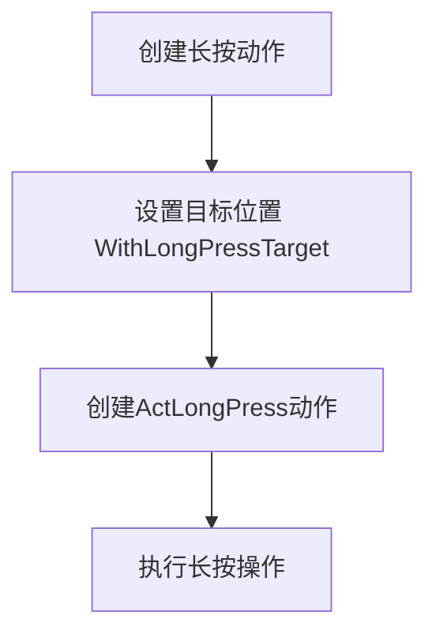
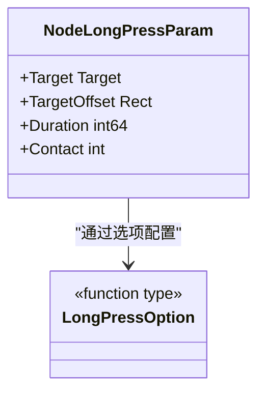
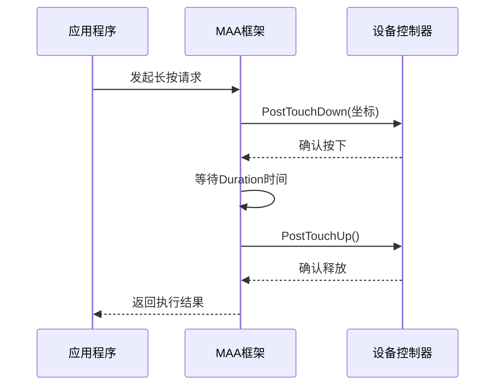

# 长按动作配置

<cite>
**本文档引用的文件**  
- [pipeline.go](file://pipeline.go#L1368-L1420)
- [target.go](file://target.go#L7-L17)
- [internal/target/target.go](file://internal/target/target.go#L28-L46)
- [controller.go](file://controller.go#L199-L214)
- [internal/native/framework.go](file://internal/native/framework.go#L175-L179)
- [context_test.go](file://context_test.go#L682-L705)
</cite>

## 目录
1. [简介](#简介)
2. [核心参数详解](#核心参数详解)
3. [长按与点击动作对比](#长按与点击动作对比)
4. [使用场景分析](#使用场景分析)
5. [延迟与冻结设置](#延迟与冻结设置)
6. [性能优化建议](#性能优化建议)
7. [常见问题解决方案](#常见问题解决方案)

## 简介
长按动作（LongPress）是自动化框架中一种重要的交互方式，用于模拟用户在触摸屏或鼠标上的长按操作。与普通点击不同，长按动作具有持续时间特性，可触发特定的UI响应，如文件选择、菜单弹出、技能蓄力等。本文档系统性地介绍长按动作的配置参数、使用场景及最佳实践。

**Section sources**
- [pipeline.go](file://pipeline.go#L1368-L1420)
- [context_test.go](file://context_test.go#L682-L705)

## 核心参数详解

### Target参数：定义长按位置
Target参数用于指定长按操作的目标位置。该参数通过`WithLongPressTarget`函数进行设置，接受一个`Target`类型参数。Target是一个类型安全的变体，可以包含布尔值、字符串或矩形区域（Rect）。

当需要指定屏幕坐标时，通常使用`NewTargetRect`创建一个矩形区域作为目标位置。矩形的前两个值表示X和Y坐标，后两个值表示宽度和高度。框架会根据矩形区域计算实际的点击坐标。



**Diagram sources**
- [pipeline.go](file://pipeline.go#L1386-L1390)
- [target.go](file://target.go#L15-L17)

### Duration参数：设置长按持续时间
Duration参数用于定义长按的持续时间，单位为毫秒。默认值为1000毫秒（1秒）。通过`WithLongPressDuration`函数可以设置自定义的持续时间，接受`time.Duration`类型的参数。

该参数在`NodeLongPressParam`结构体中定义，执行时会被转换为毫秒值。较长的持续时间可用于触发需要长时间按压的功能，如文件重命名、应用卸载等。



**Diagram sources**
- [pipeline.go](file://pipeline.go#L1374-L1404)
- [internal/native/framework.go](file://internal/native/framework.go#L175-L179)

**Section sources**
- [pipeline.go](file://pipeline.go#L1374-L1404)
- [internal/native/framework.go](file://internal/native/framework.go#L175-L179)

## 长按与点击动作对比

### 功能差异
长按动作与普通点击动作在功能上有显著区别：

- **普通点击**：瞬间完成的触控操作，用于选择、确认等即时响应场景
- **长按动作**：具有持续时间的触控操作，用于触发需要时间积累的特殊功能

在框架实现上，点击动作通过`PostClick`直接发送坐标，而长按动作需要通过`PostTouchDown`、保持状态、`PostTouchUp`三个步骤完成。



**Diagram sources**
- [controller.go](file://controller.go#L199-L214)
- [internal/native/framework.go](file://internal/native/framework.go#L175-L179)

### 实现机制差异
从底层实现看，两种动作的处理流程不同：

- **点击动作**：单次事件，直接调用`MaaControllerPostClick`完成
- **长按动作**：复合事件，需要调用`MaaControllerPostTouchDown`开始，等待指定时间后调用`MaaControllerPostTouchUp`结束

这种设计使得长按动作能够更真实地模拟用户操作，避免因系统响应过快而导致长按功能无法触发。

**Section sources**
- [controller.go](file://controller.go#L164-L166)
- [controller.go](file://controller.go#L199-L214)

## 使用场景分析

### 文件长按选择
在文件管理器等应用中，长按通常用于进入多选模式。通过设置适当的Duration（通常300-500毫秒），可以触发文件的选择状态。

```go
ActLongPress(
    WithLongPressTarget(NewTargetRect(Rect{100, 200, 80, 80})),
    WithLongPressDuration(300*time.Millisecond),
)
```

### 游戏操作蓄力
在游戏自动化中，长按常用于技能蓄力、角色加速等场景。可以根据游戏机制设置不同的持续时间，实现不同程度的蓄力效果。

例如，射击游戏中的蓄力炮击可能需要2秒以上的长按时间，而移动加速可能只需要500毫秒。

### 菜单弹出与快捷操作
许多应用通过长按图标弹出快捷菜单。这种场景下，Duration设置不宜过长，通常300毫秒即可，以确保快速响应用户操作。

**Section sources**
- [context_test.go](file://context_test.go#L682-L705)
- [pipeline.go](file://pipeline.go#L1411-L1418)

## 延迟与冻结设置

### PreDelay和PostDelay设置
虽然长按动作本身没有直接的PreDelay和PostDelay参数，但可以通过任务编排实现类似的延迟效果：

- **PreDelay**：在长按动作前添加等待动作，处理前置条件
- **PostDelay**：在长按动作后添加等待，确保系统有足够时间响应

合理的延迟设置可以提高操作的稳定性，避免因系统响应延迟导致的失败。

### PreWaitFreezes和PostWaitFreezes影响
PreWaitFreezes和PostWaitFreezes参数主要用于等待界面稳定，对长按动作的稳定性有重要影响：

- **PreWaitFreezes**：确保在长按前界面已稳定，避免在界面变化过程中执行长按
- **PostWaitFreezes**：等待长按后的界面变化完成，确保后续操作的准确性

这些参数通过影响操作时序，间接提高了长按动作的成功率。

**Section sources**
- [pipeline.go](file://pipeline.go#L1368-L1420)
- [controller.go](file://controller.go#L199-L214)

## 性能优化建议

### 合理设置持续时间
根据目标应用的响应特性设置合适的Duration：

- 系统级操作：建议500-800毫秒
- 游戏类应用：根据具体机制调整，可能需要1-3秒
- 快捷菜单：300-500毫秒即可

过长的持续时间会降低自动化效率，过短则可能导致操作失败。

### 位置精度优化
使用精确的TargetOffset调整，确保长按位置准确。结合图像识别技术，动态计算最佳点击区域，提高操作成功率。

### 资源管理
长按动作会占用触控通道，在多点触控场景下需要合理管理Contact标识，避免触控冲突。

**Section sources**
- [pipeline.go](file://pipeline.go#L1399-L1404)
- [internal/target/target.go](file://internal/target/target.go#L28-L46)

## 常见问题解决方案

### 长按未触发预期功能
可能原因及解决方案：

1. **持续时间过短**：增加Duration值，建议从500毫秒开始测试
2. **位置不准确**：检查Target坐标，使用图像识别精确定位
3. **系统响应延迟**：增加PreWaitFreezes等待界面稳定

### 多点触控冲突
当多个长按动作同时执行时，需确保使用不同的Contact标识。对于ADB控制器，Contact代表手指索引；对于Win32控制器，代表鼠标按钮。

### 跨平台兼容性问题
不同平台对长按的实现可能有差异：
- Android设备：通常支持多点触控
- Windows应用：可能将长按识别为右键点击

需要根据目标平台调整参数配置。

**Section sources**
- [pipeline.go](file://pipeline.go#L1377-L1378)
- [internal/native/framework.go](file://internal/native/framework.go#L173-L179)