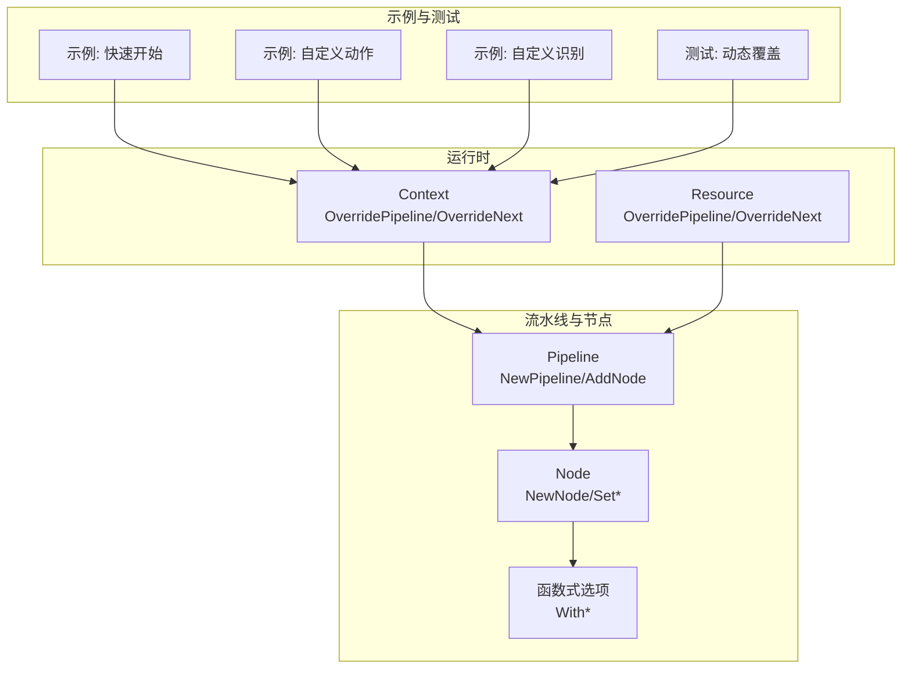
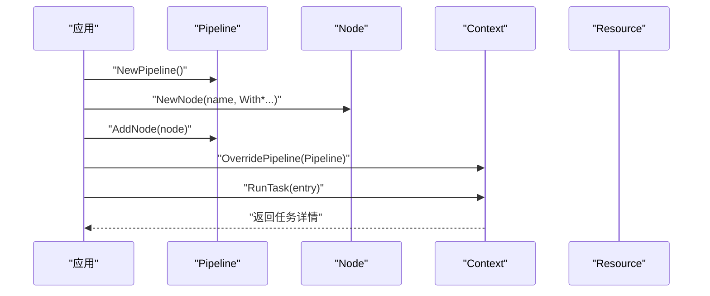
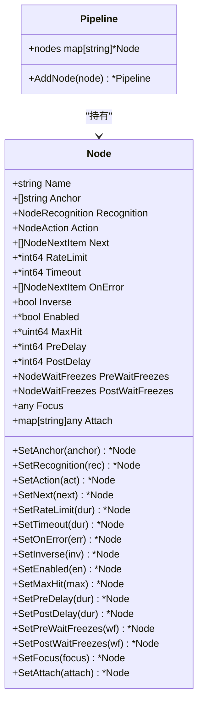
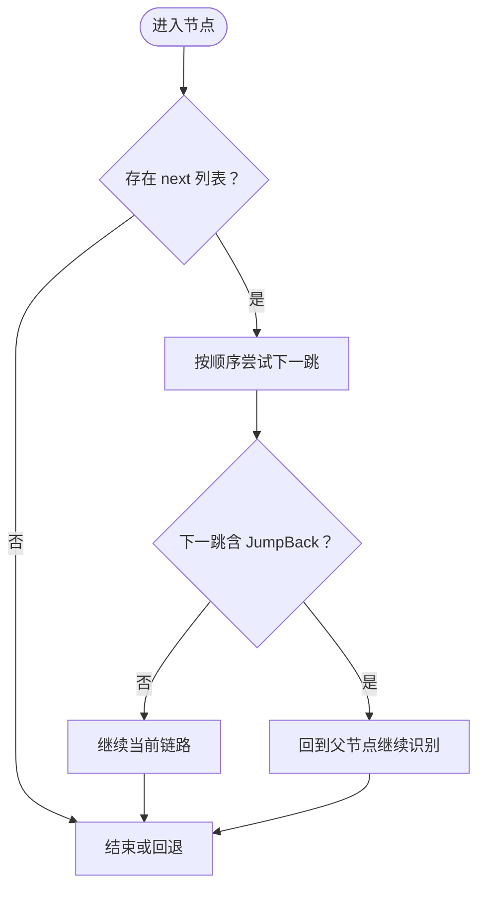
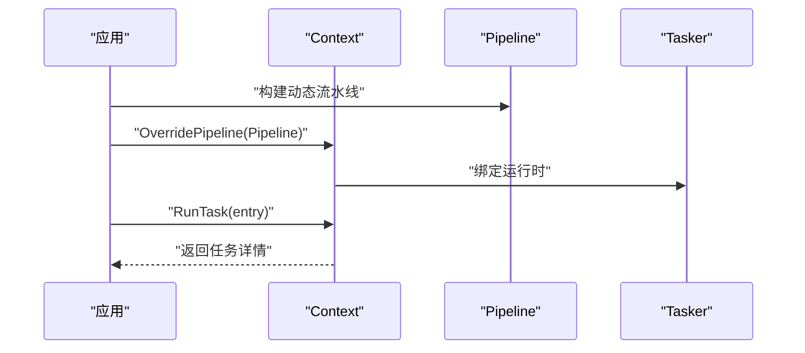
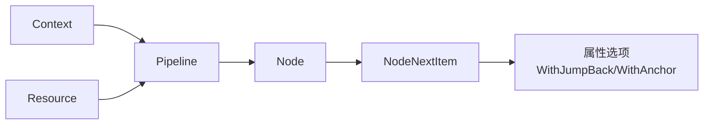

# 动态流水线构建

<cite>
**本文引用的文件列表**
- [pipeline.go](file://pipeline.go)
- [context.go](file://context.go)
- [resource.go](file://resource.go)
- [context_test.go](file://context_test.go)
- [examples/quick-start/main.go](file://examples/quick-start/main.go)
- [examples/custom-action/main.go](file://examples/custom-action/main.go)
- [examples/custom-recognition/main.go](file://examples/custom-recognition/main.go)
- [examples/quick-start/resource/pipeline/pipeline.json](file://examples/quick-start/resource/pipeline/pipeline.json)
- [examples/custom-action/resource/pipeline/pipeline.json](file://examples/custom-action/resource/pipeline/pipeline.json)
- [examples/custom-recognition/resource/pipeline/pipeline.json](file://examples/custom-recognition/resource/pipeline/pipeline.json)
</cite>

## 目录
1. [简介](#简介)
2. [项目结构](#项目结构)
3. [核心组件](#核心组件)
4. [架构总览](#架构总览)
5. [详细组件分析](#详细组件分析)
6. [依赖关系分析](#依赖关系分析)
7. [性能考量](#性能考量)
8. [故障排查指南](#故障排查指南)
9. [结论](#结论)
10. [附录](#附录)

## 简介
本文件系统性介绍如何使用 Go API 在代码中动态构建与运行流水线，重点覆盖：
- 使用 NewPipeline 和 NewNode 构建空流水线与节点
- 函数式选项模式在节点配置中的应用：WithRecognition、WithAction、WithNext 等
- 组合使用 AddNode、SetRecognition、AddNext 等方法构建复杂任务流
- 动态构建与静态 JSON 配置的优缺点对比及适用场景建议

文档同时提供可直接映射到源码的图示与路径引用，便于读者快速定位实现细节。

## 项目结构
围绕“动态流水线构建”的主题，相关代码主要分布在以下模块：
- 流水线与节点定义：pipeline.go
- 运行时上下文与动态覆盖：context.go
- 资源侧的动态覆盖：resource.go
- 示例与测试用例：examples/* 与 context_test.go

图表来源
- [pipeline.go](file://pipeline.go#L18-L33)
- [pipeline.go](file://pipeline.go#L187-L198)
- [context.go](file://context.go#L132-L166)
- [resource.go](file://resource.go#L219-L238)
- [examples/quick-start/main.go](file://examples/quick-start/main.go#L1-L41)
- [examples/custom-action/main.go](file://examples/custom-action/main.go#L1-L49)
- [examples/custom-recognition/main.go](file://examples/custom-recognition/main.go#L1-L77)
- [context_test.go](file://context_test.go#L150-L207)

章节来源
- [pipeline.go](file://pipeline.go#L18-L33)
- [pipeline.go](file://pipeline.go#L187-L198)
- [context.go](file://context.go#L132-L166)
- [resource.go](file://resource.go#L219-L238)
- [examples/quick-start/main.go](file://examples/quick-start/main.go#L1-L41)
- [examples/custom-action/main.go](file://examples/custom-action/main.go#L1-L49)
- [examples/custom-recognition/main.go](file://examples/custom-recognition/main.go#L1-L77)
- [context_test.go](file://context_test.go#L150-L207)

## 核心组件
- Pipeline：用于收集节点，支持链式添加节点
- Node：单个任务节点，包含识别、动作、下一跳、错误处理、延时、等待稳定等属性
- 函数式选项：WithRecognition、WithAction、WithNext、WithRateLimit、WithTimeout、WithOnError、WithInverse、WithEnabled、WithMaxHit、WithPreDelay、WithPostDelay、WithPreWaitFreezes、WithPostWaitFreezes、WithFocus、WithAttach 等
- 上下文动态覆盖：Context.OverridePipeline、Context.OverrideNext
- 资源侧动态覆盖：Resource.OverridePipeline、Resource.OverrideNext

章节来源
- [pipeline.go](file://pipeline.go#L18-L33)
- [pipeline.go](file://pipeline.go#L36-L73)
- [pipeline.go](file://pipeline.go#L75-L185)
- [context.go](file://context.go#L132-L166)
- [resource.go](file://resource.go#L219-L238)

## 架构总览
动态流水线构建的调用链路如下：
- 应用层创建 Pipeline 与 Node，并通过函数式选项配置节点
- 将节点加入 Pipeline 后，可通过 Context 或 Resource 的动态覆盖接口注入运行时
- 运行时根据节点配置执行识别与动作，并按 next/on_error 控制流程

图表来源
- [pipeline.go](file://pipeline.go#L18-L33)
- [pipeline.go](file://pipeline.go#L187-L198)
- [context.go](file://context.go#L132-L166)

## 详细组件分析

### Pipeline 与 Node 的动态构建
- NewPipeline：创建空流水线，内部以 map 存储节点
- NewNode：基于函数式选项初始化节点，支持一次性设置识别、动作、下一跳、超时、速率限制、错误处理、反转、启用状态、最大命中次数、前后延时、预/后等待稳定、焦点、附加数据等
- AddNode：将节点加入流水线并返回自身，便于链式调用
- Set* 方法族：对已有节点进行二次配置，同样返回自身，便于链式调用

图表来源
- [pipeline.go](file://pipeline.go#L18-L33)
- [pipeline.go](file://pipeline.go#L36-L73)
- [pipeline.go](file://pipeline.go#L200-L298)

章节来源
- [pipeline.go](file://pipeline.go#L18-L33)
- [pipeline.go](file://pipeline.go#L36-L73)
- [pipeline.go](file://pipeline.go#L200-L298)

### 函数式选项模式（With*）
- WithRecognition/WithAction/WithNext：分别设置识别器、动作、下一跳列表
- WithRateLimit/WithTimeout：设置识别间隔与超时
- WithOnError：设置错误处理下一跳
- WithInverse/WithEnabled/WithMaxHit：控制识别结果反转、节点启用状态、最大命中次数
- WithPreDelay/WithPostDelay：设置动作前/后延时
- WithPreWaitFreezes/WithPostWaitFreezes：设置动作前/后等待屏幕稳定
- WithFocus/WithAttach：设置自定义焦点与附加数据

这些选项均以 NodeOption 类型定义，最终通过 NewNode 或 Set* 方法应用到 Node 实例上。

章节来源
- [pipeline.go](file://pipeline.go#L75-L185)
- [pipeline.go](file://pipeline.go#L187-L198)
- [pipeline.go](file://pipeline.go#L206-L298)

### 下一跳与错误处理（AddNext/AddOnError）
- AddNext：向节点的 next 列表追加下一跳项，支持 WithJumpBack、WithAnchor 等属性选项
- AddOnError：向节点的 on_error 列表追加错误处理项
- RemoveNext/RemoveOnError：从列表移除指定项

图表来源
- [pipeline.go](file://pipeline.go#L300-L328)
- [pipeline.go](file://pipeline.go#L360-L436)

章节来源
- [pipeline.go](file://pipeline.go#L300-L328)
- [pipeline.go](file://pipeline.go#L360-L436)

### 动态覆盖与运行时注入
- Context.OverridePipeline：将传入的 Pipeline（或 JSON）注入到运行时，替换当前节点定义
- Context.OverrideNext：针对某个节点名，动态覆盖其 next 列表
- Resource.OverridePipeline/OverrideNext：资源侧的动态覆盖能力（同 Context）

图表来源
- [context.go](file://context.go#L132-L166)
- [resource.go](file://resource.go#L219-L238)

章节来源
- [context.go](file://context.go#L132-L166)
- [resource.go](file://resource.go#L219-L238)

### 示例与测试中的动态构建
- 示例：快速开始、自定义动作、自定义识别展示了如何初始化设备、资源与任务器，并通过 PostTask 执行任务
- 测试：context_test.go 中演示了通过 NewPipeline + NewNode + AddNode 构建流水线，并使用 Context.OverridePipeline 注入运行时，随后执行 RunTask

章节来源
- [examples/quick-start/main.go](file://examples/quick-start/main.go#L1-L41)
- [examples/custom-action/main.go](file://examples/custom-action/main.go#L1-L49)
- [examples/custom-recognition/main.go](file://examples/custom-recognition/main.go#L1-L77)
- [context_test.go](file://context_test.go#L150-L207)

## 依赖关系分析
- Pipeline 与 Node 是纯 Go 结构体，彼此通过指针关联
- Context 与 Resource 提供动态覆盖能力，底层通过原生接口桥接到框架
- 函数式选项仅影响 Node 的字段赋值，不引入外部耦合
- AddNext/AddOnError 依赖 NodeNextItem 的属性选项（WithJumpBack、WithAnchor），用于运行时解析下一跳行为

图表来源
- [pipeline.go](file://pipeline.go#L300-L328)
- [pipeline.go](file://pipeline.go#L360-L436)
- [context.go](file://context.go#L132-L166)
- [resource.go](file://resource.go#L219-L238)

章节来源
- [pipeline.go](file://pipeline.go#L300-L328)
- [pipeline.go](file://pipeline.go#L360-L436)
- [context.go](file://context.go#L132-L166)
- [resource.go](file://resource.go#L219-L238)

## 性能考量
- 函数式选项在 NewNode 与 Set* 中均为常数时间赋值，构建阶段开销极低
- AddNode 为哈希插入，平均 O(1)，适合大规模节点管理
- AddNext/AddOnError 在列表末尾追加，平均 O(1)，但查找重复项需遍历，最坏 O(n)
- OverridePipeline/OverrideNext 会触发运行时重载，建议在必要时才调用，避免频繁切换
- 延迟与等待稳定参数（PreDelay/PostDelay、PreWaitFreezes/PostWaitFreezes）会影响整体吞吐，应结合设备性能与任务特性合理设置

[本节为通用性能讨论，无需列出具体文件来源]

## 故障排查指南
- 节点未生效：确认是否已通过 AddNode 加入 Pipeline，并通过 Context.OverridePipeline 注入运行时
- 下一跳无效：检查 AddNext 是否正确传入节点名，且未被 RemoveNext 移除；如需锚点跳转，确保使用 WithAnchor
- 错误处理未触发：确认 OnError 列表已通过 AddOnError 添加，且识别或动作确实失败
- 动态覆盖失败：确认 OverridePipeline 参数类型正确（字符串或可 JSON 序列化的对象），并在 Context 生命周期内调用
- 节点命中计数异常：可使用 Context.GetHitCount/ClearHitCount 辅助定位

章节来源
- [pipeline.go](file://pipeline.go#L360-L436)
- [context.go](file://context.go#L132-L166)
- [context.go](file://context.go#L229-L239)

## 结论
- 动态构建流水线的优势在于灵活性与可编程性，适合需要按条件生成任务流、运行时调整下一跳或覆盖节点配置的场景
- 静态 JSON 配置更适合固定流程与团队协作，便于版本化与可视化编辑
- 在实际工程中，可根据需求混合使用：以静态 JSON 定义主干流程，配合动态覆盖实现分支与参数化

[本节为总结性内容，无需列出具体文件来源]

## 附录

### 动态构建与静态 JSON 的优缺点对比
- 动态构建（NewPipeline/NewNode + With*/Set* + AddNode/AddNext/AddOnError + OverridePipeline/OverrideNext）
  - 优点：灵活、可编程、易于条件分支与参数化、运行时可覆盖
  - 缺点：代码量较大、调试成本较高、易遗漏节点或下一跳
- 静态 JSON（pipeline.json）
  - 优点：简洁直观、版本可控、便于团队协作与可视化
  - 缺点：难以表达复杂逻辑、分支与参数化较困难

章节来源
- [examples/quick-start/resource/pipeline/pipeline.json](file://examples/quick-start/resource/pipeline/pipeline.json#L1-L5)
- [examples/custom-action/resource/pipeline/pipeline.json](file://examples/custom-action/resource/pipeline/pipeline.json#L1-L6)
- [examples/custom-recognition/resource/pipeline/pipeline.json](file://examples/custom-recognition/resource/pipeline/pipeline.json#L1-L12)

### 典型使用路径参考
- 创建流水线与节点
  - [NewPipeline](file://pipeline.go#L18-L22)
  - [NewNode](file://pipeline.go#L187-L198)
  - [WithRecognition/WithAction/WithNext](file://pipeline.go#L78-L96)
  - [SetRecognition/SetAction/SetNext](file://pipeline.go#L206-L222)
  - [AddNode](file://pipeline.go#L30-L33)
- 组合下一跳与错误处理
  - [AddNext](file://pipeline.go#L360-L379)
  - [AddOnError](file://pipeline.go#L398-L419)
  - [WithJumpBack/WithAnchor](file://pipeline.go#L313-L327)
- 运行时动态覆盖
  - [Context.OverridePipeline](file://context.go#L132-L146)
  - [Context.OverrideNext](file://context.go#L149-L166)
  - [Resource.OverridePipeline/OverrideNext](file://resource.go#L219-L238)
- 示例与测试
  - [示例：快速开始](file://examples/quick-start/main.go#L1-L41)
  - [示例：自定义动作](file://examples/custom-action/main.go#L1-L49)
  - [示例：自定义识别](file://examples/custom-recognition/main.go#L1-L77)
  - [测试：动态覆盖](file://context_test.go#L150-L207)