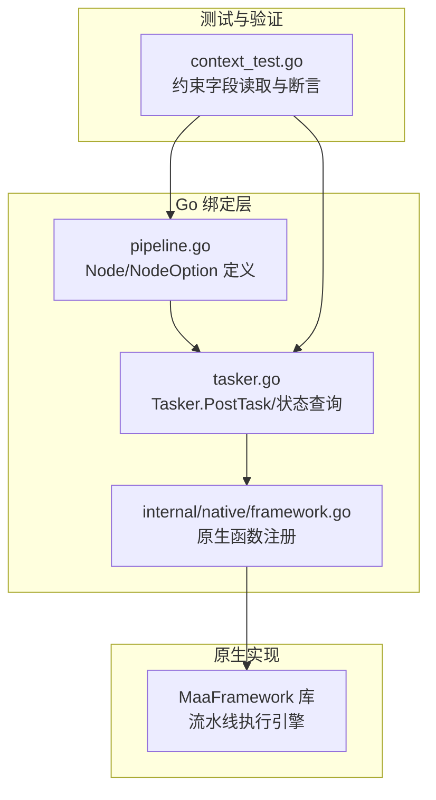
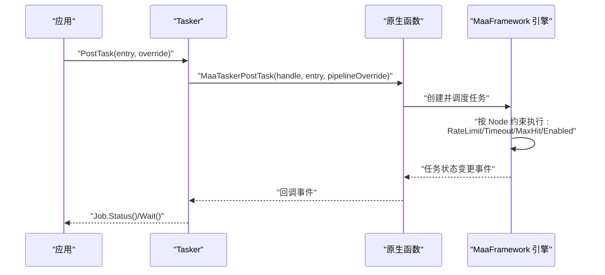
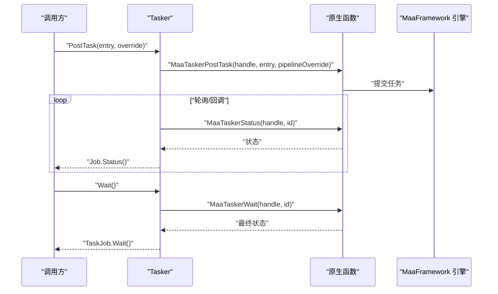
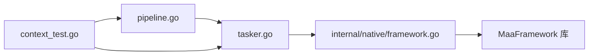

# 执行约束配置

<cite>
**本文引用的文件**
- [pipeline.go](file://pipeline.go)
- [tasker.go](file://tasker.go)
- [context_test.go](file://context_test.go)
- [framework.go](file://internal/native/framework.go)
- [agent_client.go](file://agent_client.go)
- [agent_server.go](file://agent_server.go)
</cite>

## 目录
1. [简介](#简介)
2. [项目结构](#项目结构)
3. [核心组件](#核心组件)
4. [架构总览](#架构总览)
5. [详细组件分析](#详细组件分析)
6. [依赖关系分析](#依赖关系分析)
7. [性能考量](#性能考量)
8. [故障排查指南](#故障排查指南)
9. [结论](#结论)
10. [附录：最佳实践与调优建议](#附录最佳实践与调优建议)

## 简介
本篇文档聚焦于流水线节点的“执行约束配置”，即 RateLimit（识别间隔）、Timeout（识别超时）、MaxHit（最大命中次数）与 Enabled（启用状态）。我们将从数据模型、Go绑定层到底层原生库的调用链路进行系统性解析，并结合测试用例说明这些约束如何影响节点的识别与动作执行行为，最后给出可操作的最佳实践与性能调优建议。

## 项目结构
围绕执行约束配置的关键代码主要分布在以下位置：
- 数据模型与选项：pipeline.go 中定义了 Node 结构体及其 With*/Set* 约束选项
- 任务执行与查询：tasker.go 提供 PostTask、状态查询与任务详情获取
- 原生接口桥接：internal/native/framework.go 暴露底层函数签名
- 行为验证：context_test.go 的测试覆盖了约束字段的读取与行为验证
- 其他客户端相关：agent_client.go/agent_server.go 展示了与超时相关的另一处配置入口（非节点约束）

图表来源
- [pipeline.go](file://pipeline.go#L36-L73)
- [tasker.go](file://tasker.go#L85-L112)
- [framework.go](file://internal/native/framework.go#L330-L465)
- [context_test.go](file://context_test.go#L1180-L1222)

章节来源
- [pipeline.go](file://pipeline.go#L36-L73)
- [tasker.go](file://tasker.go#L85-L112)
- [framework.go](file://internal/native/framework.go#L330-L465)
- [context_test.go](file://context_test.go#L1180-L1222)

## 核心组件
- Node 执行约束字段
  - RateLimit：最小识别间隔（毫秒），用于控制识别频率，避免过于频繁的截图/识别
  - Timeout：识别等待的最大时间（毫秒），防止识别过程卡死或阻塞
  - MaxHit：节点最大命中次数，达到后通常不再继续匹配该节点
  - Enabled：节点是否启用，true 表示激活，false 表示跳过
- NodeOption/Set* 方法族：提供 With*/Set* 方式为 Node 配置上述约束
- Tasker.PostTask：提交任务，返回 Job；通过状态查询与等待完成
- 原生函数：MaaTaskerPostTask、MaaTaskerStatus、MaaTaskerWait 等

章节来源
- [pipeline.go](file://pipeline.go#L36-L73)
- [pipeline.go](file://pipeline.go#L98-L141)
- [pipeline.go](file://pipeline.go#L224-L260)
- [tasker.go](file://tasker.go#L85-L112)
- [framework.go](file://internal/native/framework.go#L330-L345)

## 架构总览
下图展示了从 Go 层发起任务到原生引擎执行并返回状态的整体流程，以及约束字段在执行中的作用点：

图表来源
- [tasker.go](file://tasker.go#L85-L112)
- [framework.go](file://internal/native/framework.go#L330-L345)

## 详细组件分析

### Node 执行约束字段与选项
- 字段定义与默认值
  - RateLimit：最小识别间隔（毫秒），默认 1000
  - Timeout：识别等待最大时间（毫秒），默认 20000
  - MaxHit：最大命中次数，默认不限制
  - Enabled：是否启用，默认 true
- 选项与设置方法
  - WithRateLimit/WithTimeout/WithMaxHit/WithEnabled
  - SetRateLimit/SetTimeout/SetMaxHit/SetEnabled
- 语义说明
  - RateLimit：控制相邻两次识别尝试之间的最小间隔，避免过度扫描
  - Timeout：单次识别最长等待时间，超过则判定失败并触发错误分支
  - MaxHit：限制节点命中上限，到达后通常不再继续匹配
  - Enabled：禁用节点将直接跳过，不参与识别与动作

章节来源
- [pipeline.go](file://pipeline.go#L36-L73)
- [pipeline.go](file://pipeline.go#L98-L141)
- [pipeline.go](file://pipeline.go#L224-L260)

### 任务提交与状态查询
- Tasker.PostTask
  - 支持传入 pipeline 覆盖参数（override）
  - 返回 TaskJob，可通过 Wait() 获取最终状态
- Job/TaskJob
  - 提供 Status()/Wait()/Success()/Failure()/Done() 等便捷方法
- 原生函数
  - MaaTaskerPostTask/MaaTaskerStatus/MaaTaskerWait

图表来源
- [tasker.go](file://tasker.go#L85-L112)
- [framework.go](file://internal/native/framework.go#L330-L345)

章节来源
- [tasker.go](file://tasker.go#L85-L112)
- [framework.go](file://internal/native/framework.go#L330-L345)

### 约束对节点执行行为的影响
- RateLimit 如何控制识别频率
  - 在同一节点的连续识别之间施加最小间隔，降低 CPU/GPU 与截图压力
  - 适用于高频匹配场景（如反复检测某个按钮）
- Timeout 如何防止任务卡死
  - 若识别长时间无结果或阻塞，超时后触发错误处理链（OnError）
  - 有助于避免无限等待导致的资源占用
- MaxHit 如何限制节点执行次数
  - 达到上限后通常不再继续匹配该节点，避免重复执行
  - 适合“只做一次”的动作或“到达目标后停止”的节点
- Enabled 启用状态
  - false 时节点被跳过，不参与识别与动作
  - 适合临时禁用某些节点而不删除配置

章节来源
- [pipeline.go](file://pipeline.go#L36-L73)
- [context_test.go](file://context_test.go#L1180-L1222)

### 实际案例与验证
- 测试用例覆盖
  - 断言 RateLimit/Timeout/Enabled/MaxHit 等字段被正确读取
  - 断言 PreDelay/PostDelay/WaitFreezes 等其他时序参数也被正确读取
- 用法要点
  - 使用 With* 或 Set* 为 Node 配置约束
  - 通过 OverridePipeline 或 PostTask 的 override 参数动态调整节点约束
  - 使用 Job/TaskJob 的 Wait()/Status() 观察执行结果与耗时

章节来源
- [context_test.go](file://context_test.go#L1180-L1222)

### 与原生引擎的关系
- Go 层仅负责参数封装与状态查询
- 原生引擎负责具体的识别、动作执行与约束落地
- 通过 purego 注册的函数桥接到底层库，保证跨平台兼容

章节来源
- [framework.go](file://internal/native/framework.go#L330-L465)

## 依赖关系分析
- Go 层依赖
  - pipeline.go 定义约束字段与配置 API
  - tasker.go 封装任务提交与状态查询
  - internal/native/framework.go 提供原生函数签名与注册
- 测试依赖
  - context_test.go 通过 OverridePipeline 与 GetNodeData 验证约束字段读取
- 外部依赖
  - MaaFramework 库（由原生函数桥接）

图表来源
- [pipeline.go](file://pipeline.go#L36-L73)
- [tasker.go](file://tasker.go#L85-L112)
- [framework.go](file://internal/native/framework.go#L330-L465)
- [context_test.go](file://context_test.go#L1180-L1222)

章节来源
- [pipeline.go](file://pipeline.go#L36-L73)
- [tasker.go](file://tasker.go#L85-L112)
- [framework.go](file://internal/native/framework.go#L330-L465)
- [context_test.go](file://context_test.go#L1180-L1222)

## 性能考量
- RateLimit
  - 过短会导致频繁截图/识别，CPU/GPU 占用上升
  - 过长会降低响应速度，影响交互体验
  - 建议根据屏幕复杂度与算法开销动态调整
- Timeout
  - 过短可能误判成功，过长导致资源占用与延迟增加
  - 建议结合识别算法与目标特征设置合理阈值
- MaxHit
  - 对“一次性”动作（如点击进入界面）设为 1
  - 对“循环检测”类节点，结合 Enabled 与 OnError 控制退出
- Enabled
  - 通过动态开关快速禁用不稳定节点，避免影响整体流程
- 并发与事件回调
  - 利用 AddSink/AddContextSink 订阅事件，监控识别命中计数与节点状态变化

[本节为通用指导，无需列出具体文件来源]

## 故障排查指南
- 识别长时间无响应
  - 检查 Timeout 是否过小或过大
  - 关注 OnError 分支是否被触发
- 识别过于频繁导致卡顿
  - 提高 RateLimit，减少截图频率
- 动作重复执行
  - 设置 MaxHit 或在命中后将 Enabled 设为 false
- 任务迟迟不结束
  - 使用 Job.Wait() 观察最终状态，必要时使用 PostStop 停止任务
- 代理客户端超时
  - 参考 agent_client.go 的 SetTimeout 接口，调整网络超时参数（非节点约束）

章节来源
- [tasker.go](file://tasker.go#L118-L123)
- [agent_client.go](file://agent_client.go#L83-L91)

## 结论
执行约束配置是保障流水线稳定与高效运行的关键。通过合理设置 RateLimit、Timeout、MaxHit 与 Enabled，可以在不同场景下平衡识别精度、响应速度与资源消耗。结合 Job/TaskJob 的状态查询与事件订阅，可以更有效地定位问题并优化流程。

[本节为总结性内容，无需列出具体文件来源]

## 附录：最佳实践与调优建议
- 基础建议
  - RateLimit：默认 1000ms，复杂界面可适当提高；高频按钮可降低至 200~500ms
  - Timeout：默认 20000ms，简单目标可降至 5000~10000ms；复杂 OCR/模板匹配可提升至 30000ms+
  - MaxHit：一次性动作设为 1；循环检测节点设为较大值或不限制，配合 Enabled 退出
  - Enabled：临时禁用节点优先使用 Enabled，避免删除配置
- 场景化建议
  - 登录/启动流程：Timeout 适中，MaxHit 1，Enabled 动态切换
  - 高频点击：RateLimit 适中，Timeout 适中，MaxHit 1
  - OCR 文字识别：Timeout 偏大，RateLimit 适中，MaxHit 1
  - 模板匹配：根据模板数量与算法选择 RateLimit/Timeout，MaxHit 1
- 监控与调试
  - 使用 Tasker.AddSink/Tasker.AddContextSink 订阅事件，观察命中计数与节点状态
  - 通过 Tasker.GetTaskDetail/GetNodeDetail 获取实时执行细节
  - 使用 Job.Wait()/Status() 观察任务生命周期与最终状态

[本节为通用指导，无需列出具体文件来源]