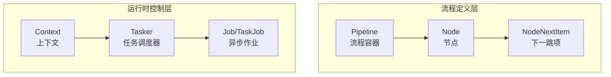
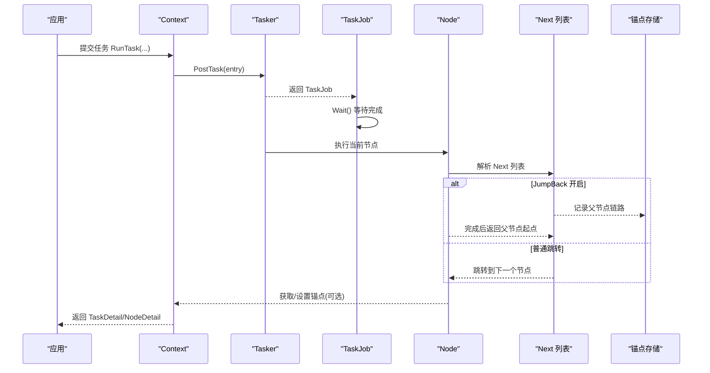
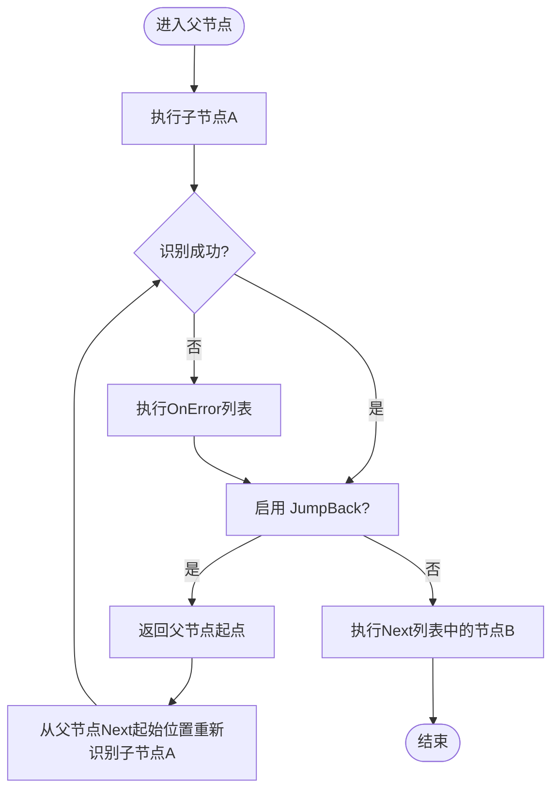
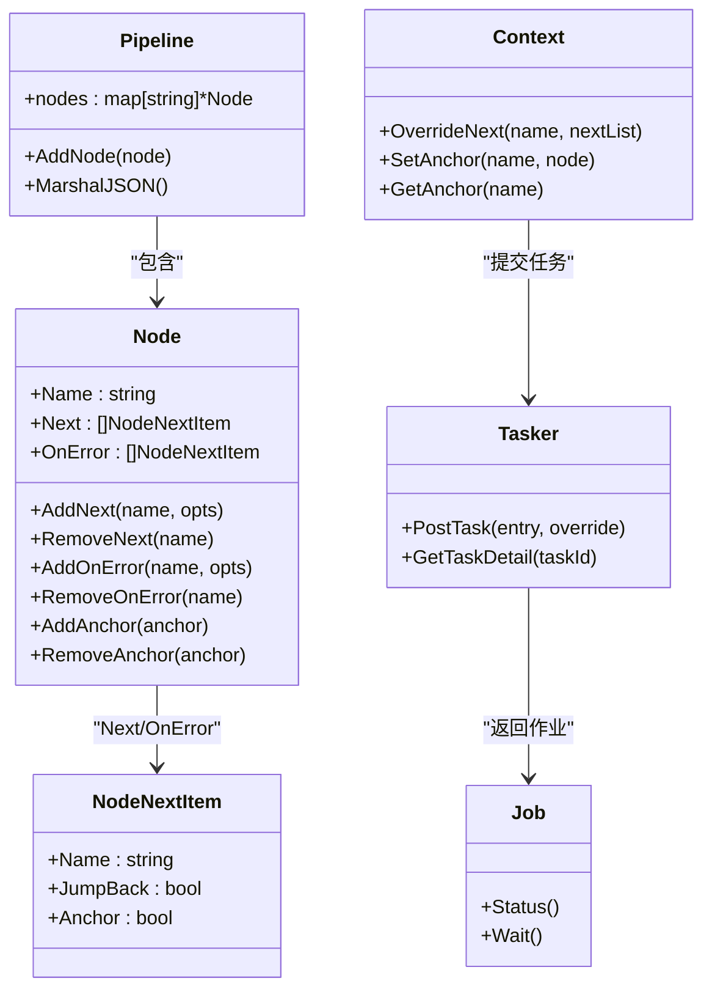

# 正常流程控制

<cite>
**本文引用的文件**
- [pipeline.go](file://pipeline.go)
- [context.go](file://context.go)
- [tasker.go](file://tasker.go)
- [job.go](file://job.go)
- [pipeline_test.go](file://pipeline_test.go)
- [examples/quick-start/resource/pipeline/pipeline.json](file://examples/quick-start/resource/pipeline/pipeline.json)
- [examples/custom-action/resource/pipeline/pipeline.json](file://examples/custom-action/resource/pipeline/pipeline.json)
- [examples/custom-recognition/resource/pipeline/pipeline.json](file://examples/custom-recognition/resource/pipeline/pipeline.json)
- [examples/quick-start/main.go](file://examples/quick-start/main.go)
- [examples/custom-action/main.go](file://examples/custom-action/main.go)
- [examples/custom-recognition/main.go](file://examples/custom-recognition/main.go)
</cite>

## 目录
1. [简介](#简介)
2. [项目结构](#项目结构)
3. [核心组件](#核心组件)
4. [架构总览](#架构总览)
5. [详细组件分析](#详细组件分析)
6. [依赖关系分析](#依赖关系分析)
7. [性能考量](#性能考量)
8. [故障排查指南](#故障排查指南)
9. [结论](#结论)
10. [附录](#附录)

## 简介
本篇文档聚焦于 MAA Framework Go 的“正常流程控制”机制，系统讲解如何通过 Node 的 Next 列表实现线性任务流、条件分支与并行路径，并深入剖析 JumpBack 循环机制在重复执行场景中的工作原理。文档同时提供基于真实代码示例的配置方式与最佳实践，帮助开发者设计高效、可维护的任务流程。

## 项目结构
围绕“正常流程控制”，本次分析涉及以下关键模块：
- 流程定义与节点模型：pipeline.go 中的 Pipeline、Node、NodeNextItem 及相关选项
- 运行时上下文与动态覆盖：context.go 中的 OverrideNext、SetAnchor、GetAnchor 等
- 任务调度与状态查询：tasker.go 中的 PostTask、TaskDetail、NodeDetail 等
- 异步作业与状态轮询：job.go 中的 Job/TaskJob 状态判断与等待
- 示例与测试：examples 与 pipeline_test.go 展示 Next 列表与锚点的基本用法

图表来源
- [pipeline.go](file://pipeline.go#L1-L200)
- [context.go](file://context.go#L1-L120)
- [tasker.go](file://tasker.go#L1-L120)
- [job.go](file://job.go#L1-L60)

章节来源
- [pipeline.go](file://pipeline.go#L1-L200)
- [context.go](file://context.go#L1-L120)
- [tasker.go](file://tasker.go#L1-L120)
- [job.go](file://job.go#L1-L60)

## 核心组件
- Pipeline：流程容器，持有多个 Node
- Node：单个任务节点，包含识别、动作、Next 列表、OnError 错误处理列表等
- NodeNextItem：Next/OnError 列表中的单项，支持 JumpBack（返回父节点）与 Anchor（锚点引用）
- Context：运行时上下文，支持 OverrideNext 动态覆盖某节点的 Next 列表
- Tasker：任务调度器，负责提交任务、查询任务详情与节点详情
- Job/TaskJob：异步作业封装，提供状态查询与等待

章节来源
- [pipeline.go](file://pipeline.go#L1-L200)
- [context.go](file://context.go#L120-L240)
- [tasker.go](file://tasker.go#L1-L120)
- [job.go](file://job.go#L1-L96)

## 架构总览
下图展示了从提交任务到节点执行、Next 列表解析与 JumpBack 循环的整体流程：

图表来源
- [context.go](file://context.go#L120-L240)
- [tasker.go](file://tasker.go#L1-L120)
- [pipeline.go](file://pipeline.go#L290-L388)

## 详细组件分析

### NodeNextItem 与 Next 列表
- NodeNextItem 字段
  - name：目标节点名称
  - jump_back：是否在该节点完成后返回父节点起点，继续从父节点的 Next 列表起始位置重新识别
  - anchor：是否将该节点作为锚点，供后续节点通过 [Anchor] 引用解析为最近一次设置该锚点的节点
- Next 列表的作用
  - 线性任务流：按顺序依次执行多个节点
  - 条件分支：同一父节点的 Next 列表中包含多个候选节点，根据识别结果选择一个
  - 并行路径：通过多个独立的子流程或并行节点组合实现（需结合锚点与动态覆盖）
- OnError 列表
  - 当识别超时或动作失败时，从 OnError 列表中选择节点继续执行

章节来源
- [pipeline.go](file://pipeline.go#L290-L388)

### JumpBack 循环机制
- 工作原理
  - 当某节点开启 JumpBack 后，该节点链路完成后，系统会回到其父节点的起点，然后从父节点 Next 列表的起始位置重新开始识别
  - 这种机制适合需要重复执行同一段子流程直到满足某个条件的场景
- 使用场景
  - 重试机制：当某步骤失败时，先尝试错误处理节点，再通过 JumpBack 回到上一步重试
  - 循环等待：等待某个条件出现（如界面元素出现），通过 JumpBack 不断重试识别
- 注意事项
  - 需要配合锚点与合理的超时/速率限制，避免无限循环
  - 在复杂流程中谨慎使用，确保有退出条件

图表来源
- [pipeline.go](file://pipeline.go#L290-L388)

章节来源
- [pipeline.go](file://pipeline.go#L290-L388)

### 锚点（Anchor）与链式调用
- 锚点的作用
  - 将某个节点标记为锚点，后续节点可通过 [Anchor] 引用解析为最近一次设置该锚点的节点
  - 常用于跨节点的相对跳转与复用
- 链式调用
  - 通过在 Next 列表中使用锚点，可以实现链式跳转，减少硬编码节点名
  - 结合 AddNext/RemoveNext 与 SetAnchor/AddAnchor/RemoveAnchor，可动态管理跳转链路
- 实践要点
  - 锚点命名应语义化，避免冲突
  - 在复杂流程中，建议对锚点进行注释与文档化

章节来源
- [pipeline.go](file://pipeline.go#L300-L388)
- [context.go](file://context.go#L210-L240)

### 动态覆盖 Next 列表（OverrideNext）
- Context.OverrideNext 支持在运行时动态覆盖指定节点的 Next 列表
- 典型用途
  - 根据识别结果动态决定下一步
  - 在自定义识别回调中根据图像内容决定跳转路径
- 示例参考
  - 自定义识别示例中，在回调中调用 OverrideNext 设置多条候选路径

章节来源
- [context.go](file://context.go#L149-L167)
- [examples/custom-recognition/main.go](file://examples/custom-recognition/main.go#L60-L77)

### 构建线性任务流、条件分支与并行路径
- 线性任务流
  - 在父节点的 Next 列表中依次添加后续节点，形成顺序执行
- 条件分支
  - 在父节点的 Next 列表中添加多个候选节点，每个节点对应不同的识别条件
  - 可结合 Inverse、Timeout、RateLimit 等参数优化识别稳定性
- 并行路径
  - 通过多个独立入口或并行节点组合实现
  - 可结合锚点与动态覆盖，实现灵活的并行与合并

章节来源
- [pipeline.go](file://pipeline.go#L1-L200)
- [pipeline_test.go](file://pipeline_test.go#L40-L70)

### NodeNextItem 的配置方式与示例路径
- 基本节点跳转
  - 使用 AddNext 添加下一个节点，支持链式调用
  - 参考：[pipeline_test.go](file://pipeline_test.go#L40-L52)
- 链式调用
  - 通过多次 AddNext 组合形成链式跳转
  - 参考：[pipeline_test.go](file://pipeline_test.go#L40-L52)
- 复杂流程设计
  - 结合 JumpBack、Anchor、OnError、Inverse、Timeout、RateLimit 等参数
  - 参考：[pipeline.go](file://pipeline.go#L1-L200)

章节来源
- [pipeline_test.go](file://pipeline_test.go#L40-L70)
- [pipeline.go](file://pipeline.go#L1-L200)

### 示例资源与代码路径
- 快速开始示例
  - 资源：[examples/quick-start/resource/pipeline/pipeline.json](file://examples/quick-start/resource/pipeline/pipeline.json#L1-L5)
  - 应用：[examples/quick-start/main.go](file://examples/quick-start/main.go#L1-L41)
- 自定义动作示例
  - 资源：[examples/custom-action/resource/pipeline/pipeline.json](file://examples/custom-action/resource/pipeline/pipeline.json#L1-L6)
  - 应用：[examples/custom-action/main.go](file://examples/custom-action/main.go#L1-L49)
- 自定义识别示例
  - 资源：[examples/custom-recognition/resource/pipeline/pipeline.json](file://examples/custom-recognition/resource/pipeline/pipeline.json#L1-L12)
  - 应用：[examples/custom-recognition/main.go](file://examples/custom-recognition/main.go#L1-L77)

章节来源
- [examples/quick-start/resource/pipeline/pipeline.json](file://examples/quick-start/resource/pipeline/pipeline.json#L1-L5)
- [examples/custom-action/resource/pipeline/pipeline.json](file://examples/custom-action/resource/pipeline/pipeline.json#L1-L6)
- [examples/custom-recognition/resource/pipeline/pipeline.json](file://examples/custom-recognition/resource/pipeline/pipeline.json#L1-L12)
- [examples/quick-start/main.go](file://examples/quick-start/main.go#L1-L41)
- [examples/custom-action/main.go](file://examples/custom-action/main.go#L1-L49)
- [examples/custom-recognition/main.go](file://examples/custom-recognition/main.go#L1-L77)

## 依赖关系分析
- Pipeline 与 Node/NodeNextItem
  - Pipeline 持有 Node 映射；Node 包含 Next/OnError 列表，列表项为 NodeNextItem
- Context 与 Tasker/Job
  - Context 通过 Tasker 提交任务，Tasker 返回 TaskJob；Job/TaskJob 提供状态查询与等待
- 运行时覆盖
  - Context.OverrideNext 与 Context.SetAnchor/GetAnchor 与 NodeNextItem 的 anchor/jump_back 协同工作

图表来源
- [pipeline.go](file://pipeline.go#L1-L200)
- [context.go](file://context.go#L120-L240)
- [tasker.go](file://tasker.go#L1-L120)
- [job.go](file://job.go#L1-L96)

章节来源
- [pipeline.go](file://pipeline.go#L1-L200)
- [context.go](file://context.go#L120-L240)
- [tasker.go](file://tasker.go#L1-L120)
- [job.go](file://job.go#L1-L96)

## 性能考量
- 识别频率与超时
  - 合理设置 RateLimit 与 Timeout，避免频繁识别导致性能下降或误判
- 跳转链长度
  - 过长的 Next 链会增加识别成本，建议拆分流程或使用锚点减少重复扫描
- JumpBack 使用
  - 在循环中务必设置退出条件，避免无限重试
- 并行路径
  - 并行路径可能带来资源竞争，建议在控制器层面做好并发控制

## 故障排查指南
- 任务未完成或卡住
  - 使用 Tasker.GetTaskDetail/Tasker.GetNodeDetail 获取任务与节点详情，定位卡住的节点
  - 检查 Next 列表是否正确、是否存在循环跳转
- 锚点解析异常
  - 确认锚点是否被正确设置与获取；检查锚点名称是否唯一且语义明确
- 动态覆盖无效
  - 确认在合适的时机调用 Context.OverrideNext；确保传入的节点名存在且拼写正确
- 识别不稳定
  - 调整 Timeout 与 RateLimit；必要时在 Node 上设置 Inverse 或 MaxHit 控制命中次数

章节来源
- [tasker.go](file://tasker.go#L240-L344)
- [context.go](file://context.go#L149-L209)

## 结论
通过 NodeNextItem 的 Next/OnError 列表、JumpBack 循环机制与锚点系统，MAA Framework Go 提供了强大的正常流程控制能力。合理运用这些机制，可以构建线性、条件分支与并行路径混合的复杂任务流；配合 Context 的动态覆盖能力，能够实现更灵活的运行时决策。建议在设计流程时遵循清晰的锚点命名、合理的超时与重试策略，并在复杂场景中加入明确的退出条件，以保证流程的稳定性与可维护性。

## 附录
- 最佳实践清单
  - 使用锚点统一管理跳转目标，避免硬编码节点名
  - 对循环路径设置明确的退出条件，防止无限重试
  - 合理设置 RateLimit 与 Timeout，平衡识别精度与性能
  - 在自定义识别中使用 OverrideNext 动态决定下一步，提升适配性
  - 对复杂流程进行模块化拆分，保持 Next 列表简洁可读