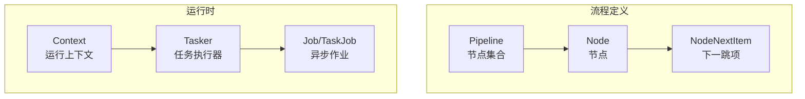
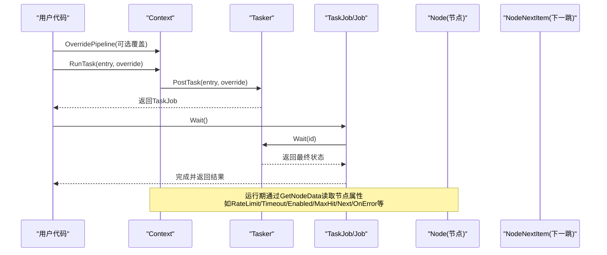
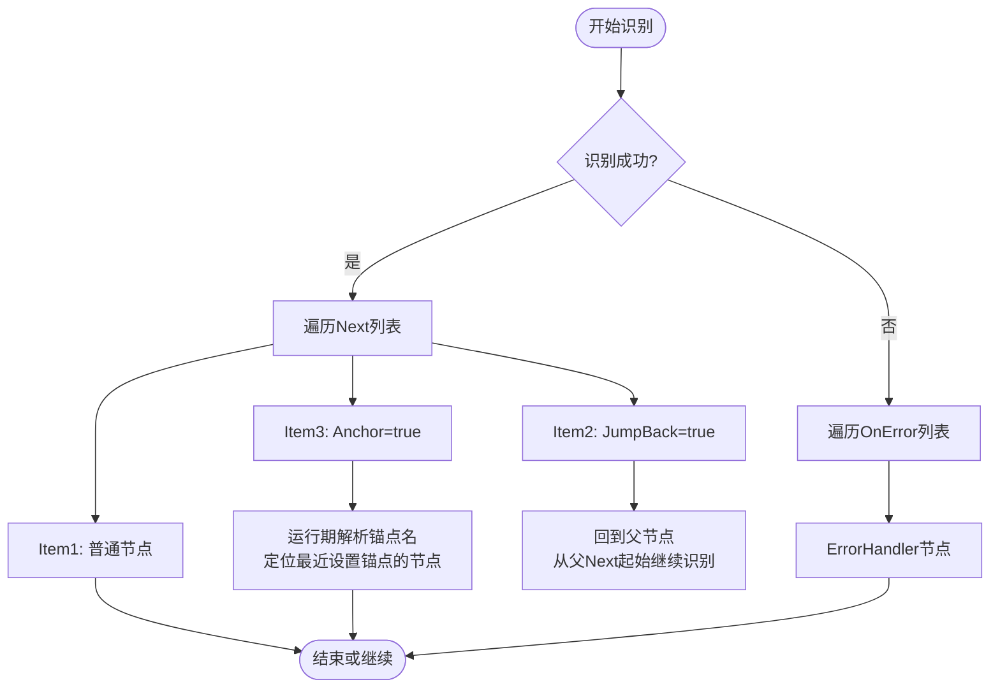
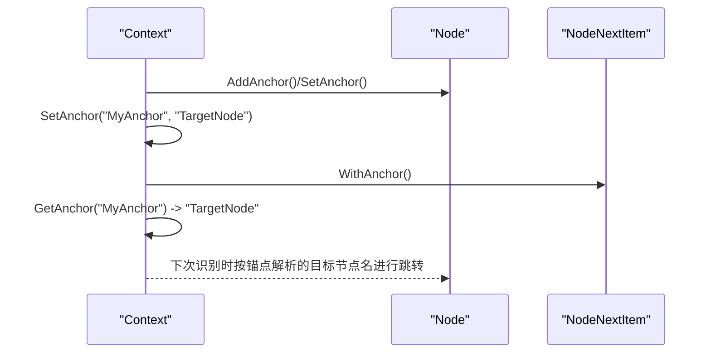
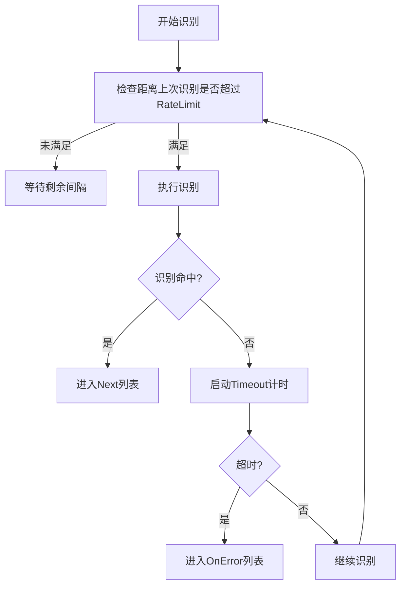
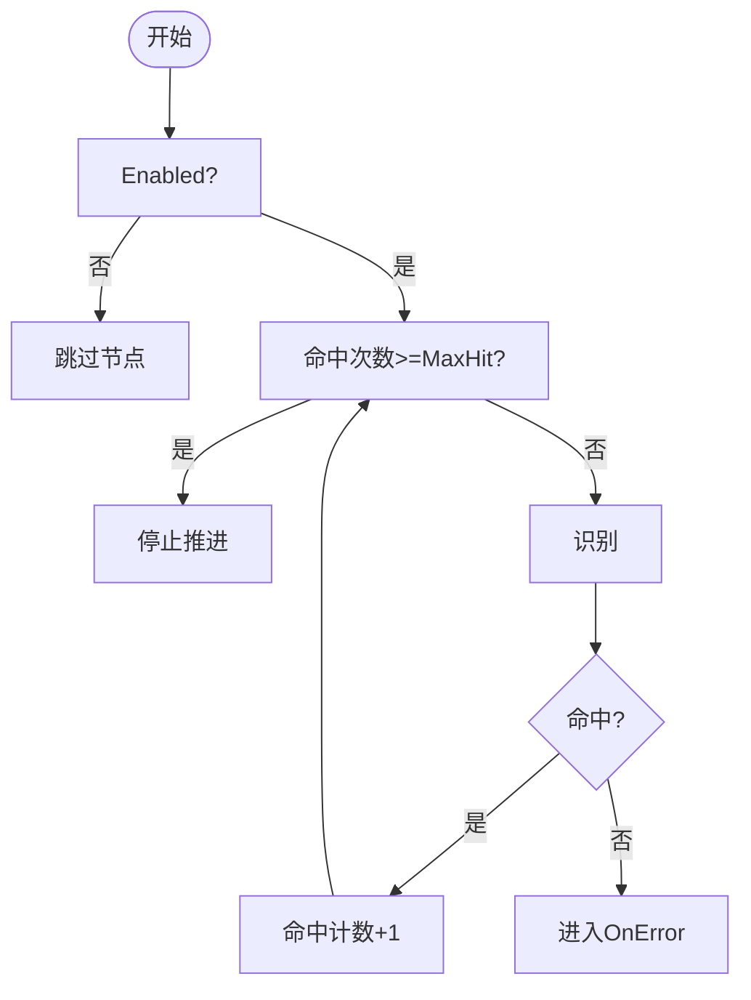
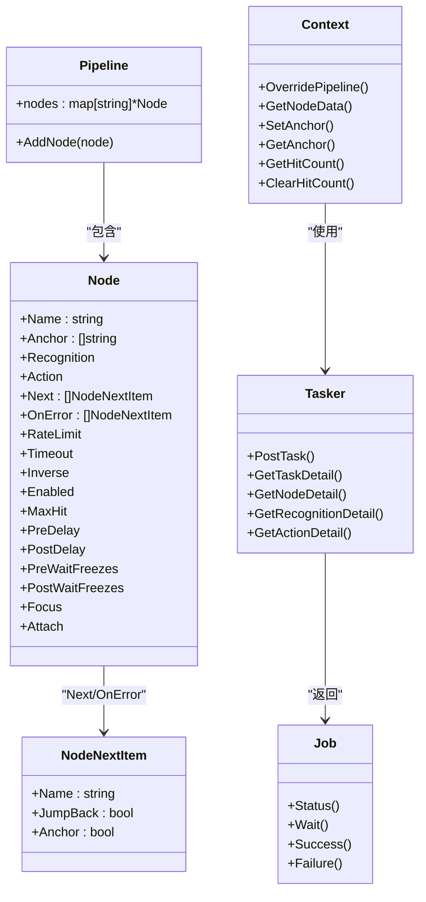

# 流程控制机制

<cite>
**本文引用的文件**
- [pipeline.go](file://pipeline.go)
- [context.go](file://context.go)
- [tasker.go](file://tasker.go)
- [job.go](file://job.go)
- [context_test.go](file://context_test.go)
- [pipeline_test.go](file://pipeline_test.go)
- [examples/quick-start/resource/pipeline/pipeline.json](file://examples/quick-start/resource/pipeline/pipeline.json)
- [examples/custom-action/resource/pipeline/pipeline.json](file://examples/custom-action/resource/pipeline/pipeline.json)
- [examples/custom-recognition/resource/pipeline/pipeline.json](file://examples/custom-recognition/resource/pipeline/pipeline.json)
</cite>

## 目录
1. [引言](#引言)
2. [项目结构](#项目结构)
3. [核心组件](#核心组件)
4. [架构总览](#架构总览)
5. [详细组件分析](#详细组件分析)
6. [依赖关系分析](#依赖关系分析)
7. [性能考量](#性能考量)
8. [故障排查指南](#故障排查指南)
9. [结论](#结论)
10. [附录](#附录)

## 引言
本文件聚焦于流水线的流程控制机制，系统性解析 Next 列表、OnError 错误处理、JumpBack 循环回溯、Anchor 锚点引用等关键能力，并结合 RateLimit 速率限制、Timeout 超时、MaxHit 最大命中次数与 Enabled 启用状态，阐述它们如何共同影响任务流的执行路径与鲁棒性。文档提供从数据结构到调用序列的多层可视化说明，并通过测试与示例展示如何设计健壮的任务流以应对异常与复杂场景。

## 项目结构
围绕流程控制的核心代码位于 pipeline.go（节点与流程定义）、context.go（运行期上下文与节点属性读取）、tasker.go（任务执行与细节查询）与 job.go（异步作业状态）。测试文件 context_test.go 与 pipeline_test.go 提供了 Next/OnError/JumpBack/Anchor 等行为的验证用例；示例目录下的 pipeline.json 展示了基础的流水线配置形态。

**图表来源**
- [pipeline.go](file://pipeline.go#L13-L120)
- [context.go](file://context.go#L1-L60)
- [tasker.go](file://tasker.go#L1-L120)
- [job.go](file://job.go#L1-L60)

**章节来源**
- [pipeline.go](file://pipeline.go#L13-L120)
- [context.go](file://context.go#L1-L60)
- [tasker.go](file://tasker.go#L1-L120)
- [job.go](file://job.go#L1-L60)

## 核心组件
- Pipeline：封装节点集合，用于组织任务流。
- Node：单个任务节点，包含识别、动作、下一跳、错误处理、速率限制、超时、启用状态、最大命中次数、延迟与冻结等待等属性。
- NodeNextItem：表示“下一跳”或“错误处理”的条目，支持 JumpBack 与 Anchor 两种特殊语义。
- Context：运行期上下文，提供 OverridePipeline、GetNodeData、SetAnchor/GetAnchor、GetHitCount/ClearHitCount 等能力。
- Tasker：任务执行器，负责提交任务、查询识别/动作/节点详情、管理事件回调。
- Job/TaskJob：异步作业抽象，提供状态查询与等待完成的能力。

**章节来源**
- [pipeline.go](file://pipeline.go#L13-L120)
- [context.go](file://context.go#L1-L120)
- [tasker.go](file://tasker.go#L1-L120)
- [job.go](file://job.go#L1-L60)

## 架构总览
下图展示了从上下文到任务执行器再到作业状态的整体调用链路，以及节点属性在运行期的读取与覆盖。

**图表来源**
- [context.go](file://context.go#L39-L92)
- [tasker.go](file://tasker.go#L85-L122)
- [job.go](file://job.go#L58-L96)
- [pipeline.go](file://pipeline.go#L41-L73)

**章节来源**
- [context.go](file://context.go#L39-L92)
- [tasker.go](file://tasker.go#L85-L122)
- [job.go](file://job.go#L58-L96)
- [pipeline.go](file://pipeline.go#L41-L73)

## 详细组件分析

### Next 列表与 OnError 错误处理
- Next 列表：定义当前节点成功匹配后的可能去向，每个条目为 NodeNextItem，包含目标节点名、是否回溯父节点（JumpBack）、是否作为锚点引用（Anchor）。
- OnError 列表：定义识别超时或动作失败时的兜底执行路径，同样由 NodeNextItem 组成。
- JumpBack：当某节点设置了 JumpBack=true，系统会在该节点链路完成后回到父节点，从父节点的 Next 列表起始位置继续识别。
- Anchor：当某节点设置了 Anchor=true 或在 Next 中使用 WithAnchor()，名称字段将被视为锚点名，在运行期通过 Context.SetAnchor/GetAnchor 解析为最近一次设置该锚点的节点名，从而实现动态跳转。

**图表来源**
- [pipeline.go](file://pipeline.go#L300-L328)
- [context.go](file://context.go#L216-L227)

**章节来源**
- [pipeline.go](file://pipeline.go#L300-L328)
- [context.go](file://context.go#L216-L227)
- [pipeline_test.go](file://pipeline_test.go#L40-L101)

### Anchor 锚点引用与运行期解析
- 设置锚点：在节点上添加 Anchor 名称，或在 Next 条目中使用 WithAnchor()。
- 运行期解析：通过 Context.SetAnchor(anchorName, nodeName) 记录锚点，随后 Context.GetAnchor(anchorName) 可获取最近一次设置的节点名，用于动态跳转。
- 结合 JumpBack：可在 JumpBack 场景中先设置锚点，再在后续节点中以锚点名作为目标，实现灵活的循环或回溯。

**图表来源**
- [pipeline.go](file://pipeline.go#L329-L358)
- [context.go](file://context.go#L216-L227)

**章节来源**
- [pipeline.go](file://pipeline.go#L329-L358)
- [context.go](file://context.go#L216-L227)

### RateLimit 速率限制与 Timeout 超时
- RateLimit：节点识别尝试之间的最小间隔（毫秒），默认 1000。用于避免频繁重复识别导致的资源浪费与误判。
- Timeout：识别等待的最大时间（毫秒），默认 20000。超过阈值则触发 OnError 路径。
- 在运行期可通过 GetNodeData 获取节点的 RateLimit/Timeout 值，也可在 OverridePipeline 中覆盖。

**图表来源**
- [pipeline.go](file://pipeline.go#L48-L52)
- [context_test.go](file://context_test.go#L1183-L1192)

**章节来源**
- [pipeline.go](file://pipeline.go#L48-L52)
- [context_test.go](file://context_test.go#L1183-L1192)

### MaxHit 最大命中次数与 Enabled 启用状态
- MaxHit：节点的最大命中次数，默认不限制。命中达到上限后，节点通常不再继续推进流程，可配合 OnError 实现“循环退出”或“终止”策略。
- Enabled：节点是否启用，默认启用。禁用的节点不会参与识别与执行，可用于临时屏蔽某些步骤。
- 运行期可通过 Context.GetHitCount(nodeName) 查询命中次数，Context.ClearHitCount(nodeName) 清除计数。

**图表来源**
- [pipeline.go](file://pipeline.go#L56-L60)
- [context.go](file://context.go#L229-L239)

**章节来源**
- [pipeline.go](file://pipeline.go#L56-L60)
- [context.go](file://context.go#L229-L239)

### 设计健壮任务流的实际案例
以下案例基于测试与示例，展示如何组合上述机制构建复杂逻辑：
- 条件分支：在节点 A 的 Next 中配置多个条目，分别指向不同目标节点；通过 Inverse 反转识别结果，实现“非命中即走另一条路”的分支。
- 循环执行：在某个节点设置 JumpBack=true，使其链路结束后回到父节点，从 Next 列表起始继续识别，形成“检测-动作-再检测”的循环。
- 错误恢复：在节点 A 的 OnError 中配置 ErrorHandler 节点，当识别超时或动作失败时自动转入错误处理流程。
- 动态跳转：在中间节点设置锚点，后续节点以锚点名作为目标，实现“根据前序结果动态选择下一步”的灵活性。
- 速率与超时：为高开销识别节点设置较小的 RateLimit 与合理的 Timeout，避免卡顿与误判；为关键节点设置较长 Timeout 以保证稳定性。
- 命中次数与启用：对易反复触发的节点设置 MaxHit，防止无限循环；对调试阶段的节点设置 Enabled=false 临时屏蔽。

**章节来源**
- [context_test.go](file://context_test.go#L1150-L1222)
- [pipeline_test.go](file://pipeline_test.go#L40-L101)
- [examples/quick-start/resource/pipeline/pipeline.json](file://examples/quick-start/resource/pipeline/pipeline.json#L1-L5)
- [examples/custom-action/resource/pipeline/pipeline.json](file://examples/custom-action/resource/pipeline/pipeline.json#L1-L6)
- [examples/custom-recognition/resource/pipeline/pipeline.json](file://examples/custom-recognition/resource/pipeline/pipeline.json#L1-L12)

## 依赖关系分析
- Node 与 NodeNextItem：Node 持有 Next 与 OnError 两个列表，元素类型均为 NodeNextItem，后者携带 JumpBack 与 Anchor 语义。
- Context 与 Tasker：Context 提供 OverridePipeline 与 GetNodeData 等方法，Tasker 负责任务提交与状态查询，二者通过 Job/TaskJob 协作。
- 运行期依赖：Context.GetNodeData 会将底层存储的节点 JSON 反序列化为 Node 结构，从而读取 RateLimit/Timeout/Enabled/MaxHit/Next/OnError 等属性。

**图表来源**
- [pipeline.go](file://pipeline.go#L13-L120)
- [context.go](file://context.go#L1-L120)
- [tasker.go](file://tasker.go#L1-L120)
- [job.go](file://job.go#L1-L60)

**章节来源**
- [pipeline.go](file://pipeline.go#L13-L120)
- [context.go](file://context.go#L1-L120)
- [tasker.go](file://tasker.go#L1-L120)
- [job.go](file://job.go#L1-L60)

## 性能考量
- RateLimit 与 Timeout 的平衡：过短的 RateLimit 会导致频繁识别与资源争用；过长的 Timeout 会放大错误恢复成本。建议根据图像复杂度与设备性能调整。
- MaxHit 与 Enabled 的组合：对高频节点设置 MaxHit 可有效防止死循环；对调试节点设置 Enabled=false 可快速隔离问题。
- 预/后延迟与冻结等待：PreDelay/PostDelay 与 PreWaitFreezes/PostWaitFreezes 可提升动作稳定性，但会增加整体耗时，应按需启用。
- 事件回调与异步等待：通过 Job/TaskJob 的 Wait() 降低轮询成本，避免忙等。

[本节为通用指导，不直接分析具体文件]

## 故障排查指南
- 识别不命中或超时
  - 检查 Timeout 是否过短；适当增大。
  - 检查 RateLimit 是否导致识别过于稀疏。
  - 使用 Tasker.GetTaskDetail/GetNodeDetail 查看节点执行详情。
- 动作失败
  - 检查 OnError 列表是否正确配置。
  - 使用 Tasker.GetActionDetail 获取动作执行结果与细节。
- 锚点跳转异常
  - 确认 Context.SetAnchor 已在预期节点设置锚点。
  - 使用 Context.GetAnchor 校验解析到的节点名。
- 命中次数与循环
  - 使用 Context.GetHitCount/Context.ClearHitCount 排查命中计数。
  - 对易反复触发的节点设置 MaxHit，避免无限循环。

**章节来源**
- [tasker.go](file://tasker.go#L141-L283)
- [context.go](file://context.go#L216-L239)

## 结论
通过 Next/OnError/JumpBack/Anchor 的组合，可以构建高度灵活且健壮的任务流：条件分支、循环执行、错误恢复与动态跳转均可实现。配合 RateLimit、Timeout、MaxHit 与 Enabled，能够在性能与稳定性之间取得平衡，并在复杂场景中保持可控的执行路径。建议在设计初期明确各节点的职责边界与流转规则，并在测试中充分验证异常路径与边界条件。

[本节为总结性内容，不直接分析具体文件]

## 附录
- 示例流水线配置参考：
  - 快速开始：[pipeline.json](file://examples/quick-start/resource/pipeline/pipeline.json#L1-L5)
  - 自定义动作：[pipeline.json](file://examples/custom-action/resource/pipeline/pipeline.json#L1-L6)
  - 自定义识别：[pipeline.json](file://examples/custom-recognition/resource/pipeline/pipeline.json#L1-L12)

**章节来源**
- [examples/quick-start/resource/pipeline/pipeline.json](file://examples/quick-start/resource/pipeline/pipeline.json#L1-L5)
- [examples/custom-action/resource/pipeline/pipeline.json](file://examples/custom-action/resource/pipeline/pipeline.json#L1-L6)
- [examples/custom-recognition/resource/pipeline/pipeline.json](file://examples/custom-recognition/resource/pipeline/pipeline.json#L1-L12)