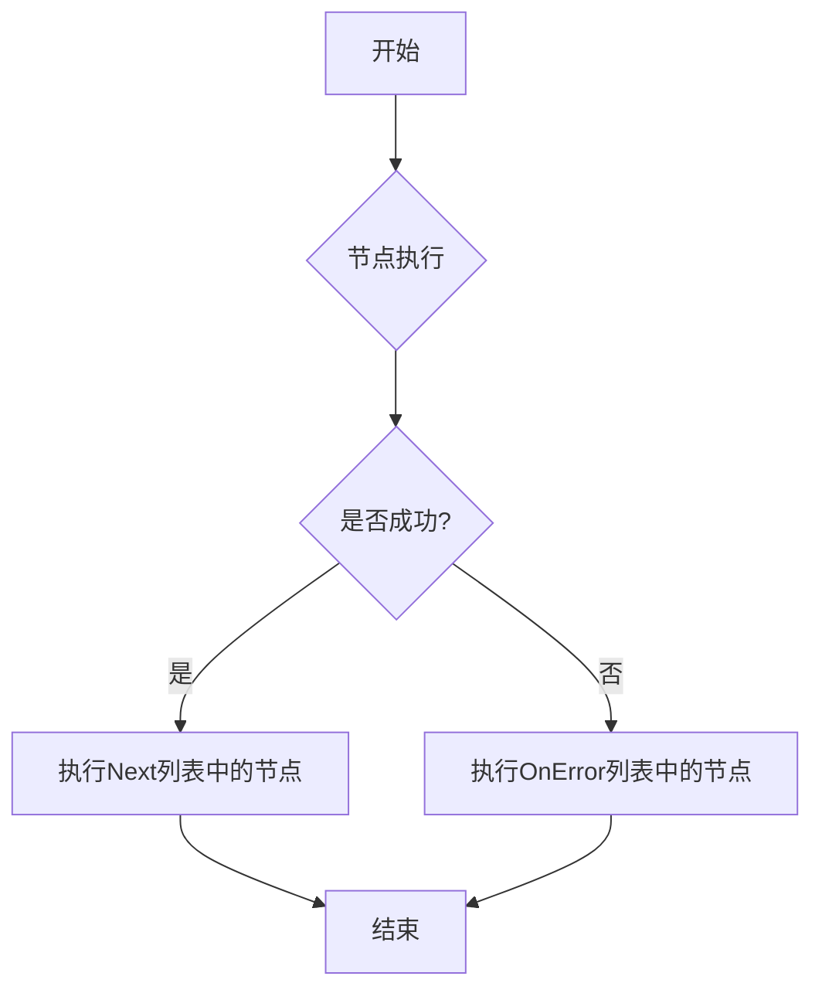
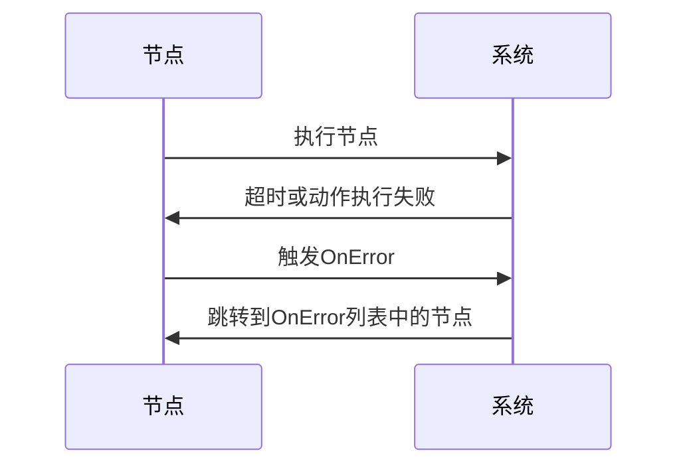
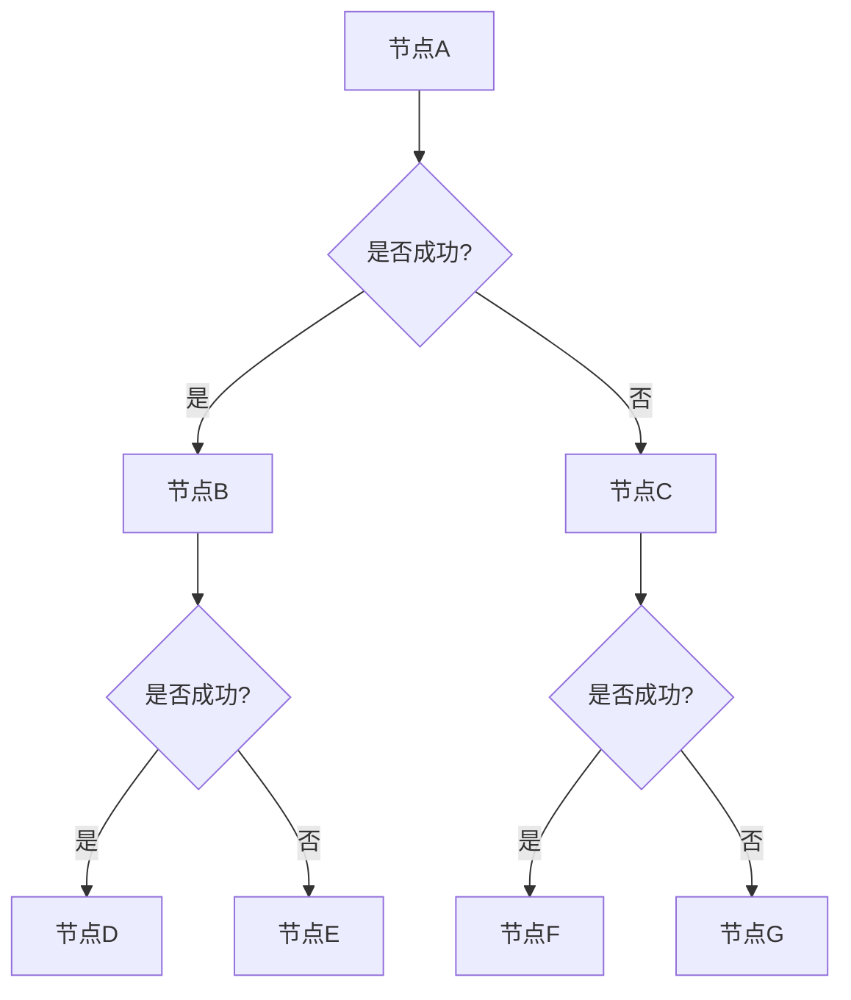
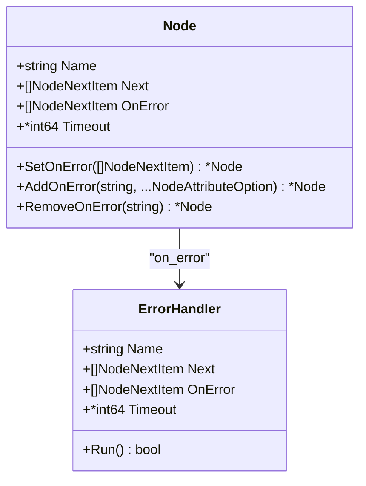

# 错误处理机制

<cite>
**本文档引用的文件**  
- [pipeline.go](file://pipeline.go#L1-L2115)
- [context.go](file://context.go#L1-L240)
- [tasker.go](file://tasker.go#L1-L433)
- [status.go](file://status.go#L1-L61)
- [context_test.go](file://context_test.go#L1120-L1319)
- [examples\quick-start\resource\pipeline\pipeline.json](file://examples/quick-start/resource/pipeline/pipeline.json)
- [examples\custom-action\resource\pipeline\pipeline.json](file://examples/custom-action/resource/pipeline/pipeline.json)
- [examples\custom-recognition\resource\pipeline\pipeline.json](file://examples/custom-recognition/resource/pipeline/pipeline.json)
</cite>

## 目录
1. [引言](#引言)
2. [错误处理机制概述](#错误处理机制概述)
3. [OnError列表的配置与执行逻辑](#onerror列表的配置与执行逻辑)
4. [异常状态检测与错误传播控制](#异常状态检测与错误传播控制)
5. [错误恢复流程设计](#错误恢复流程设计)
6. [OnError与Next列表的优先级关系](#onerror与next列表的优先级关系)
7. [常见错误场景解决方案](#常见错误场景解决方案)
8. [调试技巧](#调试技巧)
9. [结论](#结论)

## 引言
本项目是一个自动化任务框架，支持通过定义流水线（Pipeline）来执行复杂的自动化任务。每个任务由多个节点（Node）组成，节点之间通过Next列表进行顺序流转。当节点在执行过程中遇到超时或动作执行失败等异常情况时，系统需要具备健壮的错误处理能力，以确保任务能够继续执行或优雅地终止。本文档将深入解析该框架的错误处理机制，重点讲解OnError列表的配置和执行逻辑，以及如何设计有效的错误恢复流程。

## 错误处理机制概述
在maa-framework-go中，错误处理机制是通过节点（Node）的OnError列表实现的。当节点在执行过程中遇到超时或动作执行失败等异常情况时，系统会自动跳转到预设的错误处理节点。OnError列表的配置和执行逻辑是该机制的核心。



**Diagram sources**
- [pipeline.go](file://pipeline.go#L53-L54)
- [context_test.go](file://context_test.go#L1188-L1191)

**Section sources**
- [pipeline.go](file://pipeline.go#L1-L2115)
- [context_test.go](file://context_test.go#L1120-L1319)

## OnError列表的配置与执行逻辑
OnError列表是节点的一个属性，用于指定在节点执行失败时应跳转到的节点。OnError列表的配置可以通过多种方式实现，包括使用`WithOnError`函数选项、`SetOnError`方法、`AddOnError`方法等。

### 配置OnError列表
在创建节点时，可以通过`WithOnError`函数选项来配置OnError列表。例如：

```go
node := NewNode("test", WithOnError([]NodeNextItem{{Name: "ErrorHandler"}}))
```

也可以在节点创建后，通过`SetOnError`方法来设置OnError列表。例如：

```go
node.SetOnError([]NodeNextItem{{Name: "ErrorHandler"}})
```

此外，还可以通过`AddOnError`方法向OnError列表中添加节点。例如：

```go
node.AddOnError("ErrorHandler")
```

### 执行逻辑
当节点在执行过程中遇到超时或动作执行失败等异常情况时，系统会自动跳转到OnError列表中的第一个节点。如果OnError列表为空，则任务将终止。



**Diagram sources**
- [pipeline.go](file://pipeline.go#L397-L436)
- [pipeline_test.go](file://pipeline_test.go#L70-L100)

**Section sources**
- [pipeline.go](file://pipeline.go#L1-L2115)
- [pipeline_test.go](file://pipeline_test.go#L70-L100)

## 异常状态检测与错误传播控制
在maa-framework-go中，异常状态检测是通过节点的Timeout属性和动作执行结果来实现的。当节点在执行过程中超过Timeout指定的时间，或者动作执行失败时，系统会认为该节点处于异常状态，并触发OnError列表的执行。

### 异常状态检测
节点的Timeout属性用于设置节点的最大执行时间。当节点在执行过程中超过Timeout指定的时间，系统会认为该节点处于异常状态。例如：

```go
node := NewNode("test", WithTimeout(30*time.Second))
```

### 错误传播控制
当节点在执行过程中遇到异常情况时，系统会自动跳转到OnError列表中的节点。如果OnError列表中的节点也执行失败，则错误会继续传播，直到找到一个能够处理错误的节点，或者任务终止。



**Diagram sources**
- [pipeline.go](file://pipeline.go#L51-L52)
- [context_test.go](file://context_test.go#L1128-L1130)

**Section sources**
- [pipeline.go](file://pipeline.go#L1-L2115)
- [context_test.go](file://context_test.go#L1120-L1319)

## 错误恢复流程设计
在设计错误恢复流程时，需要考虑异常状态检测、错误处理节点链构建和错误传播控制。通过合理设计错误恢复流程，可以提高系统的健壮性和可靠性。

### 异常状态检测
在设计错误恢复流程时，首先需要明确哪些情况属于异常状态。在maa-framework-go中，异常状态主要包括超时和动作执行失败。可以通过设置节点的Timeout属性和检查动作执行结果来检测异常状态。

### 错误处理节点链构建
在检测到异常状态后，需要构建错误处理节点链。错误处理节点链是指一系列用于处理错误的节点。可以通过配置OnError列表来构建错误处理节点链。例如：

```json
{
    "Startup": {
        "action": "StartApp",
        "on_error": ["ErrorHandler"]
    },
    "ErrorHandler": {
        "action": "Click",
        "target": [100, 200, 100, 100],
        "on_error": ["RetryHandler"]
    },
    "RetryHandler": {
        "action": "RestartApp"
    }
}
```

### 错误传播控制
在构建错误处理节点链后，需要控制错误的传播。可以通过设置OnError列表中的节点来控制错误的传播。例如，可以在OnError列表中设置一个能够处理所有错误的节点，以防止错误继续传播。



**Diagram sources**
- [pipeline.go](file://pipeline.go#L37-L64)
- [examples\custom-action\resource\pipeline\pipeline.json](file://examples/custom-action/resource/pipeline/pipeline.json)

**Section sources**
- [pipeline.go](file://pipeline.go#L1-L2115)
- [examples\custom-action\resource\pipeline\pipeline.json](file://examples/custom-action/resource/pipeline/pipeline.json)

## OnError与Next列表的优先级关系
在maa-framework-go中，OnError列表和Next列表的优先级关系是：当节点执行成功时，系统会执行Next列表中的节点；当节点执行失败时，系统会执行OnError列表中的节点。因此，OnError列表的优先级高于Next列表。

### 优先级关系
OnError列表和Next列表的优先级关系可以通过以下代码示例来说明：

```go
node := NewNode("test",
    WithNext([]NodeNextItem{{Name: "NextNode"}}),
    WithOnError([]NodeNextItem{{Name: "ErrorHandler"}}),
)
```

在这个例子中，如果节点执行成功，系统会执行NextNode；如果节点执行失败，系统会执行ErrorHandler。

### 结合使用
通过结合使用OnError列表和Next列表，可以实现更加健壮的容错系统。例如，可以在Next列表中设置正常的任务流程，在OnError列表中设置错误处理流程。这样，当任务正常执行时，系统会按照Next列表中的节点顺序执行；当任务出现异常时，系统会跳转到OnError列表中的节点进行错误处理。


**Diagram sources**
- [pipeline.go](file://pipeline.go#L48-L54)
- [context_test.go](file://context_test.go#L1174-L1181)

**Section sources**
- [pipeline.go](file://pipeline.go#L1-L2115)
- [context_test.go](file://context_test.go#L1120-L1319)

## 常见错误场景解决方案
在实际使用中，可能会遇到各种错误场景。以下是一些常见错误场景的解决方案。

### 超时错误
当节点在执行过程中超过Timeout指定的时间时，系统会认为该节点处于异常状态。可以通过增加Timeout的值来解决超时错误。例如：

```go
node := NewNode("test", WithTimeout(60*time.Second))
```

### 动作执行失败
当节点的动作执行失败时，系统会认为该节点处于异常状态。可以通过检查动作执行结果来解决动作执行失败的问题。例如：

```go
actionResult := node.Action.Execute()
if !actionResult.Success {
    // 处理动作执行失败
}
```

### 节点不存在
当OnError列表中的节点不存在时，系统会认为该节点处于异常状态。可以通过检查节点是否存在来解决节点不存在的问题。例如：

```go
if !node.Exists("ErrorHandler") {
    // 处理节点不存在
}
```

**Section sources**
- [pipeline.go](file://pipeline.go#L1-L2115)
- [context.go](file://context.go#L183-L194)

## 调试技巧
在调试错误处理机制时，可以使用以下技巧来提高效率。

### 使用日志
通过启用日志功能，可以查看节点的执行过程和错误信息。例如：

```go
node := NewNode("test", WithLog(true))
```

### 使用调试工具
可以使用调试工具来逐步执行节点，查看每一步的执行结果。例如，可以使用IDE的调试功能来逐步执行节点。

### 检查配置
在调试时，需要检查OnError列表和Next列表的配置是否正确。可以通过打印配置信息来检查配置。例如：

```go
fmt.Println("OnError:", node.OnError)
fmt.Println("Next:", node.Next)
```

**Section sources**
- [context.go](file://context.go#L176-L181)
- [tasker.go](file://tasker.go#L292-L343)

## 结论
本文档详细解析了maa-framework-go的错误处理机制，重点讲解了OnError列表的配置和执行逻辑，以及如何设计有效的错误恢复流程。通过合理使用OnError列表和Next列表，可以实现更加健壮的容错系统。在实际使用中，需要根据具体需求来设计错误处理流程，并通过调试技巧来提高开发效率。