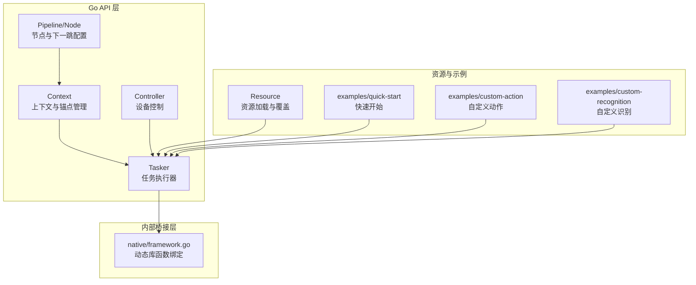
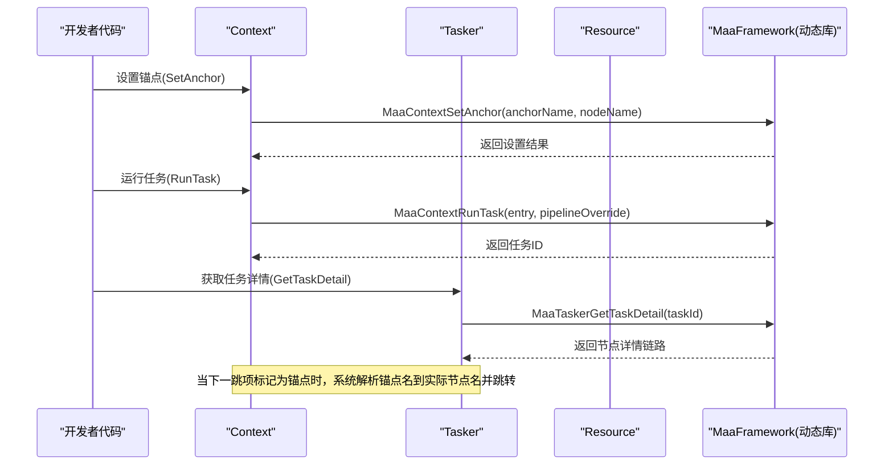
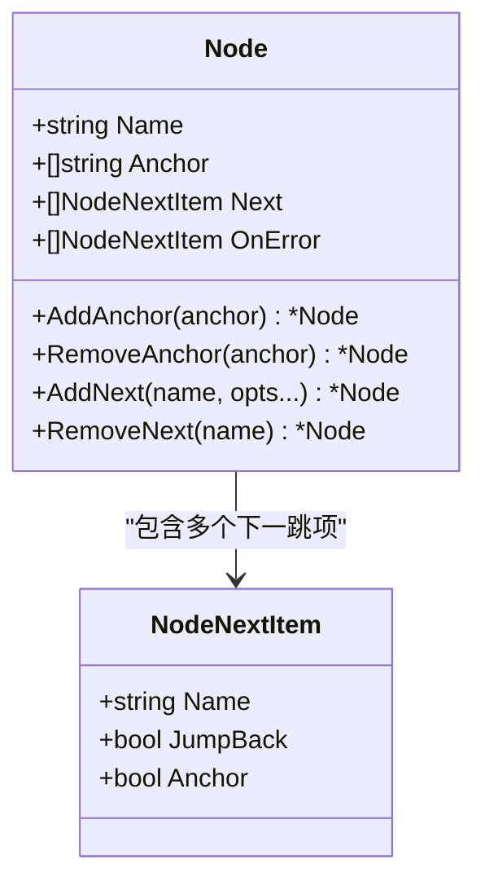
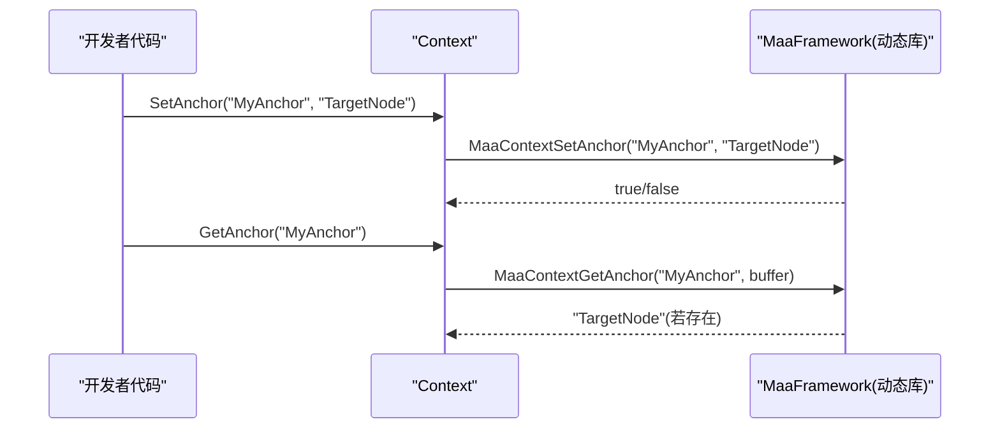
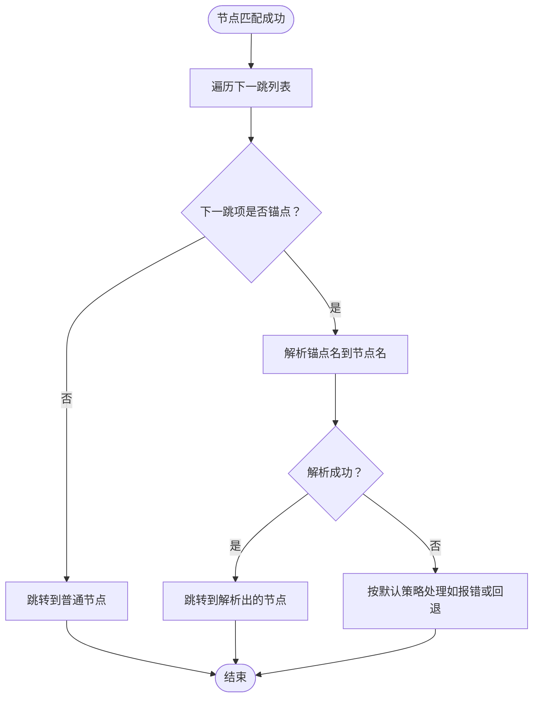
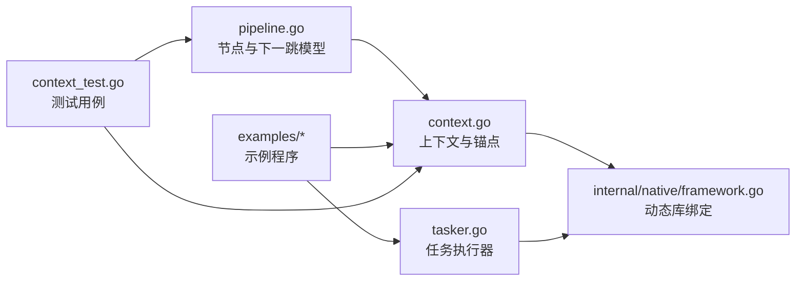

# 锚点引用系统

<cite>
**本文引用的文件**
- [context.go](file://context.go)
- [tasker.go](file://tasker.go)
- [pipeline.go](file://pipeline.go)
- [target.go](file://target.go)
- [internal/native/framework.go](file://internal/native/framework.go)
- [examples/quick-start/main.go](file://examples/quick-start/main.go)
- [examples/custom-action/main.go](file://examples/custom-action/main.go)
- [examples/custom-recognition/main.go](file://examples/custom-recognition/main.go)
- [context_test.go](file://context_test.go)
- [pipeline_test.go](file://pipeline_test.go)
</cite>

## 目录
1. [引言](#引言)
2. [项目结构](#项目结构)
3. [核心组件](#核心组件)
4. [架构总览](#架构总览)
5. [详细组件分析](#详细组件分析)
6. [依赖关系分析](#依赖关系分析)
7. [性能考量](#性能考量)
8. [故障排查指南](#故障排查指南)
9. [结论](#结论)
10. [附录](#附录)

## 引言
本文件围绕“锚点（Anchor）引用系统”展开，系统性解析其在Maa Framework Go绑定中的工作原理与使用方法。锚点用于在复杂任务流中实现动态节点引用与跳转，通过在节点上声明锚点名称，并在下一跳列表中以锚点形式引用，使流程能够在运行时根据最新设置的锚点目标进行跳转，从而支持模块化设计、动态流程调整与跨流程调用等场景。

## 项目结构
该仓库采用分层与功能模块化的组织方式：
- 上层Go API：Context、Tasker、Pipeline、Controller等对外接口
- 内部桥接层：internal/native 封装对底层MaaFramework动态库的调用
- 示例与测试：examples与test目录包含快速开始、自定义动作/识别等示例，以及针对锚点与节点属性的单元测试

图表来源
- [context.go](file://context.go#L1-L240)
- [tasker.go](file://tasker.go#L1-L120)
- [pipeline.go](file://pipeline.go#L1-L120)
- [internal/native/framework.go](file://internal/native/framework.go#L190-L210)

章节来源
- [context.go](file://context.go#L1-L240)
- [tasker.go](file://tasker.go#L1-L120)
- [pipeline.go](file://pipeline.go#L1-L120)
- [internal/native/framework.go](file://internal/native/framework.go#L190-L210)

## 核心组件
- Context：提供锚点设置与查询能力，以及任务/识别/动作的运行入口；支持运行时覆盖管道与下一跳列表。
- Tasker：任务执行器，负责任务投递、状态查询、任务详情获取等；与资源、控制器绑定。
- Pipeline/Node：节点模型，支持锚点集合、下一跳列表、错误处理列表、等待冻结等属性；提供添加/移除锚点与下一跳项的API。
- native/framework.go：对MaaFramework动态库的函数绑定，包括Context锚点相关API（设置/获取锚点）、任务执行、资源覆盖等。

章节来源
- [context.go](file://context.go#L160-L240)
- [tasker.go](file://tasker.go#L1-L120)
- [pipeline.go](file://pipeline.go#L1-L120)
- [internal/native/framework.go](file://internal/native/framework.go#L190-L210)

## 架构总览
锚点引用系统贯穿于节点定义、运行时覆盖与动态跳转三个层面：
- 节点定义阶段：在节点上声明锚点集合，并在下一跳列表中以“锚点”属性引用锚点名。
- 运行时覆盖阶段：通过Context或Tasker提供的覆盖接口，为特定节点设置下一跳列表或直接设置锚点。
- 动态跳转阶段：当节点匹配成功且下一跳项标记为锚点时，系统解析该锚点名对应的实际节点名，并进行跳转。

图表来源
- [context.go](file://context.go#L216-L227)
- [tasker.go](file://tasker.go#L285-L344)
- [internal/native/framework.go](file://internal/native/framework.go#L190-L210)

## 详细组件分析

### 组件A：锚点定义与注册（Pipeline/Node）
- 节点锚点集合：节点结构包含锚点字符串数组，用于标识可被下一跳引用的目标。
- 节点下一跳项：下一跳列表项支持“锚点”属性，表示该项应被视为锚点引用而非普通节点名。
- 工具方法：提供添加/移除锚点的方法，保证去重与幂等；提供添加/移除下一跳项的方法，避免重复添加。

图表来源
- [pipeline.go](file://pipeline.go#L36-L73)
- [pipeline.go](file://pipeline.go#L300-L328)
- [pipeline.go](file://pipeline.go#L329-L358)
- [pipeline.go](file://pipeline.go#L360-L420)

章节来源
- [pipeline.go](file://pipeline.go#L36-L73)
- [pipeline.go](file://pipeline.go#L300-L328)
- [pipeline.go](file://pipeline.go#L329-L358)
- [pipeline.go](file://pipeline.go#L360-L420)
- [pipeline_test.go](file://pipeline_test.go#L1-L53)

### 组件B：运行时锚点设置与解析（Context）
- 设置锚点：Context提供设置锚点的方法，将锚点名映射到当前节点名，供下一跳解析使用。
- 获取锚点：Context提供获取锚点的方法，便于调试与验证。
- 运行时覆盖：Context支持覆盖管道与下一跳列表，可在任务执行过程中动态调整下一跳策略。

图表来源
- [context.go](file://context.go#L216-L227)
- [internal/native/framework.go](file://internal/native/framework.go#L190-L210)

章节来源
- [context.go](file://context.go#L216-L227)
- [internal/native/framework.go](file://internal/native/framework.go#L190-L210)

### 组件C：动态跳转机制（Tasker与下一跳解析）
- 任务详情获取：Tasker提供获取任务详情的能力，包含节点链路与状态，便于定位锚点生效位置。
- 下一跳解析：当某一节点的下一跳项标记为锚点时，系统会依据当前上下文中已设置的锚点名解析到具体节点名并进行跳转。
- 错误处理与回跳：节点还支持“回跳”属性，用于在匹配后返回父节点继续从下一跳列表起始处重新识别。

图表来源
- [tasker.go](file://tasker.go#L285-L344)
- [pipeline.go](file://pipeline.go#L300-L328)

章节来源
- [tasker.go](file://tasker.go#L285-L344)
- [pipeline.go](file://pipeline.go#L300-L328)

### 组件D：目标类型与参数（Target）
- Target抽象：Target用于封装不同类型的坐标/区域参数，支持布尔、字符串、矩形等类型，便于在节点参数中统一表达目标。
- 在锚点场景中的作用：虽然锚点本身不直接使用Target，但Target作为节点参数的基础类型，与锚点配合可实现更灵活的动态目标与跳转策略。

章节来源
- [target.go](file://target.go#L1-L18)

## 依赖关系分析
- Context依赖native框架的锚点设置/获取接口，向上提供易用的Go API。
- Tasker依赖native框架的任务执行与详情查询接口，向下与资源/控制器交互。
- Pipeline/Node为数据模型，提供锚点与下一跳的声明与管理。
- 示例与测试文件展示了锚点在真实场景中的使用方式与验证方法。

图表来源
- [pipeline.go](file://pipeline.go#L1-L120)
- [context.go](file://context.go#L1-L120)
- [tasker.go](file://tasker.go#L1-L120)
- [internal/native/framework.go](file://internal/native/framework.go#L190-L210)
- [context_test.go](file://context_test.go#L1108-L1196)
- [pipeline_test.go](file://pipeline_test.go#L1-L53)

章节来源
- [pipeline.go](file://pipeline.go#L1-L120)
- [context.go](file://context.go#L1-L120)
- [tasker.go](file://tasker.go#L1-L120)
- [internal/native/framework.go](file://internal/native/framework.go#L190-L210)
- [context_test.go](file://context_test.go#L1108-L1196)
- [pipeline_test.go](file://pipeline_test.go#L1-L53)

## 性能考量
- 锚点解析成本：锚点解析发生在节点匹配后的下一跳决策阶段，通常为常数时间操作，开销较低。
- 覆盖与克隆：Context提供覆盖管道与克隆上下文的能力，可在不影响全局配置的情况下进行局部调整，减少不必要的全局重载。
- 缓存与状态：Tasker提供缓存清理与状态查询接口，有助于在长流程中保持稳定性能。

## 故障排查指南
- 验证锚点是否生效：通过Context的GetAnchor查询锚点值，确认是否与预期一致。
- 检查下一跳列表：确保下一跳项正确设置了锚点属性，且锚点名与设置的锚点名一致。
- 使用任务详情：通过Tasker获取任务详情，查看节点链路与状态，定位锚点跳转是否按预期发生。
- 参考测试用例：利用现有测试用例验证锚点行为，包括节点属性、锚点集合与下一跳项的增删改查。

章节来源
- [context.go](file://context.go#L221-L239)
- [tasker.go](file://tasker.go#L285-L344)
- [context_test.go](file://context_test.go#L1108-L1196)
- [pipeline_test.go](file://pipeline_test.go#L1-L53)

## 结论
锚点引用系统通过“节点锚点集合 + 下一跳锚点引用 + 运行时锚点设置”的组合，实现了复杂任务流中的动态跳转与灵活编排。它既支持模块化设计（将通用节点作为锚点），也支持动态流程调整（在运行时更新锚点指向），并在跨流程调用中提供了简洁的引用机制。结合Context与Tasker的覆盖与详情查询能力，开发者可以高效地构建可维护、可扩展的自动化流程。

## 附录

### 实战案例与最佳实践
- 模块化设计：将通用流程片段（如登录、引导、设置）定义为独立节点，并在需要的地方设置锚点，以便其他流程复用。
- 动态流程调整：在任务执行过程中，根据识别结果或外部条件，通过Context设置新的锚点，实现动态跳转。
- 跨流程调用：在不同任务之间共享同一锚点名，通过设置锚点实现跨任务的跳转与复用。
- 最佳实践：
  - 为每个锚点命名清晰、语义明确，避免歧义。
  - 在下一跳列表中显式标注锚点属性，确保解析逻辑清晰。
  - 使用任务详情与锚点查询进行调试，及时发现锚点未生效或解析失败的问题。
  - 避免在同一节点上重复设置相同锚点，保持锚点集合的唯一性与可维护性。

章节来源
- [context.go](file://context.go#L216-L227)
- [pipeline.go](file://pipeline.go#L300-L328)
- [examples/quick-start/main.go](file://examples/quick-start/main.go#L1-L41)
- [examples/custom-action/main.go](file://examples/custom-action/main.go#L1-L49)
- [examples/custom-recognition/main.go](file://examples/custom-recognition/main.go#L1-L77)