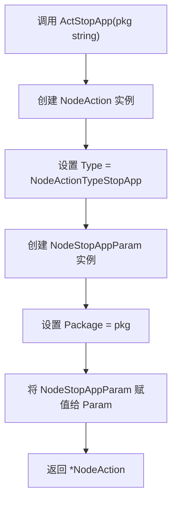
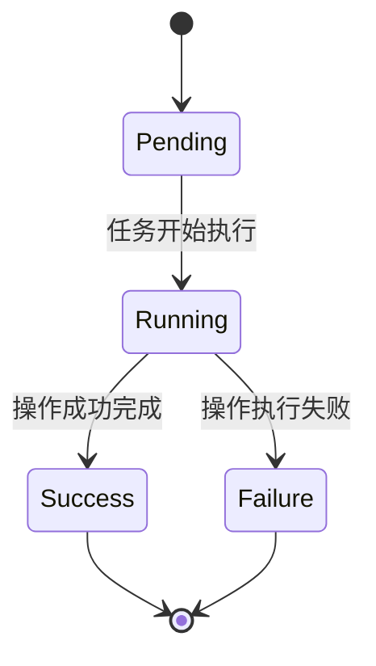

# 停止应用操作配置

<cite>
**本文档引用的文件**   
- [pipeline.go](file://pipeline.go#L1885-L1898)
- [controller.go](file://controller.go#L193-L197)
- [custom_controller.go](file://custom_controller.go#L179-L197)
- [status.go](file://status.go#L1-L61)
</cite>

## 目录
1. [NodeAction结构体与停止应用操作](#nodeaction结构体与停止应用操作)
2. [ActStopApp构造函数参数配置](#actstopapp构造函数参数配置)
3. [Package参数格式与匹配规则](#package参数格式与匹配规则)
4. [Force参数对不同平台的影响](#force参数对不同平台的影响)
5. [操作执行后的状态检查机制](#操作执行后的状态检查机制)
6. [应用停止操作的异常处理流程](#应用停止操作的异常处理流程)
7. [PreDelay/PostDelay参数在应用清理场景中的配置](#predelaypostdelay参数在应用清理场景中的配置)

## NodeAction结构体与停止应用操作

NodeAction结构体是maa-framework-go框架中用于定义节点操作的核心数据结构，其中NodeActionTypeStopApp类型专门用于实现停止应用的功能。该操作通过NodeStopAppParam参数结构体传递必要的配置信息，主要包含Package字段，用于指定需要停止的应用包名。

**Section sources**
- [pipeline.go](file://pipeline.go#L1204-L1209)
- [pipeline.go](file://pipeline.go#L1885-L1889)

## ActStopApp构造函数参数配置

ActStopApp函数是创建停止应用操作的构造函数，其参数配置简洁明了。该函数接收一个字符串类型的pkg参数，用于指定目标应用的包名。函数内部通过创建NodeAction实例并设置其Type为NodeActionTypeStopApp，同时将pkg参数封装到NodeStopAppParam结构体中作为Param字段的值，从而完成停止应用操作的配置。

**Diagram sources **
- [pipeline.go](file://pipeline.go#L1893-L1898)

**Section sources**
- [pipeline.go](file://pipeline.go#L1893-L1898)

## Package参数格式与匹配规则

Package参数用于指定需要停止的应用包名，其格式要求为标准的Android应用包名格式，通常由多个由点号分隔的标识符组成，例如"com.example.app"。该参数是必需的，且在配置时需要确保包名的准确性。

在匹配规则方面，系统采用精确匹配的方式，即提供的包名必须与目标应用的包名完全一致才能成功停止应用。目前的实现中未提供模糊匹配的功能，因此无法通过部分包名或通配符来停止多个应用。这种设计确保了操作的精确性和安全性，避免了误操作导致其他应用被意外停止。

**Section sources**
- [pipeline.go](file://pipeline.go#L1887-L1888)
- [controller.go](file://controller.go#L193-L197)

## Force参数对不同平台的影响

在当前的实现中，停止应用操作并未包含Force参数。停止应用的操作通过调用底层控制器的PostStopApp方法实现，该方法仅接收应用的包名作为参数。对于不同的平台（如ADB和Win32），停止应用的具体实现由相应的控制器负责，但对外提供的接口保持一致。

在ADB平台上，停止应用通常通过执行adb shell am force-stop命令来实现，该命令会强制停止指定包名的应用及其所有相关进程。而在Win32平台上，停止应用可能涉及关闭特定的窗口或进程，具体实现取决于目标应用的类型和运行方式。尽管底层实现可能有所不同，但框架通过统一的接口屏蔽了这些差异，使得上层应用可以以相同的方式调用停止应用操作。

**Section sources**
- [controller.go](file://controller.go#L193-L197)
- [custom_controller.go](file://custom_controller.go#L179-L197)

## 操作执行后的状态检查机制

停止应用操作执行后的状态检查机制依赖于Job对象的Wait方法。当调用Controller的PostStopApp方法时，会返回一个Job对象，该对象代表了正在执行的停止应用任务。通过调用Job对象的Wait方法，可以阻塞等待任务完成，并获取任务的执行状态。

状态检查的结果通过Status类型表示，该类型定义了Invalid、Pending、Running、Success和Failure五种状态。对于停止应用操作而言，成功执行后应返回Success状态，表示应用已成功停止；若执行过程中出现错误，则返回Failure状态。开发者可以通过检查Status的Success或Failure方法来判断操作是否成功完成。

**Diagram sources **
- [status.go](file://status.go#L6-L12)

**Section sources**
- [status.go](file://status.go#L1-L61)
- [controller.go](file://controller.go#L193-L197)

## 应用停止操作的异常处理流程

在应用停止操作的异常处理流程中，框架通过返回的Job对象和Status类型来传递错误信息。如果PostStopApp方法调用失败，返回的Job对象在调用Wait方法后会得到Failure状态。开发者应检查该状态并采取相应的恢复措施，例如重试操作或记录错误日志。

在自定义控制器的实现中，StopApp方法的返回值直接决定了操作的成功与否。如果控制器实现返回false，则框架会认为操作失败。因此，在实现自定义控制器时，需要确保StopApp方法能够正确处理各种异常情况，并返回适当的结果。

**Section sources**
- [custom_controller.go](file://custom_controller.go#L179-L197)
- [status.go](file://status.go#L34-L37)

## PreDelay/PostDelay参数在应用清理场景中的配置

在当前的NodeStopAppParam结构体定义中，并未包含PreDelay和PostDelay参数。这意味着停止应用操作本身不支持在操作前或操作后添加延迟。然而，在实际应用中，可能需要在停止应用前后执行一些清理工作，例如保存数据或释放资源。

为了实现类似PreDelay/PostDelay的功能，开发者可以在停止应用操作的前后插入其他操作节点。例如，可以在停止应用前插入一个等待操作，以模拟PreDelay的效果；在停止应用后插入另一个等待操作，以模拟PostDelay的效果。这种做法虽然不如内置参数方便，但提供了更大的灵活性，允许开发者根据具体需求配置复杂的操作序列。

**Section sources**
- [pipeline.go](file://pipeline.go#L1885-L1889)
- [pipeline.go](file://pipeline.go#L1893-L1898)