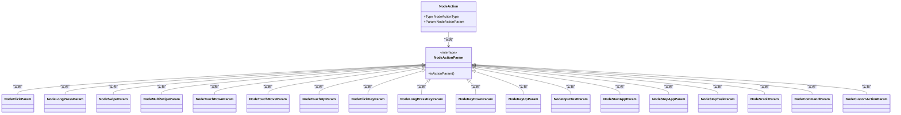

# 动作配置详解

<cite>
**本文档引用文件**   
- [pipeline.go](file://pipeline.go#L36-L2114)
- [context_test.go](file://context_test.go#L675-L1160)
</cite>

## 目录
1. [Node结构体中的Action字段](#node结构体中的action字段)
2. [NodeAction类型与参数结构](#nodeaction类型与参数结构)
3. [点击类动作实现机制](#点击类动作实现机制)
4. [滑动类动作实现机制](#滑动类动作实现机制)
5. [按键类动作实现机制](#按键类动作实现机制)
6. [其他动作类型](#其他动作类型)
7. [控制参数机制](#控制参数机制)
8. [典型使用场景示例](#典型使用场景示例)

## Node结构体中的Action字段

Node结构体中的Action字段是任务流程中定义设备操作的核心组成部分。该字段通过NodeAction类型定义具体的操作行为，配合丰富的参数结构实现多样化的设备控制功能。Action字段的设计采用了类型-参数分离的模式，通过Type字段指定动作类型，Param字段携带对应类型的参数数据。

Node结构体还提供了PreDelay和PostDelay字段用于设置动作执行前后的延迟时间，以及PreWaitFreezes和PostWaitFreezes字段用于配置画面稳定等待。这些控制参数与Action字段协同工作，确保操作的准确性和稳定性。

**Section sources**
- [pipeline.go](file://pipeline.go#L36-L294)

## NodeAction类型与参数结构

NodeAction类型定义了系统支持的各种动作类型，通过枚举值区分不同的操作行为。每种动作类型都有对应的参数结构体，实现了类型安全的参数配置。系统采用接口-实现的模式，通过NodeActionParam接口统一管理所有动作参数。

动作类型包括点击、长按、滑动、多指滑动、触摸按下/移动/抬起、按键操作、文本输入、应用启动/停止等多种设备控制功能。这种设计模式使得系统具有良好的扩展性，可以方便地添加新的动作类型。

**Diagram sources **
- [pipeline.go](file://pipeline.go#L1204-L2034)

**Section sources**
- [pipeline.go](file://pipeline.go#L1204-L1303)

## 点击类动作实现机制

点击类动作包括普通点击(Click)和长按(LongPress)两种基本操作。Click动作通过NodeClickParam结构体配置点击位置和触控点标识，支持指定目标区域和偏移量。LongPress动作在Click的基础上增加了持续时间参数，用于模拟长按操作。

系统提供了函数式选项模式(WithClickTarget、WithLongPressDuration等)来构建动作配置，这种设计模式提高了代码的可读性和灵活性。触控点标识(Contact)参数支持多指触控，可以根据不同平台(ADB/Win32)指定相应的手指索引或鼠标按钮。

**Diagram sources **
- [pipeline.go](file://pipeline.go#L1323-L1418)

**Section sources**
- [pipeline.go](file://pipeline.go#L1323-L1418)
- [context_test.go](file://context_test.go#L401-L674)

## 滑动类动作实现机制

滑动类动作提供了从简单滑动到复杂多指手势的完整支持。Swipe动作通过NodeSwipeParam定义滑动的起点、终点、持续时间和结束保持时间等参数，支持配置多个终点位置实现复杂路径。MultiSwipe动作则支持多指协同操作，通过NodeMultiSwipeItem定义每个手指的独立滑动参数。

系统采用数组形式存储多个终点和持续时间，实现了灵活的滑动路径配置。OnlyHover参数支持悬停模式，可以在不触发按下/释放事件的情况下移动触控点。Starting参数允许精确控制多指操作中各手指的启动时机，实现复杂的协同手势。

**Diagram sources **
- [pipeline.go](file://pipeline.go#L1420-L1639)

**Section sources**
- [pipeline.go](file://pipeline.go#L1420-L1639)
- [context_test.go](file://context_test.go#L707-L776)

## 按键类动作实现机制

按键类动作系统提供了完整的键盘输入支持，包括单次点击(ClickKey)、长按(LongPressKey)、按下(KeyDown)、释放(KeyUp)等操作。ClickKey和LongPressKey适用于短时按键操作，而KeyDown/KeyUp组合则支持持续按下的场景，如游戏中的方向键控制。

NodeClickKeyParam和NodeLongPressKeyParam使用整数数组存储虚拟键码，支持同时操作多个按键。NodeKeyDownParam和NodeKeyUpParam则针对单个按键设计，通过配对使用实现完整的按键生命周期管理。这种设计既满足了简单按键需求，又支持复杂的组合键操作。

**Diagram sources **
- [pipeline.go](file://pipeline.go#L1778-L1851)

**Section sources**
- [pipeline.go](file://pipeline.go#L1778-L1851)
- [context_test.go](file://context_test.go#L898-L939)

## 其他动作类型

系统还提供了多种实用的动作类型：InputText用于文本输入，StartApp/StopApp用于应用管理，StopTask用于终止任务流程，Scroll用于滚轮操作，Command用于执行外部命令，Custom用于扩展自定义操作。

特别是Custom动作类型，通过NodeCustomActionParam结构体支持注册自定义动作处理器，为系统提供了强大的扩展能力。Command动作支持运行时占位符替换，可以动态传递任务上下文信息到外部程序。

**Diagram sources **
- [pipeline.go](file://pipeline.go#L1853-L2034)

**Section sources**
- [pipeline.go](file://pipeline.go#L1853-L2034)
- [context_test.go](file://context_test.go#L940-L1106)

## 控制参数机制

动作执行的控制参数包括PreDelay/PostDelay和PreWaitFreezes/PostWaitFreezes。PreDelay和PostDelay分别设置动作执行前后的固定延迟时间，用于控制操作节奏。WaitFreezes机制则更加智能，通过监控画面变化来判断操作时机。

NodeWaitFreezes结构体配置了画面稳定等待的各项参数，包括稳定持续时间、监控区域、变化检测阈值等。系统通过模板匹配算法检测画面变化，当连续指定时间无显著变化时认为画面已稳定。这种机制特别适用于等待动画结束或加载完成的场景。

**Diagram sources **
- [pipeline.go](file://pipeline.go#L62-L68)
- [pipeline.go](file://pipeline.go#L2036-L2114)

**Section sources**
- [pipeline.go](file://pipeline.go#L62-L68)
- [pipeline.go](file://pipeline.go#L2036-L2114)
- [context_test.go](file://context_test.go#L1108-L1160)

## 典型使用场景示例

在实际应用中，动作配置需要根据具体场景进行组合。例如，在游戏自动化中，可以使用Click动作点击按钮，配合PreWaitFreezes等待界面加载完成；使用Swipe动作进行角色移动，通过MultiSwipe实现复杂技能释放；使用InputText输入账号密码，通过Command调用外部脚本处理验证码。

对于需要精确时序控制的场景，可以结合PreDelay和PostDelay设置操作间隔，利用WaitFreezes确保操作时机准确。自定义动作类型允许开发者集成特定业务逻辑，如图像识别后的特殊处理，或与外部系统的交互操作。

**Section sources**
- [pipeline.go](file://pipeline.go#L1204-L2034)
- [context_test.go](file://context_test.go#L675-L1160)