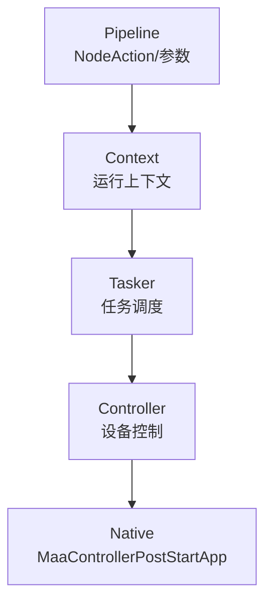
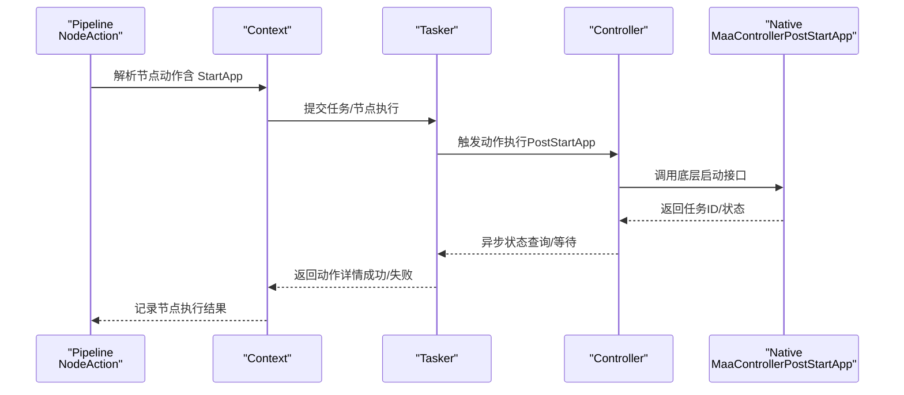
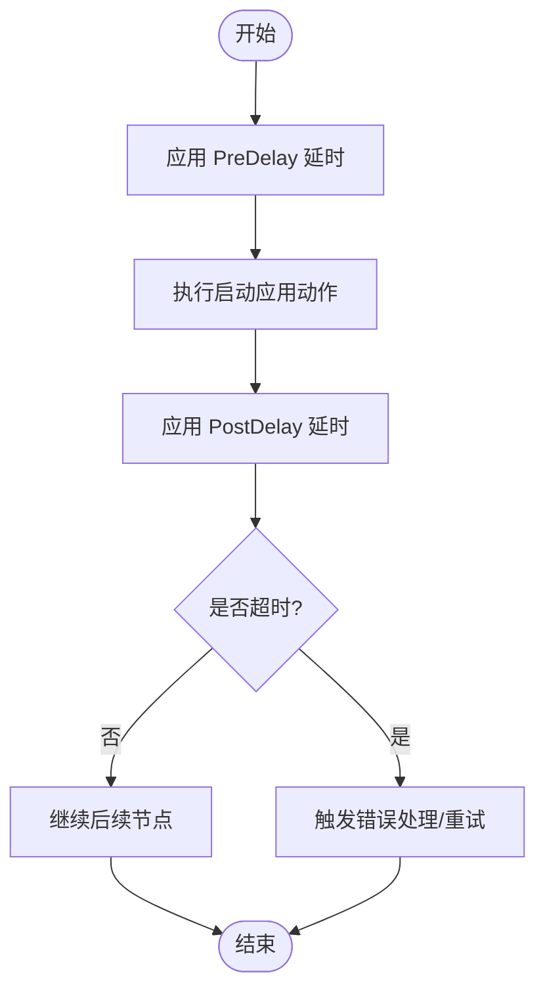
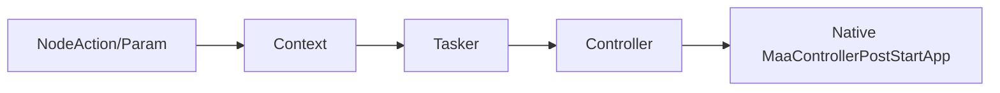

# 启动应用操作配置

<cite>
**本文引用的文件列表**
- [pipeline.go](file://pipeline.go)
- [controller.go](file://controller.go)
- [context.go](file://context.go)
- [tasker.go](file://tasker.go)
- [job.go](file://job.go)
- [internal/native/framework.go](file://internal/native/framework.go)
- [examples/quick-start/main.go](file://examples/quick-start/main.go)
- [examples/quick-start/resource/pipeline/pipeline.json](file://examples/quick-start/resource/pipeline/pipeline.json)
- [context_test.go](file://context_test.go)
</cite>

## 目录
1. [简介](#简介)
2. [项目结构与定位](#项目结构与定位)
3. [核心组件与职责](#核心组件与职责)
4. [架构总览](#架构总览)
5. [详细组件分析](#详细组件分析)
6. [依赖关系分析](#依赖关系分析)
7. [性能与可靠性考量](#性能与可靠性考量)
8. [故障排查指南](#故障排查指南)
9. [结论](#结论)
10. [附录：配置示例与最佳实践](#附录配置示例与最佳实践)

## 简介
本文件聚焦于 NodeAction 结构体中“启动应用”操作（NodeActionTypeStartApp）的实现机制，系统性解析 ActStartApp 构造函数的参数配置、Package 参数的格式要求与平台差异（Android 包名与 Activity 指定、Windows 可执行文件路径），并说明 Timeout、PreDelay、PostDelay 对任务流程的影响。同时结合实际代码示例，阐述该操作与其他设备控制操作的协同工作机制。

## 项目结构与定位
- NodeAction 与动作参数类型定义位于 pipeline.go，负责将 JSON 中的动作描述反序列化为具体参数对象。
- 控制器层通过 Controller.PostStartApp 将“启动应用”意图传递给底层框架。
- 任务执行由 Tasker/Context 驱动，最终映射到控制器的具体动作。
- 示例工程展示了如何在 Pipeline 中使用 StartApp 动作，并通过 Tasker 执行。



**章节来源**
- [pipeline.go](file://pipeline.go#L1200-L1399)
- [controller.go](file://controller.go#L187-L197)
- [tasker.go](file://tasker.go#L85-L123)
- [context.go](file://context.go#L30-L126)

## 核心组件与职责
- NodeAction/NodeStartAppParam：定义启动应用动作的类型与参数（仅包含 Package 字段）。
- ActStartApp：构造函数，用于创建带参数的 NodeAction。
- Controller.PostStartApp：将“启动应用”的 Intent（即 Package 字符串）提交给底层框架。
- Tasker/Context：驱动任务执行，将节点动作映射到控制器动作。
- Native 绑定：通过动态库绑定 MaaControllerPostStartApp，完成跨平台调用。

**章节来源**
- [pipeline.go](file://pipeline.go#L1200-L1399)
- [controller.go](file://controller.go#L187-L197)
- [internal/native/framework.go](file://internal/native/framework.go#L384-L398)

## 架构总览
下面的时序图展示了从 Pipeline 到设备控制的完整调用链路，以及启动应用动作的关键节点。



**图表来源**
- [pipeline.go](file://pipeline.go#L1200-L1399)
- [controller.go](file://controller.go#L187-L197)
- [tasker.go](file://tasker.go#L85-L123)
- [context.go](file://context.go#L30-L126)
- [internal/native/framework.go](file://internal/native/framework.go#L384-L398)

## 详细组件分析

### NodeAction 与 NodeStartAppParam
- NodeAction 定义了动作类型与参数对象；当类型为 StartApp 时，参数对象为 NodeStartAppParam。
- NodeStartAppParam 仅包含一个字段 Package，用于指定要启动的应用或活动。
- ActStartApp 构造函数创建一个带有 StartApp 类型与 Package 参数的 NodeAction。

```mermaid
classDiagram
class NodeAction {
+NodeActionType Type
+NodeActionParam Param
}
class NodeStartAppParam {
+string Package
}
class NodeActionParam {
<<interface>>
}
class NodeActionType {
<<enum>>
"StartApp"
}
NodeAction --> NodeStartAppParam : "Param"
NodeStartAppParam ..|> NodeActionParam
```

**图表来源**
- [pipeline.go](file://pipeline.go#L1200-L1399)

**章节来源**
- [pipeline.go](file://pipeline.go#L1200-L1399)

### ActStartApp 构造函数与参数配置
- ActStartApp(pkg string) 接收一个字符串参数 pkg，作为启动目标标识。
- 在当前实现中，pkg 的语义由上层资源/控制器决定：
  - 对于 Android 设备，通常应传入“包名/Activity 全限定名”，例如 com.example.app/com.example.MainActivity。
  - 对于 Windows 设备，通常应传入可执行文件的路径字符串。
- 该函数不直接处理平台差异，平台差异由控制器与底层框架在执行阶段处理。

**章节来源**
- [pipeline.go](file://pipeline.go#L1869-L1883)
- [context_test.go](file://context_test.go#L968-L989)

### Package 参数格式要求与平台差异
- Android 平台
  - 建议格式为“包名/Activity 全限定名”，如 com.example.app/com.example.MainActivity。
  - 该格式与 Android Intent 的 action/Component 形式一致，便于底层框架解析与启动。
- Windows 平台
  - 建议格式为可执行文件的绝对路径或相对路径字符串，确保控制器能够正确解析并启动目标程序。
- 注意事项
  - 若传入的 Package 不符合目标平台的启动规范，底层框架可能无法找到对应的应用或活动，导致启动失败。
  - 在实际使用中，建议在 Pipeline 中明确区分不同设备类型的启动参数，或通过资源覆盖的方式按设备注入正确的 Package 值。

**章节来源**
- [context_test.go](file://context_test.go#L968-L989)

### Timeout、PreDelay、PostDelay 对任务流程的影响
- Timeout（超时）
  - 通过 WithTimeout 设置节点级超时时间，影响任务执行的最长等待时长。
  - 当动作执行超过设定的超时时限，任务流程会根据错误处理策略进行后续处理。
- PreDelay（执行前延时）
  - 通过 WithPreDelay 设置动作执行前的延迟，常用于等待界面稳定、动画结束或资源加载完成。
- PostDelay（执行后延时）
  - 通过 WithPostDelay 设置动作执行后的延迟，常用于等待应用启动完成、页面跳转或数据刷新。
- 协同工作机制
  - 这些选项以毫秒为单位存储在 Node 上，任务执行时会按照顺序依次应用：PreDelay -> 执行动作 -> PostDelay。
  - 与启动应用操作配合时，PreDelay 可用于等待设备连接或应用准备就绪，PostDelay 可用于等待应用进入目标界面。



**图表来源**
- [pipeline.go](file://pipeline.go#L108-L157)
- [controller.go](file://controller.go#L187-L197)

**章节来源**
- [pipeline.go](file://pipeline.go#L108-L157)

### 与其他设备控制操作的协同
- 启动应用动作与点击、输入文本、长按等操作共享相同的执行通道：均由 Tasker/Context 将节点动作映射到控制器动作，再由控制器调用底层框架接口。
- 在 Pipeline 中，可以将多个动作串联，例如先启动应用，再等待一段时间，然后执行识别与点击等后续步骤。
- 错误处理与重试
  - 通过 WithOnError 可为节点配置错误处理分支，结合 Timeout、PreDelay/PostDelay 可形成稳健的自动化流程。

**章节来源**
- [controller.go](file://controller.go#L157-L215)
- [tasker.go](file://tasker.go#L85-L123)
- [context.go](file://context.go#L30-L126)

## 依赖关系分析
- NodeAction/Param 解析依赖于 NodeActionType 的枚举值与各参数类型的构造。
- Controller.PostStartApp 依赖于底层框架导出的 MaaControllerPostStartApp 函数。
- Tasker/Context 作为上层编排者，负责将动作与控制器对接，并提供异步状态查询与任务详情获取。



**图表来源**
- [pipeline.go](file://pipeline.go#L1200-L1399)
- [controller.go](file://controller.go#L187-L197)
- [internal/native/framework.go](file://internal/native/framework.go#L384-L398)

**章节来源**
- [pipeline.go](file://pipeline.go#L1200-L1399)
- [controller.go](file://controller.go#L187-L197)
- [internal/native/framework.go](file://internal/native/framework.go#L384-L398)

## 性能与可靠性考量
- 延时设置
  - 合理设置 PreDelay/PostDelay 可显著提升稳定性，避免因应用尚未完全启动或界面未渲染完成导致的误判。
- 超时控制
  - 使用 WithTimeout 限制动作执行时间，防止长时间阻塞任务流。
- 并发与状态查询
  - 通过 Job/TaskJob 的 Wait/Status 方法进行异步状态查询，避免阻塞主线程。
- 资源绑定
  - 确保 Tasker 已绑定正确的 Resource 与 Controller，避免动作执行时找不到资源或设备。

**章节来源**
- [job.go](file://job.go#L1-L96)
- [tasker.go](file://tasker.go#L85-L123)

## 故障排查指南
- 启动失败
  - 检查 Package 是否符合目标平台规范（Android 应为“包名/Activity 全限定名”，Windows 应为可执行文件路径）。
  - 确认设备已连接且控制器初始化成功。
- 超时或卡顿
  - 增加 PostDelay 或调整 Timeout，观察动作执行耗时与后续识别/点击是否正常。
- 节点未命中
  - 使用 Context.GetNodeData 获取节点 JSON，确认动作类型与参数是否正确解析。
- 示例验证
  - 参考测试用例与示例工程，核对 Pipeline 中的 StartApp 动作配置与执行入口。

**章节来源**
- [context_test.go](file://context_test.go#L968-L989)
- [examples/quick-start/main.go](file://examples/quick-start/main.go#L1-L41)
- [examples/quick-start/resource/pipeline/pipeline.json](file://examples/quick-start/resource/pipeline/pipeline.json#L1-L5)

## 结论
- NodeActionTypeStartApp 的实现以最小参数（Package）为核心，通过 ActStartApp 构造函数快速生成动作节点。
- Package 的格式需遵循目标平台规范：Android 使用“包名/Activity 全限定名”，Windows 使用可执行文件路径。
- Timeout、PreDelay、PostDelay 三者共同构成任务流程的稳定性保障，应结合实际设备与应用特性合理配置。
- 该动作与其它设备控制操作共享同一执行通道，可在 Pipeline 中灵活组合，形成完整的自动化流程。

## 附录：配置示例与最佳实践
- 在 Pipeline 中声明启动应用动作
  - 可参考示例工程中的 Startup 节点，将 action 设为 StartApp。
  - 参考路径：[examples/quick-start/resource/pipeline/pipeline.json](file://examples/quick-start/resource/pipeline/pipeline.json#L1-L5)
- 通过代码构造启动应用动作
  - 使用 ActStartApp(pkg string) 创建动作节点，其中 pkg 为平台相关的包名或路径。
  - 参考路径：[pipeline.go](file://pipeline.go#L1869-L1883)
- 在任务中执行
  - 使用 Tasker.PostTask 或 Context.RunTask 提交任务，查看任务详情与节点执行结果。
  - 参考路径：[examples/quick-start/main.go](file://examples/quick-start/main.go#L1-L41)
- 最佳实践
  - 明确区分不同设备类型的 Package 格式，必要时通过资源覆盖或条件分支注入。
  - 为启动应用动作配置合理的 PreDelay/PostDelay 与 Timeout，确保流程稳定。
  - 将启动应用动作与其他动作（识别、点击、输入文本等）串联，形成端到端的自动化流程。