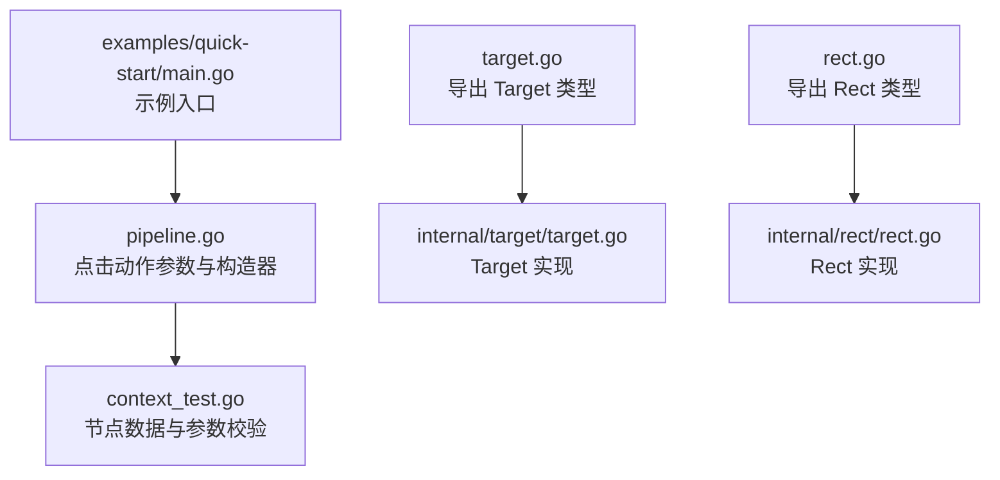
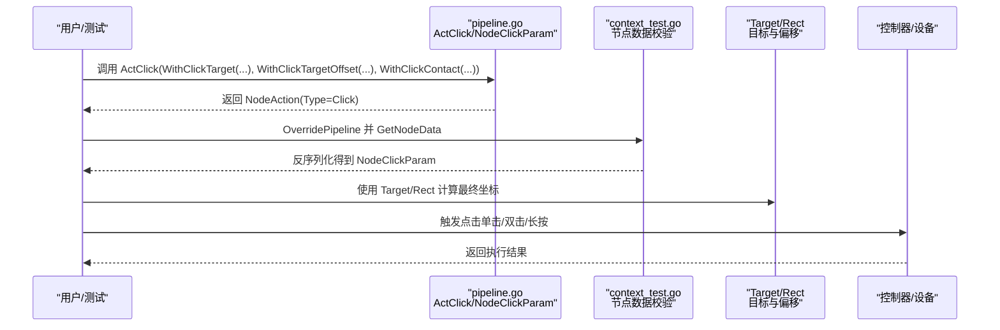
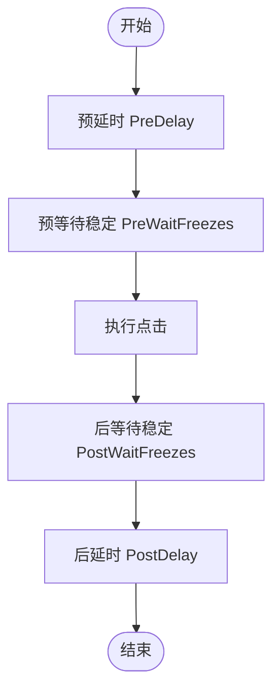
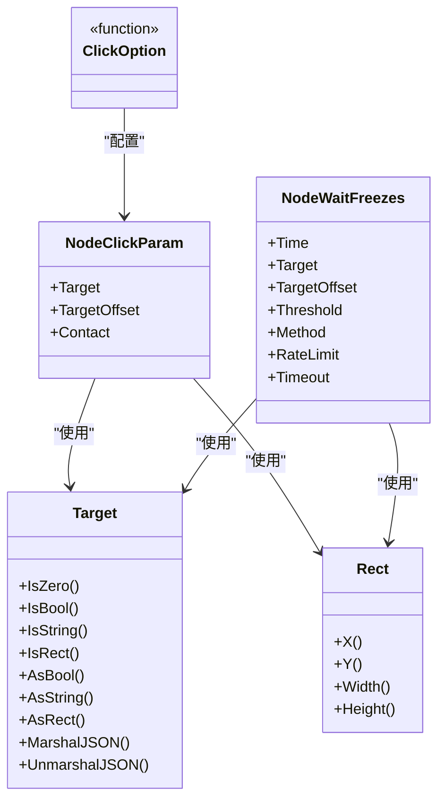

# 点击操作配置

<cite>
**本文引用的文件列表**
- [pipeline.go](file://pipeline.go)
- [context_test.go](file://context_test.go)
- [target.go](file://target.go)
- [internal/target/target.go](file://internal/target/target.go)
- [rect.go](file://rect.go)
- [internal/rect/rect.go](file://internal/rect/rect.go)
- [examples/quick-start/main.go](file://examples/quick-start/main.go)
</cite>

## 目录
1. [简介](#简介)
2. [项目结构与定位](#项目结构与定位)
3. [核心组件：点击动作与目标类型](#核心组件点击动作与目标类型)
4. [架构总览：点击动作的执行链路](#架构总览点击动作的执行链路)
5. [详细组件解析](#详细组件解析)
6. [依赖关系分析](#依赖关系分析)
7. [性能与稳定性考量](#性能与稳定性考量)
8. [故障排查指南](#故障排查指南)
9. [结论](#结论)
10. [附录：配置要点速查](#附录配置要点速查)

## 简介
本篇文档聚焦于框架中的“点击”动作（NodeActionTypeClick），系统性解析其参数模型、目标位置指定方式、点击类型与触点配置、偏移与随机化策略，以及 PreDelay/PostDelay 和 WaitFreezes 在点击流程中的协同机制。通过源码路径与测试用例的交叉验证，帮助读者构建可复现、可调试、可优化的点击自动化方案。

## 项目结构与定位
- 点击动作定义与选项：位于 pipeline.go 中，包含 NodeClickParam、ClickOption 及 ActClick 构造器。
- 目标类型 Target：用于统一承载布尔、字符串、矩形区域三类目标值，支持 JSON 序列化与反序列化。
- 矩形类型 Rect：提供 X/Y/Width/Height 访问器，作为偏移与区域参数的基础类型。
- 测试用例：context_test.go 展示了点击动作在节点数据中的序列化与反序列化行为，以及 PreDelay/PostDelay/WaitFreezes 的使用样例。

图表来源
- [pipeline.go](file://pipeline.go#L1323-L1366)
- [context_test.go](file://context_test.go#L401-L416)
- [target.go](file://target.go#L1-L18)
- [internal/target/target.go](file://internal/target/target.go#L1-L122)
- [rect.go](file://rect.go#L1-L6)
- [internal/rect/rect.go](file://internal/rect/rect.go#L1-L21)

章节来源
- [pipeline.go](file://pipeline.go#L1323-L1366)
- [context_test.go](file://context_test.go#L401-L416)
- [target.go](file://target.go#L1-L18)
- [internal/target/target.go](file://internal/target/target.go#L1-L122)
- [rect.go](file://rect.go#L1-L6)
- [internal/rect/rect.go](file://internal/rect/rect.go#L1-L21)

## 核心组件：点击动作与目标类型
- NodeClickParam：点击动作的核心参数，包含目标位置 Target、额外偏移 TargetOffset、触点 Contact。
- ClickOption：以函数式选项模式为 NodeClickParam 注入配置，如 WithClickTarget、WithClickTargetOffset、WithClickContact。
- ActClick：基于 ClickOption 组合生成 NodeAction，类型为 NodeActionTypeClick。
- Target：类型安全的变体，可持有 bool/string/rect.Rect 三种值，支持 JSON 序列化与反序列化；常用于指定坐标、相对位置或模板匹配 ROI。
- Rect：四元组 [x, y, width, height]，提供访问器，用于偏移与区域描述。

章节来源
- [pipeline.go](file://pipeline.go#L1323-L1366)
- [target.go](file://target.go#L1-L18)
- [internal/target/target.go](file://internal/target/target.go#L1-L122)
- [rect.go](file://rect.go#L1-L6)
- [internal/rect/rect.go](file://internal/rect/rect.go#L1-L21)

## 架构总览：点击动作的执行链路
从节点数据到实际点击执行，通常经历以下步骤：
- 节点数据解析：将 JSON 中的 action.param 反序列化为 NodeClickParam。
- 参数校验与应用：检查 Target/TargetOffset/Contact 等字段是否有效。
- 坐标计算：根据 Target 的具体类型（坐标矩形、相对位置、模板匹配 ROI）计算最终点击坐标。
- 执行点击：调用控制器输入接口，完成单击/双击/长按等操作。
- 后置处理：根据 PostDelay/WaitFreezes 决定延时与稳定等待。

图表来源
- [pipeline.go](file://pipeline.go#L1323-L1366)
- [context_test.go](file://context_test.go#L401-L416)
- [target.go](file://target.go#L1-L18)
- [internal/target/target.go](file://internal/target/target.go#L1-L122)
- [rect.go](file://rect.go#L1-L6)
- [internal/rect/rect.go](file://internal/rect/rect.go#L1-L21)

## 详细组件解析

### NodeActionTypeClick 的实现机制与 ActClick 构造函数
- NodeClickParam 字段
  - Target：点击目标位置，类型为 Target，支持布尔/字符串/矩形三种形态。
  - TargetOffset：额外偏移，类型为 Rect，用于微调点击坐标。
  - Contact：触点标识，不同平台含义不同（ADB 指第几个手指，Win32 指鼠标按键）。
- ClickOption 选项
  - WithClickTarget：设置 Target。
  - WithClickTargetOffset：设置 TargetOffset。
  - WithClickContact：设置 Contact。
- ActClick：收集所有选项并组装为 NodeAction，Type 设为 NodeActionTypeClick。

章节来源
- [pipeline.go](file://pipeline.go#L1323-L1366)

### 目标类型 Target 的位置指定方式
- 支持的值类型
  - 布尔：可用于开关类目标（例如启用/禁用某区域）。
  - 字符串：可用于模板匹配的资源名或路径。
  - 矩形：用于直接指定坐标区域（x, y, width, height）。
- JSON 行为
  - Target 支持 JSON 序列化与反序列化，空值序列化为 null。
  - 反序列化时能自动识别 bool/string/rect.Rect 三类值。
- 在点击中的应用
  - 当 Target 为矩形时，可直接作为点击区域；配合 TargetOffset 进行微调。
  - 当 Target 为字符串时，通常与识别模块配合，先识别出目标区域再传给点击动作。

章节来源
- [target.go](file://target.go#L1-L18)
- [internal/target/target.go](file://internal/target/target.go#L1-L122)

### 偏移与区域：TargetOffset 与 Rect
- TargetOffset：在计算出的点击坐标基础上叠加一个 Rect 偏移，Rect 的四个分量分别对应 x/y/width/height 的增量。
- Rect 访问器：X()/Y()/Width()/Height() 提供便捷读取，便于在不同模块间传递与计算。
- 在点击中的作用
  - 通过 TargetOffset 对识别结果进行微调，提升点击命中率。
  - 配合 Target 的相对位置语义，实现更灵活的定位策略。

章节来源
- [pipeline.go](file://pipeline.go#L1323-L1366)
- [rect.go](file://rect.go#L1-L6)
- [internal/rect/rect.go](file://internal/rect/rect.go#L1-L21)

### 点击类型与触点：单点/双击/长按与 Contact
- 单点点击：默认行为，无需额外参数。
- 双击/长按：在当前代码库中，NodeClickParam 未包含“双击”或“长按”的显式字段。长按相关参数位于 NodeLongPressParam，而非 NodeClickParam。
- Contact：用于指定触点（ADB 指第几个手指，Win32 指鼠标按键）。在 ActClick 中可通过 WithClickContact 设置。

章节来源
- [pipeline.go](file://pipeline.go#L1323-L1366)
- [pipeline.go](file://pipeline.go#L1368-L1418)

### 关于 RandomOffset 的说明
- 在当前仓库中，NodeClickParam 未包含 RandomOffset 字段；因此不涉及“随机化偏移”的参数配置。
- 若需引入随机化，可在上层逻辑中对 TargetOffset 或坐标进行二次扰动，但该能力不在现有参数模型内。

章节来源
- [pipeline.go](file://pipeline.go#L1323-L1366)

### PreDelay/PostDelay 与 WaitFreezes 的协同机制
- PreDelay：在执行点击前的等待时间（毫秒级），用于等待界面稳定或资源加载完成。
- PostDelay：在执行点击后的等待时间（毫秒级），用于等待页面跳转或动画结束。
- WaitFreezes：在执行前后等待屏幕稳定（无显著变化）的策略，包含监控区域、阈值、检测间隔与超时等参数。
- 协同工作流
  - PreDelay：在进入点击动作前等待。
  - PreWaitFreezes：在 PreDelay 后，等待屏幕稳定一段时间。
  - 执行点击。
  - PostWaitFreezes：等待屏幕稳定。
  - PostDelay：最后的后置等待。

图表来源
- [pipeline.go](file://pipeline.go#L143-L157)
- [pipeline.go](file://pipeline.go#L159-L179)
- [pipeline.go](file://pipeline.go#L2036-L2114)
- [context_test.go](file://context_test.go#L1108-L1160)

章节来源
- [pipeline.go](file://pipeline.go#L143-L157)
- [pipeline.go](file://pipeline.go#L159-L179)
- [pipeline.go](file://pipeline.go#L2036-L2114)
- [context_test.go](file://context_test.go#L1108-L1160)

### 结合测试用例展示精确点击配置
- 节点数据中，点击动作的参数包含 target、target_offset、contact，分别对应目标位置、额外偏移与触点。
- 测试用例展示了如何将这些参数写入 JSON 并通过 GetNodeData 反序列化为 NodeClickParam，从而验证参数正确性。

章节来源
- [context_test.go](file://context_test.go#L401-L416)

## 依赖关系分析
- NodeClickParam 依赖 Target 与 Rect：
  - Target 用于表达目标位置（坐标矩形、相对位置、模板匹配 ROI）。
  - Rect 用于表达偏移与区域。
- ActClick 依赖 ClickOption，通过函数式选项组合参数。
- WaitFreezes 作为 Node 级别的等待策略，与点击动作在节点层面协同。

图表来源
- [pipeline.go](file://pipeline.go#L1323-L1366)
- [pipeline.go](file://pipeline.go#L2036-L2114)
- [internal/target/target.go](file://internal/target/target.go#L1-L122)
- [internal/rect/rect.go](file://internal/rect/rect.go#L1-L21)

章节来源
- [pipeline.go](file://pipeline.go#L1323-L1366)
- [pipeline.go](file://pipeline.go#L2036-L2114)
- [internal/target/target.go](file://internal/target/target.go#L1-L122)
- [internal/rect/rect.go](file://internal/rect/rect.go#L1-L21)

## 性能与稳定性考量
- 精度与鲁棒性
  - 使用 TargetOffset 微调可减少误判与重试次数。
  - 在复杂界面中，建议配合 WaitFreezes 保证点击前后的画面稳定。
- 延时策略
  - PreDelay/PostDelay 用于补偿设备响应与页面动画，应结合实际设备与场景调整。
  - WaitFreezes 的 RateLimit 与 Timeout 需平衡检测灵敏度与性能开销。
- 触点选择
  - 不同平台的 Contact 含义不同，需确保与目标设备一致，避免误触。

[本节为通用指导，无需列出具体文件来源]

## 故障排查指南
- 参数反序列化失败
  - 确认 JSON 中 target/target_offset/contact 的类型与顺序正确。
  - 参考测试用例中的参数结构进行比对。
- 点击不命中
  - 检查 Target 是否为矩形坐标，或是否需要通过识别模块先定位。
  - 调整 TargetOffset 与 WaitFreezes 阈值。
- 延时与稳定问题
  - 提高 PostDelay 或启用 PostWaitFreezes，确保页面稳定后再继续后续动作。
- 触点错误
  - 根据平台调整 Contact，确保与设备输入方式一致。

章节来源
- [context_test.go](file://context_test.go#L401-L416)
- [context_test.go](file://context_test.go#L1108-L1160)

## 结论
- NodeActionTypeClick 的参数模型清晰：Target/TargetOffset/Contact 是关键配置点。
- Target 的多态设计使其既能承载坐标，也能承载相对位置与模板匹配 ROI，满足多样化的定位需求。
- 当前仓库未提供“双击/长按”的显式参数，长按参数位于 NodeLongPressParam；若需双击/长按，请参考相应参数类型。
- PreDelay/PostDelay 与 WaitFreezes 的组合使用，是保障点击稳定性与成功率的关键手段。

[本节为总结性内容，无需列出具体文件来源]

## 附录：配置要点速查
- 构造点击动作
  - 使用 ActClick(WithClickTarget(...), WithClickTargetOffset(...), WithClickContact(...))。
- 目标位置指定
  - 坐标矩形：Target 为矩形；配合 TargetOffset 进行微调。
  - 相对位置/模板匹配：Target 为字符串或识别 ROI；先识别再传入点击。
- 点击类型与触点
  - 单点点击：默认。
  - 双击/长按：当前仓库未在 NodeClickParam 中提供相应字段。
  - 触点 Contact：按平台含义设置。
- 偏移与随机化
  - TargetOffset：用于固定偏移。
  - RandomOffset：当前仓库未提供该参数。
- 延时与稳定
  - PreDelay/PostDelay：毫秒级延时。
  - WaitFreezes：预/后等待屏幕稳定，含时间、阈值、方法、速率限制与超时。

章节来源
- [pipeline.go](file://pipeline.go#L1323-L1366)
- [pipeline.go](file://pipeline.go#L143-L157)
- [pipeline.go](file://pipeline.go#L159-L179)
- [pipeline.go](file://pipeline.go#L2036-L2114)
- [context_test.go](file://context_test.go#L401-L416)
- [context_test.go](file://context_test.go#L1108-L1160)