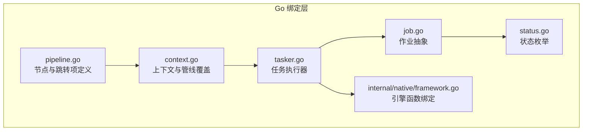
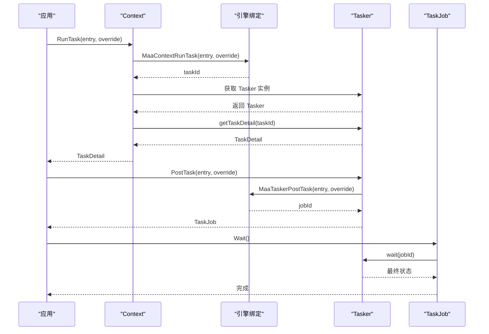
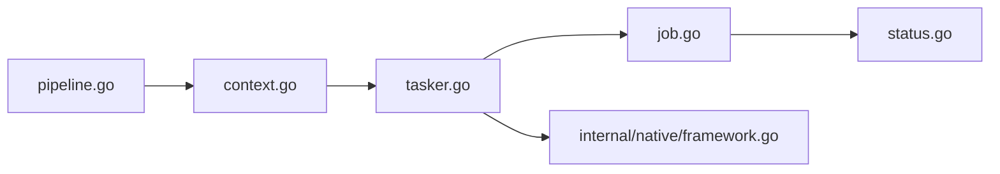

# 异常处理机制

<cite>
**本文引用的文件**
- [pipeline.go](file://pipeline.go)
- [context.go](file://context.go)
- [tasker.go](file://tasker.go)
- [job.go](file://job.go)
- [status.go](file://status.go)
- [context_test.go](file://context_test.go)
- [pipeline_test.go](file://pipeline_test.go)
- [internal/native/framework.go](file://internal/native/framework.go)
- [internal/native/native.go](file://internal/native/native.go)
</cite>

## 目录
1. [简介](#简介)
2. [项目结构](#项目结构)
3. [核心组件](#核心组件)
4. [架构总览](#架构总览)
5. [详细组件分析](#详细组件分析)
6. [依赖分析](#依赖分析)
7. [性能考量](#性能考量)
8. [故障排查指南](#故障排查指南)
9. [结论](#结论)
10. [附录](#附录)

## 简介
本文件系统化讲解 MAA Framework Go 中“OnError 列表”在任务流中的异常捕获与恢复机制，重点覆盖以下主题：
- 在识别超时、动作执行失败等异常场景下，OnError 的触发条件与行为边界
- OnError 跳转链与主流程 Next 链的执行优先级关系
- 结合 NodeNextItem 的 JumpBack 与 Anchor 属性，展示构建容错性任务流的实践模式
- 配置 OnError 的最佳实践：错误恢复节点的设计原则与避免死循环的注意事项

## 项目结构
围绕异常处理与任务流控制的核心代码位于以下模块：
- pipeline.go：定义节点、节点属性（含 OnError）、节点跳转项（NodeNextItem）及其属性（JumpBack、Anchor）
- context.go：上下文接口，封装运行任务、识别、动作以及管线覆盖能力，并提供锚点管理
- tasker.go：任务执行器，负责提交任务、查询状态、获取细节
- job.go：作业抽象，提供状态查询与等待完成的能力
- status.go：状态枚举与判断方法
- internal/native/framework.go：对底层引擎函数的绑定声明，包括任务执行、识别、动作、管线覆盖等
- 测试文件：context_test.go、pipeline_test.go 提供 OnError、Next、Anchor 等行为的验证用例

图表来源
- [pipeline.go](file://pipeline.go#L300-L388)
- [context.go](file://context.go#L1-L240)
- [tasker.go](file://tasker.go#L1-L120)
- [job.go](file://job.go#L1-L96)
- [status.go](file://status.go#L1-L61)
- [internal/native/framework.go](file://internal/native/framework.go#L191-L200)

章节来源
- [pipeline.go](file://pipeline.go#L300-L388)
- [context.go](file://context.go#L1-L240)
- [tasker.go](file://tasker.go#L1-L120)
- [job.go](file://job.go#L1-L96)
- [status.go](file://status.go#L1-L61)
- [internal/native/framework.go](file://internal/native/framework.go#L191-L200)

## 核心组件
- 节点与跳转项
  - Node：包含 Recognition、Action、Next、OnError、Timeout、RateLimit、Enabled、MaxHit、Pre/PostDelay、Pre/PostWaitFreezes、Focus、Attach 等字段
  - NodeNextItem：表示 Next 或 OnError 列表中的条目，包含 Name、JumpBack、Anchor 三个关键属性
- 上下文 Context
  - 提供 RunTask、RunRecognition、RunAction、OverridePipeline、OverrideNext、SetAnchor、GetAnchor 等能力
- 任务执行器 Tasker
  - 提交任务、查询状态、等待完成、获取任务详情
- 作业 Job/TaskJob
  - 封装异步作业的状态查询与等待逻辑
- 状态 Status
  - 定义 invalid/pending/running/success/failure 等状态并提供便捷判断

章节来源
- [pipeline.go](file://pipeline.go#L36-L73)
- [pipeline.go](file://pipeline.go#L300-L388)
- [context.go](file://context.go#L30-L126)
- [context.go](file://context.go#L128-L208)
- [tasker.go](file://tasker.go#L85-L120)
- [job.go](file://job.go#L1-L96)
- [status.go](file://status.go#L1-L61)

## 架构总览
从调用到执行的关键路径如下：
- 应用通过 Context.RunTask 提交任务，内部调用底层引擎函数 MaaContextRunTask
- Tasker 接收任务并维护任务 ID，提供状态查询与等待
- 任务执行过程中，若识别超时或动作执行失败，则进入 OnError 路径
- OnError 与 Next 的选择与优先级由引擎实现决定；JumpBack 与 Anchor 用于控制跳转与锚点解析

图表来源
- [context.go](file://context.go#L30-L58)
- [internal/native/framework.go](file://internal/native/framework.go#L191-L200)
- [tasker.go](file://tasker.go#L85-L120)
- [job.go](file://job.go#L58-L96)

## 详细组件分析

### OnError 触发条件与行为边界
- 触发条件
  - 识别超时：节点 Timeout 指定的最大等待时间到达仍未命中
  - 动作执行失败：节点 Action 执行返回失败
  - 其他异常：如资源不可用、控制器异常等，具体以引擎实现为准
- 行为边界
  - 当上述异常发生时，系统将从当前节点的 OnError 列表中选择目标节点继续执行
  - OnError 列表中的每个条目为 NodeNextItem，包含目标节点名、JumpBack、Anchor 三要素
  - 若 OnError 为空，则按默认策略回退（具体取决于引擎）

章节来源
- [pipeline.go](file://pipeline.go#L45-L54)
- [pipeline.go](file://pipeline.go#L300-L308)
- [context_test.go](file://context_test.go#L1104-L1196)

### OnError 与 Next 的执行优先级关系
- 优先级关系
  - 在识别命中且动作成功的情况下，按 Next 列表顺序推进
  - 在识别超时或动作失败的情况下，进入 OnError 列表
  - 若 OnError 为空，则不进行异常分支，继续沿 Next 或终止
- 设计建议
  - 将“重试/补偿”类节点放入 OnError，将“正常流程”节点放入 Next
  - 对于需要“回到父节点重新开始”的场景，使用 JumpBack
  - 对于需要“锚点定位”的场景，使用 Anchor 并配合 SetAnchor/GetAnchor

章节来源
- [pipeline.go](file://pipeline.go#L300-L308)
- [context.go](file://context.go#L216-L227)

### NodeNextItem 的 JumpBack 与 Anchor 属性
- JumpBack
  - 当某节点匹配后，系统返回到父节点，从父节点的 Next 列表起始位置继续识别
  - 适用于“回到上一个稳定状态再尝试”的容错模式
- Anchor
  - 将某个节点标记为锚点，后续可通过锚点名称解析到最近一次设置该锚点的节点
  - 适用于“跨节点定位”和“动态跳转”的场景
- 实践模式
  - 在重试节点上设置 Anchor，以便 OnError 跳转时能定位到正确的起点
  - 在关键检查节点上设置 JumpBack，使异常恢复后能重新评估上游状态

章节来源
- [pipeline.go](file://pipeline.go#L300-L327)
- [context.go](file://context.go#L216-L227)
- [context_test.go](file://context_test.go#L1104-L1196)

### 错误恢复节点的设计原则
- 可靠性
  - 恢复节点应具备最小化副作用，尽量不改变全局状态
  - 恢复节点应具备幂等性，多次执行不应产生不同结果
- 可观测性
  - 恢复节点应记录足够的日志或事件，便于问题定位
- 可控性
  - 恢复节点应支持可配置的重试次数、间隔与超时
  - 恢复节点应支持退出条件，避免无限循环

章节来源
- [pipeline.go](file://pipeline.go#L45-L73)
- [context.go](file://context.go#L128-L167)

### 避免死循环的注意事项
- 不要在同一节点反复设置 JumpBack 导致环路
- 不要让 OnError 与 Next 形成相互跳转的环
- 使用 Anchor 时，确保锚点解析不会导致回溯到自身
- 合理设置 MaxHit、Timeout、RateLimit，限制重复尝试
- 在复杂流程中引入“兜底节点”，当所有恢复策略失败时终止流程

章节来源
- [pipeline.go](file://pipeline.go#L45-L73)
- [pipeline.go](file://pipeline.go#L300-L327)
- [context_test.go](file://context_test.go#L1104-L1196)

### 配置 OnError 的最佳实践
- 明确异常类型
  - 区分“可恢复异常”（如网络抖动、图像未就绪）与“不可恢复异常”（如参数错误）
- 分层设计
  - 将“重试/补偿”放在 OnError 前端，将“最终兜底”放在 OnError 尾部
- 参数优化
  - 设置合理的 Timeout、RateLimit、MaxHit，避免过度轮询
- 可测试性
  - 在测试中模拟超时与失败，验证 OnError 是否按预期触发
- 可维护性
  - 将 OnError 节点命名规范化，便于阅读与排障

章节来源
- [pipeline.go](file://pipeline.go#L45-L73)
- [pipeline_test.go](file://pipeline_test.go#L70-L100)
- [context_test.go](file://context_test.go#L1104-L1196)

## 依赖分析
- 组件耦合
  - pipeline.go 与 context.go 通过 NodeNextItem 的语义耦合，Context 提供锚点与管线覆盖能力
  - tasker.go 与 job.go 通过 TaskJob 封装异步作业，提供状态查询与等待
  - internal/native/framework.go 作为引擎绑定层，向上暴露 RunTask/RunRecognition/RunAction 等函数
- 外部依赖
  - 引擎函数由 native 层注册，Go 层仅做薄封装
- 潜在风险
  - 若 OnError 与 Next 未正确分离，可能导致异常分支被忽略
  - 若 JumpBack 与 Anchor 配置不当，可能引发状态回溯与定位偏差

图表来源
- [pipeline.go](file://pipeline.go#L300-L388)
- [context.go](file://context.go#L1-L240)
- [tasker.go](file://tasker.go#L1-L120)
- [job.go](file://job.go#L1-L96)
- [status.go](file://status.go#L1-L61)
- [internal/native/framework.go](file://internal/native/framework.go#L191-L200)

章节来源
- [pipeline.go](file://pipeline.go#L300-L388)
- [context.go](file://context.go#L1-L240)
- [tasker.go](file://tasker.go#L1-L120)
- [job.go](file://job.go#L1-L96)
- [status.go](file://status.go#L1-L61)
- [internal/native/framework.go](file://internal/native/framework.go#L191-L200)

## 性能考量
- 轮询与超时
  - 合理设置 Timeout 与 RateLimit，避免频繁轮询造成 CPU 占用
- 重试策略
  - 使用指数退避或抖动，降低集中重试带来的压力
- 日志与监控
  - 记录 OnError 触发频率与耗时，辅助定位瓶颈
- 资源释放
  - 在恢复节点中及时释放临时资源，避免泄漏

## 故障排查指南
- 常见问题
  - OnError 未触发：检查节点 Timeout、Action 是否存在；确认 OnError 列表是否正确配置
  - JumpBack 导致状态异常：检查父节点 Next 列表与 JumpBack 的组合
  - Anchor 解析失败：确认锚点是否在运行时被正确设置与保留
- 排查步骤
  - 使用 Tasker/Context 的详情查询接口获取节点识别与动作执行结果
  - 逐步缩小范围，先验证 Next 正常路径，再验证 OnError 异常路径
  - 在测试中构造超时与失败场景，验证 OnError 是否按预期执行

章节来源
- [tasker.go](file://tasker.go#L141-L208)
- [context.go](file://context.go#L128-L208)
- [context_test.go](file://context_test.go#L1104-L1196)

## 结论
- OnError 是构建容错任务流的关键机制，应在识别超时与动作失败等异常场景下启用
- OnError 与 Next 的优先级应清晰分离：正常路径走 Next，异常路径走 OnError
- 通过 JumpBack 与 Anchor 可实现灵活的跳转与定位，但需谨慎配置以避免死循环
- 配置 OnError 时应遵循可靠性、可观测性与可控性的原则，并结合测试验证

## 附录
- 关键 API 与数据结构
  - NodeNextItem：Name、JumpBack、Anchor
  - Node：Next、OnError、Timeout、RateLimit、Enabled、MaxHit 等
  - Context：RunTask、RunRecognition、RunAction、OverridePipeline、OverrideNext、SetAnchor、GetAnchor
  - Tasker：PostTask、Status、Wait、GetTaskDetail
  - Job/TaskJob：Status、Wait、GetDetail
  - Status：invalid/pending/running/success/failure

章节来源
- [pipeline.go](file://pipeline.go#L36-L73)
- [pipeline.go](file://pipeline.go#L300-L388)
- [context.go](file://context.go#L30-L126)
- [context.go](file://context.go#L128-L208)
- [tasker.go](file://tasker.go#L85-L120)
- [job.go](file://job.go#L1-L96)
- [status.go](file://status.go#L1-L61)