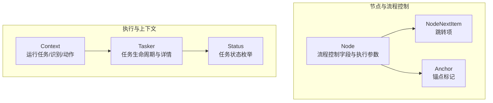
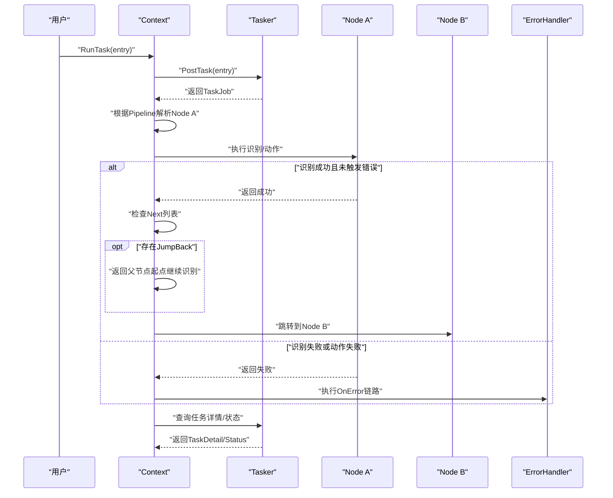
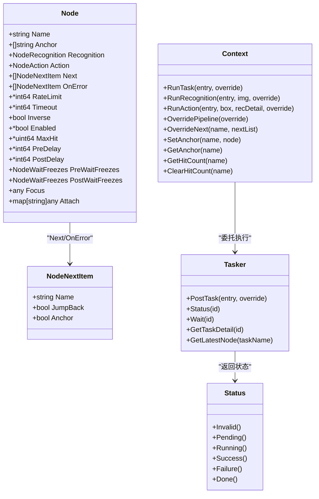

# 流程控制机制

<cite>
**本文引用的文件列表**
- [pipeline.go](file://pipeline.go)
- [context.go](file://context.go)
- [tasker.go](file://tasker.go)
- [status.go](file://status.go)
- [context_test.go](file://context_test.go)
- [pipeline_test.go](file://pipeline_test.go)
</cite>

## 目录
1. [引言](#引言)
2. [项目结构](#项目结构)
3. [核心组件](#核心组件)
4. [架构总览](#架构总览)
5. [详细组件分析](#详细组件分析)
6. [依赖关系分析](#依赖关系分析)
7. [性能考量](#性能考量)
8. [故障排查指南](#故障排查指南)
9. [结论](#结论)
10. [附录](#附录)

## 引言
本篇文档聚焦于 Node 结构体中的流程控制字段与跳转机制，系统讲解 Next、OnError、Anchor 等字段如何协同工作；深入剖析 NodeNextItem 的设计原理与 JumpBack、Anchor 属性在复杂任务流中的应用模式；结合 RateLimit、Timeout、MaxHit 等执行控制参数，阐述节点执行频率限制、超时处理与最大命中次数的实现逻辑；并解释 Inverse 字段对识别结果取反的作用机制，以及 Enabled 字段在动态启用/禁用节点方面的应用。

## 项目结构
围绕流程控制的核心代码主要集中在 pipeline.go 中的 Node 与 NodeNextItem 定义，以及上下文与任务执行相关的接口在 context.go、tasker.go 中体现。状态枚举在 status.go 中定义，测试用例在 context_test.go、pipeline_test.go 中验证行为。

图表来源
- [pipeline.go](file://pipeline.go#L36-L120)
- [context.go](file://context.go#L1-L120)
- [tasker.go](file://tasker.go#L1-L120)
- [status.go](file://status.go#L1-L61)

章节来源
- [pipeline.go](file://pipeline.go#L36-L120)
- [context.go](file://context.go#L1-L120)
- [tasker.go](file://tasker.go#L1-L120)
- [status.go](file://status.go#L1-L61)

## 核心组件
- Node：单个任务节点，包含识别配置、动作配置、流程控制字段（Next、OnError、Anchor）、执行控制参数（RateLimit、Timeout、MaxHit、Inverse、Enabled）以及前后延时与等待冻结等辅助参数。
- NodeNextItem：流程跳转项，描述下一个目标节点及其跳转属性（JumpBack、Anchor）。
- Context：提供运行任务、识别、动作的入口，并支持覆盖管线、设置/获取锚点、查询命中计数等。
- Tasker：封装底层任务句柄，提供任务状态查询、等待完成、事件回调注册等能力。
- Status：任务状态枚举，用于判断任务是否完成、成功或失败。

章节来源
- [pipeline.go](file://pipeline.go#L36-L120)
- [pipeline.go](file://pipeline.go#L300-L328)
- [context.go](file://context.go#L1-L120)
- [tasker.go](file://tasker.go#L1-L120)
- [status.go](file://status.go#L1-L61)

## 架构总览
下图展示了从 Context 发起任务到 Tasker 执行、并在节点间按 Next/OnError/JumpBack/Anchor 进行跳转的整体流程。

图表来源
- [context.go](file://context.go#L30-L60)
- [tasker.go](file://tasker.go#L85-L120)
- [pipeline.go](file://pipeline.go#L36-L120)

## 详细组件分析

### Node 结构体与流程控制字段
- Anchor：节点可设置一个或多个锚点名称，用于后续通过锚点名进行跳转解析。
- Next：节点成功后的候选下一节点列表，每个元素为 NodeNextItem，包含目标节点名及跳转属性。
- OnError：节点失败（识别超时或动作失败）时的候选节点列表，同样由 NodeNextItem 组成。
- JumpBack：当某节点匹配成功后，系统返回父节点起点，继续从 Next 列表的起始位置重新识别，常用于循环或重试场景。
- Anchor（NodeNextItem 属性）：将当前节点作为锚点，供其他节点以锚点名进行引用解析。
- RateLimit：最小识别间隔（毫秒），用于限制节点执行频率，避免过于频繁的识别。
- Timeout：识别超时时间（毫秒），超过该时间则判定为失败并进入 OnError。
- MaxHit：节点最大命中次数，达到上限后可停止继续执行。
- Inverse：对识别结果取反，常用于“不在某界面”“未出现某提示”等否定式判断。
- Enabled：动态启用/禁用节点，true 表示启用，false 表示禁用。

章节来源
- [pipeline.go](file://pipeline.go#L36-L120)
- [pipeline.go](file://pipeline.go#L300-L328)

### NodeNextItem 设计原理与应用模式
- 设计要点：
  - Name：目标节点名，支持字符串或锚点名。
  - JumpBack：开启后，节点匹配成功后回退到父节点起点，继续从 Next 列表起始位置识别。
  - Anchor：开启后，当前节点被标记为锚点，后续可通过锚点名解析到最近一次设置该锚点的节点。
- 应用模式：
  - 循环/重试：使用 JumpBack 实现“匹配后回到起点，重新尝试 Next 列表”，适合需要反复检测同一条件的任务。
  - 锚点跳转：通过 Anchor 标记关键节点，其他节点以锚点名引用，便于在复杂流程中定位最近一次出现的特定节点。
  - 条件分支：Next/OnError 分别承载成功与失败路径，配合 JumpBack 可形成“先尝试 A，失败再尝试 B，成功后回到起点继续”的复杂分支。

章节来源
- [pipeline.go](file://pipeline.go#L300-L328)
- [context.go](file://context.go#L216-L227)

### 跳转机制与锚点解析
- 锚点设置与获取：
  - 设置锚点：通过 Context.SetAnchor(anchorName, nodeName) 将锚点名绑定到当前节点名。
  - 获取锚点：通过 Context.GetAnchor(anchorName) 返回最近一次设置该锚点的节点名。
- 锚点在 Next/OnError 中的应用：
  - 当 NodeNextItem 的 Name 为锚点名时，系统会解析到最近一次设置该锚点的节点，从而实现动态跳转。
- JumpBack 的作用：
  - 在节点匹配成功后，系统返回父节点起点，继续从 Next 列表的起始位置重新识别，适合需要重复检测同一条件的任务。

章节来源
- [context.go](file://context.go#L216-L227)
- [context_test.go](file://context_test.go#L1104-L1196)

### 执行控制参数：频率限制、超时与命中次数
- RateLimit（频率限制）：
  - 通过 Node.RateLimit 指定最小识别间隔（毫秒）。在多次识别尝试之间，系统会遵守该间隔，避免过度扫描。
- Timeout（超时）：
  - 通过 Node.Timeout 指定识别超时时间（毫秒）。超过该时间则判定失败，触发 OnError。
- MaxHit（最大命中次数）：
  - 通过 Node.MaxHit 指定节点的最大命中次数。达到上限后，节点不再继续执行，可用于防止无限循环或过度执行。
- PreDelay/PostDelay：
  - 动作前/后延迟（毫秒），用于等待界面稳定或操作生效。
- PreWaitFreezes/PostWaitFreezes：
  - 动作前/后等待屏幕稳定，支持时间、阈值、方法、RateLimit、Timeout 等参数，确保识别环境稳定。

章节来源
- [pipeline.go](file://pipeline.go#L45-L120)
- [pipeline.go](file://pipeline.go#L2000-L2114)

### 识别结果取反与动态启用/禁用
- Inverse：
  - 对识别结果取反，常用于“不在某界面”“未出现某提示”等否定式判断，避免显式编写反向条件。
- Enabled：
  - 动态启用/禁用节点。当 Enabled=false 时，节点不参与执行，适合在运行时根据外部条件开关某个步骤。

章节来源
- [pipeline.go](file://pipeline.go#L45-L120)

### 测试验证与行为确认
- Next/OnError/Anchor/JumpBack：
  - 测试用例验证了 Next 列表中字符串与对象形式混用、JumpBack 与 Anchor 属性的正确解析。
- RateLimit/Timeout/MaxHit/Inverse/Enabled：
  - 测试用例验证了这些字段在节点数据解析中的正确性与默认值行为。
- 命中计数与锚点：
  - 提供 GetHitCount/ClearHitCount 与 SetAnchor/GetAnchor 接口，用于运行时统计与锚点管理。

章节来源
- [context_test.go](file://context_test.go#L1104-L1196)
- [pipeline_test.go](file://pipeline_test.go#L1-L89)
- [context.go](file://context.go#L229-L239)

## 依赖关系分析
- Node 与 NodeNextItem：
  - Node 的 Next/OnError 字段由 NodeNextItem 组成，JumpBack/Anchor 属性决定跳转策略。
- Context 与 Tasker：
  - Context 负责发起任务、识别与动作，并通过 Tasker 查询任务详情与状态。
- Status：
  - Tasker 返回的状态用于判断任务是否完成、成功或失败，驱动流程走向。

图表来源
- [pipeline.go](file://pipeline.go#L36-L120)
- [pipeline.go](file://pipeline.go#L300-L328)
- [context.go](file://context.go#L1-L120)
- [tasker.go](file://tasker.go#L1-L120)
- [status.go](file://status.go#L1-L61)

## 性能考量
- 频率限制（RateLimit）：
  - 合理设置 RateLimit 可降低 CPU 与内存压力，避免频繁截图与识别。
- 超时控制（Timeout）：
  - Timeout 过短可能导致误判失败，过长则影响整体吞吐；应结合实际界面响应时间调整。
- 命中次数（MaxHit）：
  - 为避免死循环，建议为关键节点设置 MaxHit；同时结合 JumpBack 使用时需谨慎，防止无限回退。
- 延迟与等待冻结：
  - PreDelay/PostDelay 与 PreWaitFreezes/PostWaitFreezes 可提升稳定性，但会增加总耗时；应在保证准确性的前提下尽量缩短。

## 故障排查指南
- 识别一直失败：
  - 检查 Timeout 是否过短；确认 Inverse 是否导致期望相反；查看 Enabled 是否被关闭。
- 跳转异常或循环：
  - 检查 JumpBack 是否被意外开启；确认锚点设置与解析是否一致；核对 Next/OnError 列表顺序。
- 命中次数异常：
  - 使用 GetHitCount 查看当前命中次数，必要时调用 ClearHitCount 清零；检查 MaxHit 是否过小。
- 任务状态异常：
  - 使用 Tasker 的状态查询接口判断任务是否完成、成功或失败；结合 TaskDetail 查看节点执行详情。

章节来源
- [context.go](file://context.go#L229-L239)
- [tasker.go](file://tasker.go#L1-L120)
- [status.go](file://status.go#L1-L61)

## 结论
Node 的流程控制字段与 NodeNextItem 的跳转属性共同构成了灵活而强大的任务流编排能力。通过 Anchor/JumpBack 实现动态与回退式跳转，结合 RateLimit/Timeout/MaxHit 等执行控制参数，可以有效平衡准确性与性能。Inverse 与 Enabled 则提供了否定式判断与动态启停的能力，使复杂任务流具备更强的鲁棒性与可维护性。

## 附录
- 示例参考：
  - 快速开始示例：[pipeline.json](file://examples/quick-start/resource/pipeline/pipeline.json)
  - 自定义动作示例：[pipeline.json](file://examples/custom-action/resource/pipeline/pipeline.json)
  - 自定义识别示例：[pipeline.json](file://examples/custom-recognition/resource/pipeline/pipeline.json)