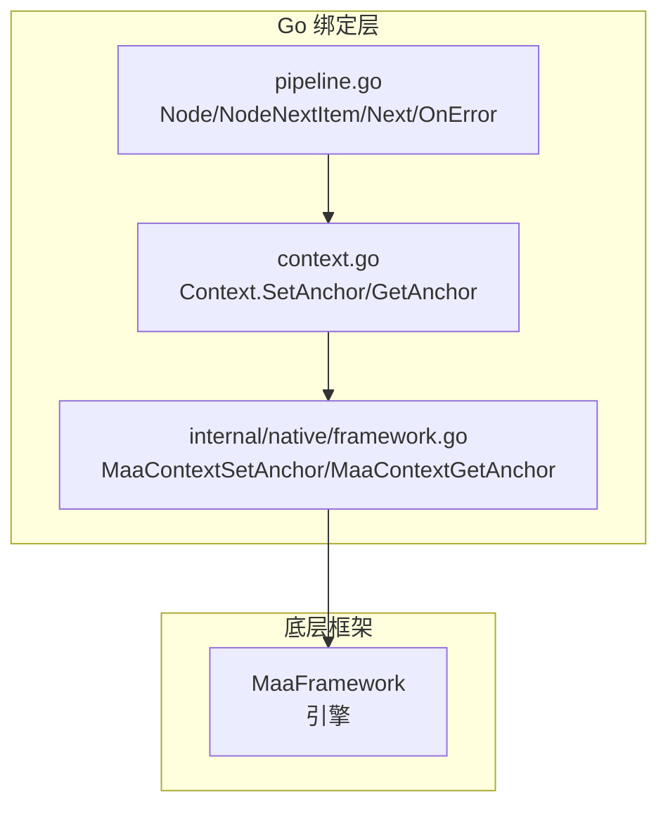
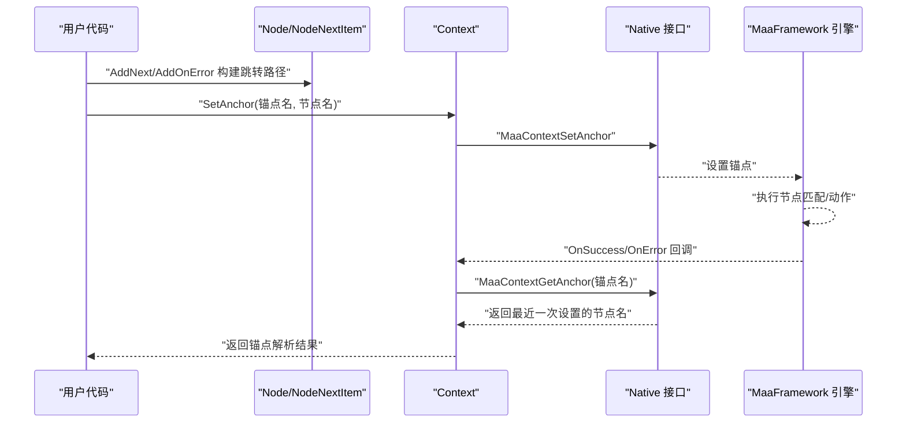
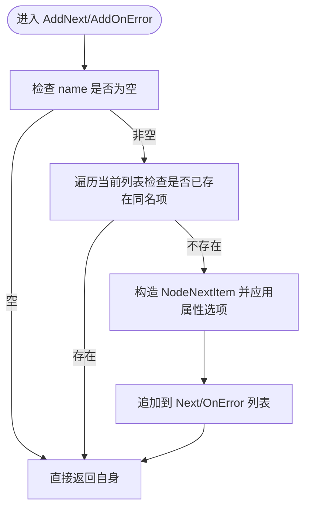
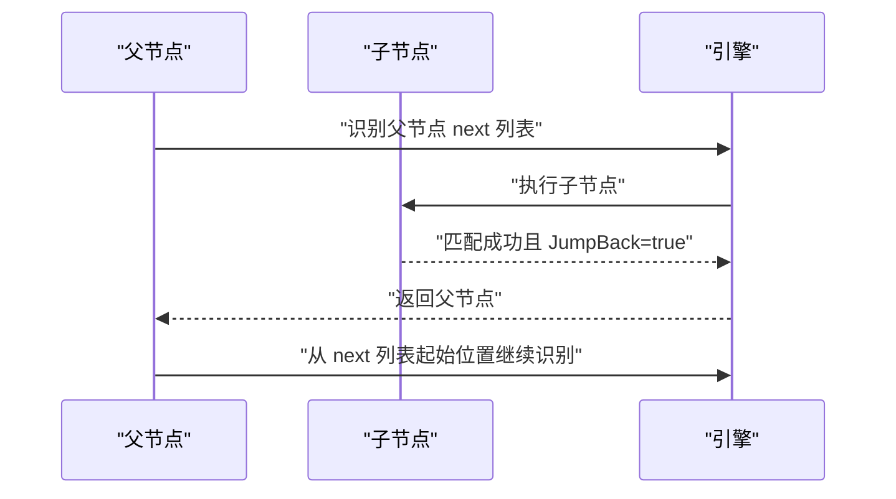
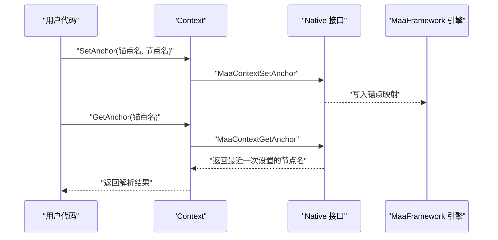
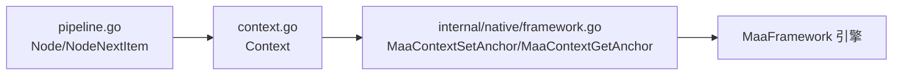

# 跳转机制

<cite>
**本文引用的文件**
- [pipeline.go](file://pipeline.go)
- [context.go](file://context.go)
- [internal/native/framework.go](file://internal/native/framework.go)
- [context_test.go](file://context_test.go)
- [pipeline_test.go](file://pipeline_test.go)
</cite>

## 目录
1. [简介](#简介)
2. [项目结构](#项目结构)
3. [核心组件](#核心组件)
4. [架构总览](#架构总览)
5. [详细组件分析](#详细组件分析)
6. [依赖关系分析](#依赖关系分析)
7. [性能考量](#性能考量)
8. [故障排查指南](#故障排查指南)
9. [结论](#结论)

## 简介
本文聚焦于 Node 结构体中 Next 与 OnError 字段的跳转机制，系统性解析 NodeNextItem 的设计原理，并阐明其 Name、JumpBack、Anchor 属性在任务流中的作用。结合 AddNext 与 AddOnError 方法的使用方式，说明如何构建任务流跳转路径；进一步解释 JumpBack 在循环识别场景中的应用模式，以及 Anchor 锚点在动态跳转中的解析逻辑。最后总结跳转执行顺序、优先级处理及边界情况的系统行为。

## 项目结构
围绕跳转机制的核心代码位于 pipeline.go 中的 Node 与 NodeNextItem 类型定义，以及上下文侧的锚点设置与获取接口在 context.go 与 internal/native/framework.go 中注册与实现。测试用例在 pipeline_test.go 与 context_test.go 中验证了 AddNext/AddOnError 与锚点的基本行为。

图表来源
- [pipeline.go](file://pipeline.go#L36-L120)
- [context.go](file://context.go#L211-L239)
- [internal/native/framework.go](file://internal/native/framework.go#L194-L206)

章节来源
- [pipeline.go](file://pipeline.go#L36-L120)
- [context.go](file://context.go#L211-L239)
- [internal/native/framework.go](file://internal/native/framework.go#L194-L206)

## 核心组件
- NodeNextItem：表示 Next 或 OnError 列表中的单项条目，包含目标节点名、是否回跳父节点、是否作为锚点三要素。
- NodeNextItem 属性：
  - Name：目标节点名称，用于定位下一个要执行的节点。
  - JumpBack：当该节点匹配成功后，系统返回父节点并从父节点的 next 列表起始位置继续识别。
  - Anchor：指示当前项是否应被解析为“锚点”——即以该锚点名记录最近一次设置该锚点的节点名，供后续动态跳转解析使用。
- Node.Next 与 Node.OnError：分别定义正常流程与错误流程的候选跳转集合。

章节来源
- [pipeline.go](file://pipeline.go#L300-L328)

## 架构总览
跳转机制由“声明式配置 + 运行时解析 + 引擎执行”三层协同完成：
- 声明式配置：在 Node 上通过 AddNext/AddOnError 构建 Next/OnError 列表，列表项为 NodeNextItem。
- 运行时解析：当节点匹配成功时，若设置了 JumpBack，则触发回跳父节点；若设置了 Anchor，则将当前节点名写入对应锚点名。
- 引擎执行：底层框架按配置推进任务流，支持锚点解析与动态跳转。

图表来源
- [pipeline.go](file://pipeline.go#L360-L420)
- [context.go](file://context.go#L216-L227)
- [internal/native/framework.go](file://internal/native/framework.go#L194-L206)

## 详细组件分析

### NodeNextItem 设计与属性语义
- Name：目标节点标识，支持直接跳转到具体节点名。
- JumpBack：启用后，节点链路完成后返回父节点，从父节点 next 列表的起始位置继续识别，常用于循环识别场景。
- Anchor：启用后，该项的 Name 不再作为普通节点名，而是作为“锚点名”，用于记录最近一次设置该锚点的节点名，供后续动态跳转解析使用。

章节来源
- [pipeline.go](file://pipeline.go#L300-L328)

### AddNext 与 AddOnError 的构建逻辑
- AddNext(name, opts...)：向当前节点的 Next 列表追加 NodeNextItem，避免重复插入相同 name 的项；opts 可传入 WithJumpBack/WithAnchor 等属性选项。
- AddOnError(name, opts...)：向当前节点的 OnError 列表追加 NodeNextItem，同样具备去重与属性设置能力。
- RemoveNext/RemoveOnError：提供从列表中移除指定项的能力，避免重复与冗余。

图表来源
- [pipeline.go](file://pipeline.go#L360-L420)

章节来源
- [pipeline.go](file://pipeline.go#L360-L420)
- [pipeline_test.go](file://pipeline_test.go#L40-L53)
- [pipeline_test.go](file://pipeline_test.go#L54-L100)

### JumpBack 在循环识别中的应用模式
- 当某节点匹配成功后，若其 Next 中的某项设置了 JumpBack，则系统会返回父节点，并从父节点 next 列表的起始位置重新开始识别，从而形成“循环识别”。
- 典型场景包括：多次尝试同一目标直到稳定、轮询等待某个条件满足、对同一区域反复扫描等。

图表来源
- [pipeline.go](file://pipeline.go#L313-L319)
- [context_test.go](file://context_test.go#L1108-L1196)

章节来源
- [pipeline.go](file://pipeline.go#L313-L319)
- [context_test.go](file://context_test.go#L1108-L1196)

### Anchor 锚点在动态跳转中的解析逻辑
- 设置锚点：通过 Context.SetAnchor(anchorName, nodeName) 将锚点名与节点名关联，底层通过 MaaContextSetAnchor 写入引擎状态。
- 获取锚点：通过 Context.GetAnchor(anchorName) 查询最近一次设置该锚点的节点名，底层通过 MaaContextGetAnchor 返回字符串缓冲区内容。
- 在 NodeNextItem 中启用 Anchor 属性后，Name 字段不再作为普通节点名，而是作为“锚点名”，用于记录最近一次设置该锚点的节点名，供后续动态跳转解析使用。

图表来源
- [context.go](file://context.go#L216-L227)
- [internal/native/framework.go](file://internal/native/framework.go#L194-L206)

章节来源
- [context.go](file://context.go#L216-L227)
- [internal/native/framework.go](file://internal/native/framework.go#L194-L206)
- [context_test.go](file://context_test.go#L1108-L1196)

### 跳转执行顺序与优先级处理
- 执行顺序：
  1) 识别当前节点的 Recognition；
  2) 若成功，执行 Action；
  3) 根据 Next 列表逐项评估，按声明顺序选择第一个可匹配项；
  4) 若设置了 JumpBack，则在该链路结束后返回父节点，从父节点 next 列表起始位置继续识别；
  5) 若识别失败或 Action 失败，则按 OnError 列表顺序选择第一个可匹配项。
- 优先级处理：
  - Next 与 OnError 列表均按声明顺序进行评估，先匹配者优先；
  - JumpBack 仅影响当前节点链路结束后的控制流，不影响列表内的顺序优先级；
  - Anchor 仅用于记录锚点值，不改变 Next/OnError 的评估顺序，但可用于动态解析目标节点名。

章节来源
- [pipeline.go](file://pipeline.go#L360-L420)
- [context_test.go](file://context_test.go#L1108-L1196)

### 边界情况与系统行为
- 空名称处理：AddNext/AddOnError 对空 name 直接返回，避免无效条目。
- 去重策略：插入前检查列表中是否已存在同名项，避免重复。
- JumpBack 与 Anchor 的组合：在同一项上同时启用 JumpBack 与 Anchor 时，JumpBack 控制控制流回跳，Anchor 控制锚点记录，二者独立生效。
- 锚点解析：GetAnchor 返回最近一次设置的节点名；若从未设置过锚点，底层接口返回失败或空值，需由上层判断并处理。

章节来源
- [pipeline.go](file://pipeline.go#L360-L420)
- [context.go](file://context.go#L216-L227)
- [internal/native/framework.go](file://internal/native/framework.go#L194-L206)

## 依赖关系分析
- pipeline.go 与 context.go 之间通过 native 层对接，Context 的锚点操作最终委托给底层框架接口。
- NodeNextItem 的 JumpBack/Anchor 属性由上层声明，底层引擎负责在执行阶段解析并应用。

图表来源
- [pipeline.go](file://pipeline.go#L300-L328)
- [context.go](file://context.go#L216-L227)
- [internal/native/framework.go](file://internal/native/framework.go#L194-L206)

章节来源
- [pipeline.go](file://pipeline.go#L300-L328)
- [context.go](file://context.go#L216-L227)
- [internal/native/framework.go](file://internal/native/framework.go#L194-L206)

## 性能考量
- 列表去重与顺序评估均为 O(n) 操作，n 为 Next/OnError 列表长度；建议合理控制列表规模以降低评估成本。
- JumpBack 会增加控制流回溯与重复识别次数，应谨慎使用，避免无限循环或过度重复扫描。
- 锚点解析为轻量级状态查询，通常不会成为性能瓶颈。

## 故障排查指南
- 无法解析锚点：确认是否已通过 SetAnchor 正确设置锚点，且在 GetAnchor 之前未被其他节点覆盖。
- JumpBack 导致死循环：检查是否存在多个连续 JumpBack 项，或父节点 next 列表中缺少终止条件。
- 跳转未生效：核对 Next/OnError 列表中项的名称是否与目标节点一致，以及是否正确启用了 JumpBack/Anchor 属性。
- 测试验证：参考 pipeline_test.go 与 context_test.go 中的断言，确保 AddNext/AddOnError 与锚点行为符合预期。

章节来源
- [pipeline_test.go](file://pipeline_test.go#L1-L53)
- [pipeline_test.go](file://pipeline_test.go#L54-L100)
- [context_test.go](file://context_test.go#L1108-L1196)

## 结论
NodeNextItem 的 Name/JumpBack/Anchor 三要素共同构成了任务流的“声明式跳转模型”。通过 AddNext/AddOnError 构建的 Next/OnError 列表，配合 JumpBack 的回跳与 Anchor 的动态解析，可以灵活地表达循环识别、条件分支与动态跳转等复杂控制流。在实际使用中，应关注执行顺序、优先级与边界情况，合理设计跳转路径，避免不必要的性能损耗与逻辑陷阱。