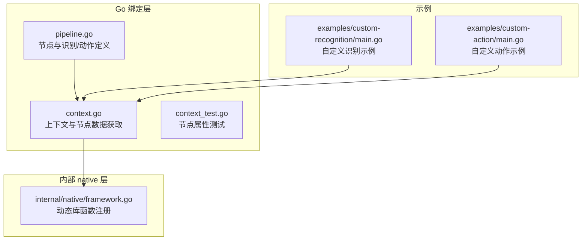
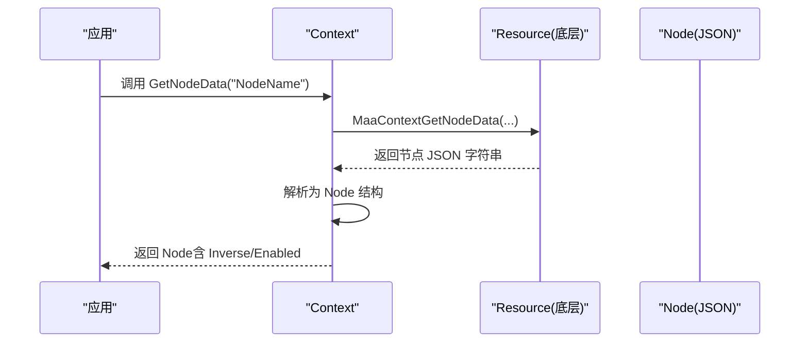
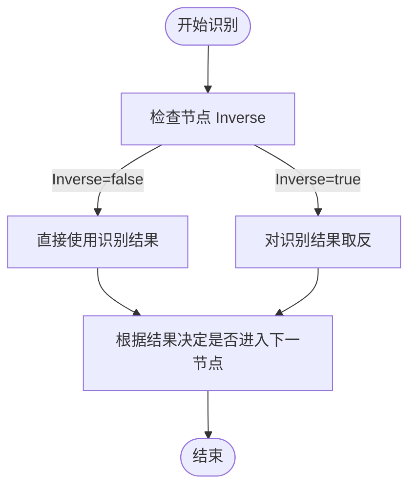
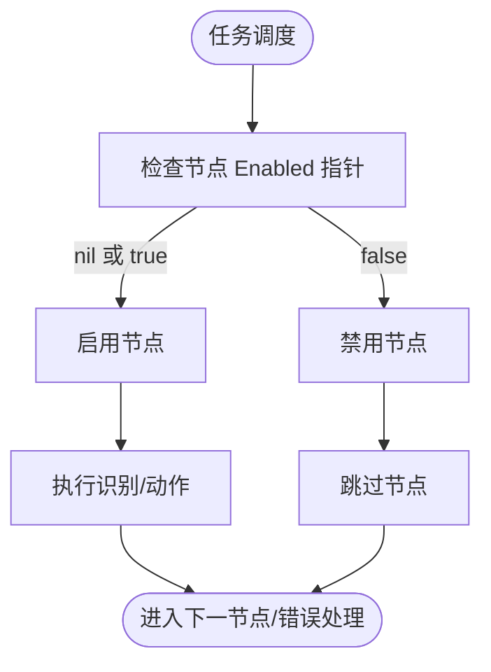
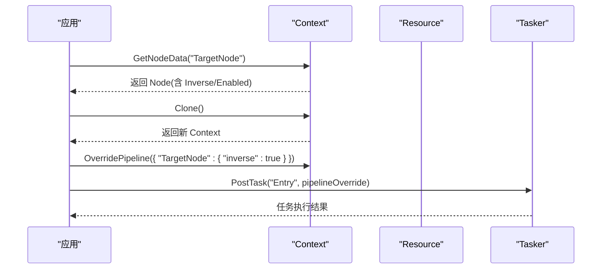
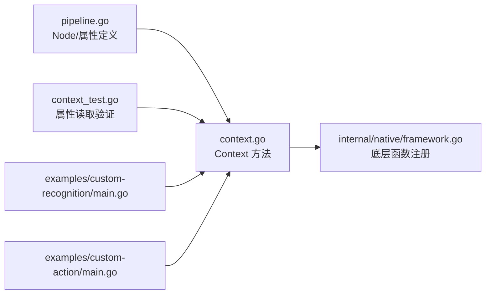

# 逻辑取反与动态启用

<cite>
**本文引用的文件列表**
- [pipeline.go](file://pipeline.go)
- [context.go](file://context.go)
- [context_test.go](file://context_test.go)
- [internal/native/framework.go](file://internal/native/framework.go)
- [examples/custom-recognition/main.go](file://examples/custom-recognition/main.go)
- [examples/custom-action/main.go](file://examples/custom-action/main.go)
</cite>

## 目录
1. [引言](#引言)
2. [项目结构](#项目结构)
3. [核心组件](#核心组件)
4. [架构总览](#架构总览)
5. [详细组件分析](#详细组件分析)
6. [依赖关系分析](#依赖关系分析)
7. [性能考量](#性能考量)
8. [故障排查指南](#故障排查指南)
9. [结论](#结论)
10. [附录](#附录)

## 引言
本文件聚焦于两个关键节点属性：Inverse（逻辑取反）与 Enabled（动态启用）。我们将从代码结构、数据流、处理逻辑与集成点出发，系统性阐述：
- Inverse 如何对识别结果进行逻辑取反，以及在“等待元素消失”等典型场景中的应用方式；
- Enabled 如何实现节点的动态启用与禁用，并在运行时动态调整任务流行为；
- 结合自定义识别与动作的集成场景，演示通过程序化修改 Inverse 和 Enabled 状态来实现复杂业务逻辑的高级用法。

## 项目结构
本仓库采用分层组织：Go 绑定层负责高层 API（如 Context、Tasker、Resource、Controller），内部 native 层通过 purego 动态绑定底层框架函数；examples 提供使用示例。本文关注与节点属性相关的 Go 绑定层与测试用例。

图表来源
- [pipeline.go](file://pipeline.go#L36-L73)
- [context.go](file://context.go#L175-L195)
- [internal/native/framework.go](file://internal/native/framework.go#L191-L206)
- [examples/custom-recognition/main.go](file://examples/custom-recognition/main.go#L1-L77)
- [examples/custom-action/main.go](file://examples/custom-action/main.go#L1-L49)

章节来源
- [pipeline.go](file://pipeline.go#L36-L73)
- [context.go](file://context.go#L175-L195)
- [internal/native/framework.go](file://internal/native/framework.go#L191-L206)

## 核心组件
- 节点结构与属性
  - Node 定义了节点的核心属性，其中包含 Inverse（布尔）与 Enabled（指针布尔）。
  - 通过 WithInverse/WithEnabled 与 SetInverse/SetEnabled 提供配置入口。
- 上下文能力
  - Context.GetNodeData 可将底层资源中的节点 JSON 解析为 Node，从而读取 Inverse 与 Enabled 等属性。
- 测试验证
  - 单元测试覆盖了 Inverse 与 Enabled 的读取与默认值行为，确保属性在运行时可被正确解析。

章节来源
- [pipeline.go](file://pipeline.go#L36-L73)
- [pipeline.go](file://pipeline.go#L122-L134)
- [pipeline.go](file://pipeline.go#L244-L254)
- [context.go](file://context.go#L183-L195)
- [context_test.go](file://context_test.go#L1193-L1200)

## 架构总览
从调用链看，节点属性由资源侧下发到底层框架，Go 绑定层通过 Context.GetNodeData 将底层返回的 JSON 映射为 Node 结构体，从而读取 Inverse 与 Enabled。

图表来源
- [context.go](file://context.go#L175-L195)
- [internal/native/framework.go](file://internal/native/framework.go#L191-L206)

## 详细组件分析

### Inverse：识别结果的逻辑取反
- 定义与配置
  - Node.Inverse 为布尔值，默认 false。
  - 通过 WithInverse/ SetInverse 配置。
- 运行时行为
  - 在识别阶段，若 Inverse 为 true，则将识别结果取反（成功变失败，失败变成功）。
  - 典型应用场景：等待元素消失
    - 使用 Inverse=true 的节点，当识别不再命中目标时即视为“命中”，从而触发后续流程（例如进入下一步或执行动作）。
- 与等待冻结（WaitFreezes）的配合
  - NodeWaitFreezes 支持在动作前后等待屏幕稳定，常用于“等待元素消失”前后的稳定性保障。

图表来源
- [pipeline.go](file://pipeline.go#L54-L68)
- [pipeline.go](file://pipeline.go#L122-L134)
- [pipeline.go](file://pipeline.go#L244-L254)
- [pipeline.go](file://pipeline.go#L2036-L2099)

章节来源
- [pipeline.go](file://pipeline.go#L54-L68)
- [pipeline.go](file://pipeline.go#L122-L134)
- [pipeline.go](file://pipeline.go#L244-L254)
- [pipeline.go](file://pipeline.go#L2036-L2099)

### Enabled：节点的动态启用与禁用
- 定义与配置
  - Node.Enabled 为指针布尔，默认 nil（表示启用）。
  - 通过 WithEnabled/SetEnabled 设置为 true/false。
- 运行时行为
  - 当 Enabled 指向 false 时，该节点在任务流中被视为禁用，不会参与识别与动作执行。
  - 常见用法：根据条件动态开关节点，以实现条件分支或节流。
- 与上下文的交互
  - 可通过 Context.OverridePipeline 或 Context.Clone + OverridePipeline 实现运行时重写节点属性（包括 Enabled）。

图表来源
- [pipeline.go](file://pipeline.go#L56-L60)
- [pipeline.go](file://pipeline.go#L129-L134)
- [pipeline.go](file://pipeline.go#L250-L254)
- [context.go](file://context.go#L128-L147)

章节来源
- [pipeline.go](file://pipeline.go#L56-L60)
- [pipeline.go](file://pipeline.go#L129-L134)
- [pipeline.go](file://pipeline.go#L250-L254)
- [context.go](file://context.go#L128-L147)

### “等待元素消失”的典型应用
- 思路
  - 使用一个识别节点（如 OCR/模板匹配/特征匹配等）去检测目标元素是否存在。
  - 将该节点的 Inverse 设为 true，使得“未检测到目标”变为“命中”，从而触发后续流程。
  - 可结合 PreWaitFreezes/PostWaitFreezes 确保屏幕稳定后再判断。
- 适用场景
  - 等待弹窗/加载动画消失
  - 等待某个按钮/图标不再出现
  - 等待页面切换完成

章节来源
- [pipeline.go](file://pipeline.go#L2036-L2099)
- [context_test.go](file://context_test.go#L1193-L1200)

### 自定义识别与动作的集成场景
- 自定义识别
  - 示例展示了通过 Context.RunRecognition 与 Context.OverridePipeline 对识别参数进行动态覆盖，从而在运行时改变识别区域等。
  - 可在此基础上进一步修改节点的 Inverse/Enabled，以实现复杂的条件识别。
- 自定义动作
  - 示例展示了通过 Context.GetTasker().GetController() 执行点击等操作，结合节点属性实现条件化的动作执行。
- 程序化修改属性
  - 可先通过 Context.GetNodeData 获取当前节点属性，再通过 Context.Clone + OverridePipeline 修改 Inverse/Enabled，最后重新提交任务以观察效果。

图表来源
- [context.go](file://context.go#L175-L195)
- [context.go](file://context.go#L128-L147)
- [examples/custom-recognition/main.go](file://examples/custom-recognition/main.go#L1-L77)
- [examples/custom-action/main.go](file://examples/custom-action/main.go#L1-L49)

章节来源
- [context.go](file://context.go#L175-L195)
- [context.go](file://context.go#L128-L147)
- [examples/custom-recognition/main.go](file://examples/custom-recognition/main.go#L1-L77)
- [examples/custom-action/main.go](file://examples/custom-action/main.go#L1-L49)

## 依赖关系分析
- Go 绑定层
  - pipeline.go 定义 Node、NodeRecognition、NodeAction 等核心类型及属性。
  - context.go 提供 Context.GetNodeData、Context.OverridePipeline、Context.Clone 等方法。
- 内部 native 层
  - internal/native/framework.go 注册底层函数（如 MaaContextGetNodeData、MaaContextOverridePipeline、MaaContextClone 等），Go 层通过这些函数与底层框架交互。
- 测试与示例
  - context_test.go 验证 Inverse 与 Enabled 的读取行为。
  - examples 展示自定义识别/动作与上下文能力的组合使用。

图表来源
- [pipeline.go](file://pipeline.go#L36-L73)
- [context.go](file://context.go#L175-L195)
- [internal/native/framework.go](file://internal/native/framework.go#L191-L206)
- [context_test.go](file://context_test.go#L1193-L1200)
- [examples/custom-recognition/main.go](file://examples/custom-recognition/main.go#L1-L77)
- [examples/custom-action/main.go](file://examples/custom-action/main.go#L1-L49)

章节来源
- [pipeline.go](file://pipeline.go#L36-L73)
- [context.go](file://context.go#L175-L195)
- [internal/native/framework.go](file://internal/native/framework.go#L191-L206)
- [context_test.go](file://context_test.go#L1193-L1200)
- [examples/custom-recognition/main.go](file://examples/custom-recognition/main.go#L1-L77)
- [examples/custom-action/main.go](file://examples/custom-action/main.go#L1-L49)

## 性能考量
- Inverse 的取反仅影响布尔判定，不引入额外计算开销，但会改变任务流走向，需注意对整体耗时的影响。
- Enabled 为指针布尔，nil 表示启用，false 表示禁用。禁用节点不会参与识别与动作，有助于减少无效工作量。
- WaitFreezes 在“等待元素消失”场景中可提升稳定性，但会增加等待时间，应根据实际场景权衡阈值与超时设置。

## 故障排查指南
- 读取属性失败
  - 确认节点名称正确且已通过资源加载。
  - 使用 Context.GetNodeJSON 获取原始 JSON，核对 Inverse/Enabled 字段是否存在。
- 属性未生效
  - 若通过 OverridePipeline 修改，请确认覆盖键名与节点名一致。
  - 若使用 Clone 后修改，请确保在 PostTask 前完成覆盖并提交任务。
- 识别结果异常
  - 检查 Inverse 是否被意外设为 true/false。
  - 检查 WaitFreezes 参数（阈值、时间、方法、速率限制、超时）是否合理。

章节来源
- [context.go](file://context.go#L175-L195)
- [context.go](file://context.go#L128-L147)
- [pipeline.go](file://pipeline.go#L2036-L2099)

## 结论
- Inverse 通过逻辑取反将“未命中”转换为“命中”，是实现“等待元素消失”等场景的关键手段。
- Enabled 通过指针布尔提供灵活的动态开关能力，可在运行时按条件启用/禁用节点，从而实现复杂的任务流控制。
- 结合 Context.GetNodeData、Context.Clone、Context.OverridePipeline 与自定义识别/动作，可以程序化地修改 Inverse 与 Enabled，构建高度灵活的自动化流程。

## 附录
- 关键 API 路径
  - 节点属性定义与配置：[pipeline.go](file://pipeline.go#L36-L73)、[pipeline.go](file://pipeline.go#L122-L134)、[pipeline.go](file://pipeline.go#L244-L254)
  - 上下文节点数据获取：[context.go](file://context.go#L175-L195)
  - 上下文覆盖与克隆：[context.go](file://context.go#L128-L147)
  - 底层函数注册（供参考）：[internal/native/framework.go](file://internal/native/framework.go#L191-L206)
  - 示例（自定义识别/动作）：[examples/custom-recognition/main.go](file://examples/custom-recognition/main.go#L1-L77)、[examples/custom-action/main.go](file://examples/custom-action/main.go#L1-L49)