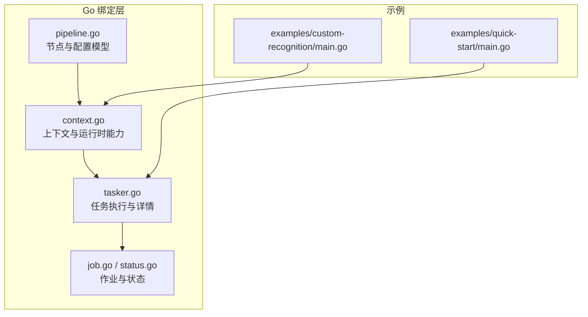
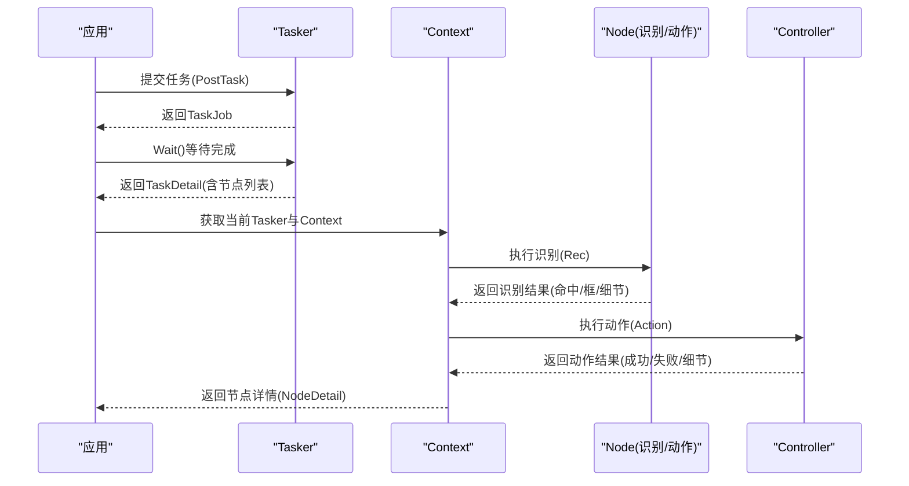
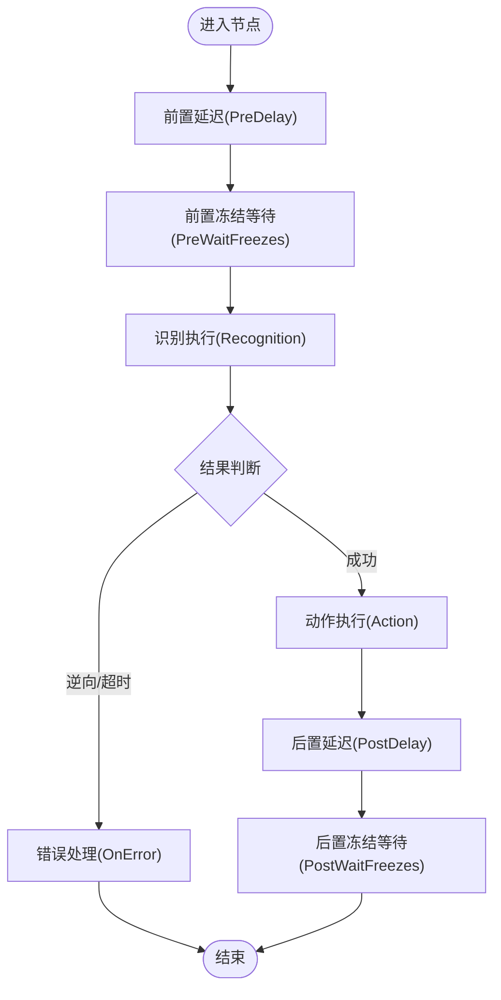
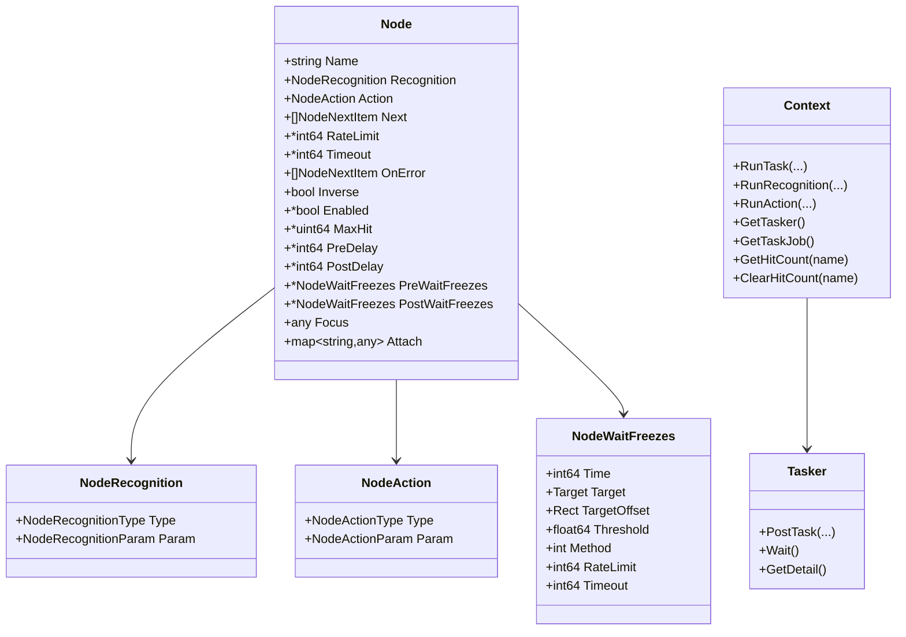
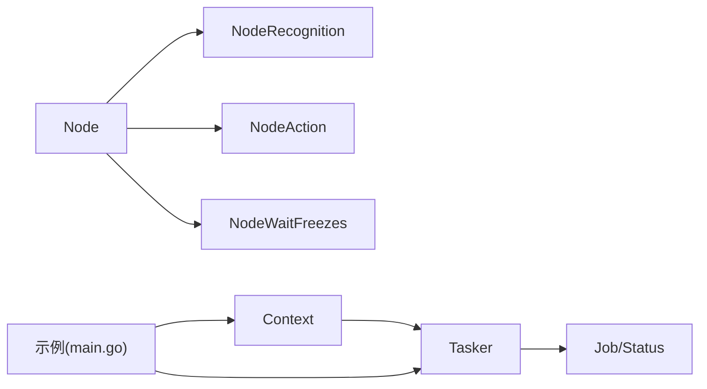

# 节点执行生命周期

<cite>
**本文引用的文件**
- [pipeline.go](file://pipeline.go)
- [context.go](file://context.go)
- [tasker.go](file://tasker.go)
- [job.go](file://job.go)
- [status.go](file://status.go)
- [README.md](file://README.md)
- [examples/quick-start/main.go](file://examples/quick-start/main.go)
- [examples/custom-recognition/main.go](file://examples/custom-recognition/main.go)
</cite>

## 目录
1. [简介](#简介)
2. [项目结构](#项目结构)
3. [核心组件](#核心组件)
4. [架构总览](#架构总览)
5. [详细组件分析](#详细组件分析)
6. [依赖关系分析](#依赖关系分析)
7. [性能与行为特性](#性能与行为特性)
8. [故障排查指南](#故障排查指南)
9. [结论](#结论)
10. [附录](#附录)

## 简介
本文围绕“节点从识别到动作执行的全生命周期”进行深入解析，结合 Go 绑定中的 Node 结构及其相关配置，系统阐述如下阶段：
- 前置延迟（PreDelay）
- 前置等待画面稳定（PreWaitFreezes）
- 识别执行
- 结果判断（含逆向、超时、错误链路）
- 动作执行
- 后置延迟（PostDelay）
- 后置等待画面稳定（PostWaitFreezes）

同时，结合 RateLimit 和 Timeout 参数说明系统如何控制节点的重复识别频率与最长等待时间；并通过 MaxHit 与 Enabled 字段解释命中计数管理与动态启用机制。

## 项目结构
该仓库提供对 MaaFramework 的 Go 绑定，核心围绕任务编排与节点执行展开：
- pipeline.go：定义节点、识别、动作、等待冻结等配置模型
- context.go：上下文能力，支持运行识别/动作、覆盖管线、锚点与命中计数查询
- tasker.go：任务执行入口，封装任务提交、状态查询、节点详情获取
- job.go/status.go：异步作业与状态枚举，用于跟踪任务生命周期
- examples：快速开始与自定义识别示例

图表来源
- [pipeline.go](file://pipeline.go#L36-L73)
- [context.go](file://context.go#L1-L60)
- [tasker.go](file://tasker.go#L85-L123)
- [job.go](file://job.go#L1-L30)
- [status.go](file://status.go#L1-L42)
- [examples/quick-start/main.go](file://examples/quick-start/main.go#L1-L41)
- [examples/custom-recognition/main.go](file://examples/custom-recognition/main.go#L1-L77)

章节来源
- [README.md](file://README.md#L78-L134)

## 核心组件
- Node：节点配置主体，包含识别、动作、下一跳、逆向、启用、命中上限、延时与冻结等待等字段
- NodeRecognition：识别配置，支持多种算法类型及参数
- NodeAction：动作配置，支持多种动作类型及参数
- NodeWaitFreezes：冻结等待配置，用于等待画面稳定
- Context：运行时上下文，支持运行识别/动作、覆盖管线、锚点与命中计数
- Tasker：任务执行器，负责提交任务、查询状态与节点详情
- Job/Status：异步作业与状态枚举，用于跟踪任务生命周期

章节来源
- [pipeline.go](file://pipeline.go#L36-L73)
- [pipeline.go](file://pipeline.go#L438-L504)
- [pipeline.go](file://pipeline.go#L1204-L1303)
- [pipeline.go](file://pipeline.go#L2036-L2114)
- [context.go](file://context.go#L1-L60)
- [tasker.go](file://tasker.go#L85-L123)
- [job.go](file://job.go#L1-L30)
- [status.go](file://status.go#L1-L42)

## 架构总览
下图展示从任务提交到节点执行的关键交互：

图表来源
- [tasker.go](file://tasker.go#L85-L123)
- [context.go](file://context.go#L197-L208)
- [pipeline.go](file://pipeline.go#L36-L73)

## 详细组件分析

### 节点生命周期阶段与配置映射
- 前置延迟（PreDelay）
  - 作用：在识别成功后、执行动作前等待指定毫秒数
  - 配置：Node.PreDelay（毫秒），默认值见 Node 字段注释
  - 行为：由引擎在识别成功后按配置等待
- 前置等待画面稳定（PreWaitFreezes）
  - 作用：在识别成功后、执行动作前等待画面稳定
  - 配置：Node.PreWaitFreezes，包含 time、target、threshold、method、rate_limit、timeout 等
  - 行为：持续检查目标区域变化，达到连续稳定时间阈值后继续
- 识别执行
  - 配置：Node.Recognition，包含 type 与 param
  - 行为：根据类型选择对应识别算法，返回命中、框与细节
- 结果判断
  - 逆向：Node.Inverse 反转识别结果
  - 超时：Node.Timeout 控制识别最长等待时间
  - 错误链路：识别失败或动作失败时，按 Node.OnError 指定的节点处理
- 动作执行
  - 配置：Node.Action，包含 type 与 param
  - 行为：调用控制器执行具体动作（点击、长按、滑动、输入、启动/停止应用等）
- 后置延迟（PostDelay）
  - 作用：在动作完成后等待指定毫秒数
  - 配置：Node.PostDelay（毫秒）
- 后置等待画面稳定（PostWaitFreezes）
  - 作用：在动作完成后等待画面稳定
  - 配置：Node.PostWaitFreezes，同 PreWaitFreezes

图表来源
- [pipeline.go](file://pipeline.go#L36-L73)
- [pipeline.go](file://pipeline.go#L2036-L2114)

章节来源
- [pipeline.go](file://pipeline.go#L36-L73)
- [pipeline.go](file://pipeline.go#L2036-L2114)

### RateLimit 与 Timeout
- RateLimit（最小识别间隔）
  - 配置：Node.RateLimit（毫秒），默认值见 Node 字段注释
  - 行为：同一节点在 RateLimit 内不会重复尝试识别，避免过度扫描
- Timeout（最大等待时间）
  - 配置：Node.Timeout（毫秒），默认值见 Node 字段注释
  - 行为：若在 Timeout 内未满足条件（识别命中或画面稳定），视为超时并触发错误链路

章节来源
- [pipeline.go](file://pipeline.go#L49-L52)
- [pipeline.go](file://pipeline.go#L2093-L2105)

### MaxHit 与 Enabled
- MaxHit（最大命中次数）
  - 配置：Node.MaxHit（无符号整型），默认不限制
  - 行为：当命中计数达到 MaxHit 后，节点不再继续执行（可配合 Enabled 动态启用）
- Enabled（是否启用）
  - 配置：Node.Enabled（布尔），默认启用
  - 行为：禁用节点将不参与识别与动作执行；可通过 Context.GetHitCount 与 Context.ClearHitCount 管理命中计数

章节来源
- [pipeline.go](file://pipeline.go#L58-L60)
- [context.go](file://context.go#L229-L239)

### 识别与动作类型
- 识别类型：DirectHit、TemplateMatch、FeatureMatch、ColorMatch、OCR、NeuralNetworkClassify、NeuralNetworkDetect、Custom
- 动作类型：DoNothing、Click、LongPress、Swipe、MultiSwipe、TouchDown/Move/Up、ClickKey/LongPressKey/KeyDown/KeyUp、InputText、StartApp、StopApp、StopTask、Scroll、Command、Custom

章节来源
- [pipeline.go](file://pipeline.go#L492-L504)
- [pipeline.go](file://pipeline.go#L1280-L1303)

### 上下文与任务执行
- Context.RunTask/RunRecognition/RunAction：在给定 override 下运行识别/动作，返回详细信息
- Context.GetTasker/GetTaskJob：获取当前任务执行器与作业
- Tasker.PostTask/Wait/GetDetail：提交任务、等待完成并获取节点详情
- Job/Status：异步作业与状态枚举，用于跟踪任务生命周期

图表来源
- [pipeline.go](file://pipeline.go#L36-L73)
- [pipeline.go](file://pipeline.go#L438-L504)
- [pipeline.go](file://pipeline.go#L1204-L1303)
- [pipeline.go](file://pipeline.go#L2036-L2114)
- [context.go](file://context.go#L1-L60)
- [tasker.go](file://tasker.go#L85-L123)

## 依赖关系分析
- Node 依赖识别与动作类型体系，通过类型与参数实现多样的识别/动作组合
- Context 作为运行时入口，协调识别/动作与任务执行器
- Tasker 提供任务提交与状态查询，Job/Status 用于跟踪生命周期
- 示例展示了基本使用与自定义识别/动作的扩展方式

图表来源
- [pipeline.go](file://pipeline.go#L36-L73)
- [context.go](file://context.go#L1-L60)
- [tasker.go](file://tasker.go#L85-L123)
- [job.go](file://job.go#L1-L30)
- [status.go](file://status.go#L1-L42)
- [examples/quick-start/main.go](file://examples/quick-start/main.go#L1-L41)
- [examples/custom-recognition/main.go](file://examples/custom-recognition/main.go#L1-L77)

## 性能与行为特性
- 识别频率控制：RateLimit 限制同一节点的最小识别间隔，降低 CPU 与识别开销
- 最大等待时间：Timeout 限制识别等待上限，避免长时间阻塞
- 命中计数与启用：MaxHit 与 Enabled 共同实现命中上限与动态启用，适合循环任务与条件退出
- 画面稳定性：PreWaitFreezes/PostWaitFreezes 通过模板匹配阈值与方法参数，确保动作前后画面稳定，提升可靠性

章节来源
- [pipeline.go](file://pipeline.go#L49-L52)
- [pipeline.go](file://pipeline.go#L2036-L2114)
- [context.go](file://context.go#L229-L239)

## 故障排查指南
- 识别超时
  - 检查 Node.Timeout 是否过短
  - 检查识别算法参数（如 OCR 阈值、模板匹配阈值）是否合理
- 识别过于频繁
  - 调整 Node.RateLimit，避免过度扫描
- 动作不稳定
  - 使用 PostWaitFreezes 等待画面稳定
  - 调整 PostDelay 以适应设备响应速度
- 命中计数异常
  - 使用 Context.GetHitCount 查询命中次数
  - 使用 Context.ClearHitCount 清除计数，重新开始
- 任务卡住
  - 通过 Tasker.GetTaskDetail 获取节点详情，定位卡住节点
  - 检查 OnError 链路是否正确配置

章节来源
- [context.go](file://context.go#L229-L239)
- [tasker.go](file://tasker.go#L285-L344)

## 结论
本文从配置模型与运行时交互两个维度，完整梳理了节点从识别到动作执行的生命周期，并结合 RateLimit、Timeout、MaxHit、Enabled 等关键参数，解释了系统在重复识别频率、最长等待时间、命中计数与动态启用方面的控制机制。通过 PreWaitFreezes 与 PostWaitFreezes，系统进一步提升了动作前后画面稳定性的鲁棒性，从而在复杂场景中获得更可靠的自动化效果。

## 附录
- 快速开始示例展示了基本的任务提交与等待流程
- 自定义识别示例展示了在识别回调中运行识别/动作、覆盖管线与锚点设置的能力

章节来源
- [examples/quick-start/main.go](file://examples/quick-start/main.go#L1-L41)
- [examples/custom-recognition/main.go](file://examples/custom-recognition/main.go#L1-L77)